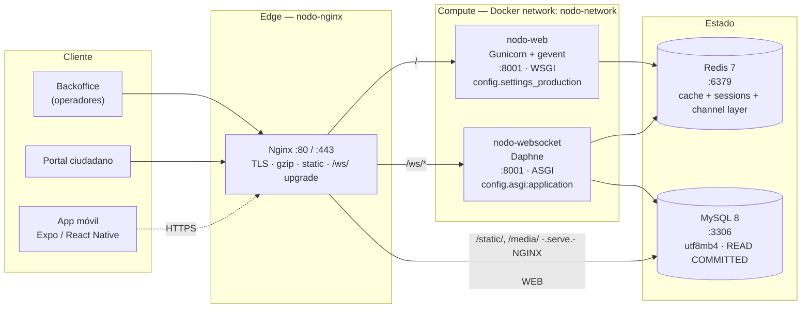
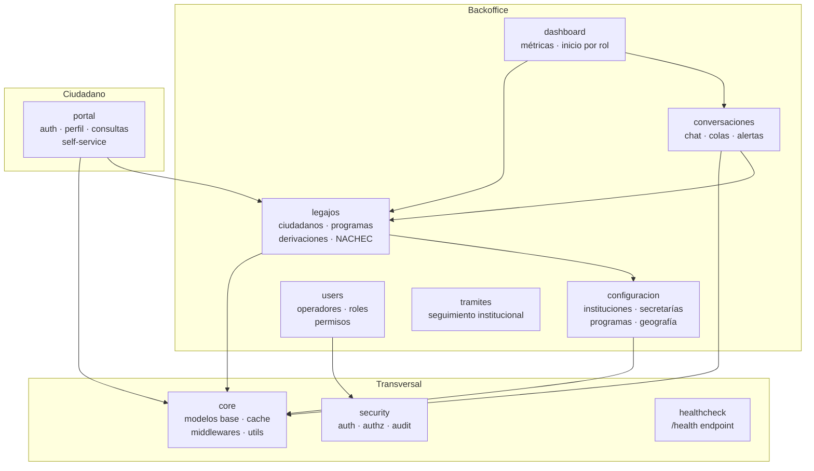
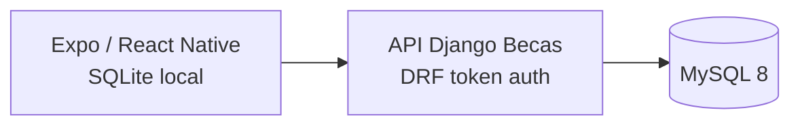
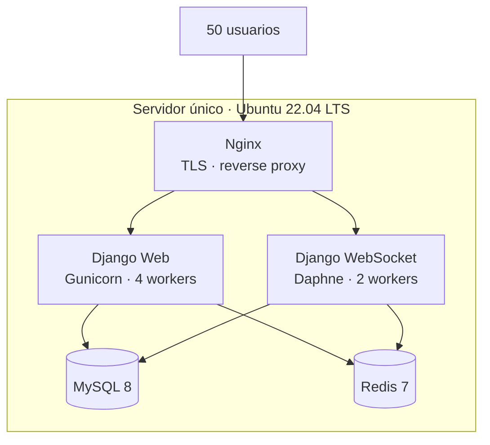

# Arquitectura técnica

Descripción técnica del sistema **Chaco**: topología de despliegue, runtime, capas internas, integraciones externas y decisiones que sostienen al producto en operación.

!!! info "Fuente de verdad"
    Esta página refleja el estado actual del repositorio (`config/`, `docker-compose.prod.yml`, `nginx.conf`, `requirements.txt`). Si algo cambia, el código manda — esta documentación se actualiza en consecuencia.

---

## 1. Visión de 30 segundos

<div class="grid cards" markdown>

-   :material-server-network: **Monolito Django modular**

    Una sola base de código, particionada en apps de dominio con fronteras claras (`legajos`, `configuracion`, `conversaciones`, `portal`, …).

-   :material-web: **Doble superficie HTTP**

    Backoffice institucional y portal ciudadano comparten infraestructura pero se aíslan por middleware de grupos y URLs.

-   :material-lightning-bolt: **Tiempo real nativo**

    WebSockets vía Django Channels + Daphne sobre un proceso ASGI dedicado, separado del proceso HTTP sincrónico.

-   :material-cellphone-link: **App móvil offline-first**

    Expo / React Native con persistencia local y sincronización contra la API Django de Becas para relevamientos de campo.

</div>

---

## 2. Stack y versiones

=== "Backend"

    | Componente | Versión | Rol técnico |
    |---|---|---|
    | Python | 3.12 | Runtime del proyecto (Dockerfile usa `python:3.11-slim` como base, target 3.12 en CI) |
    | Django | 4.2.20 LTS | Framework web, ORM, sistema de templates |
    | Django REST Framework | 3.15.2 | API REST con paginación por defecto y `drf-spectacular` |
    | Django Channels | 4.0.0 | Capa ASGI para WebSockets |
    | channels-redis | 4.1.0 | `RedisChannelLayer` en producción, `InMemoryChannelLayer` en dev |
    | Daphne | 4.0.0 | Servidor ASGI (`daphne -b 0.0.0.0 -p 8001 config.asgi:application`) |
    | Gunicorn | 23.0.0 | Servidor WSGI sincrónico para HTTP |
    | gevent | 25.9.1 | Workers asincrónicos cooperativos para Gunicorn |

=== "Persistencia y caché"

    | Componente | Versión | Rol técnico |
    |---|---|---|
    | MySQL | 8.0 | Base de datos relacional principal (`utf8mb4`, `STRICT_TRANS_TABLES`, `READ COMMITTED`) |
    | mysqlclient | 2.1.1 | Driver MySQL para Django |
    | Redis | 7-alpine | Cache, channel layer y backend de sesiones en producción |
    | django-redis | 5.4.0 | Cliente Redis para Django con `DefaultClient` |
    | SQLite | en memoria | Engine de tests bajo `pytest` (auto-detectado) |

=== "Frontend / Templates"

    | Componente | Rol |
    |---|---|
    | Django Templates | Renderizado server-side, base `templates/includes/base.html` para backoffice y `portal/base.html` para portal |
    | Tailwind CSS | Sistema de estilos utilitario |
    | Alpine.js | Interactividad declarativa, sin SPA |
    | SweetAlert2 | Confirmaciones destructivas y feedback al usuario |

=== "Infraestructura"

    | Componente | Versión | Rol |
    |---|---|---|
    | Docker | — | Contenerización de cada servicio |
    | Docker Compose | — | Orquestación: `docker-compose.yml` (dev), `docker-compose.prod.yml` (prd) |
    | Nginx | alpine | Reverse proxy + TLS + static/media + WebSocket upgrade |
    | GitHub Actions | — | CI/CD y deploy de docs a GitHub Pages |
    | MkDocs Material | — | Generación de esta documentación |

=== "Observabilidad y tooling"

    | Componente | Versión | Rol |
    |---|---|---|
    | django-silk | 5.0.4 | Profiling de requests y queries (`/silk/`, 100% en dev, 10% en prd) |
    | django-health-check | 3.17.0 | Endpoint `/health/` con checks de DB, cache y disco |
    | django-simple-history | 3.4.0 | Auditoría automática de modelos críticos |
    | drf-spectacular | 0.27.0 | OpenAPI 3 + Swagger UI + ReDoc |
    | structlog | 23.2.0 | Logging estructurado |
    | psutil | 5.9.8 | Métricas de sistema para monitoreo interno |

---

## 3. Topología de producción



!!! note "Separación HTTP / WebSocket"
    En producción **HTTP y WebSocket corren en procesos separados** (Gunicorn vs Daphne). Esto evita que la naturaleza bloqueante de las requests HTTP impacte la latencia del chat en tiempo real, y permite escalar cada canal de forma independiente.

### 3.1 Puertos y rutas

| Capa | Puerto interno | Puerto expuesto | Protocolo |
|---|---|---|---|
| Nginx | 80 / 443 | 80 / 443 | HTTP, HTTPS, WSS |
| `nodo-web` (Gunicorn) | 8001 | — (solo red interna) | HTTP |
| `nodo-websocket` (Daphne) | 8001 | — (solo red interna) | ASGI |
| MySQL | 3306 | 3307 en dev | TCP |
| Redis | 6379 | 6379 en dev | TCP |

### 3.2 Reverse proxy — reglas relevantes

Extracto de `nginx.conf`:

```nginx
location /ws/ {
    proxy_pass http://websocket;          # upstream: nodo-websocket:8001
    proxy_http_version 1.1;
    proxy_set_header Upgrade $http_upgrade;
    proxy_set_header Connection $connection_upgrade;
    proxy_read_timeout 3600;              # mantiene conexiones largas
    proxy_buffering off;
}

location /static/ { alias /staticfiles/; expires 30d; }
location /media/  { alias /media/;       expires  7d; }

location / {                              # upstream: nodo-web:8001
    proxy_pass http://django;
    proxy_set_header X-Forwarded-Proto $scheme;
    proxy_read_timeout 60s;
}
```

!!! warning "Hardening incluido en Nginx"
    `X-Content-Type-Options: nosniff`, `X-Frame-Options: DENY`, `Referrer-Policy: strict-origin-when-cross-origin` y rechazo (`return 444`) a hosts no autorizados.

---

## 4. Runtime de la aplicación

### 4.1 Selección de runtime

`docker-entrypoint.sh` arranca el proceso correcto según la variable `APP_RUNTIME`:

| `APP_RUNTIME` | Proceso lanzado | Uso |
|---|---|---|
| `runserver` | `python manage.py runserver` | Desarrollo local |
| `gunicorn` | `gunicorn -k gevent config.wsgi:application` | Producción HTTP |
| `daphne` | `daphne -b 0.0.0.0 -p $APP_PORT config.asgi:application` | Producción WebSocket |

La variable `WEBSOCKETS_ENABLED` se infiere automáticamente: es `True` cuando `APP_RUNTIME=daphne`, salvo override explícito.

### 4.2 Cadena de middlewares (orden importa)

```python
# config/settings.py
MIDDLEWARE = [
    "django.middleware.security.SecurityMiddleware",       # HSTS, redirect SSL
    "django.middleware.gzip.GZipMiddleware",               # compresión de respuestas
    "django.contrib.sessions.middleware.SessionMiddleware",
    "django.middleware.common.CommonMiddleware",
    "django.middleware.csrf.CsrfViewMiddleware",
    "django.contrib.auth.middleware.AuthenticationMiddleware",
    "core.middleware.PortalCiudadanoMiddleware",           # aísla grupo "Ciudadanos" a /portal/
    "django.contrib.messages.middleware.MessageMiddleware",
    "django.middleware.clickjacking.XFrameOptionsMiddleware",
    "core.middleware.RequestLoggingMiddleware",            # log método/URL/user/ip/status/duration
]
```

`PortalCiudadanoMiddleware` es el guardia que mantiene la separación de superficies: cualquier usuario autenticado del grupo `Ciudadanos` que intente acceder fuera de `/portal/` (excepto `/static/` y `/media/`) es redirigido a `portal:ciudadano_mi_perfil`.

### 4.3 Stack ASGI

```python
# config/asgi.py
application = ProtocolTypeRouter({
    "http": get_asgi_application(),
    "websocket": AuthMiddlewareStack(
        URLRouter(conversaciones.routing.websocket_urlpatterns)
    ),
})
```

Endpoints WebSocket expuestos (`conversaciones/routing.py`):

| Patrón | Consumer | Función |
|---|---|---|
| `ws/conversaciones/<id>/` | `ConversacionConsumer` | Mensajería 1:1 de un chat específico |
| `ws/conversaciones/` | `ConversacionesListConsumer` | Listado en vivo de conversaciones |
| `ws/alertas/` | `AlertasConsumer` | Stream de alertas para el operador |
| `ws/alertas-conversaciones/` | `AlertasConversacionesConsumer` | Notificaciones de chats nuevos |

!!! tip "Fallback HTTP 426"
    `config/urls.py` registra las mismas rutas `ws/*` para responder `HttpResponse(status=426, "WebSocket endpoint requires an ASGI server.")` cuando el cliente llega al proceso WSGI por error.

---

## 5. Apps de dominio y capas internas

### 5.1 Mapa de apps



### 5.2 Responsabilidades

| App | Responsabilidad principal | Modelos clave |
|---|---|---|
| `legajos` | Ciudadanos, derivaciones, programas sociales y módulo NACHEC | `Ciudadano`, `Derivacion`, `Programa`, `Contacto` |
| `configuracion` | Instituciones, secretarías, dispositivos, programas y geografía | `Institucion`, `Secretaria`, `Provincia`, `Localidad` |
| `conversaciones` | Chat operador↔ciudadano, colas de atención, métricas | `Conversacion`, `Mensaje`, `Cola` |
| `portal` | Portal ciudadano: registro, login, perfil, consultas self-service | `PerfilCiudadano` |
| `users` | Usuarios del backoffice, grupos y roles | `User`, `Grupo`, `Permiso` |
| `dashboard` | Métricas, KPIs y home segmentado por rol | (lectura sobre otras apps) |
| `tramites` | Seguimiento de trámites institucionales | `Tramite`, `EstadoTramite` |
| `core` | Modelos base, cache, performance, middlewares | `Auditable`, `TimestampedModel` |
| `security` | Subpaquetes `authentication/`, `authorization/`, `audit/` | — |
| `healthcheck` | Endpoint `/health/` integrado a Nginx y Docker | — |

### 5.3 Patrón de capas dentro de cada app

```
<app>/
├── models.py            ← Definición de datos y relaciones (sin lógica)
├── selectors/           ← Consultas de lectura puras, retornan QuerySets/DTOs
├── services/            ← Lógica de negocio y escritura, transacciones
├── views/               ← Orquestación HTTP: deserializa → llama service → responde
├── forms/               ← ModelForms con validación de entrada
├── api_views/           ← ViewSets DRF para la API REST
├── serializers.py       ← Serialización DRF
├── templates/           ← HTML (extiende includes/base.html o portal/base.html)
├── signals/             ← Reacciones a eventos del ORM
└── tests/               ← Tests unitarios y de integración
```

!!! abstract "Por qué este patrón"
    - **Selectores** y **servicios** son **invocables desde cualquier lado** (vistas web, vistas API, comandos `manage.py`, signals, tests) sin acoplar lógica de negocio al request HTTP.
    - Las **views** deben quedar finas: parsean, delegan, y devuelven.
    - Los **forms** validan; los **services** ejecutan. Si un service necesita validar, lo hace explícitamente.

---

## 6. Persistencia y datos

### 6.1 MySQL — configuración efectiva

```python
DATABASES["default"] = {
    "ENGINE": "django.db.backends.mysql",
    "OPTIONS": {
        "init_command": "SET sql_mode='STRICT_TRANS_TABLES'",
        "charset": "utf8mb4",
        "isolation_level": "read committed",
        "autocommit": True,
        "connect_timeout": 10,
        "read_timeout": 10,
        "write_timeout": 10,
    },
    "CONN_MAX_AGE": 60,            # connection pooling de Django
    "CONN_HEALTH_CHECKS": True,
}
```

- **Pool**: `CONN_MAX_AGE=60` mantiene conexiones reusables por 60 s con health-check previo.
- **Aislamiento**: `READ COMMITTED` para reducir bloqueos en escrituras concurrentes (chat, derivaciones).
- **Charset**: `utf8mb4` para soportar correctamente nombres con acentos y emojis.
- **Tests**: bajo `pytest`, Django usa SQLite en memoria para acelerar.

### 6.2 Redis — múltiples roles

En producción Redis cumple **tres funciones** sobre el mismo servidor (`maxmemory 350mb`, política `allkeys-lru`):

| Función | Backend | TTL |
|---|---|---|
| Cache de aplicación | `django_redis.cache.RedisCache` (alias `default`) | 600 s |
| Backend de sesiones | `django_redis.cache.RedisCache` (alias `sessions`) | 86 400 s |
| Channel layer (WebSocket) | `channels_redis.core.RedisChannelLayer` | — |

En desarrollo, Redis se reemplaza por `LocMemCache` + `InMemoryChannelLayer` para no requerir el servicio.

### 6.3 Auditoría

Modelos críticos usan `django-simple-history` para registrar *qué cambió, quién y cuándo* de forma automática. La historia se consulta vía `Model.history` y es navegable desde el admin de Django.

---

## 7. Configuración y entornos

El sistema distingue tres ambientes vía la variable `ENVIRONMENT`:

| Valor | Settings module | Características |
|---|---|---|
| `dev` | `config.settings` | DEBUG opcional, `LocMemCache`, SQLite en tests, sesiones en DB |
| `qa` | `config.settings` | Igual a dev pero apunta a infraestructura QA por env vars |
| `prd` | `config.settings_production` | Redis obligatorio, HSTS, cookies seguras, `ManifestStaticFilesStorage`, sesiones en cache |

### 7.1 Variables de entorno clave

```bash
# Core
DJANGO_SECRET_KEY=…                  # obligatoria, sin default
DJANGO_DEBUG=False
ENVIRONMENT=prd                      # dev | qa | prd
APP_RUNTIME=daphne                   # runserver | gunicorn | daphne
DJANGO_ALLOWED_HOSTS=dominio.gob.ar,localhost
DJANGO_CSRF_TRUSTED_ORIGINS=https://dominio.gob.ar

# Base de datos
DATABASE_HOST=mysql                  # nombre del servicio Docker
DATABASE_PORT=3306
DATABASE_NAME=chaco_db
DATABASE_USER=chaco_user
DATABASE_PASSWORD=…

# Redis
REDIS_HOST=redis
REDIS_PORT=6379
REDIS_SSL=False
REDIS_URL=redis://redis:6379/1       # alternativa única

# Integraciones externas
RENAPER_API_URL=…                    # padrón nacional de personas
RENAPER_API_KEY=…
OPENAI_API_KEY=…                     # asistencia IA en módulos puntuales
```

### 7.2 Endurecimiento aplicado en `prd`

- `SECURE_HSTS_SECONDS=31536000` con `INCLUDE_SUBDOMAINS` y `PRELOAD`
- `SESSION_COOKIE_SECURE = CSRF_COOKIE_SECURE = True`
- `SECURE_SSL_REDIRECT = True`
- `SECURE_BROWSER_XSS_FILTER`, `SECURE_CONTENT_TYPE_NOSNIFF`, `X_FRAME_OPTIONS=DENY`
- `ManifestStaticFilesStorage` (assets versionados por hash)
- `SECURE_PROXY_SSL_HEADER = ("HTTP_X_FORWARDED_PROTO", "https")` para detectar HTTPS detrás de Nginx
- Validadores de contraseña: `MinimumLengthValidator(min_length=8)`, `CommonPasswordValidator`, `NumericPasswordValidator`, `UserAttributeSimilarityValidator`

---

## 8. APIs

### 8.1 REST

DRF expone APIs paginadas (`PageNumberPagination`, `PAGE_SIZE=10`) montadas bajo `/api/`:

| Prefijo | App |
|---|---|
| `/api/legajos/` | Ciudadanos, derivaciones, programas |
| `/api/core/` | Modelos base, geografía |
| `/api/users/` | Usuarios y roles |
| `/api/conversaciones/` | Mensajería REST (sin WebSocket) |

### 8.2 Documentación OpenAPI

Generada automáticamente por `drf-spectacular`:

| Ruta | Función |
|---|---|
| `/api/schema/` | Esquema OpenAPI 3 (JSON/YAML) |
| `/api/docs/` | Swagger UI interactivo |
| `/api/redoc/` | ReDoc (vista de lectura) |

### 8.3 Integraciones salientes

| Integración | Cliente | Uso |
|---|---|---|
| RENAPER | `requests` con timeouts y reintentos configurables | Validación de identidad por DNI/CUIT |
| OpenAI | SDK oficial `openai==1.3.0` | Asistencia IA en módulos puntuales |

---

## 9. Observabilidad y operación

### 9.1 Logging

Logging estructurado en archivos rotativos por nivel (`core.utils.DailyFileHandler`):

```
logs/
├── info.log         ← eventos informativos
├── warning.log      ← warnings de Django y aplicación
├── error.log        ← excepciones y errores 5xx
├── critical.log     ← críticos (alertas inmediatas)
└── data.log         ← payloads JSON estructurados (atributo .data)
```

`RequestLoggingMiddleware` agrega una línea por cada request con: método, ruta, usuario, IP (`X-Real-IP`), status code y duración en ms.

### 9.2 Health checks

```
GET /health/
```

Verifica DB, cache, uso de disco (`DISK_USAGE_MAX=90`) y memoria libre (`MEMORY_MIN=100 MB`). Es la sonda usada por:

- `healthcheck` de Docker Compose (`interval: 30s`, `retries: 3`)
- Nginx para confirmar disponibilidad antes de enrutar tráfico

### 9.3 Profiling

`django-silk` está instalado en `/silk/`:

- **Dev**: intercepta el 100% de los requests
- **Prd**: intercepta el 10% (`SILKY_INTERCEPT_PERCENT`)
- Almacena traceback, queries SQL ejecutadas, profiling de Python

!!! warning "Acceso a `/silk/`"
    `SILKY_AUTHENTICATION = SILKY_AUTHORISATION = True` exigen usuario autenticado con permiso. En producción, restringir además por IP a nivel Nginx si se expone.

---

## 10. App móvil



- **Stack**: Expo SDK + React Native, código en [Mkdir-arg/Chaco-mobile](https://github.com/Mkdir-arg/Chaco-mobile)
- **Offline-first**: los operadores de campo cargan relevamientos sin conexión, con persistencia local; al recuperar red, sincronizan contra `/api/becas/`
- **Backend**: Django REST Framework expone los relevamientos asignados, formularios y sincronización de campo
- **Integración con el monolito**: los datos quedan en MySQL dentro del módulo `programas`

---

## 11. CI/CD y documentación

- **Repositorio**: monorepo en GitHub (`Mkdir-arg/Chaco`)
- **Pipelines**: GitHub Actions ejecuta tests, `manage.py check`, validación de migraciones
- **Documentación cliente**: esta misma página, generada con **MkDocs Material** desde `docs/client/` y publicada en GitHub Pages
- **Documentación interna**: `docs/internal/` (ADRs, sprints, análisis funcional) — no se publica

---

## 12. Decisiones arquitectónicas relevantes

!!! quote "Monolito modular, no microservicios"
    El sistema se diseñó como **monolito Django con apps de dominio aisladas**. Mantenemos transaccionalidad fuerte (una sola DB), simplicidad operativa (un solo deploy) y posibilidad futura de extraer apps si una superficie justifica autonomía.

!!! quote "WebSockets en proceso aparte"
    El proceso ASGI (Daphne) corre **separado del WSGI (Gunicorn)**. La latencia del chat no compite con requests HTTP largos, y se escala cada uno por separado.

!!! quote "Selectors vs Services"
    Lectura y escritura **no comparten capa**. Los selectores son consultas puras y memoizables; los servicios encapsulan reglas de negocio y transacciones. Las views nunca tienen lógica de dominio.

!!! quote "Frontend sin SPA"
    Templates + Alpine.js + Tailwind. Server-side rendering reduce complejidad de deploy, ahorra estado duplicado en el cliente y mantiene SEO/accesibilidad sin esfuerzo extra. WebSockets cubren los pocos casos que requieren tiempo real.

---

## 13. Arquitectura mínima recomendada para 50 usuarios

### 13.1 Premisas de dimensionamiento

- **Usuarios concurrentes**: estimación de 50 operadores simultáneos en horario pico (8 a.m. - 6 p.m.)
- **Carga esperada**: 10-15 requests HTTP/s promedio, picos de hasta 50 req/s, 5-10 conexiones WebSocket activas
- **Volumen de datos inicial**: hasta 100.000 ciudadanos, 50.000 derivaciones, 1.000 conversaciones/mes
- **Disponibilidad objetivo**: 99% mensual (máx. 7 h downtime/mes)

### 13.2 Topología mínima



### 13.3 Especificación del servidor

| Componente | Mínimo | Recomendado | Notas |
|---|---|---|---|
| **CPU** | 4 vCPUs | 6 vCPUs | Intel/AMD x64, o equivalente ARM |
| **RAM** | 8 GB | 12 GB | 4 GB MySQL + 1 GB Redis + 3 GB Django + 2 GB SO + buffer |
| **Disco** | 80 GB SSD | 120 GB SSD | IOPS > 3000, para logs y backups locales |
| **Red** | 100 Mbps | 1 Gbps | Latencia < 10 ms a usuarios finales |
| **SO** | Ubuntu 22.04 LTS | Ubuntu 22.04 LTS | Kernel actualizado, `unattended-upgrades` activo |

### 13.4 Asignación de recursos

=== "Gunicorn (HTTP)"

    ```bash
    gunicorn config.wsgi:application \
      --bind 0.0.0.0:8001 \
      --workers 4 \
      --worker-class gevent \
      --worker-connections 1000 \
      --timeout 60 \
      --max-requests 5000 \
      --max-requests-jitter 500
    ```

    - **4 workers**: regla general `(2 × CPU) + 1` para I/O-bound
    - **1000 conexiones/worker**: gevent permite atender múltiples requests por worker sin bloqueo
    - **Capacidad efectiva**: ~4000 conexiones simultáneas

=== "Daphne (WebSocket)"

    ```bash
    daphne config.asgi:application \
      --bind 0.0.0.0:8002 \
      --verbosity 1 \
      --access-log - \
      --proxy-headers
    ```

    - **2 instancias** (gestionadas por systemd o Docker Compose con `replicas: 2`)
    - **Capacidad**: 50-100 WebSocket concurrentes por instancia → 100-200 total

=== "MySQL"

    ```ini
    [mysqld]
    max_connections = 200
    innodb_buffer_pool_size = 3G          # ~75% de RAM asignada a MySQL
    innodb_log_file_size = 512M
    innodb_flush_log_at_trx_commit = 2    # trade-off: rendimiento vs durabilidad
    query_cache_type = 0                   # deshabilitado en MySQL 8+
    character-set-server = utf8mb4
    collation-server = utf8mb4_unicode_ci
    sql_mode = STRICT_TRANS_TABLES,NO_ENGINE_SUBSTITUTION
    ```

=== "Redis"

    ```conf
    maxmemory 1gb
    maxmemory-policy allkeys-lru
    save ""                                # desactivar snapshots para menor latencia
    appendonly no                          # no persistir; cache volátil
    tcp-backlog 511
    timeout 300
    ```

### 13.5 Consideraciones de escalamiento horizontal

Si el crecimiento supera los 50 usuarios:

| Límite | Acción |
|---|---|
| **80 usuarios** | Escalar verticalmente: 8 vCPUs, 16 GB RAM, 6 workers Gunicorn |
| **150 usuarios** | Separar MySQL a servidor dedicado (4 vCPUs, 8 GB RAM, SSD) |
| **300 usuarios** | Cluster de 2 nodos web + load balancer (Nginx como balanceador) + MySQL dedicado + Redis Sentinel |
| **500+ usuarios** | Considerar CDN para estáticos, MySQL replicado (read replicas), Redis Cluster, separación de servicios por dominio |

### 13.6 Backup y recuperación

- **MySQL**: dump diario comprimido (`mysqldump --single-transaction`) retenido por 7 días, semanal por 4 semanas
- **Media files**: rsync diario a almacenamiento secundario (NAS, S3, Backblaze)
- **Código**: tag Git por cada release, `.env` versionado en vault (Ansible Vault, AWS Secrets Manager)
- **RTO objetivo**: < 4 horas
- **RPO objetivo**: < 24 horas

### 13.7 Monitoreo básico

- **Métricas de sistema**: CPU, RAM, disco, IOPS → agregar `node_exporter` + Prometheus + Grafana (o solución cloud: Datadog, New Relic)
- **Aplicación**: logs estructurados parseados por `promtail` o `fluentd`, alertas en errores 5xx > 5/min
- **Disponibilidad**: `uptime-kuma` o `Pingdom` verificando `/health/` cada 60 s
- **Alertas**: email/Slack cuando:
    - CPU sostenida > 80% por 5 min
    - Disco > 85%
    - MySQL conexiones > 150

---

## 14. Glosario técnico

`ASGI`
:   Asynchronous Server Gateway Interface — protocolo Python para servidores asincrónicos (WebSocket, HTTP/2).

`WSGI`
:   Web Server Gateway Interface — protocolo sincrónico tradicional para servidores Python.

`Channel layer`
:   Capa de mensajería que permite a múltiples procesos Daphne intercambiar mensajes WebSocket. En Chaco, Redis cumple este rol.

`Selector`
:   Función pura de lectura sobre el ORM. No tiene side effects ni inicia transacciones.

`Service`
:   Función que ejecuta lógica de negocio y modifica estado. Inicia transacciones y emite signals.

`NACHEC`
:   Módulo de seguimiento de niñez/adolescencia incluido en `legajos`.
