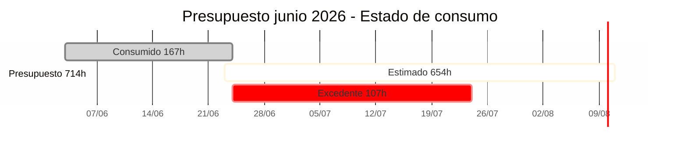

# :material-cash-multiple: Junio 2026 — Estado Financiero

!!! abstract "Consolidado mensual"
    Vista unificada del presupuesto, consumo real y estimaciones comprometidas para el mes de junio 2026.

---

## :material-chart-box-outline: Resumen ejecutivo

-   :material-wallet-outline: **Presupuesto mensual**

    ---

    **714 horas**
    
    Presupuesto acordado para junio 2026

-   :material-clock-check-outline: **Consumo real**

    ---

    **167 horas** (23%)
    
    Horas consumidas al 24/06/2026

-   :material-calculator-variant-outline: **Estimado comprometido**

    ---

    **654 horas** (92%)
    
    Programa Becas estimado

-   :material-alert-circle-outline: **Saldo disponible**

    ---

    **-107 horas**
    
    Presupuesto excedido (115%)

---

## :material-chart-bar: Estado del presupuesto

### Distribución del presupuesto

| Concepto | Horas | % del total | Estado |
|---|---:|---:|:-:|
| :material-check-circle:{ style="color: #10b981" } **Consumido** | 167 | 23% | Ejecutado |
| :material-clock-outline:{ style="color: #f59e0b" } **Estimado (Programa Becas)** | 654 | 92% | Comprometido |
| :material-alert-circle:{ style="color: #ef4444" } **Total comprometido** | **821** | **115%** | Excede presupuesto |
| :material-alert-circle:{ style="color: #ef4444" } **Saldo (sobre 714h)** | -107 | -15% | Excedido |
| **Total presupuesto** | **714** | **100%** | |

---

## :material-history: Consumo real por versión

### Versión 001 — Programa Becas y RBAC

**Período:** 3 jun → 24 jun 2026  
**Estado:** :material-circle:{ style="color: #f59e0b" } En progreso

| Categoría | Horas | % del consumo |
|---|---:|---:|
| Análisis funcional | 84.9 | 51% |
| Desarrollo (RBAC + Becas) | 46.8 | 28% |
| Diseño (aplicación) | 21.0 | 13% |
| Reuniones y coordinación | 14.4 | 8% |
| **Total Versión 001** | **167.1** | **100%** |

[:material-table-arrow-right: Ver detalle de consumo](../versiones/version-001-consumo-horas.md){ .md-button }

---

## :material-file-chart-outline: Estimaciones comprometidas

### Programa Becas — Relevamiento territorial y asignación de cupos

**Fecha de estimación:** 17 de junio 2026  
**Estado:** :material-clock-alert-outline: Comprometido  
**Inicio estimado:** 23 de junio 2026

| Categoría | Horas | % del estimado |
|---|---:|---:|
| Desarrollo Backend | 168 | 26% |
| Desarrollo App (React Native) | 158 | 24% |
| Diseño UX/UI | 126 | 19% |
| Pruebas funcionales y QA | 105 | 16% |
| Desarrollo Frontend | 52 | 8% |
| Despliegue a ambiente QA | 30 | 5% |
| Capacitación | 15 | 2% |
| **Total estimado** | **654** | **100%** |

[:material-file-document-outline: Ver estimación completa](../funcionalidades/estimacion-programa-becas.md){ .md-button }

---

## :material-alert-outline: Alertas y consideraciones

!!! danger "Presupuesto excedido"
    El consumo real (167h) más la estimación comprometida (654h) suma **821h**, superando el presupuesto mensual de 714h en **107h (115%)**. **El alcance comprometido ya excede el presupuesto: no es posible absorber nuevos requerimientos sin ampliar el presupuesto o reducir alcance.**

!!! info "Nota del 24 de junio 2026"
    Al 24 de junio de 2026 se han consumido 167 horas del sprint en análisis funcional, setup de entorno y desarrollo del motor RBAC base. Sumadas a las 654 horas estimadas del Programa Becas, el compromiso total (821h) supera el presupuesto mensual de 714h en 107h.

!!! tip "Monitoreo recomendado"
    - Validar semanalmente el avance real vs estimado
    - Reportar desvíos superiores al 10% inmediatamente
    - Considerar replanteo si aparecen requerimientos no contemplados

---

## :material-history: Histórico de actualizaciones

| Fecha | Evento | Impacto |
|---|---|---|
| 2026-06-24 | Actualización de consumo Versión 001 | 167h consumidas; presupuesto excedido (+107h) |
| 2026-06-17 | Estimación Programa Becas aprobada | +654h comprometidas |
| 2026-06-17 | Cierre parcial Versión 001 (RBAC completado) | 60h consumidas (reportado) |
| 2026-06-03 | Inicio Versión 001 | Presupuesto activado |

---

## :material-file-download-outline: Exportar reporte

!!! note "Formato de exportación"
    Este dashboard está diseñado para revisión web. Para reportes ejecutivos en PDF, contactar al equipo de proyecto.

---

[:material-arrow-left: Volver al índice financiero](index.md){ .md-button }
[:material-home: Volver al inicio](../index.md){ .md-button }
