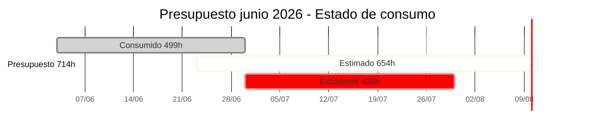

# :material-cash-multiple: Junio 2026 — Estado Financiero

!!! abstract "Consolidado mensual"
    Vista unificada del presupuesto, consumo real y estimaciones comprometidas para el mes de junio 2026.

---

## :material-chart-box-outline: Resumen ejecutivo

-   :material-wallet-outline: **Presupuesto mensual**

    ---

    **714 horas**
    
    Presupuesto acordado para junio 2026

-   :material-clock-check-outline: **Consumo real**

    ---

    **499 horas** (70%)
    
    Horas consumidas al cierre de junio 2026

-   :material-calculator-variant-outline: **Estimado comprometido**

    ---

    **654 horas** (92%)
    
    Programa Becas estimado

-   :material-alert-circle-outline: **Saldo disponible**

    ---

    **-439 horas**
    
    Presupuesto excedido (161%)

---

## :material-chart-bar: Estado del presupuesto

### Distribución del presupuesto

| Concepto | Horas | % del total | Estado |
|---|---:|---:|:-:|
| :material-check-circle:{ style="color: #10b981" } **Consumido** | 499 | 70% | Ejecutado |
| :material-clock-outline:{ style="color: #f59e0b" } **Estimado (Programa Becas)** | 654 | 92% | Comprometido |
| :material-alert-circle:{ style="color: #ef4444" } **Total comprometido** | **1153** | **161%** | Excede presupuesto |
| :material-alert-circle:{ style="color: #ef4444" } **Saldo (sobre 714h)** | -439 | -61% | Excedido |
| **Total presupuesto** | **714** | **100%** | |

---

## :material-history: Consumo real por versión

### Versión 001 — Programa Becas y RBAC

**Período:** 3 jun → 30 jun 2026  
**Estado:** :material-circle:{ style="color: #f59e0b" } En progreso

| Persona | Foco principal | Horas | % del consumo |
|---|---|---:|---:|
| Juani Portilla | Desarrollo backend (RBAC + Becas) y Design System | 113.4 | 23% |
| Matías Fariña | Análisis funcional (Becas, Dispositivos), estimación y gestión del sprint | 112.5 | 23% |
| Agostina Coppola | Análisis funcional y testing (legajos, dispositivos/merenderos, programa Dispositivos) | 112.3 | 22% |
| Pablo Cao | App de campo (diseño, desarrollo front e integración) | 96.0 | 19% |
| Equipo UX | Mockups del programa | 65.0 | 13% |
| **Total junio 2026** | | **499.2** | **100%** |

[:material-table-arrow-right: Ver detalle de consumo](../versiones/version-001-consumo-horas.md){ .md-button }

---

## :material-file-chart-outline: Estimaciones comprometidas

### Programa Becas — Relevamiento territorial y asignación de cupos

**Fecha de estimación:** 17 de junio 2026  
**Estado:** :material-clock-alert-outline: Comprometido  
**Inicio estimado:** 23 de junio 2026

| Categoría | Horas | % del estimado |
|---|---:|---:|
| Desarrollo Backend | 168 | 26% |
| Desarrollo App (React Native) | 158 | 24% |
| Diseño UX/UI | 126 | 19% |
| Pruebas funcionales y QA | 105 | 16% |
| Desarrollo Frontend | 52 | 8% |
| Despliegue a ambiente QA | 30 | 5% |
| Capacitación | 15 | 2% |
| **Total estimado** | **654** | **100%** |

[:material-file-document-outline: Ver estimación completa](../funcionalidades/estimacion-programa-becas.md){ .md-button }

---

## :material-alert-outline: Alertas y consideraciones

!!! danger "Presupuesto excedido"
    El consumo real de junio (499h) más la estimación comprometida (654h) suma **1153h**, superando el presupuesto mensual de 714h en **439h (161%)**. **El alcance comprometido ya excede el presupuesto: no es posible absorber nuevos requerimientos sin ampliar el presupuesto o reducir alcance.**

!!! info "Nota de cierre de junio 2026"
    Al cierre de junio de 2026 se consumieron 499 horas del sprint en análisis funcional (Becas, legajo ciudadano, dispositivos/merenderos y programa Dispositivos), desarrollo del motor RBAC y del backend de Becas, Design System, app de campo y mockups del equipo UX. Sumadas a las 654 horas estimadas del Programa Becas, el compromiso total (1153h) supera el presupuesto mensual de 714h en 439h.

!!! info "Regularización de horas (02/07/2026)"
    La revisión de horas de junio se consolidó el 02/07: se regularizaron **300 horas** trabajadas entre el 23/06 y el 30/06 que no habían sido registradas en su momento (desarrollo del front de la app de campo, backend del Programa Becas, análisis del programa Dispositivos y mockups del equipo UX). El detalle por día está en el [registro de consumo](../versiones/version-001-consumo-horas.md).

!!! tip "Monitoreo recomendado"
    - Validar semanalmente el avance real vs estimado
    - Reportar desvíos superiores al 10% inmediatamente
    - Considerar replanteo si aparecen requerimientos no contemplados

---

## :material-history: Histórico de actualizaciones

| Fecha | Evento | Impacto |
|---|---|---|
| 2026-07-02 | Regularización de 300h trabajadas y no registradas (23/06–30/06) | 499h consumidas en junio; presupuesto excedido (+439h) |
| 2026-07-02 | Cierre preliminar de consumo de junio | 199h registradas al momento del cierre |
| 2026-06-24 | Actualización de consumo Versión 001 | 167h consumidas al 24/06; presupuesto excedido (+107h) |
| 2026-06-17 | Estimación Programa Becas aprobada | +654h comprometidas |
| 2026-06-17 | Cierre parcial Versión 001 (RBAC completado) | 60h consumidas (reportado) |
| 2026-06-03 | Inicio Versión 001 | Presupuesto activado |

---

## :material-file-download-outline: Exportar reporte

!!! note "Formato de exportación"
    Este dashboard está diseñado para revisión web. Para reportes ejecutivos en PDF, contactar al equipo de proyecto.

---

[:material-arrow-left: Volver al índice financiero](index.md){ .md-button }
[:material-home: Volver al inicio](../index.md){ .md-button }
