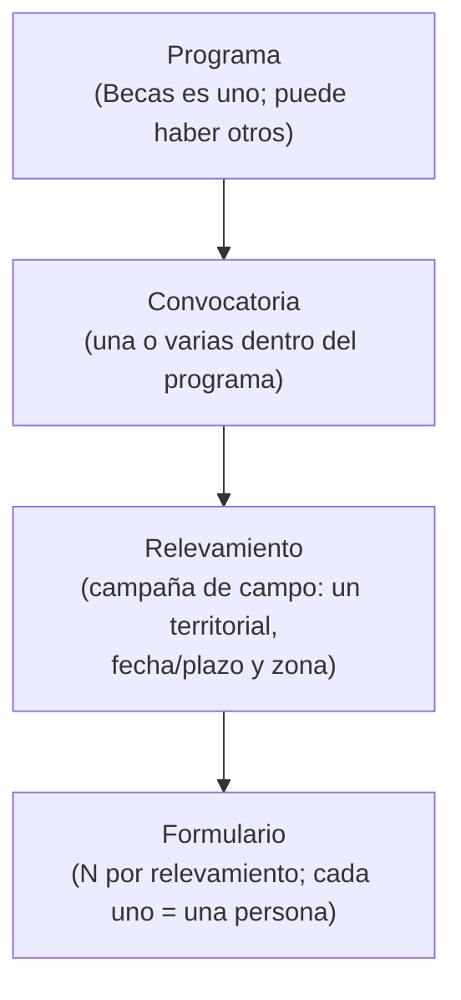
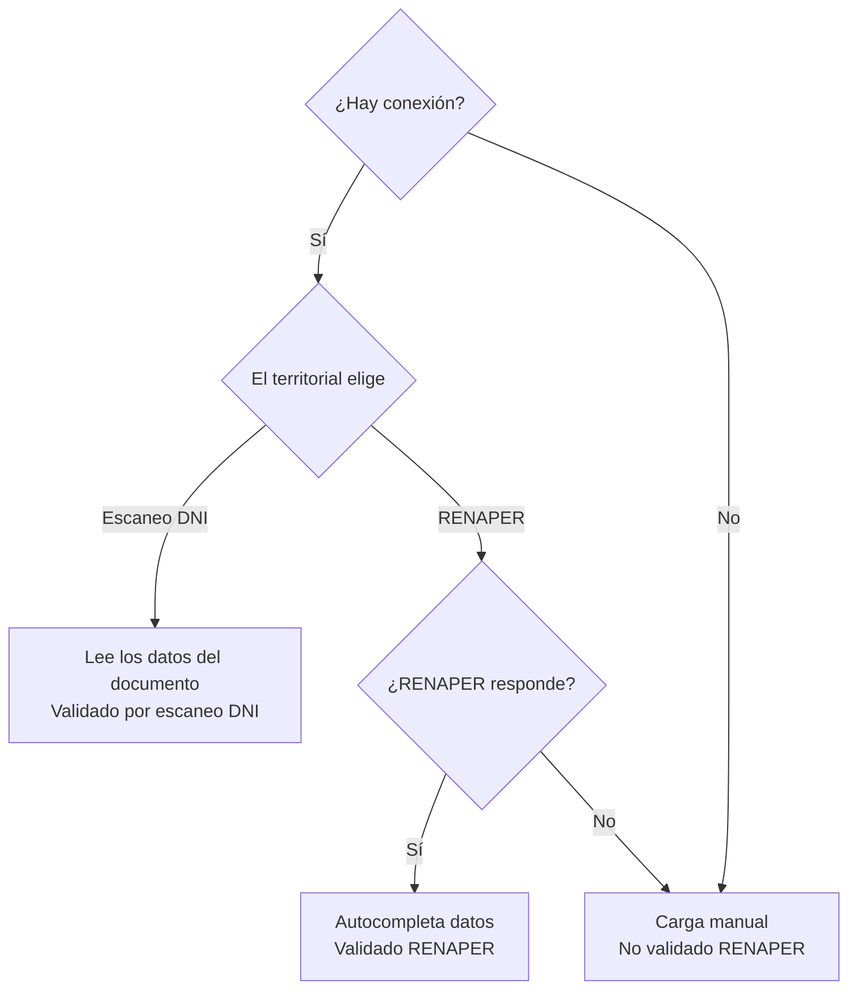

# :material-account-school-outline: Programa Becas — Relevamiento territorial y asignación de cupos

<div class="grid cards" markdown>

-   :material-circle:{ style="color: #f59e0b" } **Estado**

    En análisis

-   :material-shape-outline: **Programa**

    Becas (primer programa sobre el módulo genérico de Programas)

-   :material-monitor-cellphone: **Superficies**

    Backoffice + App de campo

-   :material-account-group-outline: **Roles**

    Administrador · Territorial

</div>

!!! abstract "Objetivo"
    Construir, en el **backoffice**, un módulo del **Programa Becas** que permita a un
    **administrador** configurar convocatorias y **asignar relevamientos** a sus
    **territoriales**. El territorial, desde una **app de campo**, releva ciudadanos en
    terreno cargando **un formulario por persona**. Al finalizar, los formularios llegan al
    backoffice, donde el administrador los **revisa caso por caso** y los **aprueba o
    rechaza**. Las personas aprobadas pasan por una **validación contra el Sistema SIS** y,
    según disponibilidad de **cupo del programa**, ocupan una beca o quedan en **lista de
    espera**.

!!! info "Cómo leer este documento"
    Esta es la **versión funcional** del programa: qué hace y cómo se usa. Algunos puntos se
    están terminando de acordar con el cliente; cuando es así, se indican como
    **:material-progress-question: A confirmar** y no se dan por cerrados.

---

## :material-cube-outline: 1. Concepto / modelo del dominio

El programa se modela con una jerarquía de **cuatro niveles**. El **cupo** se administra a
nivel del programa.



| Entidad | Descripción | Notas clave |
|---|---|---|
| **Programa** | Marco general. Becas es el primero; cada programa administra su propia parametría. | El **cupo** vive a nivel programa. |
| **Convocatoria** | Agrupador dentro del programa. Un programa tiene una o varias convocatorias. | — |
| **Relevamiento** | Campaña de campo asignada a **un solo** territorial. Se **auto-nombra** "Relevamiento XXX". | Tiene territorial, fecha/plazo y zona/localidad. Es **reasignable**. |
| **Formulario** | Una persona relevada. Muchos por relevamiento. | Un formulario = un legajo. |
| **Persona / Legajo** | El ciudadano relevado. Si ya existe se relaciona; si no, se crea **al enviar** el formulario. | Una persona puede estar en **varios programas** a la vez. |
| **Cupo** | Número de becas disponibles **por programa**. | Se ocupa **después** de validar con SIS, no al aprobar. |
| **Lista de espera** | Personas validadas que no entraron por cupo lleno. | El administrador promueve **a mano**. |

!!! tip "El legajo y sus solapas"
    La relación entre la persona y cada programa se visualiza con **solapas dinámicas**: si
    el ciudadano tiene registro en un programa, aparece la solapa correspondiente mostrando
    su estado (aprobado, rechazado, con cupo, en lista de espera).

---

## :material-account-group: 2. Actores y roles

<div class="grid cards" markdown>

-   :material-account-tie: **Administrador del programa**

    ---

    Trabaja en el **backoffice** y ve **todo** el programa. Crea convocatorias y
    relevamientos, asigna/reasigna territoriales, revisa formularios (aprueba/rechaza con
    motivo), gestiona el **cupo** y la **lista de espera**, da de baja beneficiarios y
    **exporta reportes**.

-   :material-account-hard-hat: **Territorial**

    ---

    Usuario con login propio. Ve **solo sus** relevamientos y formularios. Inicia el
    relevamiento del día asignado, carga formularios (uno por persona) en la app de campo,
    finaliza y **envía todo junto**. Su tarea termina con el envío.

</div>

!!! note "Alcance de roles"
    Por ahora el programa contempla **solo** estos dos roles (sin supervisor ni
    coordinador). El acceso al módulo depende de los roles y permisos asignados a cada
    usuario.

---

## :material-transit-connection-variant: 3. Funcionamiento end-to-end

1. **Configuración (administrador).** Define el **Programa Becas** con su **cupo**, crea una
   o varias **convocatorias** y, dentro de ellas, **relevamientos**. Al crear un
   relevamiento define **territorial asignado**, **fecha/plazo** y **zona/localidad**. El
   relevamiento se **auto-nombra** y puede **reasignarse** a otro territorial.
2. **Inicio en campo (territorial).** Entra a la app, ve el **listado de sus relevamientos**
   y **solo puede iniciar el del día**.
3. **Carga (territorial).** Dentro del relevamiento carga **un formulario tras otro** (uno
   por persona). Al iniciar cada formulario, valida la identidad según la conectividad
   (escaneo de DNI, RENAPER o carga manual). **No** puede dejar un formulario a medias.
4. **Finalización y envío (territorial).** Al terminar, **finaliza el relevamiento** y
   **todos los formularios se envían juntos** al backoffice. Cada persona se
   **crea/relaciona como legajo**, se apruebe o no después.
5. **Revisión caso por caso (administrador).** Entra al relevamiento finalizado, ve el
   **listado de formularios**, abre **uno por uno**, revisa la información y **aprueba** o
   **rechaza** (el rechazo requiere **motivo** y es **informativo**: no vuelve al territorial).
6. **Validación SIS.** El sistema valida el caso contra el **Sistema SIS** y espera la
   respuesta (validado o rechazado).
7. **Asignación de cupo.** Si la validación es favorable y **hay cupo**, la persona **ocupa
   una beca**. Si el cupo está lleno, va a **lista de espera**.
8. **Gestión de cupo (administrador).** Al **dar de baja** a un beneficiario se libera un
   cupo y el sistema muestra una **alerta** para mover a alguien de la lista de espera. El
   administrador **promueve a mano**.
9. **Reportes.** El administrador **exporta** beneficiarios, lista de espera y avance de
   relevamientos.

---

## :material-progress-check: 4. Estados

=== "Relevamiento"

    ```
    Asignado → En curso → Finalizado → En revisión → Terminado
    ```

    | Estado | Significado | Dónde se ve |
    |---|---|---|
    | **Asignado** | El administrador lo creó y se lo asignó a un territorial. | Backoffice y app |
    | **En curso** | El territorial lo inició en campo (el día asignado). | Backoffice y app |
    | **Sincronizando…** | Se finalizó **sin conexión**; los formularios están pendientes de sincronizar. | **Solo app** |
    | **Finalizado** | Cerrado y enviado (ya sincronizado con el backoffice). | Backoffice y app |
    | **En revisión** | El administrador está revisando los formularios. | Backoffice |
    | **Terminado** | Revisión completa cerrada. | Backoffice |

=== "Formulario / Persona"

    ```
    Enviado → Aprobado / Rechazado            (revisión del administrador)
       Aprobado → Validando (SIS)
           → Validado-Aprobado → Con cupo / En lista de espera
           → Validado-Rechazado
    ```

    | Estado | Significado |
    |---|---|
    | **Enviado** | El territorial lo mandó al finalizar el relevamiento. |
    | **Aprobado** | El administrador lo aprobó en la revisión. |
    | **Rechazado** | El administrador lo rechazó (con motivo, informativo). |
    | **Validando** | Consultando al Sistema SIS. |
    | **Validado-Aprobado** | El SIS respondió favorablemente. |
    | **Validado-Rechazado** | El SIS respondió negativamente. |
    | **Con cupo** | Ocupa una beca (había cupo disponible). |
    | **En lista de espera** | Validado, pero sin cupo disponible en ese momento. |

---

## :material-counter: 5. Cupo, validación y lista de espera

- El **cupo es del programa** (no del relevamiento). El territorial releva **sin límite**.
- El cupo **no se consume al aprobar**, sino **después** de la validación contra el SIS: el
  administrador confirma el caso → se valida contra SIS → si la respuesta es favorable y hay
  cupo, la persona **ocupa cupo**; si no hay cupo, va a **lista de espera**.
- La validación es **secuencial**: cada caso se resuelve antes de pasar al siguiente, de modo
  que el cupo se descuenta de forma ordenada y el caso siguiente ya ve el cupo actualizado.
- **Lista de espera:** la promoción es **manual**. Al dar de baja a un beneficiario, el
  sistema dispara una **alerta** para mover a alguien de la lista.

!!! info "Revalidación contra SIS"
    Además de la validación automática, el backoffice ofrece una acción **"Validar contra
    SIS"** en la pantalla de revisión, para reintentar la validación cuando haga falta.

---

## :material-monitor-dashboard: 6. Pantallas del backoffice

| Pantalla | Operaciones principales |
|---|---|
| **Convocatorias** | Listar, crear, editar, ver y activar/desactivar convocatorias del programa. |
| **Relevamientos** | Crear y administrar; asignar/reasignar territorial, fecha/plazo y zona; ver estado. |
| **Revisión de relevamiento** | Abrir un relevamiento finalizado → listado de formularios → abrir uno por uno → aprobar/rechazar (motivo). Acción **"Validar contra SIS"** para revalidación. |
| **Beneficiarios / Cupo** | Ver ocupación de cupo, lista de espera, **dar de baja** y **promover** desde la lista. |
| **Configuración del programa** | Definir la **parametría de cupo** del programa. |
| **Reportes** | Exportar beneficiarios, lista de espera y avance de relevamientos. |

---

## :material-form-textbox: 7. Datos del formulario

!!! info "A confirmar :material-progress-question:"
    Estos son los datos previstos para cada persona. Están **sujetos a confirmación** sobre
    si se agregan campos específicos de Becas.

=== "A — Datos personales"

    Precargados por escaneo o RENAPER, editables.

    | Campo | Características |
    |---|---|
    | Número de DNI | Obligatorio — editable si hubo error de lectura |
    | Apellido | Obligatorio |
    | Nombre | Obligatorio |
    | Sexo | M / F / X — obligatorio |
    | Estado civil | Obligatorio |
    | Fecha de nacimiento | Obligatorio — si es menor de edad, habilita la sección Apoderado |

=== "B — Domicilio"

    Precargado, editable.

    | Campo | Características |
    |---|---|
    | Provincia | Opcional |
    | Localidad | Opcional |
    | Calle | Opcional |
    | Número | Opcional |
    | Piso | Opcional |
    | Departamento | Opcional |
    | Barrio | Opcional |

=== "C — Contacto"

    Ingreso manual obligatorio.

    | Campo | Características |
    |---|---|
    | Número de celular | Obligatorio |
    | Correo electrónico | Obligatorio — se valida el formato |

=== "D — Apoderado"

    Visible **solo si la persona es menor de edad**.

    | Campo | Características |
    |---|---|
    | Nombre del apoderado | Obligatorio si la sección está visible |
    | Apellido del apoderado | Obligatorio si la sección está visible |
    | Fecha de nacimiento del apoderado | Obligatorio si la sección está visible |

=== "Adjuntos"

    | Documento | Obligatoriedad | Carga |
    |---|---|---|
    | Foto DNI — frente | Obligatorio | Cámara del dispositivo |
    | Foto DNI — dorso | Obligatorio | Cámara del dispositivo |
    | Comprobante de CBU | Opcional | Archivo o foto |
    | Certificado de domicilio | Opcional | Archivo o foto |

---

## :material-fingerprint: 8. Validación de identidad en el campo

Al iniciar cada formulario, la app determina el camino según la conectividad y la elección
del territorial:



| Camino | Cuándo | Marca | ¿Requiere revalidación? |
|---|---|---|---|
| **Escaneo del DNI** | Con conexión, leyendo el documento físico | Validado por escaneo DNI | No |
| **RENAPER** | Con conexión, ingresando DNI + sexo | Validado RENAPER | No |
| **Carga manual** | Sin conexión, o si RENAPER no responde | No validado RENAPER | Sí — se revalida luego en el backoffice |

!!! success "RENAPER ya está disponible"
    La validación con **RENAPER** reutiliza una integración que el sistema **ya tiene
    probada**: confirma la identidad (con DNI + sexo) y autocompleta los datos de la persona
    (apellido, nombres, fecha de nacimiento, domicilio, entre otros). Si no hay coincidencia
    o no responde, se permite la carga manual y el registro queda **"No validado RENAPER"**
    para revalidarlo después.

---

## :material-cellphone-arrow-down: 9. App de campo (online / offline)

<div class="grid cards" markdown>

-   :material-wifi: **Funciona con y sin conexión**

    ---

    El territorial puede relevar **sin señal**: los datos se guardan en el dispositivo y se
    **sincronizan** automáticamente al recuperar la conexión.

-   :material-sync: **Cierre diferido**

    ---

    Si finaliza sin conexión, el relevamiento muestra **"Sincronizando…"** en la app y recién
    aparece como **Finalizado** en el backoffice cuando se sincronizó **todo**.

</div>

---

## :material-connection: 10. Integración con el Sistema SIS

La validación contra el **Sistema SIS** (Sistema de Inclusión Social) es un **control de
segundo nivel**: recibe el caso aprobado por el administrador, lo valida y confirma o
rechaza. Solo con la **doble conformidad** (administrador + SIS) la persona puede ocupar cupo.

!!! warning "En definición :material-progress-question:"
    El **detalle técnico** de esta integración (qué datos se intercambian y cómo) se está
    **acordando con el equipo del Ministerio**. El comportamiento funcional descrito
    —validar para habilitar el cupo, manejo de reintento si no hay respuesta a tiempo— es el
    acordado; el alcance fino queda **a confirmar**, incluido si el caso continúa hacia un
    sistema posterior de liquidación.

---

## :material-check-decagram-outline: 11. Reglas de negocio

| ID | Regla |
|---|---|
| RN-01 | El cupo es **por programa**; el territorial releva sin límite. |
| RN-02 | El cupo se consume **solo** tras la validación favorable del SIS y si hay disponibilidad. |
| RN-03 | Sin cupo disponible, la persona validada va a **lista de espera**. |
| RN-04 | La salida de la lista de espera es **manual** (el administrador promueve). |
| RN-05 | Al dar de baja a un beneficiario, se libera cupo y el sistema **alerta** para promover. |
| RN-06 | El territorial **solo** puede iniciar el relevamiento **del día asignado**. |
| RN-07 | Un formulario **no** se puede dejar a medias; se completa entero. |
| RN-08 | Los formularios se envían **todos juntos** al finalizar el relevamiento. |
| RN-09 | El legajo se crea/relaciona **al enviar** el formulario, se apruebe o no. |
| RN-10 | Una persona puede pertenecer a **varios programas** a la vez. |
| RN-11 | El **rechazo** del administrador requiere **motivo** y es **informativo** (no vuelve al territorial). |
| RN-12 | El territorial **ve solo lo suyo**; el administrador **ve todo** el programa. |
| RN-13 | La identidad se valida por tres caminos: escaneo de DNI, RENAPER o carga manual. |
| RN-14 | **Trazabilidad obligatoria:** quién cargó, cuándo e historial de estados. |
| RN-15 | La app funciona **offline**; al finalizar sin conexión, el relevamiento queda **"Sincronizando…"** hasta sincronizar todo, y recién entonces aparece como **Finalizado** en el backoffice. |
| RN-16 | El backoffice debe permitir **revalidar contra RENAPER** los registros marcados "No validado RENAPER". |
| RN-17 | La **app de campo** entra en el alcance (la desarrollamos nosotros). |
| RN-18 | El SIS responde **válido/no válido**; si rechaza, debe existir motivo. |
| RN-19 | El cupo se ocupa **solo** con doble conformidad: **administrador + SIS**. |
| RN-20 | Si el SIS no responde a tiempo, el sistema marca una **alerta** para reintentar. |
| RN-21 | Con la doble conformidad, el caso queda **habilitado** para el proceso de liquidación. |
| RN-22 | Si la persona es **menor de edad (< 18)**, se habilita obligatoriamente la sección **Apoderado**; el formulario no puede finalizarse sin esos datos. |
| RN-23 | El territorial puede **editar los datos precargados** por escaneo o RENAPER ante un error de lectura o un domicilio desactualizado. |
| RN-24 | La validación contra el SIS se realiza de forma **secuencial**: cada caso se resuelve antes de continuar con el siguiente. |
| RN-25 | Tanto la **aprobación** como el **rechazo** del administrador registran el contexto del caso para su validación. |

---

## :material-close-octagon-outline: 12. Fuera de alcance (por ahora)

- Notificaciones automáticas a territoriales o ciudadanos.
- Reproceso de las personas rechazadas por el administrador (el rechazo es informativo).
- Diseñador de formularios dinámicos: los campos son fijos.

---

!!! quote "Documento vivo"
    Esta página se actualiza a medida que se confirman las definiciones pendientes con el
    cliente. La planificación de esta funcionalidad se sigue en el
    [Sprint 001](../sprints/sprint-001.md#funcionalidad-1).
