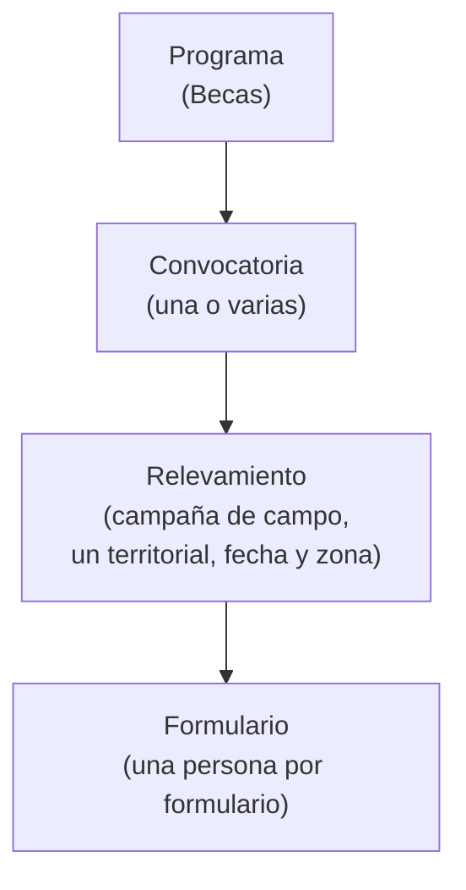

# :material-account-school-outline: Programa Becas — Relevamiento territorial y asignación de cupos

<div class="grid cards" markdown>

-   :material-circle:{ style="color: #f59e0b" } **Estado**

    En análisis

-   :material-shape-outline: **Programa**

    Becas

-   :material-monitor-cellphone: **Superficies**

    Backoffice + App de campo

-   :material-account-group-outline: **Roles**

    Administrador · Territorial

</div>

!!! abstract "Qué resuelve"
    El **Programa Becas** permite gestionar, de punta a punta, el otorgamiento de
    becas a partir de un **relevamiento en territorio**: un **administrador** configura
    las campañas y las asigna a sus **equipos de campo (territoriales)**; cada territorial
    releva a las personas con una **app móvil**; el administrador revisa cada caso, valida
    la información y administra el **cupo disponible** y la **lista de espera**.

!!! info "Cómo leer este documento"
    Esta es la **versión funcional** del programa: qué hace y cómo se usa. Algunos puntos
    todavía se están acordando con el cliente; cuando es así, se indican como
    **:material-progress-question: A confirmar** y no se dan por cerrados.

---

## :material-sitemap-outline: Cómo se organiza

El programa se estructura en cuatro niveles. El **cupo** se administra a nivel del programa.



| Nivel | Qué es |
|---|---|
| **Programa** | El marco general. Becas es el primer programa; cada programa administra su propio **cupo**. |
| **Convocatoria** | Un agrupador dentro del programa. Un programa puede tener una o varias. |
| **Relevamiento** | Una campaña de campo asignada a **un** territorial, con **fecha/plazo** y **zona/localidad**. |
| **Formulario** | Una persona relevada. Un relevamiento puede tener muchos formularios (uno por persona). |

!!! tip "La persona y su legajo"
    Cada persona relevada queda vinculada a su **legajo**: si ya existe en el sistema se
    relaciona, y si no, se crea al enviar el formulario. Una misma persona puede estar en
    **varios programas** a la vez; en su legajo se muestra una **solapa por programa** con
    el estado en cada uno (aprobado, rechazado, con cupo, en lista de espera).

---

## :material-account-group: Quién participa

<div class="grid cards" markdown>

-   :material-account-tie: **Administrador del programa**

    ---

    Trabaja desde el **backoffice** y ve **todo** el programa. Configura convocatorias y
    relevamientos, asigna y reasigna territoriales, **revisa cada formulario** (aprueba o
    rechaza con motivo), administra el **cupo** y la **lista de espera**, da de baja
    beneficiarios y **exporta reportes**.

-   :material-account-hard-hat: **Territorial (equipo de campo)**

    ---

    Trabaja desde la **app de campo** y ve **solo sus** relevamientos. Inicia el
    relevamiento del día, **carga un formulario por persona** y, al terminar, finaliza y
    **envía todo junto** al backoffice. Su tarea concluye con el envío.

</div>

---

## :material-transit-connection-variant: Cómo funciona, de principio a fin

1. **Configuración.** El administrador define el programa y su **cupo**, crea las
   **convocatorias** y, dentro de ellas, los **relevamientos**, asignando a cada uno un
   territorial, una fecha/plazo y una zona.
2. **Relevamiento en campo.** El territorial ve sus relevamientos asignados e **inicia el
   del día**. Carga un formulario por persona, validando la identidad, y completa los datos.
3. **Envío.** Al finalizar, **todos los formularios se envían juntos** al backoffice y cada
   persona queda vinculada a su legajo.
4. **Revisión caso por caso.** El administrador abre el relevamiento, revisa **uno por uno**
   los formularios y **aprueba** o **rechaza** (el rechazo lleva motivo y es informativo).
5. **Validación.** Cada caso se valida contra el **Sistema SIS** (control de segundo nivel).
6. **Asignación de cupo.** Si la validación es favorable y **hay cupo**, la persona **ocupa
   una beca**; si no hay cupo, queda en **lista de espera**.
7. **Gestión.** Cuando se da de baja a un beneficiario, se **libera un cupo** y el sistema
   avisa para **promover** a alguien de la lista de espera.
8. **Reportes.** El administrador **exporta** beneficiarios, lista de espera y avance de los
   relevamientos.

---

## :material-fingerprint: Validación de identidad en el campo

Al cargar cada persona, la app valida la identidad por uno de tres caminos, según la
conectividad del momento:

| Camino | Cuándo se usa | Resultado |
|---|---|---|
| :material-line-scan: **Escaneo del DNI** | Con conexión, leyendo el documento físico | Datos tomados directamente del documento |
| :material-card-account-details-outline: **Validación con RENAPER** | Con conexión, ingresando DNI + sexo | Identidad confirmada y datos autocompletados |
| :material-pencil-outline: **Carga manual** | Sin conexión, o si RENAPER no responde | Queda marcado para **revalidar** luego en el backoffice |

!!! success "RENAPER ya está disponible"
    La validación con **RENAPER** reutiliza una integración que el sistema **ya tiene
    probada**: confirma la identidad y autocompleta los datos de la persona (apellido,
    nombres, fecha de nacimiento, domicilio, entre otros).

---

## :material-cellphone-arrow-down: App de campo (online / offline)

<div class="grid cards" markdown>

-   :material-wifi: **Funciona con y sin conexión**

    ---

    El territorial puede relevar **sin señal**: los datos se guardan en el dispositivo y se
    **sincronizan** automáticamente al recuperar la conexión.

-   :material-sync: **Cierre diferido**

    ---

    Si finaliza sin conexión, el relevamiento muestra **"Sincronizando…"** y recién aparece
    como **Finalizado** en el backoffice cuando se sincronizó **todo**.

</div>

---

## :material-progress-check: Estados

=== "Relevamiento"

    ```
    Asignado → En curso → Finalizado → En revisión → Terminado
    ```

    | Estado | Significado |
    |---|---|
    | **Asignado** | Creado y asignado a un territorial. |
    | **En curso** | El territorial lo inició en campo. |
    | **Finalizado** | Cerrado y enviado al backoffice (ya sincronizado). |
    | **En revisión** | El administrador está revisando los formularios. |
    | **Terminado** | Revisión completa cerrada. |

=== "Formulario / Persona"

    | Estado | Significado |
    |---|---|
    | **Enviado** | Llegó al backoffice y espera revisión. |
    | **Aprobado** / **Rechazado** | Resultado de la revisión del administrador. |
    | **Validando** | En consulta con el Sistema SIS. |
    | **Validado** | El SIS respondió. |
    | **Con cupo** | Ocupa una beca. |
    | **En lista de espera** | Validado, pero sin cupo disponible en ese momento. |

---

## :material-counter: Cupo y lista de espera

- El **cupo es del programa**; el territorial releva **sin límite**.
- Una persona **ocupa cupo** solo cuando es aprobada por el administrador **y** validada por
  el SIS, y **siempre que haya cupo** disponible en ese momento.
- Si no hay cupo, la persona queda en **lista de espera**.
- La salida de la lista de espera es **manual**: cuando se libera un cupo (por una baja), el
  sistema **avisa** y el administrador promueve a quien corresponda.

---

## :material-monitor-dashboard: Pantallas del backoffice

| Pantalla | Para qué sirve |
|---|---|
| **Convocatorias** | Listar, crear, editar, ver y activar/desactivar convocatorias del programa. |
| **Relevamientos** | Crear y administrar relevamientos, asignar/reasignar territorial, fecha y zona, y ver su estado. |
| **Revisión de relevamiento** | Abrir un relevamiento finalizado, revisar los formularios uno por uno y aprobar/rechazar. |
| **Beneficiarios / Cupo** | Ver la ocupación de cupo y la lista de espera, dar de baja y promover. |
| **Configuración del programa** | Definir el cupo del programa. |
| **Reportes** | Exportar beneficiarios, lista de espera y avance de los relevamientos. |

---

## :material-form-textbox: Datos del formulario

!!! info "A confirmar :material-progress-question:"
    Estos son los datos previstos para cada persona; **están sujetos a confirmación** sobre
    si se agregan campos específicos de Becas.

=== "Datos personales"

    DNI, Apellido, Nombre, Sexo, Estado civil y Fecha de nacimiento.
    Si la persona es **menor de edad**, se solicitan además los datos del **apoderado**.

=== "Domicilio"

    Provincia, Localidad, Calle, Número, Piso, Departamento y Barrio.

=== "Contacto"

    Número de celular y correo electrónico (de carga obligatoria).

=== "Documentación"

    Foto del DNI (frente y dorso) obligatoria; comprobante de CBU y certificado de
    domicilio, opcionales.

---

## :material-check-decagram-outline: Reglas principales

- [x] El cupo es **por programa**; el territorial releva sin límite.
- [x] El cupo se ocupa **solo** tras la aprobación del administrador y la validación del SIS, y si hay disponibilidad.
- [x] Sin cupo disponible, la persona validada va a **lista de espera** (la promoción es manual).
- [x] El territorial **solo** puede iniciar el relevamiento **del día asignado**.
- [x] Un formulario se completa **entero**; no se puede dejar a medias.
- [x] Los formularios se envían **todos juntos** al finalizar el relevamiento.
- [x] La persona queda vinculada a su **legajo** al enviar el formulario, se apruebe o no.
- [x] El **rechazo** del administrador requiere **motivo** y es informativo.
- [x] El territorial **ve solo lo suyo**; el administrador **ve todo** el programa.
- [x] Los registros cargados sin validar identidad pueden **revalidarse** después en el backoffice.

---

## :material-connection: Integración con el Sistema SIS

La validación contra el **Sistema SIS** (Sistema de Inclusión Social) es un **control de
segundo nivel**: recibe los casos y confirma o rechaza.

!!! warning "En definición :material-progress-question:"
    El **detalle técnico** de esta integración (qué datos se intercambian y cómo) se está
    **acordando con el equipo del Ministerio**. El comportamiento funcional descrito arriba
    —validar para habilitar el cupo— es el acordado; el alcance fino queda **a confirmar**.

---

## :material-close-octagon-outline: Fuera de alcance (por ahora)

- Notificaciones automáticas a territoriales o ciudadanos.
- Reproceso de las personas rechazadas por el administrador.
- Diseñador de formularios dinámicos: los campos son fijos.

---

!!! quote "Documento vivo"
    Esta página se actualiza a medida que se confirman las definiciones pendientes con el
    cliente. La planificación de esta funcionalidad se sigue en el
    [Sprint 001](../sprints/sprint-001.md#funcionalidad-1).
