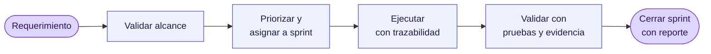

---
hide:
  - navigation
---

# Chaco — Centro de Control del Proyecto

!!! abstract "Espacio único de seguimiento"
    Toda la información funcional y técnica del proyecto en un solo lugar: alcance, metodología, sprints, evidencias y plantillas operativas. Mantenido por el equipo, accesible para el cliente.

---

## :material-radar: Estado del proyecto

-   :material-progress-clock: **Estado actual**

    ---

    :material-circle:{ .lg .middle style="color: #f59e0b" } **En ejecución**

    Sprint activo en curso, entregas iterativas confirmadas.

-   :material-rocket-launch-outline: **Sprint activo**

    ---

    [**Sprint 001**](sprints/sprint-001.md) — Gestión base de ciudadanos

    Registro y derivación de ciudadanos.

-   :material-calendar-clock: **Última actualización**

    ---

    **Mayo 2026**

    Documentación viva — se actualiza al cierre de cada sprint.

---

## :material-compass-outline: Accesos principales

-   :material-flag-checkered:{ .lg .middle } **Proyecto**

    ---

    Bases del trabajo conjunto entre ICORE y el cliente.

    [:octicons-arrow-right-16: Kick Off](kickoff.md)
    [:octicons-arrow-right-16: Equipo](team.md)
    [:octicons-arrow-right-16: Metodología](methodology.md)
    [:octicons-arrow-right-16: Arquitectura](architecture.md)
    [:octicons-arrow-right-16: Minutas](minutas/index.md)

-   :material-sprout:{ .lg .middle } **Sprints**

    ---

    Planificación y seguimiento de entregas iterativas.

    [:octicons-arrow-right-16: Todos los sprints](sprints/index.md)
    [:octicons-arrow-right-16: Sprint actual](sprints/sprint-001.md)

-   :material-file-document-multiple-outline:{ .lg .middle } **Plantillas operativas**

    ---

    Formatos para casos de prueba, minutas, reportes y actas.

    [:octicons-arrow-right-16: Caso de prueba base](templates/caso-prueba-base.md)
    [:octicons-arrow-right-16: Instancia de prueba](templates/instancia-prueba.md)
    [:octicons-arrow-right-16: Minuta de reunión](templates/minuta-reunion.md)
    [:octicons-arrow-right-16: Estimación de horas](templates/estimacion.md)
    [:octicons-arrow-right-16: Reporte de pruebas](templates/reporte-pruebas.md)
    [:octicons-arrow-right-16: Acta de cierre](templates/acta-cierre.md)

---

## :material-sitemap: Flujo operativo

1. **Registrar** el requerimiento y validar alcance.
2. **Priorizar** y asignar al sprint correspondiente.
3. **Ejecutar** desarrollo con trazabilidad en issues y PR.
4. **Validar** con pruebas funcionales y evidencia.
5. **Cerrar** sprint con reporte de resultados.

---

## :material-account-group-outline: Qué revisar según tu rol

=== ":material-clipboard-text-outline: Referente funcional"

    | Para qué | Ir a |
    |---|---|
    | Alinear objetivos y alcance | [Kick Off](kickoff.md) |
    | Entender el ciclo de trabajo | [Metodología](methodology.md) |
    | Seguir avances y entregas | [Sprints](sprints/index.md) |

=== ":material-code-tags: Desarrollo"

    | Para qué | Ir a |
    |---|---|
    | Stack, capas y decisiones técnicas | [Arquitectura](architecture.md) |
    | Sprint activo y backlog | [Sprints](sprints/index.md) |
    | Estimar requerimientos | [Plantilla de estimación](templates/estimacion.md) |

=== ":material-checkbox-marked-circle-outline: QA y validación"

    | Para qué | Ir a |
    |---|---|
    | Diseñar casos de prueba base | [Caso de prueba base](templates/caso-prueba-base.md) |
    | Registrar ejecuciones | [Instancia de prueba](templates/instancia-prueba.md) |
    | Cerrar la ronda de testing | [Reporte de pruebas](templates/reporte-pruebas.md) |

---

## :material-map-marker-path: Navegación recomendada

!!! tip "Si recién empezás"
    [**Kick Off**](kickoff.md) :material-arrow-right: [**Metodología**](methodology.md) :material-arrow-right: [**Sprint actual**](sprints/sprint-001.md)

    Tres páginas y tenés el contexto completo para participar.
