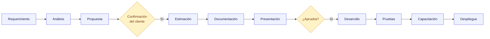
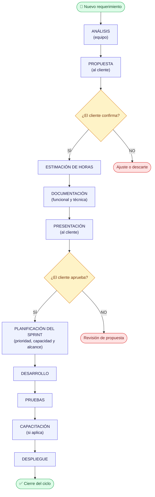

# :material-cog-sync-outline: Metodología de Trabajo

!!! abstract "Modelo de consumo de horas"
    El equipo trabaja bajo un **paquete de horas** que el cliente contrata al inicio o cuando lo necesita. Toda actividad —desde la reunión inicial hasta el despliegue— descuenta horas del saldo. Cada requerimiento sigue un flujo formal con etapas, documentación y trazabilidad.

---

## :material-eye-outline: Visión general



---

## :material-clock-outline: Paquete de horas

<div class="grid cards" markdown>

-   :material-package-variant-closed:{ .lg .middle } **Contratación**

    El cliente contrata un paquete de horas al inicio o cuando lo necesita.

-   :material-counter:{ .lg .middle } **Descuento**

    El saldo se descuenta según el tipo de actividad realizada.

-   :material-finance:{ .lg .middle } **Reporte**

    El equipo informa el consumo al cierre de cada etapa o sprint.

-   :material-bell-alert-outline:{ .lg .middle } **Alerta de saldo**

    Cuando el saldo está por agotarse, se notifica para renovar o priorizar.

</div>

---

## :material-clipboard-pulse-outline: Tipos de actividad que consumen horas

| :material-tag-outline: Actividad | Descripción |
|---|---|
| :material-account-voice: **Reunión** | Llamadas, videollamadas o encuentros presenciales de seguimiento o relevamiento |
| :material-clipboard-search-outline: **Análisis** | Estudio del requerimiento, relevamiento de impacto técnico y funcional |
| :material-code-braces: **Desarrollo** | Implementación de funcionalidades, correcciones y mejoras |
| :material-test-tube: **Pruebas** | Testing funcional, regresión y validación por parte del equipo |
| :material-school-outline: **Capacitación** | Entrenamiento al equipo del cliente sobre nuevas funcionalidades |
| :material-rocket-launch-outline: **Despliegue** | Puesta en producción, configuración de servidores y verificación post-deploy |

---

## :material-toolbox-outline: Herramientas de trabajo

El equipo utiliza **dos plataformas** como eje de gestión y documentación del proyecto.

=== ":material-jira: Jira — gestión de requerimientos"

    **URL:** [chacoicore.atlassian.net](https://chacoicore.atlassian.net/jira/software/projects/SCRUM/boards/1)

    Cada requerimiento se registra como un **Issue**. El tablero centraliza el estado de todos los ítems activos.

    | Tipo de ítem | Se crea como |
    |---|---|
    | :material-lightbulb-outline: Requerimiento nuevo | Issue con label `requerimiento` |
    | :material-bug-outline: Bug o corrección | Issue con label `bug` |
    | :material-test-tube: Documentación de pruebas | Issue con label `testing` |
    | :material-checkbox-marked-outline: Tarea interna | Issue con label `task` |

    !!! info "Ciclo de vida de un Issue"
        ```
        Backlog → En análisis → Estimado → Aprobado
              → En desarrollo → En pruebas → Cerrado
        ```

    - Al recibir un requerimiento, se abre el Issue y se asigna al responsable de análisis.
    - La **estimación** de horas se registra como comentario o campo del proyecto.
    - La **aprobación** del cliente se documenta como comentario en el Issue.
    - Al **cerrar** el Issue se indica el consumo real de horas.

=== ":material-github: GitHub Pages — documentación pública"

    **URL:** [mkdir-arg.github.io/Chaco](https://mkdir-arg.github.io/Chaco/)

    Punto de acceso centralizado para toda la documentación del equipo. Accesible para todos los integrantes del proyecto (equipo y cliente con acceso).

    | Contenido publicado | Descripción |
    |---|---|
    | :material-note-text-outline: **Minutas de reunión** | Resumen de cada reunión: acuerdos, responsables y fechas |
    | :material-calendar-text-outline: **Definiciones de sprint** | Objetivo, alcance y ítems comprometidos por iteración |
    | :material-book-open-page-variant-outline: **Documentación funcional** | Descripción de funcionalidades aprobadas e implementadas |
    | :material-file-check-outline: **Actas de cierre** | Confirmación de despliegue y cierre de cada ciclo |

    !!! tip "Regla de oro"
        Todo documento que requiera validación o referencia futura se publica en GitHub Pages para garantizar su disponibilidad y trazabilidad.

---

## :material-source-branch: Flujo de trabajo



!!! note "Importante"
    Una vez aprobado, el requerimiento **no entra automáticamente en desarrollo**: primero se incorpora al backlog priorizado y se confirma en la **planificación del sprint** según prioridad, capacidad del equipo, dependencias y compromisos ya asumidos.

---

## :material-format-list-numbered: Etapas en detalle

??? abstract "6.1 — Recepción del requerimiento"
    - El cliente envía el requerimiento por **escrito** (correo o canal oficial acordado).
    - El equipo acusa recibo **dentro de las 24 horas hábiles**.
    - Se crea un **Issue en Jira** con título, descripción completa y label `requerimiento`.
    - Se asigna un responsable de análisis y el Issue pasa al estado **"En análisis"**.

??? abstract "6.2 — Análisis"
    - El equipo estudia el requerimiento: impacto funcional, técnico y sobre procesos existentes.
    - Se identifican dudas o ambigüedades y se solicita clarificación al cliente si es necesario.
    - El analista puede convocar la cantidad de reuniones que considere necesarias hasta contar con una comprensión **completa y concreta** del requerimiento. Cada reunión consume horas del paquete.

    !!! info "Consume horas desde que comienza el análisis"

??? abstract "6.3 — Propuesta"
    - El equipo redacta una propuesta de solución con el alcance definido.
    - Se agenda una reunión breve para presentarla al cliente.
    - El cliente puede **aceptar, pedir ajustes o descartar** el requerimiento.

??? abstract "6.4 — Estimación"
    - Una vez confirmada la propuesta, el equipo estima las horas por etapa: desarrollo, pruebas, despliegue y capacitación.
    - La estimación se presenta como **rango** (ej: 8–12 horas) para contemplar variabilidad.
    - Se verifica que el cliente tenga saldo suficiente o se solicita renovación del paquete.
    - La estimación se registra en el Issue correspondiente en Jira.

??? abstract "6.5 — Documentación"
    Se genera la documentación técnica y funcional del requerimiento:

    - Descripción del problema y solución propuesta
    - Criterios de aceptación
    - Alcance y exclusiones
    - Estimación de horas por etapa

    La documentación se publica en **GitHub Pages** para que esté disponible para todo el equipo.

??? abstract "6.6 — Presentación y aprobación"
    - Se presenta la documentación al cliente en una reunión formal.
    - La **minuta** (acuerdos, responsables, fecha) se publica en GitHub Pages.
    - El cliente confirma por **escrito** su aprobación (correo o comentario en el Issue).

    !!! warning "Sin aprobación, no se inicia el desarrollo."

??? abstract "6.7 — Desarrollo"
    - El equipo implementa la solución según lo documentado.
    - Se registran las horas consumidas por tarea.
    - El Issue avanza al estado **"En desarrollo"** en Jira.

    !!! warning "Cambios de alcance durante el desarrollo requieren un nuevo ciclo de análisis y estimación."

??? abstract "6.8 — Pruebas"
    - El equipo realiza pruebas **funcionales y de regresión**.
    - Se documenta el resultado por criterio de aceptación y se publica en GitHub Pages.
    - El Issue avanza al estado **"En pruebas"**.
    - Si hay observaciones, se corrigen y re-prueban dentro del bloque de horas estimado (salvo que el volumen lo supere).

??? abstract "6.9 — Capacitación"
    - Se realiza solo cuando la funcionalidad lo requiere.
    - Puede ser presencial, por videollamada o mediante documentación de usuario.
    - Se agenda con anticipación y consume horas del paquete.

??? abstract "6.10 — Despliegue"
    - El equipo despliega en el entorno productivo según la ventana acordada.
    - Se verifica el correcto funcionamiento post-deploy.
    - El **acta de cierre** se publica en GitHub Pages.
    - El Issue se cierra en Jira con el consumo real de horas registrado.

---

## :material-file-tree-outline: Documentación producida en cada etapa

| Etapa | Documento generado | Dónde se publica |
|---|---|---|
| :material-email-outline: Recepción | Issue creado en Jira | Jira |
| :material-clipboard-search-outline: Análisis | Notas de relevamiento / acta de dudas | Jira (Issue) |
| :material-clipboard-text-outline: Propuesta | Propuesta de solución (borrador) | Jira (Issue) |
| :material-calculator-variant-outline: Estimación | Planilla de estimación de horas | Jira (Issue) |
| :material-book-open-page-variant-outline: Documentación | Documento funcional y técnico | **GitHub Pages** |
| :material-presentation: Presentación | Minuta de reunión + confirmación | **GitHub Pages** |
| :material-test-tube: Pruebas | Reporte de pruebas por criterio | **GitHub Pages** |
| :material-rocket-launch-outline: Despliegue | Acta de cierre del ciclo | **GitHub Pages** |

---

## :material-shield-check-outline: Reglas generales

!!! danger "Reglas que no se negocian"

    1. :material-numeric-1-circle-outline: **Toda actividad se registra.** Reuniones, análisis, desarrollo, pruebas y despliegue siempre generan un registro de horas consumidas.
    2. :material-numeric-2-circle-outline: **Sin aprobación no hay desarrollo.** El equipo no inicia el desarrollo sin confirmación escrita del cliente.
    3. :material-numeric-3-circle-outline: **Cambios de alcance reinician el ciclo.** Si el cliente solicita cambios sobre un requerimiento ya aprobado y en desarrollo, se genera un nuevo ciclo de análisis y estimación.
    4. :material-numeric-4-circle-outline: **Transparencia en el consumo.** El cliente puede consultar su saldo y el detalle de consumo en cualquier momento.
    5. :material-numeric-5-circle-outline: **Comunicación oficial.** Todo acuerdo, aprobación o cambio se realiza por los canales escritos definidos al inicio del proyecto. Las conversaciones informales no tienen validez contractual.

---

## :material-calendar-week-outline: Planificación por sprints

El trabajo se organiza en **sprints**: iteraciones de duración fija que agrupan un conjunto de requerimientos priorizados y aprobados.

<div class="grid cards" markdown>

-   :material-timer-outline: **Duración acordada**

    Se acuerda con el cliente al inicio de la planificación (por ejemplo: 1, 2 o 3 semanas).

-   :material-bullseye-arrow: **Alcance definido**

    Al comenzar el sprint se define qué ítems del backlog se comprometen para esa iteración.

-   :material-lock-outline: **Foco protegido**

    Durante el sprint el equipo trabaja únicamente sobre los ítems comprometidos. Los cambios se tratan en el siguiente sprint.

-   :material-presentation-play: **Revisión al cierre**

    Reunión final con el cliente para presentar lo entregado, validar resultados y planificar el siguiente ciclo.

-   :material-counter: **Consumo informado**

    Al cierre de cada sprint se informa el consumo real de horas.

-   :material-link-variant: **Trazabilidad pública**

    La definición y estado de cada sprint se publica en **GitHub Pages** y se gestiona como Issue en **Jira**.

</div>
