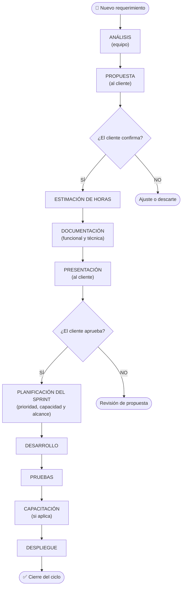

# Metodología de Trabajo con el Cliente

## Índice

1. [Visión general](#1-visión-general)
2. [Paquete de horas](#2-paquete-de-horas)
3. [Tipos de actividad que consumen horas](#3-tipos-de-actividad-que-consumen-horas)
4. [Herramientas de trabajo](#4-herramientas-de-trabajo)
5. [Flujo de trabajo](#5-flujo-de-trabajo)
6. [Etapas en detalle](#6-etapas-en-detalle)
7. [Documentación producida en cada etapa](#7-documentación-producida-en-cada-etapa)
8. [Reglas generales](#8-reglas-generales)
9. [Planificación por sprints](#9-planificación-por-sprints)

---

## 1. Visión general

El equipo trabaja bajo un modelo de **consumo de horas **. El cliente dispone de horas hombre que se va consumiendo a medida que avanza el trabajo. Toda actividad —desde la reunión inicial hasta el despliegue— descuenta horas del paquete.

El proceso para cada requerimiento sigue este orden:

```
Requerimiento → Análisis → Propuesta → Confirmación del cliente
→ Estimación → Documentación → Presentación → (si aprueba) Desarrollo
→ Pruebas → Capacitación → Despliegue
```

---

## 2. Paquete de horas

- El cliente contrata un paquete de horas al inicio o cuando lo necesita.
- El saldo se descuenta según el tipo de actividad realizada (ver sección 3).
- El equipo informa el consumo al cierre de cada etapa o sprint.
- Cuando el saldo está por agotarse, se notifica al cliente para renovar o priorizar tareas pendientes.

---

## 3. Tipos de actividad que consumen horas

| Actividad         | Descripción                                                                 |
|-------------------|-----------------------------------------------------------------------------|
| **Reunión**       | Llamadas, videollamadas o encuentros presenciales de seguimiento o relevamiento |
| **Análisis**      | Estudio del requerimiento, relevamiento de impacto técnico y funcional      |
| **Desarrollo**    | Implementación de funcionalidades, correcciones y mejoras                   |
| **Pruebas**       | Testing funcional, regresión y validación por parte del equipo              |
| **Capacitación**  | Entrenamiento al equipo del cliente sobre nuevas funcionalidades            |
| **Despliegue**    | Puesta en producción, configuración de servidores y verificación post-deploy |

---

## 4. Herramientas de trabajo

El equipo utiliza dos plataformas de GitHub como eje de gestión y documentación del proyecto.

### 4.1 Jira — gestión de requerimientos y tareas

**URL:** [Jira](https://chacoicore.atlassian.net/jira/software/projects/SCRUM/boards/1)

Cada requerimiento del cliente se registra como un **Issue** en el repositorio. El tablero de proyecto (Jira) centraliza el estado de todos los ítems activos.

| Tipo de ítem         | Se crea como                          |
|----------------------|---------------------------------------|
| Requerimiento nuevo  | Issue con label `requerimiento`       |
| Bug o corrección     | Issue con label `bug`                 |
| Documentación de pruebas | Issue con label `testing`        |
| Tarea interna        | Issue con label `task`                |

**Ciclo de vida de un Issue:**

```
Backlog → En análisis → Estimado → Aprobado → En desarrollo → En pruebas → Cerrado
```

- Al recibir un requerimiento, se abre el Issue y se asigna al responsable de análisis.
- La estimación de horas se registra como comentario o campo del proyecto.
- La aprobación del cliente se documenta como comentario en el Issue.
- Al cerrar el Issue se indica el consumo real de horas.

### 4.2 GitHub Pages — documentación pública del equipo

**URL:** [mkdir-arg.github.io/Chaco](https://mkdir-arg.github.io/Chaco/)

GitHub Pages es el punto de acceso centralizado para toda la documentación del equipo. Es accesible para todos los integrantes del proyecto (equipo y cliente con acceso).

| Contenido publicado          | Descripción                                              |
|------------------------------|----------------------------------------------------------|
| **Minutas de reunión**       | Resumen de cada reunión: acuerdos, responsables y fechas |
| **Definiciones de sprint**   | Objetivo, alcance y ítems comprometidos por iteración    |
| **Documentación funcional**  | Descripción de funcionalidades aprobadas e implementadas |
| **Actas de cierre**          | Confirmación de despliegue y cierre de cada ciclo        |

> Todo documento que requiera validación o referencia futura se publica en GitHub Pages para garantizar su disponibilidad y trazabilidad.

---

## 5. Flujo de trabajo



Una vez aprobado por el cliente, el requerimiento no entra automáticamente en desarrollo: primero se incorpora al backlog priorizado y se confirma en la **planificación del sprint** según prioridad, capacidad del equipo, dependencias y compromisos ya asumidos.

---

## 6. Etapas en detalle

### 6.1 Recepción del requerimiento

- El cliente envía el requerimiento por escrito (correo o canal oficial acordado).
- El equipo acusa recibo dentro de las 24 horas hábiles.
- Se crea un **Issue en Jira** con el título del requerimiento, descripción completa y label `requerimiento`.
- Se asigna un responsable de análisis y el Issue pasa al estado **"En análisis"**.


### 6.2 Análisis

- El equipo estudia el requerimiento: impacto funcional, técnico y sobre procesos existentes.
- Se identifican dudas o ambigüedades y se solicita clarificación al cliente si es necesario.
- El analista puede convocar la cantidad de reuniones que considere necesarias hasta contar con una comprensión completa y concreta del requerimiento. Cada reunión consume horas del paquete.
- **Consume horas** desde el momento en que comienza el análisis.

### 6.3 Propuesta

- El equipo redacta una propuesta de solución con el alcance definido.
- Se agenda una reunión breve para presentarla al cliente.
- El cliente puede aceptar, pedir ajustes o descartar el requerimiento.

### 6.4 Estimación

- Una vez confirmada la propuesta, el equipo estima las horas necesarias por etapa: desarrollo, pruebas, despliegue y capacitación.
- La estimación se presenta como rango (ej: 8–12 horas) para contemplar variabilidad.
- Se verifica que el cliente tenga saldo suficiente o se solicita renovación del paquete.
- La estimación se registra en el Issue correspondiente en Jira.

### 6.5 Documentación

- Se genera la documentación técnica y funcional del requerimiento:
  - Descripción del problema y solución propuesta
  - Criterios de aceptación
  - Alcance y exclusiones
  - Estimación de horas por etapa
- La documentación se publica en **GitHub Pages** para que esté disponible para todo el equipo.

### 6.6 Presentación y aprobación

- Se presenta la documentación al cliente en una reunión formal.
- La **minuta de la reunión** (acuerdos, responsables, fecha) se publica en GitHub Pages.
- El cliente confirma por escrito su aprobación (correo o comentario en el Issue).
- Sin aprobación, no se inicia el desarrollo.

### 6.7 Desarrollo

- El equipo implementa la solución según lo documentado.
- Se registran las horas consumidas por tarea.
- El Issue avanza al estado **"En desarrollo"** en Jira.
- Cambios de alcance durante el desarrollo requieren un nuevo ciclo de análisis y estimación.

### 6.8 Pruebas

- El equipo realiza pruebas funcionales y de regresión.
- Se documenta el resultado por criterio de aceptación y se publica en **GitHub Pages**.
- El Issue avanza al estado **"En pruebas"**.
- Si hay observaciones, se corrigen y re-prueban dentro del bloque de horas estimado (salvo que el volumen lo supere).

### 6.9 Capacitación

- Se realiza solo cuando la funcionalidad lo requiere.
- Puede ser presencial, por videollamada o mediante documentación de usuario.
- Se agenda con anticipación y consume horas del paquete.

### 6.10 Despliegue

- El equipo despliega en el entorno productivo según la ventana acordada.
- Se verifica el correcto funcionamiento post-deploy.
- El **acta de cierre** se publica en GitHub Pages.
- El Issue se cierra en Jira con el consumo real de horas registrado.

---

## 7. Documentación producida en cada etapa

| Etapa            | Documento generado                                  | Dónde se publica         |
|------------------|-----------------------------------------------------|--------------------------|
| Recepción        | Issue creado en Jira                     | Jira          |
| Análisis         | Notas de relevamiento / acta de dudas               | Jira (Issue)  |
| Propuesta        | Propuesta de solución (borrador)                    | Jira (Issue)  |
| Estimación       | Planilla de estimación de horas                     | Jira (Issue)  |
| Documentación    | Documento funcional y técnico del requerimiento     | GitHub Pages             |
| Presentación     | Minuta de reunión + confirmación de aprobación      | GitHub Pages             |
| Pruebas          | Reporte de pruebas por criterio de aceptación       | GitHub Pages             |
| Despliegue       | Acta de cierre del ciclo                            | GitHub Pages             |

---

## 8. Reglas generales

1. **Toda actividad se registra.** Reuniones, análisis, desarrollo, pruebas y despliegue siempre generan un registro de horas consumidas.
2. **Sin aprobación no hay desarrollo.** El equipo no inicia el desarrollo sin confirmación escrita del cliente.
3. **Cambios de alcance reinician el ciclo.** Si el cliente solicita cambios sobre un requerimiento ya aprobado y en desarrollo, se genera un nuevo ciclo de análisis y estimación.
4. **Transparencia en el consumo.** El cliente puede consultar su saldo y el detalle de consumo en cualquier momento.
5. **Comunicación oficial.** Todo acuerdo, aprobación o cambio se realiza por los canales escritos definidos al inicio del proyecto. Las conversaciones informales no tienen validez contractual.

---

## 9. Planificación por sprints

El trabajo se organiza en **sprints**: iteraciones de duración fija que agrupan un conjunto de requerimientos priorizados y aprobados.

- La duración de cada sprint se acuerda con el cliente al inicio de la planificación (por ejemplo: 1, 2 o 3 semanas).
- Al comenzar cada sprint se define su alcance: qué ítems del backlog se comprometen para esa iteración.
- Durante el sprint el equipo trabaja únicamente sobre los ítems comprometidos; los cambios de alcance se tratan en el siguiente sprint.
- Al cierre de cada sprint se realiza una revisión con el cliente para presentar lo entregado, validar resultados y planificar el siguiente ciclo.
- El consumo de horas se informa al cierre de cada sprint.

La definición y el estado de cada sprint se publican en **GitHub Pages** y se gestionan como Issues en **Jira**.