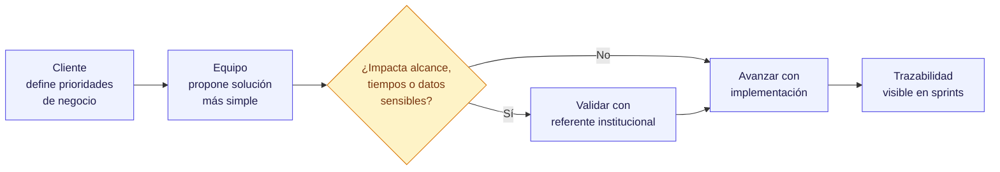

# :material-account-group: Equipo del proyecto

!!! abstract "Quién hace qué"
    Esta sección identifica al equipo asignado al proyecto y cómo se organiza el trabajo entre la institución y el equipo de implementación.

---

## :material-card-account-details-outline: Equipo asignado

-   :material-account-tie:{ .lg .middle } **Matias Fariña**

    ---

    **Rol:** Project Manager
    **Enfoque:** Seguimiento general del proyecto, coordinación y priorización.

-   :material-clipboard-text-search-outline:{ .lg .middle } **Agostina Coppola**

    ---

    **Rol:** Analista funcional
    **Enfoque:** Relevamiento, definición funcional y validación de alcance.

-   :material-code-braces:{ .lg .middle } **Pablo Cao**

    ---

    **Rol:** Desarrollador Sr.
    **Enfoque:** Implementación técnica y soporte de entregas.

-   :material-code-braces:{ .lg .middle } **Juan Kitro**

    ---

    **Rol:** Desarrollador Sr.
    **Enfoque:** Implementación técnica y soporte de entregas.

-   :material-palette-outline:{ .lg .middle } **Florencia García**

    ---

    **Rol:** UI / UX Designer
    **Enfoque:** Experiencia de usuario e interfaz visual del producto.

---

## :material-gavel: Cómo se toman decisiones

- El **cliente** define prioridades de negocio y valida el resultado esperado.
- El **equipo** propone la solución funcional y técnica más simple para cubrir esa necesidad.
- **Cambios con impacto** en alcance, tiempos o datos sensibles se revisan con el referente institucional antes de desarrollarse.
- Cada sprint deja trazabilidad visible en la sección de [**Sprints**](sprints/index.md).

---

## :material-handshake-outline: Responsabilidades compartidas

| Tema | :material-account-tie: **Cliente** | :material-account-hard-hat-outline: **Equipo del proyecto** |
|---|---|---|
| :material-priority-high: **Prioridades** | Define urgencia e impacto | Ordena y propone secuencia de implementación |
| :material-book-open-outline: **Reglas de negocio** | Aclara casos y excepciones | Las documenta y valida contra el sistema |
| :material-check-decagram-outline: **Validación** | Prueba y aprueba flujos clave | Prepara entregables y corrige desvíos |
| :material-database-outline: **Datos y accesos** | Facilita usuarios, permisos e información | Configura, acompaña y resuelve bloqueos |
| :material-progress-check: **Seguimiento** | Confirma avances y pendientes | Reporta estado, riesgos y próximos pasos |

---

## :material-message-text-outline: Canales de trabajo

-   :material-video-outline: **Reuniones de alineación**

    Para decisiones de alcance, definiciones funcionales y prioridades.

-   :material-presentation: **Revisión de sprint**

    Para mostrar avances y recoger feedback al cierre de cada iteración.

-   :material-forum-outline: **Canal operativo**

    Definido al inicio del proyecto para dudas, incidencias y seguimiento.

-   :material-book-open-page-variant-outline: **Documentación compartida**

    Este mismo sitio: acuerdos visibles, actualizados y públicos.

---

## :material-target-account: Qué esperar del equipo

!!! success "Compromisos del equipo"
    - :material-eye-outline: **Visibilidad de avance** por sprint.
    - :material-resize: **Cambios acotados y trazables.**
    - :material-clipboard-text-clock-outline: **Definiciones documentadas** antes de desarrollar temas sensibles.
    - :material-alert-circle-check-outline: **Respuesta ordenada** ante bloqueos, cambios o incidentes.
