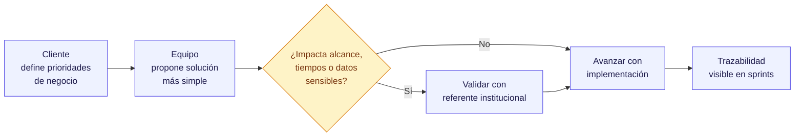

# :material-account-group: Equipo del proyecto

!!! abstract "Quién hace qué"
    Esta sección identifica al equipo asignado al proyecto y cómo se organiza el trabajo entre la institución y el equipo de implementación.

---

## :material-card-account-details-outline: Equipo asignado

-   :material-account-tie:{ .lg .middle } **Matías Fariña**

    ---

    **Rol:** Project Manager
    **Email:** [mfarina@i-core.com.ar](mailto:mfarina@i-core.com.ar)
    **Enfoque:** Seguimiento general del proyecto, coordinación, análisis funcional y priorización.

-   :material-code-braces:{ .lg .middle } **Pablo Cao**

    ---

    **Rol:** Desarrollador Sr.
    **Email:** [pablocao@i-core.com.ar](mailto:pablocao@i-core.com.ar)
    **Enfoque:** Implementación del backoffice y de la app de campo, y soporte de entregas.

-   :material-code-braces:{ .lg .middle } **Juani Portilla**

    ---

    **Rol:** Desarrollador Sr.
    **Enfoque:** Desarrollo de programas, automatización de pruebas, rendimiento y sistema de diseño.

-   :material-checkbox-marked-circle-outline:{ .lg .middle } **Matías Abate**

    ---

    **Rol:** QA y documentación funcional
    **Enfoque:** Pruebas funcionales por perfil, casos de prueba y documentación de las funcionalidades.

!!! note "Participaciones en etapas anteriores"
    **Agostina Coppola** (analista funcional) acompañó el análisis funcional del proyecto hasta agosto de 2026: propuesta de Becas, legajo ciudadano y relevamiento de Dispositivos y Merenderos. **Florencia García** (UI/UX) definió los mockups y la identidad visual inicial del producto, que derivaron en el sistema de diseño que hoy usa todo el sistema.

---

## :material-gavel: Cómo se toman decisiones

```mermaid
flowchart LR
    C[Cliente<br/>define prioridades<br/>de negocio] --> E[Equipo<br/>propone solución<br/>más simple]
    E --> V{¿Impacta alcance,<br/>tiempos o datos<br/>sensibles?}
    V -- Sí --> R[Validar con<br/>referente institucional]
    V -- No --> D[Avanzar con<br/>implementación]
    R --> D
    D --> T[Trazabilidad<br/>visible en sprints]

    classDef step fill:#eef2ff,stroke:#4f46e5,color:#1e1b4b
    classDef gate fill:#fef3c7,stroke:#d97706,color:#78350f
    class C,E,R,D,T step
    class V gate
```

- El **cliente** define prioridades de negocio y valida el resultado esperado.
- El **equipo** propone la solución funcional y técnica más simple para cubrir esa necesidad.
- **Cambios con impacto** en alcance, tiempos o datos sensibles se revisan con el referente institucional antes de desarrollarse.
- Cada versión deja trazabilidad visible en la sección de [**Versiones**](versiones/index.md).

---

## :material-handshake-outline: Responsabilidades compartidas

| Tema | :material-account-tie: **Cliente** | :material-account-hard-hat-outline: **Equipo del proyecto** |
|---|---|---|
| :material-priority-high: **Prioridades** | Define urgencia e impacto | Ordena y propone secuencia de implementación |
| :material-book-open-outline: **Reglas de negocio** | Aclara casos y excepciones | Las documenta y valida contra el sistema |
| :material-check-decagram-outline: **Validación** | Prueba y aprueba flujos clave | Prepara entregables y corrige desvíos |
| :material-database-outline: **Datos y accesos** | Facilita usuarios, permisos e información | Configura, acompaña y resuelve bloqueos |
| :material-progress-check: **Seguimiento** | Confirma avances y pendientes | Reporta estado, riesgos y próximos pasos |

---

## :material-message-text-outline: Canales de trabajo

-   :material-video-outline: **Reuniones de alineación**

    Para decisiones de alcance, definiciones funcionales y prioridades.

-   :material-presentation: **Revisión de sprint**

    Para mostrar avances y recoger feedback al cierre de cada iteración.

-   :material-forum-outline: **Canal operativo**

    Definido al inicio del proyecto para dudas, incidencias y seguimiento.

-   :material-book-open-page-variant-outline: **Documentación compartida**

    Este mismo sitio: acuerdos visibles, actualizados y públicos.

---

## :material-target-account: Qué esperar del equipo

!!! success "Compromisos del equipo"
    - :material-eye-outline: **Visibilidad de avance** por sprint.
    - :material-resize: **Cambios acotados y trazables.**
    - :material-clipboard-text-clock-outline: **Definiciones documentadas** antes de desarrollar temas sensibles.
    - :material-alert-circle-check-outline: **Respuesta ordenada** ante bloqueos, cambios o incidentes.
