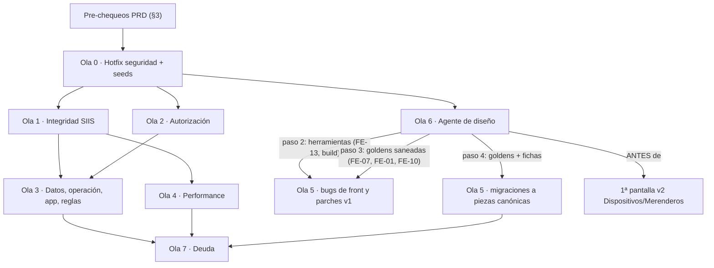

# Auditoría integral de DATAÑACH (Chaco) — octubre 2026

## Estado al 03-oct-2026 (segunda tanda)

Contrastado contra el código de `origin/development @ 719dc0a` (PRs #507 a #518, mergeados el 01-oct-2026, y #536 a
#542, mergeados el 03-oct-2026). Cada ficha resuelta o parcial lleva una línea **Resolución:** debajo de su severidad;
las pendientes cuyo código o escenario cambió llevan **⚠ Actualizar (03-oct-2026)**. Las tablas índice de `hallazgos/`
tienen la columna «Avance 03-oct» (✅ resuelto · 🟡 parcial · ⬜ pendiente).

| Severidad | Total | ✅ Resueltos | 🟡 Parciales | ⬜ Pendientes |
|---|---:|---:|---:|---:|
| CRÍTICA | 6 | 4 | 1 | 1 |
| ALTA | 33 | 5 | 4 | 24 |
| MEDIA | 75 | 3 | 0 | 72 |
| BAJA | 91 | 0 | 0 | 91 |
| INFO | 1 | 0 | 0 | 1 |
| **Total auditado** | **206** | **12** | **5** | **189** |
| Seguimientos de la 1ª tanda de la Ola 0 (R0-01..07, BAJA/MINOR) | 7 | 1 | 0 | 6 |
| Seguimientos de la 2ª tanda de la Ola 0 (R0b-01..10, BAJA/MINOR) | 10 | 0 | 0 | 10 |
| Seguimientos operativos de la 2ª tanda (R0b-11, R0b-12, PM, sin código) | 2 | 0 | 0 | 2 |

**Resueltos y parciales**

| ID | Sev. | Avance | PR · Cambio | Qué quedó / qué falta |
|---|---|---|---|---|
| SEC-02 | CRÍTICA | ✅ | #542 · Cambio 114 | `ReadOnlyModelViewSet` + `ciudadano.ver`; `SearchFilter` (V1-NEW-03); solo contesta búsquedas de ≥ 3 caracteres; sensibles con `ciudadano.sensible`. Seguimientos R0b-04, R0b-05 |
| SEC-03 | CRÍTICA | ✅ | #539 · Cambio 110 | Incluye G1b-01. Fuera superusuarios, admins globales y de otro programa; credenciales solo si **todos** los roles están en alcance (D-03). Operativo: P-04 (R0b-12); seguimientos R0b-01, 02, 03, 10 |
| SEC-04 | CRÍTICA | ✅ | #509 · Cambio 100 | Ruta, vista y throttle borrados; `/api/becas/renaper/consultar/` intacto. Operativo: logs de 90 días (P-15, D-04) |
| SEC-05 | CRÍTICA | ✅ | #540 · Cambio 113 | `/api/users/` solo con `me` (D-05). Cierra también SEC-16 y SEC-17 |
| SEC-08 | ALTA | ✅ | #507 · Cambio 103 | `json_script` en `base.html`; sin whitelist en `RolForm.clean_name` (decidido) |
| SEC-13 | ALTA | ✅ | #541 · Cambio 115 | Geografía de solo lectura por API; los 6 ViewSets de `core` con `BackofficeAutenticado` |
| SEC-14 | ALTA | ✅ | #541 · Cambio 115 | Las 5 APIs del dashboard con `BackofficeAutenticado` + capacidad; alertas por alcance; `inicio.html` condicionado. Seguimiento R0b-09 |
| G1-02 | ALTA | ✅ | #510 · Cambio 101 | `consultar-renaper/` desmontada y su código borrado |
| SIIS-07 | ALTA | ✅ | #515 · Cambio 99 | Migración `0073` + `q_uuid_en_texto`. Operativo: P-11/P-12 y prueba en testing de ECOM; seguimientos R0-06, R0-07 |
| SEC-16 | MEDIA | ✅ | #540 · Cambio 113 | Listados de personal retirados (con SEC-05) |
| SEC-17 | MEDIA | ✅ | #540 · Cambio 113 | Escritura de usuarios y roles por API retirada (con SEC-05) |
| SEC-19 | MEDIA | ✅ | #537 · Cambio 111 | Las 4 rutas de debug/prueba de legajos → 404 y sus vistas borradas |
| R0-01 | BAJA (MINOR) | ✅ | #537 · Cambio 111 | `<id>/evaluar/` desmontada; no queda escritura anónima en `conversaciones` |
| SEC-01 | CRÍTICA | 🟡 | #509 · Cambio 100; #536 · Cambio 109 (+ #540, #541, #542) | Puntos 1 y 2 hechos sobre toda la lista de la ficha (`users`, `legajos`, `core`, `dashboard`; `BackofficeAutenticado` exige `is_active`). Falta, sin riesgo explotable hoy: `conversaciones/api_views` (4), `core/views/performance.py` (8), las vistas de Spectacular y las raíces de los routers → Ola 2, PR 8 (2 h). H-08 (PM) |
| SEC-09 | ALTA | 🟡 | #538 · Cambio 112 | Etapa 1 en código (nginx `internal`, `SERVE_MEDIA=True`, el middleware ya no exime `/media/`). Falta desplegarla en icore (R0b-11, PM: `web` antes que `nginx`) y la etapa 2 (pertenencia, Ola 2, PR 7). Seguimientos R0b-07, R0b-08 |
| SEC-29 | ALTA | 🟡 | #511 · Cambio 102 | Rutas `mi-perfil/*` apagadas + comando `desactivar_usuarios_portal`. Falta correrlo en PRD tras P-08 (PM) |
| G1-01 | ALTA | 🟡 | #510 · Cambio 101 | Rutas públicas desmontadas y `evaluar/` cerrada (R0-01, #537). Falta la fase 2 (Ola 7) y P-10 |
| OPS-06 | ALTA | 🟡 | #508 · Cambio 104 | Opt-in, activo, Operador (DECISIÓN PM 01-oct: queda como está) y `crear_programas`. Falta la fase 2 `RolMeta.clave` → Ola 2, PR 1 (+4 h); P-05 y re-tildar en PRD (PM) |

**PRs sin ficha propia.** #512 (Cambio 105) arregló las fechas fijas de `test_coordinador_regional.py` (no es un
hallazgo; dejó R0-03 como seguimiento). #513, #516, #517 y #518 son desarrollo nuevo (comando `correr_alta_siis`,
`ids_de` por rangos de pk, lista de aprobados, tabla intermedia `AltaIntermediaSIIS` y `--destino`): **no cierran
ninguna ficha** y suman caminos nuevos a SIIS-01 (séptima vía de alta sin exclusión: `sincronizar_tabla_intermedia`),
SIIS-03 (otro comando que ignora la corrida viva), SIIS-04 (la tabla intermedia se manda sin releer el estado) y G3-06
(`correr_alta_siis` corre `corregir_datos_siis --aplicar`). Además la migración `0074` quedó tomada por
`0074_altaintermediasiis`: la de SIIS-01 pasa a ser la siguiente libre.

**La Ola 0 queda completa en código.** De sus 16 ítems, 11 están ✅ (SEC-02, 03, 04, 05, 08, 13, 14, 16, 17, 19 y
G1-02) y 5 🟡, ninguno con código pendiente de la Ola 0: SEC-01 (el resto de `BackofficeAutenticado`, fuera de la
lista de la ficha, pasa a la Ola 2), SEC-09 (deploy en icore + etapa 2 en la Ola 2), SEC-29 (operativo), G1-01 (fase 2
en la Ola 7 + P-10) y OPS-06 (fase 2 en la Ola 2 + P-05). R0-01 también se cerró. Ya no queda ninguna escritura por API
abierta a cualquier usuario del backoffice ni superficie anónima conocida, salvo `/media/` en DEV hasta el deploy de
R0b-11.

**Pendientes operativos (PM / ECOM), sin código:** desplegar SEC-09 etapa 1 en icore-srv, `web` antes que `nginx`
(R0b-11); P-04 ampliado en PRD (R0b-12, SEC-03); P-08 y `desactivar_usuarios_portal --aplicar` en PRD (SEC-29); P-05 y
volver a tildar `becas.relevamiento.publico` donde haga falta (OPS-06); P-11/P-12 y prueba del link público en testing
(SIIS-07); P-15 (D-04); P-10 (G1-01); H-08 (SEC-01). Y el release de todo esto a ECOM (`/pushGitLabecom`, lo decide el
PM, H-04).

**Horas del plan:** 636 h al cierre de la primera tanda − 22 h cerradas en la Ola 0 (todo lo que quedaba salvo las 2 h
del resto de SEC-01, que pasan a la Ola 2) + 14 h nuevas (R0b-01..10) = **628 h** (detalle por ola en §6).

Base auditada: `origin/development @ 917e583` (01-oct-2026). Producción: MariaDB de ECOM. Documento consolidado de tres
pasadas: descubrimiento (8 áreas), verificación adversarial independiente con tests, y profundización de huecos.

**Lectores:** (1) el **agente desarrollador** que implementa, en sesiones separadas y sin acceso a la conversación que
produjo esto: todo lo que necesita está en esta carpeta; (2) el **PM (Mkdir)**, que decide las DECISIONES (§2) y prioriza
las olas (§6).

## Contenido de la carpeta

| Archivo | Qué tiene |
|---|---|
| `README.md` | Este documento: uso (§0), resumen (§1), decisiones (§2), pre-chequeos en PRD (§3), índice de hallazgos (§4), agente de diseño (§5), plan por olas (§6), criterios v2 (§7), lo refutado (§8) y trazabilidad (§9) |
| `hallazgos/01-seguridad.md` | Fichas de seguridad y autorización (SEC, G1-01/02, G1c-04/10/16) |
| `hallazgos/02-siis-becas.md` | Fichas de SIIS, núcleo de Becas, app de campo y reportes (SIIS, BEC, G1, G2-01, G1c-15, G3-06) |
| `hallazgos/03-dispositivos-merenderos-legajos.md` | Fichas de Dispositivos, Merenderos y Legajos (DIS, MER, LEG, G1c-08/17), con «parchear v1» o «criterio v2» |
| `hallazgos/04-performance.md` | Fichas de performance (PERF, G1b-11, G1c-09/11, G3-03) |
| `hallazgos/05-datos-operacion-tests.md` | Fichas de datos, operación, CI y tests (DAT, OPS, TST, G1c-12, G2-05, G3-04/05) + inventario de comandos programados |
| `hallazgos/06-usuarios-dashboards.md` | Fichas del ABM de usuarios/roles y dashboards (G1b, G2) |
| `hallazgos/07-front.md` | Fichas de front (FE, V5A-NEW) |
| `anexo-agente-diseno.md` | Especificación completa de la Ola 6 (agente de diseño) |
| `anexo-front-clases-inexistentes.md` | Las 120 clases que no existen en el CSS cargable y el diff del build |
| `anexo-mediciones-performance.md` | Método, mediciones y criterios de cierre en el banco |
| `poc/` | Tests de reproducción por dominio, harness de performance y herramientas (ver `poc/README.md`) |

Las fichas viven en `hallazgos/` (una por dominio) para que cada sesión lea solo lo de su ola; §4 es el índice.

---

## 0. Cómo usar este documento (agente implementador)

### 0.1 Reglas de trabajo
1. **Base y ramas.** Todo sale de `origin/development` (nunca de `main`, que es un release generado por
   `publish-main.yml` y **no se toca a mano**). Un **worktree + una rama por PR** de la ola:
   ```powershell
   git fetch origin
   git worktree add ..\Chaco-wt-<ola>-<tema> -b fix/<ola>-<tema> origin/development
   ```
   No usar `git stash` en el checkout principal (hay sesiones concurrentes sobre el mismo checkout). Verificar la rama en
   el mismo comando que hace el commit. PRs contra `development` con `--repo Mkdir-arg/Chaco-Back`. Nada de deploy ni de
   espejado a ECOM (`/pushGitLabecom` lo decide el PM). Commits con el trailer de coautoría que indique la sesión.
2. **Venv.** Tests, `check` y `compile_templates` con **`.venv312`** (Python 3.12 + Django 5.2.17, igual al CI); `ruff`
   con `.venv`. Nunca el Python global. Prólogo (PowerShell, raíz del worktree):
   ```powershell
   $env:PY = "C:\Users\mkdir\Proyectos\Chaco\.venv312\Scripts\python.exe"   # el venv vive en el checkout principal, no en el worktree
   $env:PYR = "C:\Users\mkdir\Proyectos\Chaco\.venv\Scripts\python.exe"     # ruff y auditorías de diseño (tampoco está en el worktree)
   $env:DJANGO_SECRET_KEY = "test-key"; $env:PYTEST_RUNNING = "1"; $env:DJANGO_SYNCDB_PROJECT_APPS = "True"
   ```
   En un worktree nuevo no hay `node_modules`: correr `npm ci` antes de `npm run build:tailwind`. En Git Bash, `export PYTHONIOENCODING=utf-8` antes de `scripts/requerimientos.py`.
3. **Requerimientos (regla de oro del repo).** Antes de diseñar cada ítem: `& $env:PY scripts\requerimientos.py --tag <tema>`
   y `--buscar "<palabra>"` para las decisiones registradas que cita la ficha (p. ej. Cambio 18, 20, 29, 41, 54, 58, 69,
   88, 91). Si la ficha contradice una decisión registrada, decirlo antes de implementar. Al terminar: entrada nueva +
   fila del índice en `docs/internal/requerimientos.md` y `requerimientos.py --check` en OK. **El número de Cambio lo da
   el archivo al momento de escribir** (no asumir: p. ej. la rama del token usaba «Cambio 95», ya ocupado).
4. **TDD con las PoC.** Para cada ítem con PoC (ver `poc/README.md`): copiar la clase de reproducción al worktree,
   comprobar que **hoy pasa** (el bug existe), escribir el test **invertido** (o el de «Tests a agregar» de la ficha) y
   comprobar que **falla** antes del fix y **pasa** después. Commitear solo el test invertido con el nombre de la ficha.
   Sin PoC: escribir primero el test de la ficha y verlo fallar.
5. **Verificación estándar (`V-STD`)**, en todo PR:
   ```powershell
   & $env:PY manage.py check
   & $env:PY manage.py check --deploy
   & $env:PY manage.py makemigrations --check --dry-run
   & $env:PY manage.py test <apps tocadas>          # y la suite completa antes de pedir revisión
   & $env:PYR -m ruff check <archivos tocados>
   & $env:PY scripts\requerimientos.py --check
   ```
   Si toca rutas presupuestadas: `& $env:PY manage.py test --tag performance` (y `scripts/perf_budgets.json` +
   `scripts/perf_audit.py::build_targets` juntos).
6. **Verificación de UI (`V-UI`)**, si el PR toca templates, CSS o JS:
   ```powershell
   & $env:PYR scripts\design_audit.py --changed                          # desde la Ola 6: --ratchet (0 nuevos)
   & $env:PY scripts\compile_templates.py                                # 0
   & $env:PYR scripts\check_design_agent.py --changed
   npm run build:tailwind                                                # si se agregó una utilidad; commitear el CSS
   ```
   Antes de la Ola 6 el `design_audit` completo da 46 errores preexistentes: el criterio es **0 nuevos en los archivos
   tocados**. Desde la Ola 6 rige el protocolo del agente de diseño (Plan de pantalla, golden, novedades).
7. **Revisión.** Cada PR pasa por un revisor independiente (`chaco-dev-reviewer`; en UI también
   `chaco-design-reviewer`). Lo aprueba el juez.

### 0.2 Gotchas de MariaDB (producción en ECOM) que condicionan las propuestas
- **Prod es MariaDB**, la CI usa `mysql:8.0` y los tests SQLite: lo que pasa en tests puede romper solo en PRD. Para lo
  que dependa del motor, probar en el banco `scripts/perf_mysql/` (contenedor 3308, base `chaco_perf_ci`) o con la
  matriz de TST-01 cuando exista.
- **Sin tablas de zona horaria:** nada de `__date`, `__year`, `__month`, `__day`, `TruncDate`, `TruncWeek` sobre
  `DateTimeField` (Django genera `CONVERT_TZ` → NULL). Usar rangos `[inicio, fin)` en hora local (DIS-01). `TruncMonth`
  sobre un `DateField` es seguro.
- **`read_timeout = 10 s`:** nunca mantener un lock de fila mientras se espera un HTTP externo (SIIS-01); consultas de
  página por «pk primero e hidratar» (PERF-02); `JSON_EXTRACT` con ruta explícita (`KeyTransform` trata claves numéricas
  como índice); evitar IN anidados y funciones sobre columnas en el WHERE con `select_for_update`.
- **UUID:** MariaDB ≥ 10.7 tiene UUID nativo y Django 5 manda UUID **con guiones**: columnas `char(32)` dan «Data too
  long»; buscar con `q_uuid_en_texto` (SIIS-07, V2-NEW-05).
- **`supports_partial_indexes = False`:** un `UniqueConstraint(condition=…)` **no se crea** en MariaDB. Para unicidad
  condicional usar una columna nullable dentro de un índice único (varios NULL permitidos), como en SIIS-01 y DIS-02.
- **DDL no transaccional:** una migración cortada deja el esquema a medias. Migraciones de datos por lotes (patrón 0072),
  índices con `ALGORITHM=INPLACE, LOCK=NONE`; ensayar sobre la tabla grande (`programas_formulario`) en el banco.
- **Restore de PRD:** puede dejar tablas huérfanas («Table already exists»): se borran, **nunca `--fake`** (OPS-01).
- **`SKIP LOCKED`** necesita MariaDB ≥ 10.6 (confirmar la versión con P-11).
- **ORM:** `Exists` sobre FK casi siempre NULL = scan por fila; `only(pk)` sobre un manager relacionado = N+1.

### 0.3 Cómo leer una ficha
```
### <ID> · <título>
**Severidad:** CRÍTICA|ALTA|MEDIA|BAJA|INFO · **Estado:** CONFIRMADO con test (<clase de la PoC>) | CONFIRMADO (lectura) | PLAUSIBLE
· **Origen:** IDs de las pasadas anteriores que absorbe · **Ola:** 0-7 (o «v2») · **Esfuerzo:** S|S-M|M|L · **Decisión:** D-xx
- Ubicación (path:línea en 917e583) · Escenario (lo reproducido) · Causa raíz
- Propuesta (archivos, funciones, pseudo-código, migración) · Lo que NO hay que hacer (si aplica)
- Tests a agregar (nombres) · Verificación (V-STD/V-UI + específica) · Dependencias
```
- **ID canónico:** el de la pasada 2 (SEC, SIIS, BEC, DIS, MER, LEG, PERF, DAT, OPS, TST, FE) o el de la pasada 3 (G1-NN,
  G1b-NN, G1c-NN, G2-NN, G3-NN) o un nuevo de verificación (V2-NEW-03…). Cada problema aparece **una sola vez**; los
  duplicados figuran en «Origen» y en §9.
- **Estado:** «con test» = hay una PoC en `poc/` que lo reproduce; «lectura» = verificado leyendo el código citado;
  «PLAUSIBLE» = mecanismo real pero depende de datos/config de PRD o no se reprodujo.
- Las líneas citadas son de `917e583`: si se movieron, buscar por nombre de función.
- **Decisión:** si la ficha tiene una D-xx abierta, implementar el **default** de §2 salvo que el PM haya decidido otra
  cosa (registrarlo en *Decisiones tomadas* de la entrada de requerimientos).

### 0.4 Qué NO hacer (detalle en §8)
- No mantener un `select_for_update` durante el HTTP a SIIS; no creer que en MariaDB «solo el candado da unicidad».
- No globalizar `programa.configurar` (rompe Dispositivos); no pasar `ItemDiseno` a PROTECT (Cambio 58).
- No borrar ni tocar el alias **`/api/becas/renaper/consultar/`** (lo usa la app en ECOM): se borra solo
  `/api/legajos/renaper/consultar/`.
- No usar `NUM_PROXIES` para throttles; no usar `settings.ENVIRONMENT` para guardas «no correr en PRD» (QA y DEV dicen
  `prd`).
- No montar `api_contactos` con `path("contactos/", …)` ni sin arreglar el filtro; no agregar la escala `gray` al build.
- No sacar el GZip para los xlsx; no crear índice sobre `modificado` para el cupo; no `set_expiry(3600)` en el paso 1
  del link; no reescribir el xlsx fila a fila; no queryset por defecto que difiera `definicion`.
- No usar `replaces` ni `--fake` para la renumeración de migraciones de icore.
- No columna generada por `RunSQL` para unicidad de alojamiento; no deduplicar entregas «idénticas en < 1 min».
- Agente de diseño: no `design_conformidad.py`, ni `design_skeleton.py`/*similarity*, ni 20 reglas bloqueantes, ni
  `design_baseline.json`, ni mover parciales de Becas a `components/`, ni `ModernModal` con `input`, ni fichas dentro de
  `.claude/agents/`.

---

## 1. Resumen ejecutivo

### 1.1 Alcance
- **Se auditó:** Becas (núcleo, cupo, revisión, constructor, padrón, proceso masivo, reportes y dashboard), integración
  SIIS, RENAPER y Base de Personas, inscripción pública por link (`/portal/inscripcion/<uuid>/`), API de la app de campo
  (`/api/becas/*`, contrastada con `Chaco-mobile`), Dispositivos y Merenderos v1, Legajos, Configuración, ABM de usuarios y
  roles, dashboards e inicio, admin de Django, comandos de management y cron, despliegue (entrypoint, nginx, k8s de
  referencia, settings), CI y tests, front del backoffice y el sistema del agente de diseño.
- **Fuera de alcance:** portal ciudadano (registro, perfil, consultas) y conversaciones, por estar sin uso (decisión del
  29-sep-2026), **salvo la superficie pública que exponen** (registro sobre legajos existentes, chat público que crea
  legajos, oráculo RENAPER, WebSocket de alertas), que sí se auditó porque afecta al backoffice y a SIIS. No se ejecutó
  nada contra PRD ni contra MariaDB: lo que depende de PRD está en §3 como consulta a correr.

### 1.2 Método
1. **Descubrimiento (pasada 1):** 8 auditores independientes por área (núcleo Becas, SIIS/inscripción,
   Dispositivos/Merenderos/Legajos, performance, seguridad/RBAC, front, agente de diseño, datos/comandos/tests): 211
   hallazgos + 6 solapados.
2. **Verificación adversarial (pasada 2):** 7 verificadores independientes (V1 seguridad, V2 SIIS/Becas, V3
   Dispositivos/Legajos, V4 performance, V5a front, V5b agente de diseño, V6 datos/operación) re-leyeron el código,
   **reprodujeron con tests** en worktrees de `origin/development` con `.venv312` (más Playwright en front y un harness de
   conteo de sentencias en performance), refutaron o ajustaron severidades y propuestas, y agregaron hallazgos nuevos.
3. **Huecos (pasada 3):** G1 (app móvil, `armar_payload`, configuración, padrón, avisos, identidad), G2 (verificación de
   G1b: usuarios y dashboards) y G3 (verificación de G1c: admin, WebSocket, alta RENAPER del backoffice, comandos y cron).
4. **Consolidación:** deduplicación entre dominios (cada problema una vez), plan por olas y criterios de la v2.

Resultado de la verificación: **1 hallazgo refutado entero** (A4-15, GZip de xlsx) y varios refutados en parte (§8);
decenas de severidades ajustadas en ambos sentidos. Antes de deduplicar, la pasada 2 sumó 41 hallazgos nuevos y la
pasada 3 otros 59 (G1 16, G1b 12, G1c 18, G2 6, G3 7); muchos resultaron duplicados y quedaron absorbidos (§9).

### 1.3 Números finales (post-verificación y dedupe)

| Dominio | CRÍTICA | ALTA | MEDIA | BAJA | INFO | Total |
|---|---:|---:|---:|---:|---:|---:|
| Seguridad y autorización | 5 | 12 | 14 | 10 | 0 | 41 |
| SIIS, Becas, app de campo y reportes | 1 | 7 | 22 | 29 | 1 | 60 |
| Dispositivos, Merenderos y Legajos | 0 | 4 | 6 | 11 | 0 | 21 |
| Performance | 0 | 2 | 7 | 12 | 0 | 21 |
| Datos, operación, CI y tests | 0 | 3 | 8 | 13 | 0 | 24 |
| Usuarios, roles y dashboards | 0 | 1 | 3 | 7 | 0 | 11 |
| Front del backoffice | 0 | 4 | 15 | 9 | 0 | 28 |
| **Total** | **6** | **33** | **75** | **91** | **1** | **206** |

Además, el **sistema del agente de diseño** (A7) tiene un diagnóstico propio (§5): de 37 afirmaciones verificadas, 4
refutadas y varias ajustadas, más 5 problemas nuevos; se trata como un único frente de trabajo (Ola 6).

### 1.4 Top-10 de riesgos, en lenguaje claro
1. **Cualquiera en internet consulta datos de RENAPER** (domicilio, si la persona falleció) de cualquier DNI, sin login,
   por dos puertas distintas (SEC-04, G1-02). *(✅ 03-oct: las dos cerradas, #509 y #510.)*
2. **Un beneficiario puede quedar dado de alta dos veces en SIIS** (que no tiene baja) por un doble clic, por el proceso
   masivo junto con el botón, o porque un corte de red se registra como «error, reintentar» (SIIS-01, SIIS-02).
3. **Un anónimo se crea una cuenta de «ciudadano» sobre un legajo existente con solo el DNI** y con esa cuenta usa la API
   del backoffice: lista el personal, el padrón y crea provincias (SEC-29, SEC-01). *(🟡 03-oct: registro apagado
   y Basic cerrado, #511 y #509; falta desactivar las cuentas existentes en PRD.)*
4. **El admin de un programa puede tomar la cuenta de un superusuario** o de un usuario de otro programa, y quien
   administra solo roles o solo usuarios puede darse el control total del programa (SEC-03, G1b-02, SEC-05).
   *(🟡 03-oct: SEC-03 y SEC-05 cerrados, #539 y #540; G1b-02 sigue, Ola 2.)*
5. **Cualquier usuario logueado puede cambiar o borrar ciudadanos y provincias por API** y desactivar a otros usuarios
   (SEC-02, SEC-13, SEC-05). *(✅ 03-oct: los tres cerrados, #542, #541 y #540.)*
6. **Desde el chat público se crean legajos con nombres inventados** que después se usan para informar a SIIS (G1-01).
   *(✅ 03-oct: el chat ya no crea legajos, #510, y `evaluar/` se cerró, #537; G1-01 queda 🟡 por la fase 2 y P-10.)*
7. **Un nombre de rol con código se ejecuta en todas las páginas del backoffice**, y con una sesión robada se cambia la
   clave sin conocer la actual (SEC-08, G2-03). *(🟡 03-oct: el XSS se cerró, #507; G2-03 sigue.)*
8. **Cada deploy borra configuración hecha a mano en Roles** (p. ej. la capacidad de ver los casos del link público del
   Referente, tildada el 25/09 y probablemente perdida en el deploy del 28/09), y reactiva roles desactivados (OPS-06).
   *(🟡 03-oct: #508 dejó de pisarla; falta verificar con P-05 y volver a tildar en PRD.)*
9. **Borrar una pregunta o un requisito borra en silencio los documentos (fotos de DNI) de todos los casos**; el revisor
   los ve como «faltantes» (DAT-01).
10. **Producción está ciega ante errores** (los tracebacks de los 500 no llegan a los logs de ECOM) y el alta de
    relevamientos públicos puede dar 500 en MariaDB ≥ 10.7 con un arreglo que está en una rama sin mergear (OPS-03,
    SIIS-07). *(🟡 03-oct: SIIS-07 mergeado, #515; OPS-03 sigue.)*

---

## 2. Decisiones pendientes

Todas tienen un **default recomendado**: el implementador aplica el default salvo que el PM decida otra cosa. «Bloquea»
indica qué ítems no conviene cerrar sin la respuesta.

### 2.1 Preguntas abiertas (operación y ECOM)

| ID | Pregunta | Default / cómo resolverla | Bloquea |
|---|---|---|---|
| H-01 | ¿Qué versión de MariaDB corre en PRD (y en testing de ECOM)? | Correr P-11. Mientras tanto, asumir ≥ 10.7 (UUID nativo) | SIIS-07 (prueba), TST-01 (matriz), SIIS-03 punto 7 (`SKIP LOCKED`) |
| H-02 | ¿ECOM tiene instalado el CronJob `generar_alertas`? | Inferirlo con P-16 y preguntarlo a ECOM | Severidad de LEG-01/PERF-20; G1c-04 (agravante) |
| H-03 | ¿La rama `fix/token-publico-uuid-mariadb` quedó sin PR a propósito? | ✅ Resuelta (01-oct): mergeada en #515 como Cambio 99 | — (la migración de SIIS-01 ya no es la 0074: la ocupa `0074_altaintermediasiis`) |
| H-04 | ¿La Ola 0 va como hotfix fuera del ciclo o como prioridad 1 del plan? | Hotfix fuera de ciclo (cierra exposición anónima de datos personales) | Calendario de la Ola 0 |
| H-05 | Manifiestos reales de ECOM: `LOCAL_BOOTSTRAP_COMMANDS` del initContainer, CronJobs (deadlines, `timeZone`), ingress (timeout, `Origin` en `/ws/`, `/media/`), réplicas | Pedirlos a ECOM (`kubectl get … -o yaml`) | OPS-06 (impacto), G3-04, G1c-04, OPS-07, PERF-03, SEC-09 etapa 2 |
| H-06 | Configuración del Redis de ECOM (política de evicción, bases separadas) | Pedirla a ECOM | PERF-10, G1c-12 |
| H-07 | ¿Hay backups de base de PRD con retención? | Confirmar con ECOM | Severidad de DAT-01 (pasa a CRÍTICA si no hay) |
| H-08 | ¿Algún monitoreo de ECOM usa HTTP Basic contra `/api/`? | Preguntar; el healthcheck está en `/health/`, fuera de DRF | Riesgo de deploy de SEC-01 |
| H-09 | `ENVIRONMENT` y `DJANGO_SETTINGS_MODULE` en testing y PRD de ECOM | Pedirlos a ECOM | SEC-35, OPS-12, SIIS-20 |
| H-10 | ¿Se usan los legajos de atención (Legajos «clínico»)? | Si no: retirar el CronJob de alertas | PERF-20, LEG-01 |

### 2.2 Decisiones de producto y seguridad

| ID | Pregunta | Default recomendado | Bloquea |
|---|---|---|---|
| D-03 | ¿El admin de un programa puede cambiar el **email** de un usuario que también pertenece a otro programa? | No (deshabilitar email y clave para multiprograma; ajustar TC-67-04). ✅ Aplicado el default (03-oct): #539, Cambio 110 | SEC-03 (parte) |
| D-04 | Si los logs muestran uso anónimo masivo de la consulta RENAPER, ¿se notifica como incidente (Ley 25.326)? | Borrar la ruta ya y revisar logs de 90 días; decidir con el resultado | — |
| D-05 | ¿Se conserva la API REST `/api/users/`? | No: apagarla y dejar `me`. ✅ Aplicado el default (03-oct): #540, Cambio 113 | SEC-05, SEC-16, SEC-17 |
| D-06 | ¿Algún rol de otro programa usa capacidades de Becas a propósito? | No; correr P-02 antes de la migración | SEC-06 (migración) |
| D-07 | ¿El admin de un programa edita el wizard de **su** programa? | Sí, solo el suyo; crear programas, solo roles sin programa | SEC-07 |
| D-09 | Coordinación con ECOM de `/media/` protegido | Etapa 1 en DEV ya; etapa 2 en el próximo release a ECOM. 🟡 03-oct: etapa 1 mergeada (#538), falta desplegarla en icore (R0b-11) | SEC-09 etapa 2 |
| D-11 | ¿Timeline y alertas del legajo requieren `ciudadano.sensible`? | Sí | SEC-11, G1c-04 |
| D-12 | ¿Capacidad nueva `ciudadano.derivar` o reusar `ciudadano.editar`? | Reusar `ciudadano.editar` | SEC-12 |
| D-15 | ¿El F-00 necesita `.doc/.docx`? | No: PDF e imagen | SEC-15 |
| D-18 | ¿Se acepta que el badge de alertas quede en 0 para quien hoy ve CRÍTICAS globales? | Sí | SEC-18 |
| D-20 | ¿La exportación masiva de ciudadanos necesita capacidad propia (`ciudadano.exportar`)? | Sí, sembrada a quienes tienen `ciudadano.editar` | SEC-20 (parte) |
| D-22 | ¿RN-P13 (casos del link público) alcanza a reportes y cupo? | Sí | SEC-22 |
| D-24 | ¿`scan` (código de barras del DNI) cuenta como validación de identidad? | Sí para `scan` (registrarlo); no para `personas` sin re-consulta | SEC-24 |
| D-25 | Tasa del throttle de consulta de personas de la app | 120/h por usuario (medir uso real) | SEC-25 |
| D-26 | Clave provisoria del territorial: (a) 403 en el token + endpoint para fijar clave (release de la app) o (b) link de reseteo | (b) | SEC-26 (parte) |
| D-27 | Cadena de certificados de RENAPER | Que ECOM la confirme antes de activar `verify` | SEC-27 |
| D-29 | ¿Se desactivan las cuentas de ciudadano existentes al apagar el registro? | Sí (contar con P-08) | SEC-29 (datos) |
| D-37 | ¿Se reabre el Cambio 71 (nombre visible en el paso 2 del link)? | No; exigir reCAPTCHA en PRD | SEC-37 |
| D-S02 | Contrato de errores 5xx de SIIS con ECOM | 503 `ERROR_BD_LEGACY` se reintenta; 500 es INCIERTO; pedir clave de idempotencia (`id_externo`) | SIIS-02 |
| D-S03 | ¿Mover el proceso masivo a un CronJob de ECOM? | No (se respeta el Cambio 88) | SIIS-03 punto 7 |
| D-S05 | ¿Una persona puede tener dos altas en el mismo plan con otra función? | No: `DUPLICADO_LOCAL` | SIIS-05 |
| D-S06 | Umbral para abortar la sincronización de programas SIIS | Todos o más del 50 % ausentes | SIIS-06 |
| D-S08 | ¿Quién manda sobre el legajo cuando llega una identidad validada distinta? | Opción mínima: bloquear el envío y que corrija el coordinador | SIIS-08 |
| D-S09 | Timeouts de llamadas externas (pendiente del Cambio 91) | Consultas (5, 10) s; alta (5, 20) s; `EMAIL_TIMEOUT` 5 s | SIIS-09 |
| D-S13 | ¿Un RECHAZADO con identidad nunca validada libera el DNI en la convocatoria? (pendiente del Cambio 41) | Sí | SIIS-13 |
| D-B05 | ¿El cupo del subsegmento es tope duro? | No (referencia) | BEC-05 |
| D-B10 | ¿«En lista de espera» cuenta como revisado para terminar un relevamiento? | Sí, con mensaje diferenciado | BEC-10 |
| D-B11 | ¿El masivo aprueba a quien SIIS declaró incompatible? | No: quedan para revisión manual | BEC-11 |
| D-B23 | ¿La solapa Becas del legajo es transversal? | Ocultar casos públicos sin la capacidad; mostrar el resto | BEC-23 |
| D-G04 | Gracia para sincronizar capturas offline después del vencimiento (pendiente del Cambio 54) | 24 h desde `fecha_fin` (G1 sugería 72 h) | G1-04 |
| D-G11 | CUIL: ¿calcularlo o usar el real? (Cambio 80) | Medir diferencias; si hay, preferir el real cuando coincide con el DNI | G1-11 |
| D-G204 | ¿El inicio muestra indicadores de Becas? | Corregir etiquetas ahora; indicadores de Becas como requerimiento aparte | G2-04 |
| D-V1 | ¿Se va a operar Dispositivos/Merenderos v1 en PRD antes de aprobar la v2? | No | DIS-02..06, MER-01 (pasan a «parchear v1» si es sí) |
| D-D04 | ¿Un dispositivo «inactivo» permite egresos y traslados salientes? | Sí; no promociones ni ingresos | DIS-04 |
| D-M01 | ¿La suspensión de un merendero es reversible? | Sí | MER-01 |
| D-L03 | Red familiar del legajo: (A) arreglarla o (B) retirarla | B, retirar | LEG-03 |
| D-L06 | ¿Siguen las derivaciones entre programas del legajo? | Ocultar «Derivar a Programa» hasta la v2 | LEG-06 |
| D-C08 | Alta manual de ciudadano después de un resultado «fallecido» | Guardar `estado_renaper=FALLECIDO` | G1c-08 |
| D-O04 | ¿`/health/ready/` como readinessProbe? | No: solo monitoreo externo | OPS-04 |
| D-O05 | ¿Subir `read_timeout` solo para `migrate`? (choca con el Cambio 91) | Sí, solo en `migrate` | OPS-05 |
| D-O06 | Roles sembrados: ¿editables? ¿«Operador de backoffice» sigue con `usuario.administrar` y `rol.administrar`? | ✅ Decidida (PM, 01-oct): respetar activo y nombre; sincronizar solo capacidades base; las opt-in sobreviven; el Operador se crea solo si no existe y **queda como está** (no protegido, conserva sus capacidades). Aplicado en #508 | OPS-06 (fase 2 pendiente) |
| D-D01 | ¿Un requisito en uso se desactiva o se prohíbe tocarlo? | Se desactiva (fase 2 de DAT-01) | DAT-01 fase 2 |
| D-F01 | ¿Swipe para abrir el sidebar en celular? | No | FE-01 |
| D-F16 | «Gestión de Programas» de Legajos: ¿borrar o arreglar? | Borrar | FE-16 |
| D-F22 | ¿El hero de `inicio.html` queda como excepción registrada al canon («no hero sections»)? | Aplicar el canon salvo que el PM registre la excepción | FE-22 |

### 2.3 Decisiones del agente de diseño (antes del paso 3 de la Ola 6)

| ID | Decisión | Recomendación |
|---|---|---|
| D1 | Tamaño de las acciones del header | `btn-base` en listados y formularios, `btn-sm` en detalles (lo que hace el código) |
| D2 | Confirmación con motivo en pantallas nuevas | Arquetipo Modal con form POST; Swal queda legacy condicionado (Dispositivos y Legajos actuales) |
| D3 | Íconos | Font Awesome en el contenido; Heroicons solo en sidebar y navbar |
| D4 | Wizard de backoffice | Frenar y preguntar; no se define ahora |
| D5 | Avatar con gradiente en filas de la golden de detalle | Iniciales en `bg-brand-soft text-fg-brand` |

---

## 3. Pre-chequeos en PRD (solo lectura)

Correrlos **antes** de implementar las olas que los citan, con un usuario de solo lectura (o en una réplica), y guardar
el resultado en la issue de la ola. Tablas: `auth_*` de Django, `users_rolmeta` (`grupo_id`, `programa_id`, `activo`,
`protegido`), `programas_programa` (`codigo`), capacidades = `auth_permission` con codename = código con `.` → `_`
(`becas.programa.administrar` → `becas_programa_administrar`).

**P-01 · Altas SIIS duplicadas ya existentes (V2-NEW-03; antes de la migración de SIIS-01).** Si devuelve filas, el
listado va a ECOM para depurar en SIIS.
```sql
SELECT formulario_id, COUNT(*) AS n FROM programas_enviosiis
 WHERE estado = 'ENVIADO' GROUP BY formulario_id HAVING n > 1;
SELECT documento, id_programa, COUNT(DISTINCT formulario_id) AS n FROM programas_enviosiis
 WHERE estado = 'ENVIADO' GROUP BY documento, id_programa HAVING n > 1;
```

**P-02 · Roles de otro programa con capacidades de Becas (SEC-06).** Si da vacío, la migración no quita nada.
```sql
SELECT g.id, g.name AS rol, p.codigo AS programa, pe.codename
  FROM auth_group g
  JOIN users_rolmeta rm ON rm.grupo_id = g.id
  JOIN programas_programa p ON p.id = rm.programa_id
  JOIN auth_group_permissions gp ON gp.group_id = g.id
  JOIN auth_permission pe ON pe.id = gp.permission_id
 WHERE p.codigo <> 'BECAS' AND pe.codename LIKE 'becas\_%'
 ORDER BY g.name, pe.codename;
```

**P-03 · Roles con `programa.configurar` (SEC-07; el Cambio 20 la repartió).**
```sql
SELECT g.id, g.name AS rol, rm.categoria, p.codigo AS programa, rm.activo
  FROM auth_group g
  JOIN users_rolmeta rm ON rm.grupo_id = g.id
  LEFT JOIN programas_programa p ON p.id = rm.programa_id
  JOIN auth_group_permissions gp ON gp.group_id = g.id
  JOIN auth_permission pe ON pe.id = gp.permission_id
 WHERE pe.codename = 'programa_configurar';
```

**P-04 · Superusuarios con roles de programa y usuarios multiprograma (SEC-03).** *(03-oct: no cubre roles
Backoffice/Sistema sin programa ni grupos sin `RolMeta`: ampliarla antes de correrla, R0b-03 / R0b-12.)*
```sql
SELECT u.id, u.username, g.name AS rol, p.codigo AS programa
  FROM auth_user u
  JOIN auth_user_groups ug ON ug.user_id = u.id
  JOIN auth_group g ON g.id = ug.group_id
  JOIN users_rolmeta rm ON rm.grupo_id = g.id AND rm.activo = 1
  JOIN programas_programa p ON p.id = rm.programa_id
 WHERE u.is_active = 1 AND u.is_superuser = 1;

SELECT u.id, u.username,
       COUNT(DISTINCT rm.programa_id) AS programas,
       SUM(rm.programa_id IS NULL)    AS roles_globales
  FROM auth_user u
  JOIN auth_user_groups ug ON ug.user_id = u.id
  JOIN users_rolmeta rm ON rm.grupo_id = ug.group_id AND rm.activo = 1
 WHERE u.is_active = 1
 GROUP BY u.id, u.username
HAVING programas > 1 OR (programas >= 1 AND roles_globales >= 1);
```

**P-05 · ¿El deploy del 28/09 borró las capacidades tildadas a mano? (OPS-06).** Roles de Becas con
`becas_relevamiento_publico` (se esperaba al menos el Referente, tildado el 25/09) y estado del «Operador de backoffice».
```sql
SELECT g.name AS rol, rm.activo,
       MAX(pe.codename = 'becas_relevamiento_publico') AS tiene_publico
  FROM auth_group g
  JOIN users_rolmeta rm ON rm.grupo_id = g.id
  JOIN programas_programa p ON p.id = rm.programa_id AND p.codigo = 'BECAS'
  LEFT JOIN auth_group_permissions gp ON gp.group_id = g.id
  LEFT JOIN auth_permission pe ON pe.id = gp.permission_id
 GROUP BY g.id, g.name, rm.activo;

SELECT rm.activo, rm.protegido, pe.codename
  FROM auth_group g
  JOIN users_rolmeta rm ON rm.grupo_id = g.id
  LEFT JOIN auth_group_permissions gp ON gp.group_id = g.id
  LEFT JOIN auth_permission pe ON pe.id = gp.permission_id
 WHERE g.name = 'Operador de backoffice';

SELECT u.username, u.is_active
  FROM auth_user u JOIN auth_user_groups ug ON ug.user_id = u.id JOIN auth_group g ON g.id = ug.group_id
 WHERE g.name = 'Operador de backoffice';
```

**P-06 · Roles de programa con capacidades de administración «parciales» y cuántos usuarios las tienen (G1b-02).**
```sql
SELECT g.name AS rol, p.codigo AS programa, pe.codename, COUNT(DISTINCT ug.user_id) AS usuarios
  FROM auth_group g
  JOIN users_rolmeta rm ON rm.grupo_id = g.id
  JOIN programas_programa p ON p.id = rm.programa_id
  JOIN auth_group_permissions gp ON gp.group_id = g.id
  JOIN auth_permission pe ON pe.id = gp.permission_id
  LEFT JOIN auth_user_groups ug ON ug.group_id = g.id
 WHERE pe.codename IN ('programa_rol_administrar', 'programa_usuario_administrar', 'programa_configurar')
 GROUP BY g.name, p.codigo, pe.codename;
```

**P-07 · Cuentas activas sin ningún rol (G1b-05).**
```sql
SELECT u.id, u.username, u.last_login
  FROM auth_user u LEFT JOIN auth_user_groups ug ON ug.user_id = u.id
 WHERE u.is_active = 1 AND u.is_superuser = 0 AND ug.id IS NULL;
```

**P-08 · Cuentas de ciudadano del portal activas (SEC-29).**
```sql
SELECT COUNT(*) AS activas, MAX(u.date_joined) AS ultima_alta
  FROM auth_user u JOIN auth_user_groups ug ON ug.user_id = u.id JOIN auth_group g ON g.id = ug.group_id
 WHERE g.name = 'Ciudadanos' AND u.is_active = 1;
```

**P-09 · Cuentas de seeds con claves conocidas y cuentas staff (OPS-02, G1c-10).**
```sql
SELECT username, is_superuser, is_staff, is_active, last_login, date_joined
  FROM auth_user
 WHERE username IN ('admin', 'admin1', 'admin2', 'admin3', 'territorial_demo') OR is_staff = 1;
```

**P-10 · Legajos creados por el chat público (G1-01).** Además, revisar a mano ciudadanos creados sin legajo ni caso
previo en las fechas de uso del chat.
```sql
SELECT COUNT(*) FROM legajos_ciudadano WHERE nombre = 'Usuario' AND apellido = 'Chat';
```

**P-11 · Versión del motor (H-01; SIIS-07, TST-01).**
```sql
SELECT VERSION();
```

**P-12 · UUID guardados en hex (SIIS-07, V2-NEW-05).**
```sql
SELECT COLUMN_TYPE FROM information_schema.COLUMNS
 WHERE TABLE_SCHEMA = DATABASE() AND TABLE_NAME = 'programas_relevamiento' AND COLUMN_NAME = 'token_publico';
SELECT COUNT(*) FROM programas_relevamiento WHERE token_publico IS NOT NULL AND CHAR_LENGTH(token_publico) = 32;
SELECT id FROM legajos_legajoatencion WHERE CHAR_LENGTH(id) = 32 LIMIT 1;
```

**P-13 · Estado de `django_migrations` en icore-srv (OPS-01; antes de redesplegar `development` en DEV).**
```sql
SELECT app, name, applied FROM django_migrations
 WHERE app = 'programas' AND name REGEXP '^00(5[5-9]|6[0-9])_' ORDER BY name;
```

**P-14 · Casos aprobados sin alta y errores de envío por código (G1-08, SIIS-02).**
```sql
SELECT COUNT(*) AS aprobados_sin_alta FROM programas_formulario f
 WHERE f.estado = 'APROBADO'
   AND NOT EXISTS (SELECT 1 FROM programas_enviosiis e WHERE e.formulario_id = f.id AND e.estado = 'ENVIADO');
SELECT estado, codigo_error, COUNT(*) AS n FROM programas_enviosiis GROUP BY estado, codigo_error ORDER BY n DESC;
```

**P-15 · Logs de la consulta RENAPER anónima (SEC-04, D-04).** No es SQL: en icore,
`grep "/api/legajos/renaper/consultar/"` sobre el access log de nginx y sobre `logs/` de la app (la línea `core.requests`
trae `user=anon ip=…`), contando por IP; en ECOM, pedir el log del ingress de los últimos 90 días.

**P-16 · ¿Corre `generar_alertas` en PRD? (H-02; LEG-01, PERF-20).** Muchas inactivas con `creado` reciente y sin
`fecha_cierre` = el cron corre y recrea.
```sql
SELECT activa, prioridad, COUNT(*) AS n, MAX(creado) AS ultima, SUM(fecha_cierre IS NULL) AS sin_cierre
  FROM legajos_alertaciudadano GROUP BY activa, prioridad;
SELECT COUNT(*) AS legajos_de_atencion FROM legajos_legajoatencion;
```

**P-17 · DNI con caracteres no numéricos y personas duplicadas por formato (G1c-08).** El resultado es para revisión
manual: no hay merge automático.
```sql
SELECT COUNT(*) FROM legajos_ciudadano WHERE dni REGEXP '[^0-9]';
SELECT REGEXP_REPLACE(dni, '[^0-9]', '') AS dni_normalizado, COUNT(*) AS n, GROUP_CONCAT(id) AS ids
  FROM legajos_ciudadano GROUP BY dni_normalizado HAVING n > 1;
```

---

## 4. Hallazgos por dominio (índice)

Fichas completas en `hallazgos/`. Orden por severidad dentro de cada dominio. «Ola» remite a §6; «v2» a §7.
Avance al 03-oct-2026: ✅ resuelto · 🟡 parcial; sin marca = ⬜ pendiente.

### 4.1 Seguridad y autorización → `hallazgos/01-seguridad.md` (41 + 9 seguimientos)
Avance: 11 ✅ · 4 🟡 · 26 ⬜ (+ R0-01 ✅; R0-05, R0b-04..09 ⬜; R0b-11 operativo).
- **CRÍTICA:** 🟡 SEC-01 Basic en `/api/` (0; resto → 2) · ✅ SEC-02 CRUD del padrón por API (0) · ✅ SEC-03 toma de cuentas
  por el admin de programa (0) · ✅ SEC-04 RENAPER anónimo (0) · ✅ SEC-05 activar/desactivar usuarios por API (0).
- **ALTA:** SEC-06 `becas.*` en roles de otro programa (2) · SEC-07 `programa.configurar` global (2) · ✅ SEC-08 XSS por
  nombre de rol (0) · 🟡 SEC-09 `/media/` sin login en DEV (0/2) · SEC-10 adjuntos sin capacidad (2) · SEC-11 APIs JSON de
  legajos (2) · SEC-12 derivaciones por GET (2) · ✅ SEC-13 geografía escribible (0) · ✅ SEC-14 APIs del dashboard (0) ·
  🟡 SEC-29 registro del portal (0) · 🟡 G1-01 chat público crea legajos (0/7) · ✅ G1-02 segundo oráculo RENAPER (0).
- **MEDIA:** SEC-15 uploads · ✅ SEC-16 lista de personal · ✅ SEC-17 API de roles · SEC-18 alertas · ✅ SEC-19 debug con XSS ·
  SEC-20 CSV injection · SEC-21 cupo del Regional · SEC-22 RN-P13 · SEC-23 PATCH de la app · SEC-24 autovalidación ·
  SEC-25 throttle de personas · SEC-26 login/token/clave provisoria · SEC-27 `verify=False` · G1c-04 `/ws/alertas/`.
- **BAJA:** SEC-30 a SEC-37 · G1c-10 admin en todos los entornos · G1c-16 payload RENAPER en sesión.
- **Seguimientos (BAJA/MINOR):** ✅ R0-01 `evaluar/` anónimo de conversaciones (0) · R0-05 tasa `renaper` sin consumidor (2) ·
  R0b-04 `retrieve` de ciudadanos da 404 (2) · R0b-05 sin `OrderingFilter` (2) · R0b-06 capacidad de `AlertasViewSet` (2) ·
  R0b-07 `/media/` abierto con `DEBUG` (2) · R0b-08 comentarios viejos de `/media/` (2) · R0b-09 `actividad_reciente` (2).
- **Operativo (PM):** R0b-11 desplegar SEC-09 etapa 1 en icore (`web` antes que `nginx`).

### 4.2 SIIS, Becas, app de campo y reportes → `hallazgos/02-siis-becas.md` (60 + 3 seguimientos)
Avance: 1 ✅ · 0 🟡 · 59 ⬜ (+ R0-04, R0-06, R0-07 ⬜).
- **CRÍTICA:** SIIS-01 alta sin exclusión mutua (1).
- **ALTA:** SIIS-02 resultado ambiguo · SIIS-03 masivo · SIIS-04 estado viejo en masivo · SIIS-06 catálogo vacío ·
  ✅ SIIS-07 `token_publico` · SIIS-08 identidad validada vs legajo · V2-NEW-03 duplicados existentes (todos Ola 1).
- **MEDIA:** SIIS-05, 09, 10, 11, 12, 13 · BEC-01, 02, 03, 04, 05, 06, 07, 09, 10, 11 · G1-03, 04, 05, 08, 09 · G2-01.
- **BAJA:** SIIS-14 a 21 · BEC-14 a 21, 23, 24, 25 · G1-06, 07, 10, 11, 12, 13, 14, 16 · G1c-15 · G3-06.
- **INFO:** BEC-22.
- **Seguimientos (BAJA/MINOR):** R0-04 raíz `/api/becas/` con Token (3) · R0-06 `MultipleObjectsReturned` en el link (3) ·
  R0-07 `q_uuid_en_texto` sin guarda (3).

### 4.3 Dispositivos, Merenderos y Legajos → `hallazgos/03-dispositivos-merenderos-legajos.md` (21)
Avance: 21 ⬜.
- **ALTA:** DIS-01 `__date`/CONVERT_TZ (parchear v1, Ola 5) · DIS-02 doble alojamiento (v2) · DIS-03 espera huérfana
  (v2) · LEG-03 red familiar (Ola 5).
- **MEDIA:** DIS-04, 05, 06 (v2) · LEG-01 alertas recreadas (Ola 4) · LEG-04 AJAX que traga errores (Ola 5) · G1c-08 alta
  de ciudadano (Ola 3).
- **BAJA:** DIS-07, 09, 10, V6-NEW-02, MER-01, MER-02 (v2) · DIS-08 (Ola 5) · LEG-02, LEG-05 (Ola 5) · LEG-06 (Ola 7) ·
  G1c-17 (Ola 2).

### 4.4 Performance → `hallazgos/04-performance.md` (21)
Avance: 21 ⬜ (PERF-01 con «⚠ Actualizar» por #513).
- **ALTA:** PERF-04 padrón · PERF-02 cupo.
- **MEDIA:** PERF-01 payload/hidratar · PERF-03 Excel · PERF-07 pantalla del masivo · PERF-11 foto `definicion` (Ola 7) ·
  PERF-20 `generar_alertas` · G1b-11 export del dashboard · G1c-09 fichas del admin.
- **BAJA:** PERF-06, 08, 10, 12, 13, 15, 16, 19 · PERF-17, 18 (v2) · G1c-11 · G3-03 (Ola 2).

### 4.5 Datos, operación, CI y tests → `hallazgos/05-datos-operacion-tests.md` (24 + 2 seguimientos)
Avance: 0 ✅ · 1 🟡 · 23 ⬜ (+ R0-02, R0-03 ⬜).
- **ALTA:** 🟡 OPS-06 seeds de arranque (Ola 0; fase 2 → Ola 2) · DAT-01 cascada de adjuntos · OPS-03 logs de 500.
- **MEDIA:** OPS-01, 02, 04, 05, 07 · TST-01, 02 · G1c-12.
- **BAJA:** DAT-02, 03, 05 · V2-NEW-05 · OPS-11, 12 · TST-03 · G2-05 · G3-04, 05 · OPS-10, 13, 14 (Ola 7).
- **Seguimientos (BAJA/MINOR):** R0-02 docs con `portal:ciudadano_mi_perfil` (7) · R0-03 fecha fija que vence el
  01-ene-2027 (3, antes del 31-dic-2026).

### 4.6 Usuarios, roles y dashboards → `hallazgos/06-usuarios-dashboards.md` (11 + 5 seguimientos)
Avance: 11 ⬜ (+ R0b-01, 02, 03, 10 ⬜; R0b-12 operativo). SEC-03 (con G1b-01) está en 4.1.
- **ALTA:** G1b-02 autootorgamiento de capacidades.
- **MEDIA:** G1b-05 cuentas fantasma · G1b-06 capacidades globales borradas · G2-03 cambio de clave sin la actual.
- **BAJA:** G1b-07, 08, 09, 10, 12 · G2-04 · G2-06.
- **Seguimientos (BAJA/MINOR):** R0b-01 `help_text` de los campos bloqueados (2) · R0b-02 rol desactivado en SEC-03 (2) ·
  R0b-03 P-04 sin roles Backoffice/Sistema (2) · R0b-10 botones del listado para no gestionables (2).
- **Operativo (PM):** R0b-12 correr P-04 ampliado en PRD.

### 4.7 Front del backoffice → `hallazgos/07-front.md` (28)
Avance: 28 ⬜.
- **ALTA:** FE-02 `toastr` · FE-04 paginación de Geografía · FE-05 wizard · FE-06 clases inexistentes.
- **MEDIA:** FE-01, 07, 08, 09, 10, 11, 12, 13, 17, 18, 19, 20, 21 · V5A-NEW-01 · V5A-NEW-07.
- **BAJA:** FE-14, 16, 22, 23, 24, 25, 26 · V5A-NEW-04 · V5A-NEW-08.

---

## 5. Agente de diseño (resumen; especificación completa en `anexo-agente-diseno.md`)

**Diagnóstico verificado.** El sistema gobierna un **inventario**, pero no le enseña al agente a **reproducir
pantallas**: no hay molde por arquetipo, `design_audit.py` solo tiene reglas de token/lint (no mira estructura) y no corre
en CI, el hook audita el archivo entero y deja pasar lo preexistente, y el agente canónico es un changelog de 64,5 KB
(~18k tokens; filas de hasta 4.000 caracteres; 39 referencias de historia) con contradicciones internas. Fuera de Becas
hay 0 usos de `page_header`; la paleta cruda (963 usos) está en legajos, configuración, conversaciones y `templates/`, no
en Becas/Dispositivos/Merenderos. Verificación V5b: 37 afirmaciones de A7, 4 refutadas (`[x-cloak]` está en 16 archivos,
no 47; `_alta_rapida_modal` no incluye `_modal_header`; la «contradicción (c)» no es tal; `--fondo-principal` ya es
semántico) y 5 problemas nuevos: **N1** `check_design_agent.py` saltea en silencio las filas con `\|`; **N2** la regla
«pieza canónica → mismo diff» cubre 71 rutas (incluido `tailwind.css`) y es el motor del changelog; **N3** el contrato de
acciones del header no coincide con el código; **N4** 4 dialectos de filtros; **N5** la receta del modal tiene un
`style=`.

**Propuesta final (recortada ~50 % respecto de A7):**
1. **Una golden por arquetipo**, saneada y bloqueada por `design_audit.py --goldens` en CI: listado `personas_list.html`;
   detalle `cupo/segmento_detail.html`; formulario `segmento_form.html` + `_field.html`; modal «Nuevo programa» de
   `programa_list.html` + `_modal_header/_footer` + `becas-modal.js` + `_ajax_js.html`; confirmación sí/no
   `data-confirm-url` + `_confirm_js.html` → `ModernModal`; confirmación con motivo = arquetipo Modal (D2); badge =
   contrato de `dispositivos/_estado_badge.html`; **wizard, revisión de caso compleja y dashboard: no hay golden →
   frenar**. Una hermana del módulo **nunca** es molde (solo aporta dominio).
2. **Núcleo ≤ 30.000 bytes** (celdas ≤ 450 caracteres, sin historia) + **fichas** en `.claude/design/` (5 arquetipos, ~12
   componentes, shells y dominio), con esqueleto literal, variantes permitidas, prohibidos y checklist.
3. **Protocolo** en `chaco-frontend`: clasificar (A ajuste / B pantalla nueva / C pieza nueva); en B y C, **Plan de
   pantalla** antes del primer Write; si hay **novedades** (lista cerrada), no escribir y devolver al llamador.
4. **`design_audit.py` como ratchet** (`--ratchet` contra la base, sin baseline en archivo) con **7 reglas P1**
   (RAWPALETTE, INLINESTYLE, STYLEBLOCK, SHELLLEGACY, PAGEHEADER, TABLECANON, ICONARIA) **+ CLASSDEF** (V5a: clases que no
   existen en el CSS cargable; ERROR para utilidades Tailwind), `--arquetipo` (marcadores ordenados), `--goldens`, y el
   decodificador arreglado; en hook y CI, más el **gate de build de Tailwind**.
5. **`check_design_agent.py`:** parseo de `\|`, evidencia declarada en la ficha, regla del mismo diff satisfecha por
   núcleo **o** ficha y sin disparar por `tailwind.css`/tests/views, límites de tamaño e historia.
6. **Revisor sin `Edit`**, con checklist de 10 puntos (plan, molde, mecánico, ficha, novedades, dominio, front, a11y,
   visual, inventario).
7. **Cambios exactos** en CLAUDE.md (auditorías → «0 nuevos» con ratchet; pantalla nueva = clonar golden), AGENTS.md (una
   frase) y `chaco-frontend.md`/`chaco-design-reviewer.md`.
8. **Ejercicio de control:** 3 prompts de dominio sin pistas de diseño (listado de entregas de Merenderos, detalle de
   cama con solapas, alta de tipo de prestación), antes y después; criterio: las 3 cumplen al primer intento (plan con la
   golden correcta, 0 nuevos, marcadores OK, revisor aprueba, captura aceptada por el PM como «mismo sistema»).

**Cuándo:** pasos 0-7 de la Ola 6 (§6), **antes de la primera task de pantalla de la v2 de Dispositivos y Merenderos**.
Decisiones D1-D5 en §2.3.

---

## 6. Plan de implementación por olas

**Conversión de esfuerzo a horas (supuesto de este plan, ajustable por el PM):** S = 2 h, S-M = 4 h, M = 8 h, L = 20 h,
para implementación asistida por agente, incluyendo test, verificación y entrada de requerimientos (no incluye QA
funcional ni coordinación con ECOM). Las horas de cada ola suman los esfuerzos de sus ítems.

| Ola | Objetivo | Ítems | Horas | Ítems al 03-oct | Horas al 03-oct |
|---|---|---:|---:|---:|---:|
| 0 | Hotfix de seguridad y seeds | 16 | 36 | 0 (completa en código; lo operativo, en «Estado») | 0 |
| 1 | Integridad SIIS | 23 | 72 | 22 (− SIIS-07) | 70 |
| 2 | Autorización (RBAC, legajos, alcance de Becas, usuarios) | 36 | 116 | 50 (+ fase 2 de OPS-06, R0-05, resto de SEC-01, etapa 2 de SEC-09, R0b-01..10) | 136 |
| 3 | Datos, operación, CI, app de campo y reglas de Becas | 55 | 158 | 59 (+ R0-03, R0-04, R0-06, R0-07) | 166 |
| 4 | Performance | 19 | 52 | 19 | 52 |
| 5 | Bugs de front y parches v1 de Legajos/Dispositivos | 31 (+ V5A-NEW-07 b) | 114 | 31 (+ V5A-NEW-07 b) | 114 |
| 6 | Agente de diseño | 4 (+8 pasos) | 42 | 4 (+8 pasos) | 42 |
| 7 | Deuda | 9 (+ fase 2 de G1-01) | 46 | 10 (+ fase 2 de G1-01; + R0-02) | 48 |
| v2 | Criterios de aceptación de la v2 (§7), no se implementan en v1 | 13 | — | 13 | — |
| **Total** | | **206** | **636** | **208** | **628** |

Primera tanda (PRs #507-#518, 01-oct): se cerraron 16 h del plan (SEC-04, SEC-08, G1-02, SIIS-07, la parte hecha de
SEC-29, G1-01 y OPS-06) y entraron 16 h nuevas (fase 2 de OPS-06, 4 h, que el plan no contaba —ver m-6—, y los
seguimientos R0, 6 × 2 h; R0-05 va dentro de SEC-25) → 636 h. Segunda tanda (PRs #536-#542, 03-oct): se cerraron las
24 h que le quedaban a la Ola 0 salvo 2 h (el resto de SEC-01, que pasa a la Ola 2, PR 8; R0-01 cerró sus 2 h) → −22 h,
y entraron 14 h de seguimientos R0b (R0b-01, 02, 03, 04, 07, 09 y 10 a 2 h; R0b-05, 06 y 08 van dentro de otro ítem;
R0b-11 y R0b-12 son operativos, sin horas) → **628 h**. SEC-29 queda fuera de las olas: lo que falta es operativo.
Los 208 ítems al 03-oct = 189 pendientes + SEC-01, SEC-09, OPS-06 (parciales, en la Ola 2) + 6 R0 + 10 R0b; G1-01
sigue como «fase 2» de la Ola 7.

### Dependencias entre olas

La Ola 6 es independiente del resto del backend: conviene correrla **en paralelo** con las Olas 1-2 (otro implementador)
por su fecha límite. OPS-03 (logs a stdout, Ola 3) es independiente y conviene adelantarlo al primer release, porque sin
tracebacks no se diagnostica el deploy de las olas siguientes.

### Ola 0 — Hotfix de seguridad y seeds de arranque
- **Objetivo:** cerrar toda exposición anónima o de ciudadano del portal, las escrituras por API de cualquier
  autenticado, la toma de cuentas y el XSS global; y que los deploys dejen de pisar la configuración de Roles.
- **✅ Completa en código al 03-oct-2026.** Primera tanda (PRs #507-#511, 01-oct): ✅ SEC-04, SEC-08, G1-02 · 🟡 SEC-29,
  G1-01, OPS-06. Segunda tanda (PRs #536-#542, 03-oct, Cambios 109-115): ✅ SEC-02, SEC-03 (+G1b-01), SEC-05, SEC-13,
  SEC-14, SEC-16, SEC-17, SEC-19, R0-01 · 🟡 SEC-01 (puntos 1 y 2 hechos sobre la lista de la ficha), SEC-09 (etapa 1).
  **Queda 0 h de código en esta ola.** Lo que sigue abierto se movió o es operativo:
  1. *Movido a la Ola 2:* el resto de SEC-01 (`BackofficeAutenticado` en `conversaciones/api_views`,
     `core/views/performance.py`, Spectacular y las raíces de los routers; PR 8, 2 h), la etapa 2 de SEC-09 (PR 7) y la
     fase 2 de OPS-06 (PR 1). La fase 2 de G1-01 sigue en la Ola 7.
  2. *Operativo (PM / ECOM):* desplegar SEC-09 etapa 1 en icore, `web` antes que `nginx` (R0b-11); P-04 ampliado en
     PRD (R0b-12); `desactivar_usuarios_portal --aplicar` tras P-08 (SEC-29); P-05 y re-tildar (OPS-06); P-10 (G1-01);
     P-15 (D-04); H-08 (SEC-01); release a ECOM (H-04).
  3. *Seguimientos MINOR de los revisores:* R0b-01..10, todos en la Ola 2 (PRs 2, 3 y 7).
- **PRs y orden (plan original, para referencia):**
  1. *Superficie anónima:* SEC-04 (borrar `/api/legajos/renaper/consultar/`, **sin tocar** `/api/becas/renaper/consultar/`),
     G1-01 + G1-02 (desmontar rutas públicas de conversaciones), SEC-29 (apagar `mi-perfil/*`), SEC-01 (defaults DRF +
     `BackofficeAutenticado`/`RequiereCapacidad`), SEC-19 (rutas de debug/test). 12 h.
  2. *APIs del backoffice:* SEC-05 (+SEC-16, SEC-17: apagar `/api/users/` salvo `me`), SEC-02, SEC-13, SEC-14. 8 h.
  3. *Cuentas y XSS:* SEC-03 (con la ampliación G1b-01), SEC-08. 10 h.
  4. *Seeds:* OPS-06 (opt-in sobrevive, roles y Operador de backoffice no se reactivan, `crear_programas` sin pisar). 4 h.
  5. *Infra DEV:* SEC-09 etapa 1 (nginx de icore). 2 h.
- **Hecho cuando:** V-STD en verde con la suite completa; las PoC de seguridad invertidas pasan
  (`poc/test_repro_seguridad.py`: SEC-01 → 401/403, SEC-02 → 403/405, SEC-03 → redirect y clave intacta, SEC-04 → 404,
  SEC-05 → 403/404, SEC-08 → sin `</script>` literal, SEC-13 → 405, SEC-14 → 403, SEC-16/17 → 404, SEC-19 →
  `NoReverseMatch`); `test_repro_admin_cron_renaper.py::G1c02…` invertido pasa; `resolve("/portal/mi-perfil/registro/")`
  → 404 y la inscripción pública sigue (`manage.py test portal`); `test_becas_api` en verde (la app sigue autenticando con
  Token); en DEV, `curl -I` de un `/media/` sin cookie → 302.
- **Riesgo de deploy:** bajo. Sin migraciones de esquema (salvo la migración de datos opcional de SEC-29 para desactivar
  ciudadanos, tabla chica). SEC-01 puede romper un consumidor desconocido con Basic (H-08). Después del deploy de OPS-06,
  el PM verifica P-05 y vuelve a tildar en PRD lo que el seed haya borrado. SEC-09 etapa 1 reinicia nginx en icore
  (gotcha de IP cacheada). Si H-04 = hotfix fuera de ciclo: release a `main` y espejado a ECOM test → PRD
  (`/pushGitLabecom`, lo decide el PM).

### Ola 1 — Integridad SIIS
- **Objetivo:** que ningún camino pueda duplicar un alta ni registrar un resultado ambiguo como reintentable; masivo
  robusto; catálogo y payload sin sorpresas.
- **PRs y orden:**
  0. V2-NEW-03: correr P-01 en PRD (sin código). 2 h.
  1. ✅ SIIS-07: mergeado en #515 (Cambio 99), 01-oct. Queda operativo: P-11/P-12 y prueba en testing de ECOM.
  2. SIIS-01 + SIIS-02 + SIIS-04 + SIIS-05 + BEC-14 (migración de `EnvioSIIS` —la siguiente libre: la 0074 es
     `altaintermediasiis`, #517—, comando `conciliar_envios_siis`, guard de UI). **Incluye la séptima vía
     `sincronizar_tabla_intermedia` y `correr_alta_siis` (⚠ en SIIS-01, 03 y 04).** 22 h.
  3. SIIS-03 (+A5-33) + BEC-11 + BEC-21 (masivo). 6 h.
  4. SIIS-06, SIIS-11, SIIS-12, BEC-01, BEC-02 (independientes, S). 10 h.
  5. SIIS-09 (+PERF-09) **después** del PR 2. 4 h.
  6. SIIS-08 + G1-08 + G1-09 + G1-10 (qué viaja a SIIS). 20 h.
  7. SIIS-19, SIIS-17, G3-06 (herramientas y correcciones manuales). 6 h.
- **Hecho cuando:** V-STD; PoC invertidas de `poc/test_repro_siis_becas.py` pasan (SIIS-01: 1 sola llamada y un solo
  `vigente`; SIIS-02: `ReadTimeout` → INCIERTO no reintentable; SIIS-03: latido por caso, freno, comandos abortan con
  corrida viva; SIIS-04: no informa casos en BAJA; SIIS-05: `DUPLICADO_LOCAL`; SIIS-06: catálogo vacío no escribe;
  SIIS-11/12; BEC-01/02); la migración de `EnvioSIIS` (ya no la 0074) probada en MariaDB real con varios NULL en el índice único y con un formulario
  con 2 `ENVIADO`; `manage.py test programas` completo en verde.
- **Riesgo de deploy:** medio. Dos migraciones: 0073 (`programas_relevamiento`, tabla chica, `RunPython` con `MODIFY`; ya
  mergeada en #515) y la de `EnvioSIIS` (hoy sería la 0075; `programas_enviosiis`: decenas de miles de filas, AddField +
  índice único + índice `(documento, id_programa)` +
  migración de datos). Requisitos: P-01 corrido; no desplegar con una corrida masiva en curso; acordar con ECOM el
  procedimiento de conciliación de INCIERTOS (D-S02) y pedir la clave de idempotencia.

### Ola 2 — Autorización
- **Objetivo:** que cada capacidad se evalúe con su alcance de programa y que ninguna vista de legajos, Becas o usuarios
  dependa solo de estar logueado.
- **PRs y orden:**
  1. *Catálogo y roles:* SEC-06 (catálogo + migración de datos + exports + masivo + RENAPER pendientes), SEC-07
     (`puede_sin_programa`), G1b-02, G1b-06 y la **fase 2 de OPS-06** (`RolMeta.clave`, con migración; viene de la
     Ola 0). 26 h.
  2. *Usuarios:* G1b-05, G1b-07, G1b-08, SEC-26, G2-03, R0b-01, R0b-02, R0b-03, R0b-10 (seguimientos de SEC-03). 24 h.
  3. *Legajos:* SEC-10, SEC-11, SEC-12, SEC-18 (+ R0b-06), R0b-04 (+ R0b-05), R0b-09. 14 h.
  4. *WebSocket de alertas:* G1c-04, G1c-17, G3-03. 12 h.
  5. *Alcance en Becas:* SEC-21, SEC-22, SEC-20, SEC-30, BEC-19, BEC-23. 14 h.
  6. *App de campo:* SEC-23 (+G1-15), SEC-24, SEC-25 (+ R0-05: usar o borrar la tasa `renaper`). 12 h.
  7. *Media y uploads:* SEC-09 etapa 2, SEC-15, SEC-31, R0b-07 (+ R0b-08). 14 h.
  8. *Bajos:* SEC-27, SEC-32, SEC-33, SEC-34, SEC-35, SEC-36, SEC-37, G1c-10, G1c-16 y el resto de SEC-01
     (`BackofficeAutenticado` fuera de la lista de la ficha; viene de la Ola 0). 20 h.
- **Hecho cuando:** V-STD (+ V-UI en los PR con templates); PoC invertidas de `poc/test_repro_seguridad.py` (SEC-06, 07,
  09, 10, 11, 12, 15) y `poc/test_repro_usuarios.py` (G1b-02, 05, 06, 07; SEC-26; G2-03) y
  `test_repro_admin_cron_renaper.py::G1c04…`; `programas/tests/test_dispositivos_config.py` sigue en verde; P-02, P-03 y
  P-06 revisados con el PM antes de migrar.
- **Riesgo de deploy:** medio. Migración de datos de SEC-06 sobre `auth_group_permissions` (chica, pero quita
  capacidades: P-02 y D-06 antes); si se agregan capacidades nuevas (D-12, D-20) va una migración de `users`
  (`AlterModelOptions`). SEC-09 etapa 2 necesita al ingress de ECOM (`X-Accel-Redirect` o `SERVE_MEDIA=True`, H-05).
  SEC-26 revoca tokens al cambiar clave: los territoriales que cambien la clave reingresan en la app; si D-26 = (a), hace
  falta release de la app.

### Ola 3 — Datos, operación, CI, app de campo y reglas de Becas
- **Objetivo:** que no se pierdan datos (adjuntos, capturas offline), que el despliegue sea diagnosticable y robusto, que
  la CI pruebe el motor real, y cerrar las reglas de negocio de Becas.
- **PRs y orden:**
  1. *Operación y deploy:* OPS-03 (adelantable), OPS-01, OPS-04, OPS-05, OPS-07, OPS-11, OPS-12, G3-04, G3-05. 24 h.
  2. *Datos y catálogo:* DAT-01, DAT-02, DAT-03, DAT-05, V2-NEW-05, G1c-08. 18 h.
  3. *Comandos peligrosos:* OPS-02, G2-05, G1c-12. 6 h.
  4. *CI y tests:* TST-01 (matriz MariaDB), TST-02, TST-03, R0-03 (fecha fija que vence el 01-ene-2027: **antes del
     31-dic-2026**). 20 h.
  5. *App de campo:* G1-03, G1-04 (+BEC-22), G1-05, G1-06, G1-07, G1-16, R0-04 (raíz `/api/becas/` con Token). 34 h.
  6. *Reglas de Becas:* BEC-03, BEC-04, BEC-05, BEC-06, BEC-07, BEC-09, BEC-10, BEC-15, BEC-16, BEC-17, BEC-18,
     BEC-20, BEC-24. 26 h.
  7. *Integraciones y link público:* SIIS-10, SIIS-13, SIIS-14 (+G3-02), SIIS-15, SIIS-16, SIIS-18, SIIS-20, SIIS-21,
     G1c-15, G1-11, G1-12, G1-13, G1-14, R0-06, R0-07 (link público y `q_uuid_en_texto`). 30 h.
  8. *Reportes:* G2-01. 8 h.
- **Hecho cuando:** V-STD (+ V-UI donde aplique); PoC invertidas de `poc/test_repro_datos_operacion.py` (DAT-01, OPS-03,
  OPS-04), `test_repro_admin_cron_renaper.py` (G1c-08, RENAPER 401/503) y `test_repro_dashboard_campos_propios.py`
  (G2-01); el job de CI con `mariadb:<versión de P-11>` corre `migrate` y `test --tag mysql` en verde; `seed_datos_base`
  tiene tests de idempotencia; los «Top-5 tests faltantes» de TST-02 existen.
- **Riesgo de deploy:** medio. DAT-01 es una migración solo de estado (sin DDL). G1-04 y G1-05 agregan columnas a
  `programas_formulario` (la tabla más grande): nullable o con default, en una sola migración, ensayada en el banco de 20k
  con el `read_timeout` de migrate (OPS-05). OPS-01 y OPS-05 cambian el entrypoint (unos segundos más al arranque;
  `SKIP_SCHEMA_GUARD` de escape). OPS-03 aumenta el volumen de stdout (avisar a ECOM). OPS-12 hace que QA dependa de Redis.
  TST-01 suma 2-4 min de CI.

### Ola 4 — Performance
- **Objetivo:** que padrón, cupo, masivo, exports y el cron horario escalen a 40k casos sin acercarse al `read_timeout`
  ni al timeout de nginx.
- **PRs y orden:** (1) PERF-04 + PERF-16 (padrón; prototipo listo) 10 h · (2) PERF-02 (cupo) 2 h · (3) PERF-01 (+V4-NEW-02),
  PERF-19, PERF-07, PERF-06 (circuito SIIS) 8 h · (4) PERF-20 + LEG-01 (alertas) 6 h · (5) PERF-03 (`lxml` + botón CSV),
  G1b-11, G1b-12 (exports y dashboard) 14 h · (6) PERF-08, PERF-10 (config) 4 h · (7) G1c-09, G1c-11 (admin) 4 h · (8)
  PERF-12, PERF-13, PERF-15 (medir en el banco; índice solo si el plan lo pide) 4 h.
- **Hecho cuando:** V-STD + `test --tag performance`; presupuestos nuevos en `perf_budgets.json` (`becas_cupo_segmento`,
  `becas_proceso_masivo`); tests de consultas constantes (PERF-04, PERF-01, PERF-20, G1c-09); los criterios de cierre en
  el banco MariaDB de `anexo-mediciones-performance.md`.
- **Riesgo de deploy:** bajo-medio. Índices `(formulario, creado, id)` en `programas_enviosiis` y `programas_validacionsis`
  (online); índice de PERF-13 sobre `programas_formulario` solo si `EXPLAIN` lo justifica (`ALGORITHM=INPLACE, LOCK=NONE`).
  `lxml` nuevo en `requirements.txt` (pasar `pip-audit`). PERF-10 requiere coordinar Redis con ECOM (H-06). LEG-01 cambia
  el comportamiento de las notificaciones (menos ruido).

### Ola 5 — Bugs de front y parches v1 de Legajos y Dispositivos
- **Objetivo:** que las pantallas funcionen (subir archivos, paginar, cascadas, botones visibles) y migrar las pantallas
  fuera de Becas a las piezas canónicas clonando las goldens.
- **PRs y orden:** (1) DIS-01 + DIS-08 (helper de fechas locales + guardia de `__date`) 4 h · (2) Legajos: FE-02, LEG-04,
  LEG-05, LEG-02, LEG-03, FE-09, FE-21 14 h · (3) Configuración: FE-04, FE-05, FE-08 6 h · (4) FE-06 ya; FE-07, FE-01 y FE-10
  **después de la Ola 6 paso 3** (en ese orden: FE-07 antes o con FE-01; FE-01 antes que FE-10) 14 h · (5) FE-18, FE-19, FE-25, FE-26 8 h · (6) **después de la
  Ola 6 paso 4:** FE-11, FE-12, FE-17, FE-20, FE-23, FE-24 48 h · (7) FE-22, FE-16, V5A-NEW-04, G2-04, G2-06, V5A-NEW-07 parte (b) (labels de `convocatoria_list` y deuda de
  `_dashboard_panel`) 20 h.
- **Hecho cuando:** V-STD + V-UI (desde la Ola 6, `--ratchet` = 0 nuevos y `--arquetipo` OK en pantallas migradas); PoC
  invertidas de `poc/test_repro_dispositivos_legajos.py` (DIS-01, DIS-08, LEG-02..05); las verificaciones de Playwright de
  cada ficha FE (a 1440 y 390 px); CLASSDEF en 0 para los archivos tocados.
- **Riesgo de deploy:** bajo (sin migraciones). Cambios visuales: pasar por QA visual; CSS de Tailwind regenerado y
  committeado. Dispositivos/Merenderos: si D-V1 = no, solo FE-10, FE-18, FE-19 y DIS-01/DIS-08 tocan esos módulos.

### Ola 6 — Agente de diseño
- **Objetivo:** que una pantalla nueva salga igual a su golden al primer intento, con la deuda vieja contenida por un
  ratchet. **Fecha límite: antes de la primera task de pantalla de la v2 de Dispositivos y Merenderos.**
- **Pasos (detalle en `anexo-agente-diseno.md` §9):** 0 línea base «antes» (2 h) → 1 decisiones D1-D5 (2 h) → 2
  herramientas: `--ratchet`, 7 reglas P1 + CLASSDEF, `--arquetipo`, `--goldens`, decodificador (FE-13), gate de build
  (V5A-NEW-01), `compile_templates` sin `site-packages` (V5A-NEW-08), `check_design_agent.py` (14 h) → 3 sanear goldens
  (V5A-NEW-07) (4 h) → 4 reescribir el agente (núcleo + fichas) (8 h) → 5 consumidores (CLAUDE.md, AGENTS.md, agentes) (2 h)
  → 6 ejercicio de control «después» (8 h) → 7 registro (2 h).
- **Hecho cuando:** los criterios verificables de cada paso del anexo: PR de prueba con `text-gray-900` en un template
  existente **falla** en «Design Agent Contract» y uno nuevo canónico **pasa**; `check_design_agent.py` reporta 36 filas;
  `--goldens` = 0; núcleo ≤ 30.000 bytes y sin historia; las 3 pantallas del ejercicio cumplen al primer intento.
- **Riesgo de deploy:** casi nulo en runtime (`.claude/` y los scripts de auditoría no viajan en el release); el paso 3
  toca templates de Becas (cambios visuales mínimos, capturas antes/después). Cambia el CI (`design-agent-contract.yml`).

### Ola 7 — Deuda
- **Ítems:** OPS-10 (módulos de «optimización» y sus comandos), OPS-13 (dependencias), OPS-14 (código muerto; `.py` con CR),
  FE-14 (29 JS huérfanos), LEG-06 (código muerto de Legajos), BEC-25, G1b-09, G1b-10, **G1-01 fase 2** (apagar
  conversaciones completo: includes, `ws/conversaciones/…` y `ws/alertas-conversaciones/` —**no** `ws/alertas/`—, menú,
  card del inicio y solapa del legajo; 2 h; R0-01 se cierra antes, en la Ola 0), **R0-02** (CLAUDE.md y
  `docs/client/architecture.md` con `portal:ciudadano_mi_perfil`; 2 h) y **PERF-11** (tabla
  `FotoDefinicion`, plan propio, L).
- **Hecho cuando:** V-STD + V-UI; `git grep -n "phase2\|core.performance.monitoring"` vacío; `pip-audit` y build de imagen
  OK; `collectstatic` sin 404.
- **Riesgo de deploy:** bajo, salvo PERF-11 (migración de datos larga sobre `programas_formulario`: plan propio con ECOM,
  por lotes, con el `read_timeout` de migrate y ventana acordada).

---

## 7. Criterios de aceptación para la v2 de Dispositivos y Merenderos

Estos hallazgos **no se parchean en la v1** (salvo D-V1 = sí). Se copian como criterios de aceptación en las tasks de la
v2 (épica #127, análisis #385-#396), con el nombre del test que la task hereda. Ninguna task v2 puede pasar a Ready sin
casos de QA (pendiente 1 del Cambio 69). **Precondición transversal:** la Ola 6 terminada antes de la primera task de
pantalla.

| Hallazgo | Módulo / task v2 | Criterio de aceptación | Tests que hereda |
|---|---|---|---|
| DIS-01, DIS-08 | M5 bitácora, M8, M9 reportes | Ningún filtro ni conteo por día usa `__date`/`Trunc*` sobre DateTimeField; fechas en hora local (helper de DIS-01) | `test_parte_diario_sql_sin_convert_tz`, `test_filtro_periodo_sql_sin_convert_tz`, `test_movimiento_2230_art_se_exporta_con_fecha_local` |
| DIS-02 | M3 estadías (#406, constraint de red; asistente #408) | Unicidad residencial en la red con campo real nullable `clave_alojamiento` (UNIQUE con NULL), sin `UniqueConstraint(condition=…)`; todas las vías (admitir, promover, espera) la respetan | `test_clave_alojamiento_unica_en_la_red`, `test_promover_rechaza_si_ya_esta_alojado`, `test_no_se_puede_poner_en_espera_a_un_alojado` |
| DIS-03 | M3 tránsito (#410) | El traslado tiene recepción, rechazo y vencimiento; rechazar o vencer libera el origen; existe «cancelar espera» con motivo | `test_traslado_con_cama_cancela_espera_pendiente`, `test_cancelar_espera_libera_egreso_del_origen` |
| DIS-04 | M1 instituciones (#385), asistente de egreso masivo (#411) | Cerrar/inactivar con alojados obliga a egresar o trasladar; no se promueve ni ingresa en un dispositivo no activo | `test_no_se_cierra_con_alojados`, `test_promover_en_inactivo_falla` |
| DIS-05 | M3 asistente de ingreso | Cama elegida no disponible → error visible, nunca degradar a espera en silencio | `test_alojar_con_cama_ocupada_muestra_error_y_no_encola` |
| DIS-06 | M3 egreso (#411) | Egreso con fecha futura rechazado en servicio y form | `test_egreso_con_fecha_futura_rechazado` |
| DIS-07 | M2 plazas (#386) | `libres = DISPONIBLE`; reservadas y prestadas no cuentan | `test_resumen_no_cuenta_reservadas_como_libres` |
| DIS-09 | M3 + solapa del legajo (§4.10) | La membresía no se cierra con esperas pendientes en otro dispositivo | `test_egreso_no_cierra_membresia_con_espera_pendiente` |
| DIS-10, V6-NEW-02 | M4 ficha por tipo en el constructor | El tipo no cambia con estadías cargadas; borrar un campo con archivos no da 500 (PROTECT + mensaje + baja lógica) | `test_editar_tipo_con_admisiones_deshabilitado` |
| B3 del Cambio 48 | M5 bitácora | El parte (o su reemplazo) no pisa el turno (`registro_diario.py:64-67`) | — |
| MER-01 | M11 | Suspensión reversible con traza; la grilla de un suspendido o cerrado se consulta en solo lectura | `test_grilla_de_suspendido_es_de_solo_lectura`, `test_reactivar_merendero_suspendido` |
| MER-02 | §4.11 entregas | Anulación con motivo (`motivo_anulacion`, `anulada_por`, `anulada_en`); submit deshabilitado; sin deduplicación por tiempo | `test_anular_entrega_la_excluye_del_padron` |
| PERF-17 | Todos los listados | `paginate_by = 25` + `_paginacion`; trazas `[:50]`; presupuestos `dispositivos:lista`, `merenderos:lista` | presupuestos en `perf_budgets.json` |
| PERF-18 | M9 reportes | Ocupación por `Subquery` escalares, sin `Count(distinct)` sobre camas × admisiones | `assertNumQueries` + `EXPLAIN` con 20 × 2.000 |
| FE-11/12/18/19/26 (si D-V1 = no) | Todas las pantallas | Pantallas construidas con el protocolo del agente (golden + Plan + ratchet 0 nuevos); confirmaciones nuevas según D2; doble envío bloqueado | `--arquetipo` OK y revisor aprobado |
| LEG-06 (derivaciones) | M6 (#390) | Las derivaciones tienen bandeja, permisos (SEC-12) y reinscripción por `activar_inscripcion` (LEG-02) | `test_aceptar_derivacion_get_405`, `test_aceptar_derivacion_con_inscripcion_cerrada_la_reactiva` |

---

## 8. Refutado y descartado (no reintroducir)

### 8.1 Propuestas refutadas o descartadas por la verificación
| Propuesta | Por qué no | Qué se hace en su lugar |
|---|---|---|
| Mantener el `select_for_update` del caso durante el HTTP a SIIS (A1-01, «opción mínima») | `read_timeout = 10 s`: el segundo request muere con 2013 | Reserva `EN_PROCESO` en una transacción corta + índice único con NULL (SIIS-01) |
| «En MariaDB la unicidad solo puede darla el candado» (A2-02) | Un índice único admite varios NULL: una columna nullable lo emula | `vigente` nullable + `UniqueConstraint(formulario, vigente)` |
| Mover `programa.configurar` a un módulo global (A5-07) | Dispositivos la evalúa con programa (`dispositivos.py:13`, `:56`) | `puede_sin_programa` + evaluación por programa (SEC-07) |
| Montar `api_contactos` con `path("contactos/", include(...))` (A6-03) | Prefijo duplicado y el filtro `ciudadano_principal` se ignora: listaría los vínculos de todos | Retirar (default) o montar con `path("", …)`, capacidad y filtro corregido (LEG-03) |
| Pasar `ItemDiseno.pregunta/requisito` a PROTECT (A8-01) | Contradice el Cambio 58 (el diseño sigue al catálogo) | PROTECT solo en `AdjuntoFormulario` (DAT-01) |
| Columna generada por `RunSQL` condicionado al vendor para unicidad de alojamiento (A3-06) | Frágil con `DJANGO_SYNCDB_PROJECT_APPS` | Campo real nullable `clave_alojamiento` (DIS-02, v2) |
| Deduplicar entregas «idénticas en menos de 1 minuto» (A3-23) | Rechaza entregas legítimas del mismo día | Anulación con motivo + submit deshabilitado (MER-02) |
| Sacar `GZipMiddleware` para los xlsx (A4-15) | **Refutado:** el xlsx comprime al 43 % en 0,12 s (1,3 % del request) | Nada; `lxml` + CSV (PERF-03) |
| Índice sobre `modificado` para el cupo (A4-02) | Lo caro es ordenar filas anchas, no el orden | «pk primero e hidratar» + `aggregate` (PERF-02), sin migración |
| `set_expiry(3600)` en el paso 1 del link (A4-11) | Contradice `portal/views/inscripcion.py:193-196` (perdía el paso 2) | Sesiones en otra DB de Redis; no crear sesión en el GET del captcha (PERF-10) |
| Reescribir el xlsx fila a fila / exportar fuera del request primero (A4-03) | Ahorra ~37 MB y no mueve el tiempo; lo de fondo es caro | `lxml`, después botón CSV, recién después cola (PERF-03) |
| Queryset por defecto que difiera `definicion` (A4-12) | Cualquier lector en bucle se vuelve N+1 sin aviso | `Formulario.objects.listado()` explícito + test (PERF-11) |
| Contador denormalizado del cupo del link (A4-13) | El Cambio 91 decidió conservar el `count` bajo el lock | Medir; solo si > 20 ms con 40k (PERF-12) |
| La tabla administrada de `aprobados_materias` para performance (A4-08) | Ya tiene índice (`idx_dni`, #506) | Memo con TTL y no recalcular con corrida viva (PERF-07) |
| `NUM_PROXIES` para el throttle de DRF (A2-01) | Difiere entre DEV (nginx) y ECOM (ingress) | `IPClienteMixin` con `ip_cliente` (SEC-04) |
| Usar `settings.ENVIRONMENT` en guardas «no correr en PRD» (A8-03) | icore (DEV) vale `prd`; QA lo pisa a `prd` | `DEBUG` o variable explícita (OPS-02); arreglar OPS-12 |
| `replaces` para renumerar migraciones de icore (A8-02) | 0060 depende de 0059: probable `InconsistentMigrationHistory` | `UPDATE django_migrations` versionado + guarda (OPS-01); nunca `--fake` |
| Agregar la escala `gray` al build de Tailwind | Va contra los tokens | Reemplazar por piezas canónicas (FE-06) |
| Promover `_modal_*`, `_field`, `_confirm_js`, `_ajax_js` a `components/`, `x-nodo-modal`, `ModernModal` con `input`, `_tab.html`, `` (A7) | Refactor que rompe consumidores; no mejora el agente | Declararlos transversales; confirmación con motivo = arquetipo Modal (D2) |
| `design_conformidad.py`, `design_skeleton.py` con *similarity*, 20 reglas bloqueantes, `design_baseline.json` (A7) | Frágiles, sin calibrar o duplican lo que sabe git | Ratchet con 7 P1 + CLASSDEF, `--arquetipo`, `--goldens` |
| Fichas del agente dentro de `.claude/agents/` | El cargador de subagentes las leería como definiciones | `.claude/design/` |
| «Revisión de caso» como arquetipo (A7) | `formulario_detalle.html` (1.079 líneas, dominio Becas) no es molde | Frenar |

### 8.2 Afirmaciones refutadas (para no volver a citarlas)
- A4 sobre los exports: «un coordinador baja DNI cambiando el id» — falso: exigen `becas.programa.administrar`; el riesgo
  real es SEC-06.
- A8-07: «ninguna migración corre contra MySQL en CI» — falso: el job efímero corre `migrate` en `mysql:8.0`; lo que
  falta es MariaDB (TST-01).
- A8-03: `seed_perf`, `prepare_perf_http_probe` y `seed_aceptacion_reportes` sin guarda — falso: ya exigen base efímera.
- A8-13: «código sin uso en runtime» — falso: `core/views/performance.py` importa esos módulos (OPS-10).
- A8 (mapa de cobertura): `reenviar_siis_pendientes` y `cerrar_espera_colgada` «sin tests» — falso: los tienen.
- A2-03: «a la noche `reenviar_siis_pendientes` lo reintenta» — ningún cron lo corre; el reintento automático es la
  próxima corrida del masivo.
- A4-04: «500 en el portal por lock del padrón» — poco probable con READ COMMITTED; el riesgo real es el 504.
- A4-03: «150-250 MB de memoria» — medido 37 MB con 20k.
- A4-07: «8-10 consultas por `armar_payload`» — son 6 (8 con `ProvinciaSiis` cargado).
- A3-07 sub-punto: `_cerrar_origen_por_traslado` con `cama_id is None` — inalcanzable.
- A6-15: «26 JS / ≈3.100 líneas» — son 29 JS y 2.809 líneas. A6-19: los 3 handlers «idénticos» — no lo son. A6-01: el
  `overflow` pegado y los botones `x-show` que reaparecen — no se reprodujeron.
- A7: `[x-cloak]` en 47 templates (son 16); `_alta_rapida_modal` incluye `_modal_header` (no); contradicción (c) (no lo
  es); token legacy `--fondo-principal` en el shell (ya es semántico).
- `TruncMonth` sobre un DateField «usa CONVERT_TZ» — falso: compila a `DATE_FORMAT` (seguro).
- G1b-10 «500 en el alta rápida ante colisión» — solo en una carrera (el form ya valida unicidad).
- G1c-14 (vencimientos) — impacto real INFO (BEC-22).

---

## 9. Trazabilidad

Estado: CONF. test / CONF. lectura / PLAUSIBLE / REFUTADO / absorbido (= su contenido vive en el canónico indicado).

### 9.1 Pasada 1 → canónico
| Origen | Canónico | Estado |
|---|---|---|
| A1-01 | SIIS-01 | CONF. test |
| A1-02 | SIIS-03 | CONF. test |
| A1-03 | SIIS-02 | CONF. test |
| A1-04 | SIIS-04 | CONF. test |
| A1-05 | SIIS-07 | CONF. (merge simulado) |
| A1-06 | BEC-01 | CONF. test |
| A1-07 | BEC-03 | CONF. lectura |
| A1-08 | BEC-04 | CONF. lectura |
| A1-09 | BEC-05 | CONF. ajustado |
| A1-10 | BEC-06 | CONF. lectura |
| A1-11 | BEC-07 | CONF. lectura |
| A1-12 | SEC-21 | absorbido (= A5-21) |
| A1-13 | BEC-09 | CONF. lectura |
| A1-14 | BEC-10 | CONF. lectura |
| A1-15 | BEC-11 | CONF. lectura |
| A1-16 | PERF-04 | absorbido |
| A1-17 | BEC-02 | CONF. test |
| A1-18 | LEG-02 | absorbido |
| A1-19 | BEC-14 | CONF. lectura |
| A1-20 | BEC-15 (+ DAT-05 el Excel) | CONF. lectura |
| A1-21 | BEC-16 | CONF. lectura |
| A1-22 | BEC-17 | CONF. lectura |
| A1-23 | BEC-18 (+ DIS-08 la parte de `indicadores.py`) | CONF. lectura |
| A1-24 | BEC-19 | CONF. lectura |
| A1-25 | BEC-20 | CONF. lectura |
| A1-26 | BEC-21 | CONF. lectura |
| A1-27 | BEC-22 | CONF. lectura (INFO) |
| A1-28 | BEC-23 | CONF. ajustado |
| A1-29 | BEC-24 | CONF. lectura |
| A1-30 | BEC-25 | CONF. lectura |
| A2-01 | SEC-04 | CONF. test |
| A2-02 | SIIS-01 | CONF. test |
| A2-03 | SIIS-02 | CONF. ajustado (test) |
| A2-04 | SIIS-06 | CONF. test |
| A2-05 | SIIS-07 | CONF. ajustado |
| A2-06 | SIIS-08 | CONF. lectura |
| A2-07 | SIIS-05 | CONF. test |
| A2-08 | SIIS-09 | CONF. lectura |
| A2-09 | SIIS-10 | CONF. test |
| A2-10 | SEC-27 | CONF. lectura |
| A2-11 | SIIS-11 | CONF. test |
| A2-12 | SEC-09 | CONF. ajustado |
| A2-13 | SIIS-12 | CONF. test |
| A2-14 | SIIS-13 | CONF. ajustado |
| A2-15 | SIIS-02 | absorbido |
| A2-16 | SIIS-14 | CONF. lectura |
| A2-17 | SIIS-15 | CONF. lectura |
| A2-18 | SIIS-16 | CONF. lectura |
| A2-19 | SIIS-17 | CONF. lectura |
| A2-20 | SIIS-18 | CONF. lectura |
| A2-21 | SIIS-19 | CONF. lectura |
| A2-22 | SIIS-20 | CONF. lectura |
| A2-23 | SIIS-21 | CONF. ajustado |
| A3-01 | SEC-04 | CONF. test |
| A3-02 | SEC-01 (Basic) + SEC-02 (CRUD) | CONF. test |
| A3-03 | SEC-10 (adjuntos) + SEC-11 (resto) | CONF. test |
| A3-04 | SEC-12 | CONF. test |
| A3-05 | DIS-01 | CONF. test |
| A3-06 | DIS-02 | CONF. test (matiz) |
| A3-07 | DIS-03 | CONF. test |
| A3-08 | SEC-15 | CONF. ajustado (test) |
| A3-09 | DIS-04 | CONF. test |
| A3-10 | DIS-05 | CONF. test |
| A3-11 | DIS-06 | CONF. test |
| A3-12 | LEG-01 | CONF. test |
| A3-13 | SEC-18 | CONF. test |
| A3-14 | SEC-19 | CONF. test |
| A3-15 | LEG-02 | CONF. test |
| A3-16 | LEG-03 | CONF. test |
| A3-17 | LEG-04 (+ SEC-10 la fuga de `str(exc)`) | CONF. test |
| A3-18 | LEG-05 | CONF. test |
| A3-19 | DIS-07 | CONF. test |
| A3-20 | DIS-08 | CONF. test |
| A3-21 | DIS-09 | CONF. test |
| A3-22 | MER-01 | CONF. (conforme spec v1) |
| A3-23 | MER-02 | CONF. lectura |
| A3-24 | DIS-10 | PARCIAL |
| A3-25 | LEG-06 (+ LEG-03 la parte `api_contactos`) | CONF. lectura |
| A4-01 | SIIS-03 (+ SIIS-01 punto 3, PERF-01 la parte de perf) | CONF. test |
| A4-02 | PERF-02 | CONF. (forma medida) |
| A4-03 | PERF-03 | CONF. ajustado |
| A4-04 | PERF-04 | CONF. medido |
| A4-05 | DIS-01 | absorbido |
| A4-06 | PERF-06 | CONF. código |
| A4-07 | PERF-01 | CONF. ajustado |
| A4-08 | PERF-07 | CONF. ajustado |
| A4-09 | PERF-08 | CONF. ajustado |
| A4-10 | SIIS-09 | absorbido |
| A4-11 | PERF-10 | CONF. ajustado |
| A4-12 | PERF-11 | CONF. medido |
| A4-13 | PERF-12 | CONF. ajustado |
| A4-14 | PERF-13 | PLAUSIBLE |
| A4-15 | — | **REFUTADO** |
| A4-16 | PERF-15 | CONF. código |
| A4-17 | SIIS-09 | absorbido |
| A4-18 | PERF-16 | CONF. medido |
| A4-19 | PERF-17 | CONF. código (criterio v2) |
| A4-20 | PERF-18 | CONF. código (criterio v2) |
| A4-21 | PERF-19 | CONF. ajustado |
| A5-01 | SEC-01 | CONF. test |
| A5-02 | SEC-02 | CONF. test |
| A5-03 | SEC-03 | CONF. test |
| A5-04 | SEC-04 | CONF. test |
| A5-05 | SEC-05 | CONF. test |
| A5-06 | SEC-06 | CONF. ajustado (test) |
| A5-07 | SEC-07 | CONF. ajustado (test) |
| A5-08 | SEC-08 | CONF. test |
| A5-09 | SEC-09 | CONF. ajustado |
| A5-10 | SEC-10 | CONF. test |
| A5-11 | SEC-11 | CONF. test |
| A5-12 | SEC-12 | CONF. test |
| A5-13 | SEC-13 | CONF. test |
| A5-14 | SEC-14 | CONF. test |
| A5-15 | SEC-26 | CONF. lectura |
| A5-16 | SEC-16 | CONF. test |
| A5-17 | SEC-17 | CONF. test |
| A5-18 | SEC-18 | CONF. test |
| A5-19 | SEC-19 | CONF. test |
| A5-20 | SEC-20 | CONF. lectura |
| A5-21 | SEC-21 | CONF. lectura |
| A5-22 | SEC-22 | CONF. lectura |
| A5-23 | SEC-23 | CONF. lectura |
| A5-24 | SEC-24 | CONF. lectura |
| A5-25 | SEC-25 | CONF. lectura |
| A5-26 | SEC-30 | CONF. lectura (latente) |
| A5-27 | BEC-19 | absorbido |
| A5-28 | SEC-31 | PLAUSIBLE |
| A5-29 | SEC-15 | absorbido |
| A5-30 | SEC-32 | CONF. lectura |
| A5-31 | SEC-22 | absorbido |
| A5-32 | BEC-23 | absorbido |
| A5-33 | SIIS-03 | absorbido |
| A5-34 | SEC-33 | CONF. lectura |
| A5-35 | SEC-26 | absorbido |
| A5-36 | SEC-34 | CONF. lectura |
| A5-37 | SEC-26 | absorbido |
| A5-38 | SEC-35 | PLAUSIBLE |
| A5-39 | SEC-36 (+ OPS-10 `run_phase2_tests_api`) | CONF. lectura |
| A5-40 | SEC-13 | absorbido |
| A5-41 | SEC-29 | CONF. test |
| A5-42 | G1-01 (fase 2) | absorbido |
| A5-43 | SEC-37 | CONF. (riesgo aceptado) |
| A5-44 | LEG-06 | absorbido |
| A6-01 | FE-01 | CONF. ajustado |
| A6-02 | FE-02 | CONF. navegador |
| A6-03 | LEG-03 | absorbido (propuesta de A6 refutada) |
| A6-04 | FE-04 | CONF. navegador |
| A6-05 | FE-05 | CONF. navegador |
| A6-06 | FE-06 | CONF. ajustado |
| A6-07 | FE-07 | CONF. navegador |
| A6-08 | FE-08 | CONF. |
| A6-09 | FE-09 | CONF. ajustado |
| A6-10 | FE-10 | CONF. navegador |
| A6-11 | FE-06 | absorbido |
| A6-12 | FE-11 | CONF. |
| A6-13 | FE-12 | CONF. |
| A6-14 | FE-13 | CONF. ajustado |
| A6-15 | FE-14 | CONF. ajustado |
| A6-16 | SEC-19 (+ LEG-06 los templates) | absorbido |
| A6-17 | FE-17 | CONF. |
| A6-18 | FE-18 | CONF. |
| A6-19 | FE-19 | CONF. ajustado |
| A6-20 | FE-20 | CONF. navegador |
| A6-21 | FE-21 | CONF. |
| A6-22 | FE-16 | CONF. |
| A6-23 | FE-22 | CONF. |
| A6-24 | FE-23 | CONF. ajustado |
| A6-25 | FE-24 | CONF. |
| A6-26 | FE-12 | absorbido |
| A6-27 | FE-01 (`showToast` del script) + FE-25 (`alertas_websocket.js`) | CONF. código |
| A6-28 | G1-01 (fase 2) | fuera de alcance funcional; se resuelve al apagar conversaciones |
| A6-29 | FE-26 | PLAUSIBLE |
| A7-01 | §5 / Ola 6 (goldens) | sostenido |
| A7-02 | §5 / FE-11 | CONF. |
| A7-03 | §5 / Ola 6 paso 4 | CONF. |
| A7-04 | §5 (contradicciones a, d, e, g) | CONF.; (c) REFUTADA; (b) y (f) ajustadas |
| A7-05 | §5 (filtros, `_field`, `main.html` documentados) | CONF. |
| A7-06 | §5 (declarar transversales, sin mover) | AJUSTADO (afirmación 29 refutada) |
| A7-07 | §5 (7 reglas P1 + CLASSDEF) | CONF. |
| A7-08 | §5 (CI) | CONF. |
| A7-09 | §5 (ratchet) | CONF. |
| A7-10 | §5 (protocolo con Plan) | sostenido con condiciones |
| A7-11 | §5 (`check_design_agent.py`) | CONF. + N1, N2 |
| A7-12 | FE-24 | AJUSTADO (4 de 6) |
| A7-13 | §5 / D3 | CONF. |
| A7-14 | §5 (STYLEBLOCK) | **REFUTADO** el conteo (16, no 47) |
| A7-15 | §5 (protocolo: nunca `grep -r`) | CONF. |
| A7-16 | §5 (documentar stdlib) | CONF., trivial |
| A7-17 | — | **REFUTADO** |
| A8-01 | DAT-01 | CONF. ajustado (test) |
| A8-02 | OPS-01 | CONF. código |
| A8-03 | OPS-02 | CONF. ajustado |
| A8-04 | OPS-03 | CONF. test |
| A8-05 | OPS-04 | CONF. test |
| A8-06 | OPS-05 | PLAUSIBLE |
| A8-07 | TST-01 | CONF. ajustado (tesis central refutada) |
| A8-08 | OPS-06 | CONF. test |
| A8-09 | OPS-07 | CONF. ajustado |
| A8-10 | PERF-20 | absorbido |
| A8-11 | PERF-10 | absorbido |
| A8-12 | DAT-02 | CONF. ajustado |
| A8-13 | OPS-10 | CONF. ajustado |
| A8-14 | TST-02 | CONF. |
| A8-15 | OPS-11 | CONF. ajustado |
| A8-16 | OPS-12 | CONF. |
| A8-17 | OPS-13 | CONF. |
| A8-18 | OPS-14 | CONF. |
| A8-19 | DAT-03 | PLAUSIBLE |
| A8-20 | TST-03 | CONF. |
| A8-21 | G1-04 | absorbido |
| A8-22 | DAT-05 | CONF. |
| A8-S1 | SIIS-01, SIIS-02, SIIS-03 | absorbido |
| A8-S2 | SIIS-03 | absorbido |
| A8-S3 | SIIS-07 | absorbido |
| A8-S4 | SIIS-06 | absorbido |
| A8-S5 | LEG-01 | absorbido |
| A8-S6 | BEC-15 | absorbido |

### 9.2 Pasada 3 → canónico
| Origen | Canónico | Estado |
|---|---|---|
| G1-01 … G1-14, G1-16 | mismos IDs | ver fichas (G1-11 y G1-16 PLAUSIBLE; resto CONF.) |
| G1-15 | SEC-23 | absorbido |
| G1b-01 | SEC-03 | absorbido (ampliación con test) |
| G1b-02 | G1b-02 | CONF. test (sube a ALTA) |
| G1b-03, G1b-04 | SEC-26 | absorbidos (con test) |
| G1b-05, 06, 07 | mismos IDs | CONF. test |
| G1b-08 | G1b-08 | CONF. lectura |
| G1b-09 | G1b-09 | PLAUSIBLE |
| G1b-10 | G1b-10 (+ SEC-36 el texto crudo) | CONF. ajustado |
| G1b-11 | G1b-11 | PLAUSIBLE |
| G1b-12 | G1b-12 | CONF. ajustado |
| G1c-01 | DAT-01 | absorbido (aporte: `protegido` en el seed) |
| G1c-02 | OPS-06 | absorbido (con test; sube a ALTA) |
| G1c-03 | OPS-06 | absorbido |
| G1c-04 | G1c-04 | CONF. test |
| G1c-05, G1c-06 | SEC-18 | absorbidos |
| G1c-07 | SEC-12 | absorbido |
| G1c-08 | G1c-08 | CONF. test |
| G1c-09 | G1c-09 | CONF. test |
| G1c-10 | G1c-10 | CONF. ajustado (baja a BAJA) |
| G1c-11 | G1c-11 | CONF. lectura |
| G1c-12 | G1c-12 | CONF. código |
| G1c-13 | OPS-10 | absorbido |
| G1c-14 | BEC-22 | absorbido (INFO) |
| G1c-15 | G1c-15 | CONF. test |
| G1c-16 | G1c-16 | CONF. lectura |
| G1c-17 | G1c-17 | CONF. lectura |
| G1c-18 | OPS-02 | absorbido |
| G2-01 | G2-01 | CONF. test |
| G2-02 | OPS-06 | absorbido (con test) |
| G2-03 | G2-03 | CONF. test |
| G2-04, G2-06 | mismos IDs | CONF. lectura |
| G2-05 | G2-05 | CONF. lectura |
| G3-01 | SEC-20 | absorbido (V1 ya citaba `legajos/views/ciudadanos.py:47-68`; aporte: export masivo sin registro ni capacidad) |
| G3-02 | SIIS-14 | absorbido (= segunda mitad de A2-16; ahora con test) |
| G3-03 | G3-03 | CONF. lectura |
| G3-04 | G3-04 | PLAUSIBLE |
| G3-05 | G3-05 | CONF. lectura |
| G3-06 | G3-06 | PLAUSIBLE |
| G3-07 | G2-05 | absorbido |

### 9.3 IDs de la pasada 2 absorbidos o renombrados
| ID p2 | Canónico | Motivo |
|---|---|---|
| SEC-28 | SIIS-13 + SIIS-21 | mismo hallazgo (A2-14, A2-23) verificado por V1 y V2 |
| BEC-08 | SEC-21 | = A5-21 |
| BEC-12 | PERF-04 | mismo cruce de padrón |
| BEC-13 | LEG-02 | mismo `unique_together`; su vista no tiene ruta (LEG-06) |
| PERF-05 | DIS-01 | mismo `__date` |
| PERF-09 | SIIS-09 | misma cadena de llamadas externas |
| PERF-14 | — | REFUTADO (A4-15) |
| LEG-07 | SEC-18 | lo cierra V1 |
| LEG-08 | SEC-19 | lo cierra V1 |
| FE-03 | LEG-03 | misma red familiar |
| FE-15 | SEC-19 (+ LEG-06) | mismas rutas de debug/test |
| OPS-08 | PERF-20 | mismo `generar_alertas` |
| OPS-09 | PERF-10 | mismo Redis compartido |
| DAT-04 | G1-04 | misma carga tardía (pendiente del Cambio 54) |
| V1-NEW-01 | SEC-08 | apóstrofo en el nombre de rol |
| V1-NEW-02 | SEC-07 / §8 | corrección de propuesta |
| V1-NEW-03 | SEC-02 | `SearchFilter` faltante |
| V1-NEW-04 | SEC-04 | oráculo de defunción |
| V2-NEW-01, 02 | SIIS-03 | freno y `MAX_ERRORES` por lote |
| V2-NEW-04 | SIIS-01 | orden sin desempate |
| V2-NEW-06 | SIIS-04 | estados sensibles |
| V3-NEW-01, 05 | DIS-01 | exports y variantes de `__date` |
| V3-NEW-02 | DIS-08 | fecha UTC del export |
| V3-NEW-03 | PERF-20 | `generar_alertas` |
| V3-NEW-04 | BEC-18 | `timezone.now().date()` |
| V4-NEW-01 | PERF-04 | `bulk_update` caro |
| V4-NEW-02 | PERF-01 | `hidratar()` sin `defer` |
| V4-NEW-03 | PERF-07 | recarga cada 5 s |
| V4-NEW-04 | PERF-19 | subconsulta doble |
| V4-NEW-05 | LEG-01 / PERF-20 | crecimiento de la tabla de alertas |
| V5A-NEW-02 | LEG-03 | API de vínculos abierta |
| V5A-NEW-03 | FE-20 | 403/404/500 sin estilo |
| V5A-NEW-05, 06 | FE-01 | swipe y parche del navbar |
| V5A-NEW-09 | FE-06 | más clases inexistentes |
| V5A-NEW-10 | FE-13 | nota errónea del Cambio 95 |
| V5b N1-N5 | §5 / anexo | problemas del sistema de agentes |
| V6-NEW-01 | OPS-12 | `ENVIRONMENT` pisado |
| V6-NEW-03 | OPS-10 | `run_phase2_tests_api` |
| V6-NEW-04 | OPS-07 | doc contradice al entrypoint |
| V6-NEW-05 | DAT-05 | `quitar_padron_propio` |
| V6-NEW-06 | OPS-02 | comandos legacy de grupos |
| V2-NEW-03, V2-NEW-05, V5A-NEW-01, 04, 07, 08, V6-NEW-02 | mismos IDs | canónicos propios |

---

## Observaciones menores abiertas de la revisión

Quedaron de la revisión final independiente (R1) porque requieren criterio del PM o datos que no están en esta carpeta.
No bloquean la implementación.

- **m-6 · Horas por el camino corto.** Las horas de §6 cuentan la variante más barata aunque el default de §2 sea la cara:
  DAT-01 suma solo la fase 1 (S); el default de D-D01 implica la fase 2 (M, +6 h). Revisar igual SEC-17 (si D-05 =
  conservar la API: M), SIIS-13 opción (b) (M) y OPS-06 con `RolMeta.clave` (M). Estimar con el PM si se toman esos
  caminos.
- **m-17 · Referencias a la memoria del proyecto.** G1b-02 remite a la memoria «Alcance de admin de programa (RBAC)»
  para los 4 lugares donde se mueve `CAPS_ADMIN_PROGRAMA`, y `poc/README.md` remite a la memoria para la receta de
  Playwright + SQLite. Conviene que el implementador de la Ola 2 liste esos 4 lugares en la ficha al empezar (grep de
  `CAPS_ADMIN_PROGRAMA` en `core/rbac.py`, `users/` y `programas/`).

