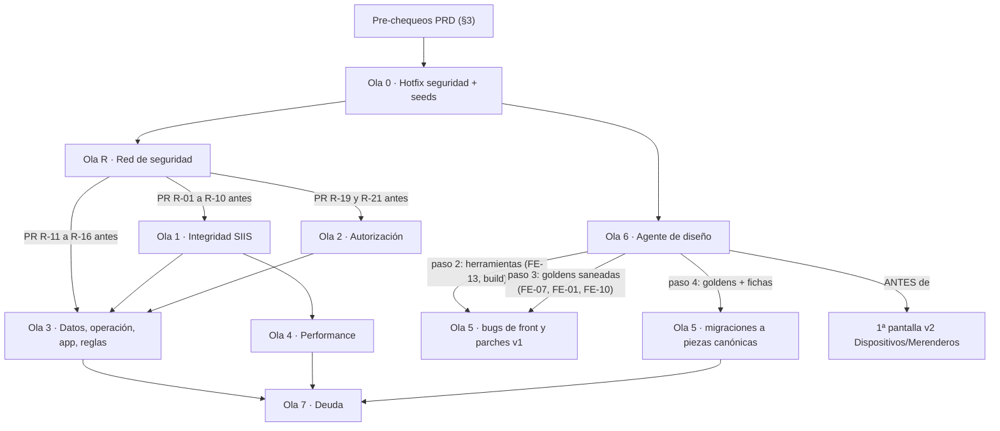

# Auditoría integral de DATAÑACH (Chaco) — octubre 2026

## Estado al 07-oct-2026 (Ola 1, PR 7: herramientas y correcciones manuales — **la Ola 1 cierra**)

**Las tres fichas de herramientas, más la segunda parte de RED-32.** El PR 7 de la Ola 1 (Cambio 162) son
6 + 4 h y **sin migraciones**. Con esto la Ola 1 va por **76 h cerradas de 78**: lo único que queda es el
ítem 0 (V2-NEW-03, correr P-01 en PRD), que es operativo y no tiene código.

| Ficha | Qué quedó |
|---|---|
| **SIIS-19** ✅ | `diagnosticar_siis --alta` escribe un beneficiario inventado en un servicio **sin baja**, y lo hacía con el DNI del ejemplo del manual por defecto y contra cualquier URL. Ahora `--alta-dni` es obligatorio y el alta solo sale contra el SIIS de desarrollo de ECOM —decidido por la **URL** (`es_host_de_desarrollo`), no por `ENVIRONMENT`, que vale `prd` también en QA y en icore—; fuera de ahí pide `--si-entiendo-prd --motivo`, que deja rastro en el log. La guarda vive en `ComandoSiisBase` (RED-53), no en el comando. Los pasos 1 a 5, de solo lectura, no cambian |
| **SIIS-17** ✅ | Una corrección cargada mal en «Completar datos para SIIS» no se podía borrar —lo vacío se descarta, así que solo se podía tapar con otra— y dos guardados simultáneos se pisaban, porque el merge leía la foto del principio del request. Ahora hay un bloque «Quitar corrección» con los campos que de verdad están corregidos, el merge va bajo `select_for_update` adentro de la transacción, y la localidad se cruza contra la provincia **ya guardada** cuando el POST no la trae (que es siempre que se corrige solo la localidad) |
| **G3-06** ✅ | `corregir_datos_siis --aplicar` mandaba el `datos_siis` entero calculado sobre una lectura de hace segundos: lo que el coordinador hubiera guardado en el medio desaparecía sin rastro, y desde #513 esa ventana se abre en **cada** corrida de `correr_alta_siis`. Ahora relee bajo candado, compara campo por campo y respeta la corrección más nueva, no toca un caso con un `EnvioSIIS` vigente (más ancho que el `exclude` de `ENVIADO` del armado de la lista: cubre el `EN_PROCESO` en vuelo y el `INCIERTO`), y deja **una** traza por caso firmada con el `--usuario` nuevo |
| **RED-32** ✅ | Cierra su segunda parte: `test_validar_casos_siis.py`, 11 tests con `--aplicar` sobre lo que la ficha nombra como frágil (el `order_by` del `Subquery`, el `exclude(estado=RECHAZADO)` y el freno por errores seguidos), verificados con tres mutaciones. De yapa, `completar_casos_renaper` deja de morirse entero por un caso ilegible: lo saltea, lo nombra por pk y sigue |

**Dos desvíos de las fichas, a favor del código.** (1) SIIS-17 pedía «un centinela por campo»: seis de los
trece campos son selects que llena el navegador o inputs de texto, donde un centinela no tiene dónde vivir,
así que el «quitar» quedó como un campo aparte que además **solo ofrece lo que está puesto**. (2) RED-32
pedía parchear `programas.services.validacion_siis.validar_formulario_en_siis`: el comando importa ese nombre
en su encabezado, así que con ese target los tests pasarían **saliendo a la red de verdad**; el patch va sobre
el módulo del comando. **Lo que no se cierra:** el «además no deja `EnvioSIIS`» de SIIS-19 no se puede hacer
—esa tabla cuelga de un `Formulario` y el alta de prueba no tiene caso—; la guarda de ambiente lo reemplaza:
en vez de anotar el alta irreversible, la impide.

**Ronda 2 de la revisión (APPROVE @ 19718fb, tres MINOR cerrados).** El importante es una carrera que el
propio arreglo de G3-06 dejaba abierta: `corregir_datos_siis` leía los envíos vigentes **antes** del
`select_for_update`, y `siis_envio._reservar` hace lo inverso —bloquea la fila del `Formulario` y recién
entonces crea el `EnvioSIIS`—, así que una reserva del masivo que entrara en esa ventana no aparecía en
`tomados` y el comando le reescribía el `datos_siis` a un caso cuyo payload ya había salido. Las dos consultas
cambian de orden. Los otros dos: el recorrido de `.errors` del bloque «Quitar corrección» era inalcanzable
—con el form inválido la vista redirige con un solo aviso (ALR-8)— y se reemplaza por la comprobación de que
ese aviso llega; y ningún test afirmaba que el paso 5 de `correr_alta_siis` reenvía `--usuario`.

**La ficha del componente Campo** (`.claude/design/componentes/field.md`) suma el bloque «Quitar corrección»
como consumidor nuevo de `.nodo-checks`: el contrato del agente de diseño obliga a mover la ficha en el mismo
diff que su evidencia. Lo commiteó el juez (19718fb), porque la sesión headless no escribe bajo `.claude/`.

## Estado al 07-oct-2026 (Ola R: R-20, cobertura y regresión)

| PR | Cambio | Fichas | Estado | Qué quedó abierto |
|---|---|---|---|---|
| R-20 | 163 | TST-02 ✅ · TST-03 ✅ · R0-03 ✅ · RED-34 ✅ · RED-74 ✅ · RED-72 ✅ · RED-88 ✅ | ✅ | **Las 7 fichas, 24 h, sin migraciones y sin una línea de código de producción.** El único `.py` no-test que cambia es `core/management/commands/seed_perf.py`, un comando que no se puede correr fuera de la base de test. (1) **TST-02:** los cinco módulos de `programas/tests/` que solo pasaban si otro había corrido antes heredan de `programas/tests/base_becas.BecasPantallaTestCase` —una sola definición del `cache.clear()` + `crear_programas` que el Cambio 130 había dejado copiado—, y la verificación es la que pedía la ficha: **los 77 módulos de `programas/tests/` corridos uno por uno dan 0 en rojo** (antes: 12 + 6 + 4 + 3 + 1 = 26 fallas) y `--shuffle` queda verde con las dos semillas medidas, 1234 y 777, que daban 21 y 26. Además, `generar_alertas` —que corre **cada hora** y estaba al 0 %— estrena 8 tests (idempotencia de dos pasadas, desactivación de lo que ya no aplica sin apagar las ALTA, un ciudadano sin legajo, y el WebSocket una vez por alerta **nueva**), el wizard de Configuración 12 y el ABM de secretarías 6, y los dos `assertTrue(True)` pasan a afirmar algo real. (2) **TST-03:** el `omit` deja afuera lo que no es producto, se activa **`branch = true`** y el `fail_under` pasa de 48 a **79** sobre un medido de 81 % con ramas; más un piso de **90 %** por módulo en los nueve flujos críticos, como paso del job que ya era obligatorio (sin tocar el ruleset). (3) **R0-03** cerrada 56 días antes del plazo, con un test que corre el alta **con el reloj congelado en 2027**. (4) **RED-34:** `core/tests/test_contrato_auditoria.py` parsea las **131** líneas «Test permanente» de los ocho `hallazgos/*.md` y exige que existan, **y** que toda ficha cerrada desde el 04-oct declare la suya —sin esa segunda mitad, cerrar sin dejar test seguía siendo gratis—. (5) **RED-88:** la causa no era la que la ficha anticipaba (ninguna excepción guardada como atributo de clase): `seed_perf` comparaba el nombre de la base contra dos literales y no reconocía el clon que crea `--parallel` (`file:memorydb_default_2?mode=memory&cache=shared`); el `CommandError` en `setUpTestData` arrastra un `traceback` impickleable y mataba el runner entero. **`core users portal --parallel 2` pasa de morir a 1.171 tests OK en 56 s.** (6) **RED-72:** D-RED-06 = No aplicada; en `tests/e2e/` **no quedaba ni un `.py`**, solo bytecode de Python 3.14, así que el PR cierra la puerta (`.gitignore` + 4 tests, incluido «ningún workflow menciona Playwright») y el `rm` queda como paso del PM. (7) **RED-74:** los dos arreglos sin ficha propia. **Tres hallazgos que las fichas no tenían:** un **sexto** módulo con el mismo defecto, y en `legajos` —la ficha midió solo `programas/`—; un **séptimo** que el barrido módulo por módulo no podía encontrar, porque corrido solo pasa y solo falla con otro orden (`RenaperTestModeTests`: la caché de RENAPER es de proceso y el segundo test pegaba en ella, dejando al otro pasando por el motivo equivocado), encontrado por el job nuevo en su **primera** corrida; y un **flake de medianoche** en DIS-01 (`now() - timedelta(minutes=5)` comparado contra la fecha local se pone rojo entre las 00:00 y las 00:05 ART, nunca en el CI, que corre en UTC), arreglado y protegido con un test que congela el reloj a las 00:02; más que la rama «con padrón» que RED-74 pedía probar **ya no existe**. **Abierto:** el `assertNumQueries` de `generar_alertas` es PERF-20 (Ola 4) y RED-86 (suite entera en paralelo) sigue en la suya, ahora desbloqueada. **Para el PM:** borrar a mano `tests/e2e/` del checkout principal (nunca estuvo versionado) y corregir la memoria de trabajo que lo daba por existente «y en verde» |

## Estado al 07-oct-2026 (Ola R: R-18, contratos del backoffice y job `Contratos de API`)

| PR | Cambio | Fichas | Estado | Qué quedó abierto |
|---|---|---|---|---|
| R-18 | 160 | RED-42 ✅(R) · RED-39 ✅(R) · RED-40 ✅(R) · RED-41 ✅ · RED-43 ✅ · RED-44 ✅ | ✅ | **Las 6 fichas, 18 h, sin migraciones y sin tocar una sola vista de producción.** El único código nuevo que se despliega es `core/http.py` (dos helpers que todavía no usa nadie) y un comando de management de **solo lectura**; todo lo demás son tests, fixtures y CI. (1) **RED-42:** `core/tests/test_urls_del_front.py` barre `templates/`, los ocho `*/templates/` y `static/**/*.js`, normaliza los segmentos que son una interpolación entera probándolos con una sonda entera **y** una UUID, y mide **14 literales con 3 rotos** —`/legajos/1/contactos/api/`, `/legajos/contactos/1/detalle/` (LEG-06) y `/set_dark_mode/` (RED-75)—, que son la allowlist inicial con ratchet en **las dos direcciones**; del otro lado, `dashboard/tests/test_api_contrato.py` congela el conjunto **exacto** de `results`/`has_more`, `labels`/`datos` y `count`/`criticas`, que son los kwargs de un `aggregate()` que nadie eligió a propósito. (2) **RED-39:** `core/http.py` con `error_json`/`ok_json`, y las cinco claves de hoy congeladas **donde están** —el constructor en `message`, legajos en `error` y en `mensaje`—, para que la migración de la Ola 7 no se lleve puesto un front. (3) **RED-40:** `verificar_json_guardado [--json]`, la foto que hay que sacar contra un dump restaurado **antes** de cambiar la forma de un `JSONField`: condiciones con operadores que no existen (el ítem no se muestra nunca), `propio` sin `tipo`, fotos sin `items` y correcciones de SIIS que nadie consume. (4) **RED-41:** seis fixtures sintéticos de RENAPER, Personas y SIIS con **D-RED-04 aplicada por default**, consumidos por los parsers reales, de punta a punta y con el domicilio anidado; dos bugs quedan **medidos y no arreglados** (SIIS-10 con `expectedFailure` y su contracara, y el `result` anidado un nivel que marca al caso validado con el nombre en `None`). (5) **RED-43:** job **`Contratos de API`** —`spectacular --validate` + 8 módulos, 62 tests en 8,8 s, sin base real ni red—, **obligatorio desde el primer día**: sumado a `ruleset-development.json` y a `CHECKS_OBLIGATORIOS` en el mismo PR, con el filtro por rutas adentro del job. (6) **RED-44:** cruce AST en las dos direcciones entre los literales de capacidad y el `CATALOGO`. **Tres desvíos, los tres code-first:** la allowlist de RED-42 nace en 3 y no en 4 (el Cambio 150 ya retiró la cuarta); la `definicion` «plana anterior al Cambio 58» que pedía RED-40 **no puede existir** —el campo nació en `programas.0062`, que es de ese mismo cambio—, así que se prueba lo viejo de verdad (`definicion = NULL` + `data` legacy); y RED-44 midió **seis** capacidades sin uso propio y no una. **Abierto:** `config.ver`, `relevamiento.ver`, `institucion.ver` e `institucion.administrar` están en el catálogo, el ABM de Roles las ofrece y **tildarlas no habilita nada** → decisión de la Ola 7 (OPS-14); las partes no-R de RED-39 (Ola 7), RED-40 (Ola 3, los `validators`) y RED-42 (Ola 5, literales → ``); SIIS-10 (Ola 3); y el job no nombra todavía `programas.tests.test_definicion_contrato` ni `scripts/check_condiciones_js.mjs`, que los crea **R-17** y hay que agregar al workflow en ese mismo PR. **Ronda 2 (4 MINOR, todos corregidos):** los dos jobs con `dorny/paths-filter` —el nuevo y `Migrate ida y vuelta`— declaraban solo `contents: read` y podían terminar **en verde sin correr nada** en cuanto D-RED-01 vuelva privado el repo; ahora llevan `pull-requests: read` y un paso que falla si el filtro no resolvió. El test de la subida feliz escribía en el `MEDIA_ROOT` real (siete huérfanos borrados): va a un `TemporaryDirectory`. **La vuelta de RED-44 era ciega a la mitad del catálogo** —contaba `CAPS_GESTION`, que *es* el catálogo de Becas— y al corregirlo apareció `becas.coordinador.ver`. Y el barrido de URLs usaba la misma sonda para todos los segmentos, así que una ruta que mezcle `<uuid:>` con `<int:>` daba falso roto. **Para el PM:** el ruleset de `development` cambió —cuando lo aplique, va con `Contratos de API` adentro— |

## Estado al 07-oct-2026 (Ola 5, PR 7: números que no miden lo que su rótulo dice)

| PR | Cambio | Fichas | Estado | Qué quedó abierto |
|---|---|---|---|---|
| Ola 5 · PR 7 | 161 | G2-04 ✅ · G2-06 ✅ · FE-16 ✅ · V5A-NEW-04 ✅ · FE-22 🟡 · V5A-NEW-07 (b) 🟡 | 🟡 | **4 fichas cerradas, 2 parciales, 20 h, sin migraciones.** Hilo común: la pantalla afirma algo que el código no sostiene. (1) **G2-04:** «↑N nuevos este mes» contaba inscripciones y pasa a decirlo; `actividad_hoy` —el mismo número con otro nombre, impreso dos veces— se **borra** del contexto; «usuarios activos hoy» pasa a `ingresos_24h`, **excluye a los ciudadanos del portal** y se rotula por lo que mide (`last_login` es el último ingreso, no actividad), con clave de caché nueva para que la semántica vieja no sobreviva al deploy; y la serie de `tendencias_datos` arranca en `hoy - (dias - 1)`, así que **el gráfico ya incluye hoy**. (2) **G2-06:** el login se rotula «Tu usuario», igual que lo que el ABM da de alta; el backend no se toca. (3) **FE-16:** salen los tres KPIs que leían anotaciones que `get_queryset` dejó de calcular. **Desvío de D-F16:** no se borra la pantalla —el default dice «borrar **con LEG-06**», Ola 7, y `programa_detalle` sigue siendo destino de redirect de las bajas y derivaciones—. (4) **V5A-NEW-04:** encabezado canónico, bajada funcional (se va la que le nombraba la librería de maquetado al usuario) y DNI/estado/portal como badges **leídos del registro**: «Activo» estaba escrito a mano. (5) **FE-22, con D-F22 en su default:** el hero del inicio sale, `/legajos/reportes/` queda migrada sin los «(Próximamente)» ni las cinco «métricas de calidad» en cero literal, el semáforo de WebSocket vive detrás de `websockets_enabled` y los emojis pasan a Font Awesome con `aria-hidden`. (6) **V5A-NEW-07 (b):** los 6 labels de `convocatoria_list` con `for`, más el `[x-cloak]` local y el backdrop con `style=` que la descartaban como golden (`--arquetipo modal` da OK); en `_dashboard_panel`, los títulos a `text-base` y el modal de respuestas al arquetipo Modal con `x-becas-modal`. **Abierto (los dos 🟡, mismo bloqueo):** las 4 stat cards del inicio y los 6 KPIs de `_dashboard_panel` siguen a mano. `_stat_card.html` acepta `etiqueta`/`valor`/`icono`/`tono` y las tarjetas piden además nota, `data-kpi`, valor compuesto, sufijo, variación, sparkline y barra de progreso: darle esos parámetros al componente canónico es **novedad del agente** y el protocolo manda frenar. La propuesta va en el cuerpo del PR, para OK del PM. Fuera de alcance, code-first: `dashboard/templates/dashboard.html` tiene el mismo defecto que FE-16 pero su vista está tapada por el orden del URLconf (RED-78, Ola 7) |

## Estado al 07-oct-2026 (Ola R: R-21, los ratchets de arquitectura)

| PR | Cambio | Fichas | Estado | Qué quedó abierto |
|---|---|---|---|---|
| R-21 | 159 | RED-46 ✅ · RED-79 ✅(R) · RED-13 ✅(R) · RED-45 ✅(R) · RED-52 ✅(R) · RED-51 ✅(R) · RED-78 ✅(R) · RED-82 ✅ | ✅ | **Las 8 fichas, 18 h, sin migraciones.** Todo lo que las Olas 2, 4 y 7 van a mover queda medido con un techo que falla si sube. (1) **RED-82 (prerrequisito de SEC-20):** `exportacion_reportes.py` tenía 122 CR y **cero** LF —git lo marcaba `i/-text`, así que el diff de un PR sobre él no mostraba el contenido y pylint lo salteaba devolviendo verde—; queda en LF, con el contenido verificado idéntico, más `*.py text eol=lf` y un test que recorre `git ls-files "*.py"`. (2) **RED-46:** contrato de las 3.252 líneas de `programas/models/__init__.py` —65 nombres públicos, 45 `app_label`/`db_table` y las properties de negocio con valores concretos, incluido el borde en que `habilitado_en(date)` cae **antes** de la apertura—; el corte del archivo deja de ser riesgoso. (3) **RED-79:** detector AST propio que distingue import de módulo del **diferido**: 9 aristas vista→vista y **5** ciclos (la ficha decía 3; la medición suma `models ↔ services.inscripciones` y `proceso_masivo ↔ siis_envio`), y los dos ratchets fallan en las dos direcciones, así que la Ola 2 **tiene** que bajar el techo al resolver. (4) **RED-13:** los dos criterios de «hecho» de G1-01 fase 2 escritos y rojos con `expectedFailure`, cada uno con su control de andamio y con la afirmación de **por qué** falla hoy; la tercera pata —las cuatro variables que `conversaciones` le presta al shell— queda en verde, que es el modo de falla silencioso. (5) **RED-45:** el entrypoint aborta ante **las dos** perillas de gevent (la ficha nombraba una) y ante **las cuatro** formas de pedirlo —incluida `-k`, la corta, que la ronda 2 encontró abierta—, pero **solo** ante gevent y eventlet: es el `ENTRYPOINT` único de la imagen y un `sync` explícito no puede dejar un ambiente sin arrancar. Probado ejecutando el script, no leyéndolo. (6) **RED-52:** el *lost update* del Profile tiene **dos** caras, no una: la segunda la dispara **el login mismo** vía `update_last_login`. (7) **RED-51:** los dos contadores de la home que nadie refresca, con la trampa de la deduplicación de OPS-10 vuelta explícita (las dos funciones homónimas no borran las mismas claves). (8) **RED-78:** la raíz es el login solo por el orden del URLconf. **Abierto:** las partes no-R de seis fichas —RED-79 y RED-52 en la **Ola 2**, RED-51 en la **Ola 4**, RED-13, RED-45 y RED-78 en la **Ola 7**—, cada una con su test rojo o su ratchet ya puesto |

## Estado al 07-oct-2026 (Ola 1, PR 6: qué viaja a SIIS)

**Las cuatro fichas de «qué viaja», más los cuatro MINOR que dejó la revisión del PR 5.** El PR 6 de la Ola 1
(Cambio 158) son 20 h y **una migración** (`programas.0077_catalogo_siis_local`, tabla nueva y vacía). Con esto
la Ola 1 va por 66 h cerradas de 78: queda el PR 7 (SIIS-19, SIIS-17, G3-06, y la segunda parte de RED-32).

| Ficha | Qué quedó |
|---|---|
| **SIIS-08** ✅ | Un legajo que ya existía con datos autodeclarados recibía un caso validado por padrón o Base de Personas y se quedaba como estaba: el caso figuraba validado y el alta salía con el nombre que nadie verificó. Ahora la identidad acreditada se compara contra el legajo, queda guardada en `datos_siis` con su traza por campo, y mientras no coincidan el caso es INCOMPLETO y no llega a `cargar_beneficiario`. **Default de D-S08** (opción mínima, sin migración): el legajo **no** se corrige solo —quién manda sobre él es la decisión abierta— |
| **G1-08** ✅ | El mapeo «esta pregunta alimenta este campo de SIIS» salía del catálogo de hoy. Desactivar «Calle y altura» para reemplazarla mandaba de golpe todos los aprobados pendientes como «Planta urbana sin número», altura 1, sin un solo error y sin vuelta atrás. Ahora la **foto del caso** declara sus destinos (`destinos_siis`, solo los campos marcados, para no engordar una foto de 27 KB en una tabla de 283 MB). Los casos anteriores siguen leyendo el catálogo —no hay otra fuente para ellos— y eso quedó caracterizado |
| **G1-09** ✅ | «Una sola pregunta activa por destino SIIS» era una regla del form, y el botón de activar/desactivar no pasa por el form. Ahora el botón la chequea **al activar**; desactivar nunca se bloquea, porque dos activas es un estado que ya puede existir en la base |
| **G1-10** ✅ | Entre dos campos con el mismo destino ganaba el de mayor `orden`, así que un requisito del programa le ganaba al del subsegmento. Ahora gana el **más específico** (subsegmento → segmento → programa → pregunta general) y `orden` desempata dentro del nivel. Vale por los dos caminos, foto y catálogo |
| **MINOR 1** ✅ | «Aprobar» y «promover» no declaraban los **GET de catálogos** que `armar_payload` dispara con la caché fría: tres de 15 s sobre una cadena que ya estaba justo en 55 de 55, o sea 100 s contra los 60 de nginx, invisibles para `core.E003`. No había forma de declararlos y que la cuenta cerrara, así que la llamada salió del request: copia local en la base (`CatalogoSiisLocal`) y `Catalogos.sin_red()` en las dos vistas que dan de alta |
| **MINOR 2** ✅ | Con `--parallel` y *spawn* la guarda sin red no llegaba a los workers: la suite paralela corría con la red abierta |
| **MINOR 3** ✅ | La guarda era cierta solo para `requests`; `urllib.request` y `http.client` salían de verdad. Se corta también `http.client.HTTPConnection.connect` |
| **MINOR 4** ✅ | «Configuración SIIS incompleta» se logueaba igual para una variable vacía que para un token que SIIS devolvió mal, que mandan a mirar lugares opuestos |

**Un desvío de la ficha, a favor (SIIS-08):** se guarda la **identidad acreditada** y no una marca «hay
conflicto». Con la marca, el caso quedaba bloqueado para siempre salvo que alguien se acordara de borrarla
después de corregir el legajo; guardando la identidad, la comparación se rehace contra el legajo de ahora y el
caso se destraba solo. **Lo que no se hizo:** la mitigación «mientras tanto» de G1-08 (confirmación al
desactivar una pregunta con destino) queda sin sentido con la foto, y la opción de fondo de SIIS-08
(`Ciudadano.identidad_origen` con migración) espera a que D-S08 se decida.

**Queda abierto, de la misma familia que el MINOR 1:** la pantalla «Completar datos para SIIS»
(`programas/forms.py:283-308`) pide **cinco** catálogos en un GET y tampoco está declarada en ninguna cadena.
Es el mismo agujero en una pantalla que no hace nada irreversible; se anota como seguimiento.

**Ronda 2 de la revisión (07-oct):** cuatro MINOR. Dos de código — el botón de activar una pregunta daba **500**
con un `destino_siis` fuera del enum (la columna es un `CharField` con `choices`, así que la base acepta cualquier
texto: ahora muestra la etiqueta si existe y el valor crudo si no), y el envío que no sale por falta de copia de
catálogos deja de decir «SIIS no respondió correctamente» —lo contrario de lo que pasó, porque no se consultó a
SIIS—: lleva su propio `codigo_error` (`CATALOGO_SIN_COPIA`) y un mensaje que dice qué hacer. Dos de documentación:
**SIIS-08 es hacia adelante** (la marca solo se escribe cuando el caso resuelve su legajo; los ya resueltos se
siguen informando con el nombre del legajo), con la consulta **`P-18`** de §3 para medir cuántos son sin sacar un
solo nombre; y la **huella de la foto cambia**, así que una inscripción pública con el paso 2 abierto durante el
rolling tiene que reenviarse.

**Pendiente operativo (PM):** después de desplegar, **correr `sincronizar_programas_siis` una vez**. La tabla
`programas_catalogosiislocal` nace vacía y el backoffice ya no va a buscar los catálogos a SIIS dentro del
request: hasta que la copia exista, el alta desde la pantalla del caso queda como ERROR **reintentable** con un
mensaje que lo explica (el masivo y los comandos siguen funcionando, y de paso llenan la copia). **El camino que
falla el día 1 es «Promover» desde Cupo**: aprobar desde el detalle suele encontrar la copia ya llena, porque
«Completar datos para SIIS» sí va a la red. Y conviene **desplegar fuera del horario de una convocatoria con el
link público abierto**, por la huella de la foto.

---

## Estado al 07-oct-2026 (Ola R: R-16, la red de Becas)

| PR | Cambio | Fichas | Estado | Qué quedó abierto |
|---|---|---|---|---|
| R-16 | 156 | RED-05 ✅ · RED-31 ✅ · RED-35 ✅ · RED-77 ✅ · RED-49 ✅ · RED-50 🟡 · RED-81 ✅ · RED-70 ✅ | ✅ | **Las 8 fichas, 22 h, sin migraciones.** Es el último prerrequisito de la **Ola 3**: lo que DAT-01, BEC-\* y SEC-20 van a tocar ahora tiene antes un test que se pone rojo. (1) **RED-05:** el adjunto se sigue por HTTP de punta a punta desde los **dos** canales —paso 1 + paso 2 del link público y el alta + `POST …/adjuntos/` de la app— hasta el bloque que renderiza `formulario_detalle`; cambiar el prefijo `pg-` en `_adjuntos_por_clave` deja los dos tests en rojo (antes, la foto del DNI desaparecía de la pantalla del revisor sin error ni log). (2) **RED-31:** los cuerpos de `requisito_eliminar` y `subsegmento_eliminar`, que no se ejecutaban ni una vez en 3.000 tests, quedan cubiertos con sus bordes de método y capacidad; el daño de **DAT-01** queda *caracterizado* con el mensaje de qué invertir. (3) **RED-35:** prueba **conductual** de la atomicidad (se hace fallar el paso siguiente al alta del legajo y nada queda escrito), con gemelo `@tag("mysql")` en `TransactionTestCase`, donde el rollback es de InnoDB y no un savepoint de SQLite. (4) **RED-77 (código):** `q_con_identidad()` unifica la RN-2 del padrón que estaba escrita **cuatro** veces (no dos) con dos semánticas distintas; se expone como `Q` para que el `Count` del detalle de la convocatoria use la misma regla, y el patrón es la **clase literal** de los 29 caracteres que saca `str.strip()` —ni `Trim`, ni `\s`, ni `[[:space:]]`: Django compila el lookup como `REGEXP BINARY` en MariaDB, donde esas dos clases son ASCII y un nombre de un solo NBSP quedaba dentro del queryset mientras la property decía que no—. (5) **RED-49:** las tres acepciones de `cupo_disponible` quedan fijadas con sus tres números distintos, más la aserción de que **siguen difiriendo** (PERF-02 tiene que renombrar, no unificar). (6) **RED-81 (código):** `procesar_vencimientos` con el registro vacío pasa de salir con éxito a `CommandError`, y lee el registro por el módulo —`registrar()` rebindea la lista global—. (7) **RED-70:** M49 muerta: borrar `ILLEGAL_CHARACTERS_RE.sub` deja los cinco tests nuevos en rojo, tres con el `IllegalCharacterError` que es el 500 de la descarga. **Abierto:** **RED-50 queda 🟡** —el `expectedFailure` describe el bug de la edad en UTC y el arreglo (una sola `edad_en_anios` con `timezone.localdate()` + `DTZ011`) es de la **Ola 3**, con H-13 definiendo su severidad—; DAT-01 y el tercer test de RED-05 también son de la Ola 3; el renombre de RED-49 es de la Ola 4; y `exportacion_reportes.py` sigue con terminadores CR (**RED-82**, PR R-21), que conviene cerrar antes de la revisión de SEC-20 |

## Estado al 06-oct-2026 (Ola R: R-15, operación y deploy)

| PR | Cambio | Fichas | Estado | Qué quedó abierto |
|---|---|---|---|---|
| R-15 | 153 | OPS-03 ✅ · RED-55 ✅ · OPS-04 ✅ · RED-59 ✅ · OPS-01 ✅ · RED-16 🟡 | ✅ | **Las 6 fichas, 18 h, sin migraciones.** Lo que habilita: el próximo deploy en icore deja de ser a ciegas. (1) El traceback de cada 500 llega a **stdout** —`django.request` propaga a la raíz— y los archivos de `logs/` pasan a depender de `LOG_TO_FILES`, con retención de 14 días (OPS-03); los dos context processors que tragaban toda excepción ahora loguean, **sin cambiar lo que ve el usuario** (RED-55). (2) `/health/ready/` toca la base y, en prd, el cache de sesiones, y devuelve 503; `/health/` no cambia, así que ninguna sonda de ECOM se toca (OPS-04) — se retiró el include de `health_check.urls`, que estaba montado en la misma ruta y era inalcanzable; el paquete **sigue instalado**, porque sacarlo deja dos filas de `django_migrations` sin archivo y una tabla sin modelo, y eso frena el arranque (lo midió la guarda de OPS-01 en el CI de este mismo PR: queda anotado en OPS-13). (3) `deploy_prod.sh` verifica con `/health/ready/` + `migrate --check` + manifest + `GET /login/`, crea `rollback/<ts>` en vez de quedar en detached HEAD y **aborta el rollback automático si el deploy aplicó migraciones** (RED-59). (4) `verificar_esquema_migraciones` corre en el entrypoint y en el paso 8/8 del roundtrip, con el chequeo inverso de RED-15, y el renombre de icore quedó versionado en `core/sql/2026-10-06_renombrar_migraciones_icore.sql` (OPS-01). (5) Cada release deja un tag `release-AAAA.MM.DD-<short>` (RED-16). **Abierto:** la otra mitad de RED-16 —el tag de **imagen** por commit— es D-RED-02 y la aplica ECOM; está en `propuesta-ecom-verify.md` §2, junto con los avisos nuevos §4 (volumen en stdout) y §5 (`/health/ready/`), todo pendiente de que lo mande el PM. El renombre de `django_migrations` en icore lo corre una persona antes del próximo deploy |

## Estado al 07-oct-2026 (Ola 5, PR 5: bugs de front y parches v1)

| PR | Cambio | Fichas | Estado | Qué quedó abierto |
|---|---|---|---|---|
| Ola 5 PR 5 (#605) | 157 | FE-18 ✅ · FE-19 ✅ · FE-25 ✅ · FE-26 ✅ | ✅ | **Las 4 fichas cerradas, sin migración: 8 h.** El rojo del sistema deja de significar dos cosas. Merenderos estrena sus dos parciales de badges —legajo y solicitud, con el contrato del de Dispositivos— y sus tres pantallas dejan de volcar `get_estado_display` como texto suelto; «Inactivo» pasa a `badge-gray` en usuarios y roles, y «Sin datos» a `text-body-subtle` en los indicadores del dispositivo. Los **tres** handlers de confirmación copiados (y distintos entre sí) se reemplazan por `programas/_swal_confirm_js.html`, donde el tono lo declara la pantalla con `data-confirm-danger`: «Rechazar» y «Cerrar» confirman en rojo, «Validar», «Aprobar», «Suspender» e «Inactivar» no, y «Activar usuario/rol» deja de salir con el botón de borrado. `alertas_websocket.js` deja de tener sistema de avisos propio: toast por `window.toast` y alerta crítica por `ModernModal`, con foco atrapado y Escape. Y una guardia global (`static/custom/js/nodo-submit-guard.js`, una sola carga en el shell) cancela el segundo `submit` de cualquier formulario POST que no sea `data-ajax`. **Playwright a 1440 y 390 px, 0 errores de consola:** los badges con su tono, el Swal de «Cerrar» en `btn-danger` con fondo `rgb(199,0,54)` y `padding-left: 16px`, el de «Suspender» en `btn-brand`, y el doble envío bloqueado con `aria-busy="true"`. **Cinco desvíos, los cinco code-first:** (a) la rama `SIN_DATOS` va en **dos** de los cuatro indicadores, no en los cuatro: ocupación y disponibilidad nunca devuelven ese semáforo y la rama sería código muerto; (b) los botones del diálogo llevan `btn-base`, que la ficha no nombraba —`customClass` reemplaza entero el del mixin y sin tamaño el botón queda en `padding-left: 0`, el mismo defecto de FE-06/FE-07—; (c) el envío confirmado va por `requestSubmit()`, porque `submit()` no dispara el evento y se saltearía la guardia de FE-26; (d) el `disabled` de la guardia se aplica en el turno siguiente, o el navegador deja el `name`/`value` del botón fuera del POST; (e) el «Ver» de la alerta crítica apunta al detalle del **ciudadano** y la URL la arma el shell con ``: el destino que proponía el modal viejo (`/legajos/<id>/`) no existe (FE-09). **Lo que no se hizo:** las tres acciones del listado de solicitudes siguen siendo texto subrayado, no `btn-nodo` (eso es FE-12), y estas pantallas siguen sin arquetipo: su encabezado, tabla y paginación son de FE-11/FE-12/FE-17, PRs 6 y 7. Los dos parches de `.claude/` (tres filas del núcleo y un bloque de `design/shells.md`) los **aplicó el juez** en `b355eb9c`, porque la sesión implementadora no tiene permiso de escritura ahí: «Design Agent Contract» quedó en verde. La **ronda 2** cerró dos MINOR del revisor: (1) la guardia de doble envío leía `event.defaultPrevented` **una sola vez, al entrar**, y un listener delegado en `document` registrado después —los de ``, que corren dentro de `DOMContentLoaded`— se ejecuta detrás de ella: si ese cancelaba el envío, el formulario quedaba `aria-busy` con los botones `disabled` para siempre (reproducido en Chromium; ninguna pantalla lo pisa hoy, pero el script es global). Ahora se reevalúa en el mismo turno diferido del `disabled` y, si quedó cancelado, se suelta la marca; (2) esta misma fila decía que los parches de `.claude/` seguían pendientes |

## Estado al 06-oct-2026 (Ola 5, PR 4: bugs de front)

| PR | Cambio | Fichas | Estado | Qué quedó abierto |
|---|---|---|---|---|
| Ola 5 PR 4 (#603) | 155 | FE-06 ✅ · FE-07 ✅ · FE-01 ✅ · FE-10 ✅ | ✅ | **Las 4 fichas cerradas, sin migración: 14 h.** Los controles que el navegador no dibujaba vuelven a verse: ninguna pantalla en alcance nombra una clase que el build no genera (CLASSDEF P1 en 0 para las 31 de la ficha), el backdrop del sidebar oscurece de verdad (`bg-black/50`) y los «Cancelar» y «Volver» son botones del sistema con su tamaño. Los **diez** modales de Configuración clonan la golden del arquetipo Modal —overlay por clase, `x-becas-modal`, `_modal_header`/`_modal_footer`— y se abren centrados con **0,00 px** de desvío medido. `static/custom/js/mobile-enhancements.js` **se borró**: reescribía estilos en línea sobre cada control de cada página, también en escritorio, y abría el sidebar con cualquier swipe horizontal; el área táctil de 44 px pasó a `nodo-buttons.css` y al `<style>` del sidebar, detrás de `@media (pointer: coarse)` (D-F01 = No: sin swipe). La grilla de la prestación mensual scrollea (`overflow-auto` + `min-w-[720px]`) y a 390 px sus `<th>` pasan de 50 a 101 px. **Playwright a 1440 y 390 px: 11 de 11 mediciones OK.** **Cuatro desvíos, los cuatro code-first:** (a) **un bug que ninguna ficha vio** —el criterio de FE-01 seguía fallando con el script ya borrado porque `nodo-buttons.css` se carga después de Tailwind y `.btn-nodo` le ganaba a `.hidden` por orden: el «Cancelar» de un `ModernModal` de aviso se veía igual—; (b) la confirmación de borrado de Configuración deja SweetAlert2 y pasa a `data-confirm-url` → `ModernModal`, porque el arquetipo Modal prohíbe un `Swal.fire` nuevo y el inventario no habilita SweetAlert2 en ese módulo; (c) el indicador de WebSocket quedó en `bg-disabled` y no en `badge badge-gray` (es un punto de 12 px, no una píldora); (d) `divide-y divide-light` en vez de `divide-y [&>*]:border-light`, que evita un arbitrario nuevo. **Pendiente del juez:** los tres parches de `.claude/` (fila «CSS responsive/mobile global» del núcleo, bloque nuevo de `design/shells.md` y retoque de `design/componentes/botones_badges.md`) van en el cuerpo del PR porque la sesión no tiene permiso de escritura ahí; hasta aplicarlos, «Design Agent Contract» queda rojo —la fila cita el script que este PR borra— |

## Estado al 06-oct-2026 (Ola 1, PR 5: la cadena de llamadas externas entra en los 60 s)

**SIIS-09 (= PERF-09) cerrada, más los tres MINOR que dejó la revisión del PR 4.** El PR 5 de la Ola 1
(Cambio 154) son 4 h, **sin migraciones**. Con esto la Ola 1 va por 46 h cerradas de 78.

| Ficha | Qué quedó |
|---|---|
| **SIIS-09 / PERF-09** ✅ | «Aprobar» encadena token → compatibilidad → alta → correo, y las tres llamadas a SIIS compartían `(10, 30)`: la cadena podía pasar los 120 s contra los 60 de nginx, y el 504 llega con el alta posiblemente hecha del otro lado. Ahora hay **un timeout por tipo de llamada** (D-S09: conexión 5 s, consultas 10 s, alta 20 s, `EMAIL_TIMEOUT` 5) y, sobre todo, un **presupuesto declarado y verificado**: `core/integraciones.py::CADENAS` dice qué encadena cada request y `check --deploy` falla con `core.E003` si alguna pasa los 55 s. «Aprobar un caso» queda **justo en 55**: la próxima llamada que alguien encadene ahí deja el check en rojo. Cortacircuito de 3 fallas de red / 60 s sobre Base de Personas (el tope de `identificar` del punto 4) y sobre la compatibilidad de SIIS; **no** sobre el alta. `requests.Session` por módulo con `pool_maxsize=10` |
| **MINOR 1** ✅ | La guarda de SIIS-06 contaba los `DESCONOCIDO` **nuevos**: diez programas vinculados y tres catálogos parciales seguidos (4 → 5 → 1) los dejaban **a los diez bloqueados** sin que saltara nunca. Pasa a contar el estado **resultante**, que es lo que la ficha pide confirmar. Contradice una línea escrita en el Cambio 151 y está dicho en los dos lados |
| **MINOR 2** ✅ | `--forzar` exige `--motivo` y acepta `--usuario`, como `--ignorar-corrida` desde el PR 3, y deja rastro en el log —solo cuando el forzado hizo falta de verdad—. El CronJob de `cronjobs.yaml` corre sin el flag y **no cambia**: hay un test que lo fija |
| **MINOR 3** ✅ | Lo que SIIS contesta fuera de contrato deja de perderse: va a `respuesta["_crudo"]`, recortado a 500 caracteres. El único lector estructurado (`_detalle_validacion_siis`) sigue mostrando lo mismo, con test. No se loguea |

**Un desvío de la ficha:** el token de SIIS lleva su propio `SIIS_API_TIMEOUT_TOKEN` de 5 s, que D-S09 no
nombra. Con los `(5, 10)` de «consulta» la cadena de «Aprobar» daba 60 s y no entraba en el presupuesto.

**Ronda 2 de la revisión (07-oct):** el cambio a `requests.Session` había movido el punto de parcheo de los
tests y uno de seguridad del portal se quedó parcheando `requests.get`: mock en **cero llamadas** y salida a la
red real, con la regresión del DNI en el log pasando por accidente. Se arregló el parche y la PoC, y la suite
entera pasa a correr **con la red cortada** (`core/tests/runner.py` por `TEST_RUNNER`, sustituyendo
`HTTPAdapter.send` por asignación y no con `patch().start()`, que trece tests apagaban con `patch.stopall`).
Además: el **reCAPTCHA** entra en la cadena del paso 1 del link —era su llamada más lenta y no estaba
declarada; su timeout pasa de escalar congelado a par `(5, 10)` leído en cada llamada—, se declaran tres
cadenas que faltaban, la `Session` de módulo deja de guardar cookies (las habría reenviado entre personas
distintas del mismo proceso) y una configuración incompleta de SIIS deja de contar como falla del
cortacircuito.

**Pendiente operativo (PM):** **las variables del entorno de ECOM mandan sobre los defaults.** Si en testing o
PRD siguen `SIIS_API_TIMEOUT=30`, `PERSONAS_API_TIMEOUT=20`, `RENAPER_TIMEOUT=20` o `EMAIL_TIMEOUT=10`, el
presupuesto no se cumple: hay que bajarlas o sacarlas del entorno. `SIIS_API_TIMEOUT_TOKEN`,
`SIIS_API_TIMEOUT_CONSULTA` y `RECAPTCHA_CONNECT_TIMEOUT` son nuevas y no hace falta agregarlas (sin setear
valen 5, 10 y 5).

---

## Estado al 06-oct-2026 (Ola 5, PR 3: parches v1 de Configuración)

| PR | Cambio | Fichas | Estado | Qué quedó abierto |
|---|---|---|---|---|
| Ola 5 PR 3 | 152 | FE-04 ✅ · FE-05 ✅ · FE-08 ✅ | ✅ | **Las 3 fichas cerradas, sin migración: 6 h.** Las tres pantallas de Geografía dibujan su pie de paginación —la fila 21 dejó de ser inalcanzable— y los seis `form_invalid` devuelven la lista paginada con el **mismo** queryset del listado (el de provincias salía por `id` y el reintento por `nombre`). El `<script>` del paso 1 del wizard vuelve a llegar al navegador (`extra_js` → `customJS`) y la cascada Secretaría → Subsecretaría funciona, con aviso por `window.toast` si la API falla. Los errores no de campo salen de una **pieza canónica nueva** (`templates/components/_form_errores.html`, con contrato, test, ficha y fila de inventario) que usan los diez modales de Geografía y Secretarías, los cuatro pasos del wizard, dos formularios de Legajos y Dispositivos y la **golden del arquetipo Formulario**. FE-05 además queda convertida en gate: `compile_templates.py --bloques`, en «Contratos del repo», falla con cualquier bloque que ningún ancestro declare (allowlist de 6, cada una con su ficha dueña). **Tres desvíos, los tres code-first:** (a) el `form_invalid` de edición devuelve la **página que contiene la fila**, no la 1 —paginarlo a secas, como salía de la ficha, escondía el error de la fila 21—; (b) `legajos/ciudadano_{edit,manual,confirmar}_form.html` **no** se tocaron: vuelcan `form.errors.items`, que incluye `__all__`, así que el error ya se ve y la pieza lo duplicaría (su migración es FE-11/FE-12); (c) se arregló de paso un bug del propio `design_audit --ratchet`, que leía la base en cp1252 y daba por nueva toda la deuda vieja de cualquier template con tildes (34 hallazgos falsos; en el CI, UTF-8, no se veía). **Pendiente del juez:** las tres fichas de `.claude/` (la nueva `componentes/form_errores.md`, los retoques de `arquetipos/formulario.md` y la fila de inventario) van en el cuerpo del PR porque la sesión no tiene permiso de escritura ahí; hasta aplicarlas, «Design Agent Contract» queda rojo |


## Estado al 06-oct-2026 (Ola 5, PR 2: parches v1 de Legajos)

| PR | Cambio | Fichas | Estado | Qué quedó abierto |
|---|---|---|---|---|
| Ola 5 PR 2 | 150 | FE-02 ✅ · LEG-02 ✅ · LEG-03 ✅ · LEG-04 ✅ · LEG-05 ✅ · FE-09 ✅ · FE-21 ✅ | ✅ | **Las 7 fichas cerradas, sin migración: 14 h.** «Subir archivos» vuelve a funcionar (`toastr` nunca se cargó y cortaba el handler en su primera línea); reinscribir a alguien con una inscripción CERRADA/DADA DE BAJA/SUSPENDIDA deja de dar 500, con **una sola puerta** (`programas/services/inscripciones.py::activar_inscripcion`) que usan las tres vías de alta y `_membresia_activa` de Dispositivos; la solapa «Red Familiar» se retira con el **default D-L03 = B** —se van el 404 por carga del legajo, el ViewSet que listaba los vínculos de todos y 673 KB de `vis-network`—; un adjunto con el blob perdido ya no vacía la lista (se lista marcado `faltante`) y la consulta deja de ser N+1; la subida múltiple es atómica y limpia los blobs si falla; los links a `/legajos/<id>/` —ruta que no existe— pasan a texto, salvo el del dashboard de alertas, que apunta al ciudadano; y el modal de archivos se ata a `becas-modal.js` (Escape, foco atrapado, foco devuelto). **Tres desvíos, los tres code-first:** (a) la mitad de LEG-04 del «except que traga» **ya la había cerrado R-19** (#556, Cambio 126) —acá queda su test permanente—; (b) la allowlist de RED-42 que LEG-03 manda limpiar **no existe todavía** (`core/tests/test_urls_del_front.py` es del PR R-18, abierto); (c) `VinculoFamiliarViewSet` se borró además del router, porque dejarlo escrito es dejar la trampa armada. **Abierto, de otra ficha:** los tres JS huérfanos que todavía usan `toastr` (`static/custom/js/ciudadanos*.js`, ningún template los carga) los borra FE-14 en la Ola 7; `ciudadano_detail.html` sigue con 8 desvíos de arquetipo (eran 9), que son del PR 6 |

## Estado al 06-oct-2026 (Ola 1, PR 4: catálogo y reglas independientes)

**Cinco fichas que no dependían de ninguna otra, y la línea que BEC-21 estaba esperando.** El PR 4 de
la Ola 1 (Cambio 151) cierra **SIIS-06**, **SIIS-11**, **SIIS-12**, **BEC-01**, **BEC-02** y completa
**BEC-21**: 10 h de las 46 que le quedaban a la ola. **Sin migraciones.**

| Ficha | Qué quedó |
|---|---|
| **SIIS-06** ✅ | El cron de las 04:00 deja de poder bloquear Becas entera por un error de SIIS. Catálogo vacío → no escribe nada; ausencia que alcanza a **todos** los vinculados o a **más del 50 %** → tampoco, sin `--forzar` (default de **D-S06**). La guarda no se aplica con un solo programa vinculado, donde «todos» es siempre cierto y una baja real no se podría detectar nunca. La ausencia parcial —lo normal— se sigue escribiendo sola. `listar_programas` y `listar_programas_todos` dejan de cachear la lista vacía. El `CommandError` deja el CronJob en rojo: es la forma de que alguien se entere |
| **SIIS-11** ✅ | El cuerpo se normaliza antes del primer `.get` en los tres caminos que faltaban (compatibilidad, token, registro de la validación; el alta ya estaba, Cambio 127). Y los dos campos estructurados que se guardan de esa respuesta dejan de reventar al escribirse: `id_consulta` por `uuid.UUID`, `fecha_hora` por un `parse_datetime` envuelto. El intento igual se registra: es la constancia de que SIIS contestó cualquier cosa |
| **SIIS-12** ✅ | El payload prevalida al apoderado —fecha futura, menor de 18, el propio titular—, que son los tres rechazos que el Cambio 98 midió en PRD (265 + 448 casos) y corrigió **en los datos, no en el payload**. Se valida después de aplicar las correcciones de `datos_siis`: el coordinador tiene salida sin tocar el legajo |
| **BEC-01** ✅ | Las cuatro operaciones de `cupo.py` releen el estado con el candado de la fila del caso (orden segmento → caso, sin ciclo con rechazar) **y escriben condicionadas**: `UPDATE … WHERE estado = <el que leímos>`. El candado serializa en MariaDB; el compare-and-set es lo que hace que la decisión se pueda afirmar también en SQLite, donde `select_for_update()` es un no-op |
| **BEC-02** ✅ | En `agregar_a_lista_espera` el candado del segmento pasa al principio y los dos chequeos se hacen adentro. Contra **MariaDB 10.11 real sin tzinfo**: con el código de `development` los dos hilos dejan **2 filas activas** y las **2 bajas pasan**; con el arreglo, una y un `ValidationError` |
| **BEC-21** ✅ | La línea que esperaba a SIIS-06: `_sin_pausa_vigente` excluye los casos cuyo programa está `INACTIVO` o `DESCONOCIDO` en SIIS. Ya no hay riesgo de frenar el masivo entero, porque un catálogo vacío no escribe. Un programa recién vinculado (`""`) sigue siendo candidato |

**Dos tests cambian a propósito**, los dos marcados en su docstring: `test_catalogo_vacio_marca_todo_desconocido`
(R-06 lo dejó caracterizando lo de hoy «para que la Ola 1 lo decida a la vista»: hoy es
`test_catalogo_vacio_no_escribe_nada`) y la primera mitad de
`test_la_correccion_del_caso_pisa_la_fecha_del_apoderado` (Cambio 98), que afirmaba `faltantes == {}`
para un apoderado de 17 años que era además el titular.

**Pendiente operativo (PM):** avisar a quien mira el CronJob de las 04:00 que ahora puede terminar en
rojo con «SIIS devolvió un catálogo vacío» o «no informó N de M programas vinculados». **Eso es la
señal, no la falla**: antes de usar `--forzar` hay que confirmar la baja con ECOM, porque forzar marca
los programas `DESCONOCIDO` y eso bloquea sus segmentos.

---

## Estado al 06-oct-2026 (Ola 5, PR 1: fechas locales de Dispositivos)

| PR | Cambio | Fichas | Estado | Qué quedó abierto |
|---|---|---|---|---|
| Ola 5 PR 1 | 140 | DIS-01 ✅ · DIS-08 ✅ | ✅ | **El bug que estaba vivo en PRD queda cerrado y con guardia.** Helper único `core/utils_fechas.py` (rango `[inicio, fin)` en hora local) en los dos usos de la ficha más los tres «latentes» y **cuatro de Conversaciones** que la ficha no listaba: el barrido los encontró y arreglarlos deja la guardia **sin allowlist**. La guardia (`core/tests/test_sql_portable.py`) recorre con `ast` todo el código productivo y resuelve el tipo del campo contra los modelos, así que también cubre la consulta que se escriba mañana; antes del fix encontraba **16** lookups vivos. Se sacaron los dos `expectedFailure` de DIS-01 (Cambios 125 y 130), que ahora pasan de verdad —el segundo, contra `mariadb:10.11` sin tablas de zona horaria—. **Abierto, de otra ficha:** los `timezone.now().date()` de Becas y de las alertas de Legajos (BEC-18), que calculan la fecha en UTC sin pasar por el motor. **Abierto, del plan:** RED-33 (tests HTTP de las vistas de Dispositivos y Merenderos, 8 h) figura «con el PR 1» en el ítem (8) de la ola; no entró acá, que son las 4 h de DIS-01 + DIS-08 |

## Estado al 06-oct-2026 (Ola 6 CERRADA: ejercicio de control «después» y registro)

| PR | Cambio | Fichas | Estado | Qué quedó abierto |
|---|---|---|---|---|
| Ola 6 pasos 6 y 7 | 137 | — (ninguna nueva: las de la ola se cerraron en #574 y #577) | ✅ | **Las 3 pantallas del ejercicio cumplen al primer intento**: Plan de pantalla como artefacto antes del primer `Write`, la golden correcta en las tres, **0 P1**, `--arquetipo` OK, `--ratchet` 0 nuevos y `chaco-design-reviewer` —en tres sesiones independientes— aprobando las tres. Antes fallaban las tres. Evidencia y comparación en [`linea-base-agente-diseno/`](linea-base-agente-diseno/README.md), que ahora guarda las dos mitades (`antes/` y `despues/`). **No se activó ninguna regla de fase 2** y no hubo que corregir ninguna ficha. **Pendiente del PM, no del desarrollo:** el criterio (e) del paso 6 —captura lado a lado con la golden a 1440 y 390 px que el PM acepte como «mismo sistema»— no se tomó, porque necesita el harness Playwright (local, no commiteado) y al PM |

**Las pantallas del ejercicio no son producto.** Viven en `linea-base-agente-diseno/despues/`, fuera de todo árbol de
templates, sin vista, URL ni modelo escritos. `design_audit.py` excluye `docs/` entero, así que no suman deuda.

## Estado al 06-oct-2026 (Ola 1, PR 3: el masivo robusto)

**Una corrida que trabaja ya no aparece muerta, y nadie se mete en el medio.** El PR 3 de la Ola 1
(Cambio 136) cierra **SIIS-03** (con **A5-33**) y **BEC-11**, y deja **BEC-21** en parcial: 6 h de
las 52 que le quedaban a la ola.

| Ficha | Qué quedó |
|---|---|
| **SIIS-03 + A5-33** ✅ | Latido antes de la selección, cada 100 candidatos mirados y **por caso**; `LATIDO_VENCIDO` de 2 a **5 min** (un caso son hasta tres llamadas de 40 s: dos minutos justos). El freno de la persona y el de errores se miran **por caso**, no al cerrar el lote de 40. `crear_corrida` cierra como `DETENIDA` la corrida sin señal en vez de dejar dos «en curso», y el hilo reemplazado se retira **sin pisar el estado**. Frenar marca **por programa** (A5-33) y **sin** filtrar por latido (V2-NEW-01): la que parece interrumpida es justo la que hay que poder frenar. Los cinco comandos abortan con una corrida viva —la guarda vive en `ComandoSiisBase`, se pregunta **con el candado tomado** y tiene `--ignorar-corrida`—. **El punto 7 (CronJob) no se hace:** default de D-S03 |
| **BEC-11** ✅ | Default de **D-B11**: un caso que SIIS declaró incompatible no se aprueba en lote; queda contado en `CorridaSiis.incompatibles` (pantalla y resumen del comando) y lo resuelve una persona. No cuenta para el freno: SIIS contestó, y bien. **Y sale de los candidatos**: si siguiera, la corrida lo volvería a consultar en cada vuelta y con 200 adelante por pk una corrida de 100 daba cero altas (ronda 2 de la revisión). Vuelve solo si lo revalidan con OK o si cambia el DNI o el plan |
| **BEC-21** 🟡 → ✅ | Fuera de los candidatos los `ENVIADO` que la aprobación iba a rechazar igual (sin identidad validada o sin ciudadano con DNI) y los pausados en los cinco niveles. Faltaba el bloqueo por estado del programa en SIIS, atado a SIIS-06; **lo cerró el PR 4 (Cambio 151)** |

**Migración `programas.0076_corridasiis_incompatibles`**: una columna con default en una tabla de una
fila por corrida. Expand-only, instantánea, reversa de Django.

**Pendientes operativos que deja (PM):**
1. **No desplegar con una corrida masiva en curso** (sigue del PR 2; ahora, si queda interrumpida, se
   ve y la relanza la pantalla, que la retira sola).
2. **Avisar a quien opera los comandos** que cortan si la pantalla tiene una corrida en curso, y que
   la salida de emergencia es `--ignorar-corrida --motivo "..."`, que deja rastro (los dos caminos
   toman los mismos casos). La exclusión cubre una sola dirección y está documentada.
3. **Mirar el contador de incompatibles** de la primera corrida: son casos que antes se aprobaban
   solos y ahora esperan a una persona.

---

## Estado al 05-oct-2026 (Ola 6, pasos 4 y 5: agente reescrito y consumidores)

| PR | Cambio | Fichas | Estado | Qué quedó abierto |
|---|---|---|---|---|
| #579 Ola 6 pasos 4 y 5 | 132 | — (ninguna nueva: las de la ola se cerraron en #574 y #577) | 🟡 | Núcleo reescrito (**25.548 bytes**, de 67.681; sin una sola referencia de historia; celdas ≤ 450 caracteres) con la tabla `## Arquetipos` que `--goldens` lee como fuente, + **21 fichas** en `.claude/design/` con los contratos largos movidos literales. Consumidores al día: `CLAUDE.md` («0 errores» → ratchet + goldens), `AGENTS.md`, `chaco-frontend`, `chaco-design-reviewer` (sin `Edit`) y `chaco-dev-reviewer`. Los dos interruptores del PR #574 encendidos: `--limites` en el CI y `--goldens` sin tolerancia. **Faltan los pasos 6 y 7** (ejercicio de control «después» y registro final) |

**El contenido de `.claude/` entró en un commit aparte.** La sesión que escribió el paso 4 no tenía
permiso de escritura sobre `.claude/`, así que el núcleo, las fichas y los agentes consumidores
viajaron en una carpeta de tránsito y el juez aplicó el movimiento dentro del mismo PR. El resultado
está en su lugar: `check_design_agent.py --limites` OK y `design_audit.py --goldens` en 0 sobre las
5 goldens que declara la tabla `## Arquetipos` del núcleo.

## Estado al 05-oct-2026 (Ola 6, paso 3: goldens saneadas)

| PR | Cambio | Fichas | Estado | Qué quedó abierto |
|---|---|---|---|---|
| #577 Ola 6 paso 3 | 131 | V5A-NEW-07 (a) | 🟡 | Las 4 goldens en **0 hallazgos P1 y marcadores de arquetipo completos**: `personas_list` (filtros con `aria-label`, `<th>` de acciones nombrado), `cupo/segmento_detail` (sin `<style>` local, avatares según D5), el modal de `config/programa_list` (labels canónicos, ayuda que no parece error, `data-error="__all__"`, nota con `_alerta`, backdrop por clase) y `config/segmento_form` (ya estaba limpia). El step `Design audit goldens` deja de ser `continue-on-error`. **La parte (b) de V5A-NEW-07 sigue abierta** (Ola 5, PR 7: labels de `convocatoria_list` y deuda de `_dashboard_panel`). Pendientes del paso 4 en adelante: reescribir el núcleo y sus fichas, consumidores, ejercicio de control y registro |

**Las goldens se defienden desde este PR, no desde el paso 4.** `--goldens` leía la tabla `## Arquetipos` del núcleo, que
escribe el paso 4: sin esa tabla el step salía verde sin verificar nada, así que sacarle el `continue-on-error` no habría
agregado un gate. `design_audit.GOLDENS` declara las cuatro mientras tanto y el núcleo pasa a mandar en cuanto exista la
tabla (si las dos fuentes se contradicen, el script lo reporta).

**Cambios a la vista, medidos con un diff de píxeles a 1440 y 390 px:** `personas_list` **0 px** (el form de filtros lo
reconstruye `dynamic_list_filters.js`); `segmento_detail` 0,08 % / 0,47 %, acotado a la columna de 32 px de los avatares
(**D5**, el único cambio visible previsto); el modal de `programa_list`, el cuerpo del diálogo (ayuda en gris, labels
canónicos, ícono de la nota en Font Awesome).

## Estado al 05-oct-2026 (Ola 1, PR 2: integridad del alta en SIIS)

**El alta en SIIS ya no se puede duplicar.** El PR 2 de la Ola 1 (Cambio 127) cierra **SIIS-01**
(CRÍTICA), **SIIS-02**, **SIIS-04**, **SIIS-05**, **BEC-14** y la parte de la Ola 1 de **RED-53**:
26 h de las 78 de la ola.

| Ficha | Qué quedó |
|---|---|
| **SIIS-01** ✅ | `EnvioSIIS.vigente` nullable dentro del índice único `(formulario, vigente)` —la unicidad condicional que MariaDB no da con `condition=`— más una reserva de milisegundos: lock de la fila del `Formulario`, relectura, `EN_PROCESO` commiteado y recién después el POST, **fuera de toda transacción**. Las siete vías pasan por ahí, incluida `sincronizar_tabla_intermedia` |
| **SIIS-02** ✅ | Estado `INCIERTO`, **no reintentable** (D-S02 aplicado: 503 `ERROR_BD_LEGACY` se reintenta, 500/502/504/`ReadTimeout`/conexión cortada no). `EN_PROCESO` vencido a los 5 min se ve incierto. Comando `conciliar_envios_siis` (`--listar`/`--confirmar`/`--liberar`, en lote y desde el CSV que vuelve de ECOM) con traza. El freno de las corridas cuenta los inciertos aparte (`--max-inciertos`, default 3): si no, con SIIS caído la corrida no cortaba nunca |
| **SIIS-04** ✅ | El estado se relee bajo lock en las tres puertas (masivo, `enviar_casos_siis` con `estados_permitidos`, tabla intermedia) |
| **SIIS-05** ✅ | Columna derivada `clave_persona_plan` dentro de un índice único: la regla la decide el motor, no un check-then-act (con dos procesos a la vez pasaban los dos). El `IntegrityError` se traduce a `DUPLICADO_LOCAL` |
| **BEC-14** ✅ | Guard `data-un-solo-envio`, botón deshabilitado en el `onConfirm` y relectura del estado antes de consultar SIIS |
| **RED-53** ✅ (1; falta Ola 5) | `ComandoSiisBase`: los cuatro comandos que hablan con SIIS comparten flags, lotes, resumen y freno. El test los corre **con SIIS caído** y exige que corten: mirar solo que acepten el flag dejó pasar un comando que lo ignoraba |

**Migración `programas.0075_enviosiis_vigente`** (`programas_enviosiis`): expand-only, se puede
desplegar antes que el código. **Medida ida y vuelta contra MariaDB 10.11 real con 40.100 envíos:
6,9 s y 4,0 s.** Resuelve los duplicados que ya existen sin fallar ni borrar: dentro del mismo caso
queda vigente el más viejo; **entre casos distintos** —la misma persona con dos altas reales en el
mismo plan— el más viejo se queda con la clave y **los demás siguen vigentes sin clave**, porque
liberarlos mandaría una tercera alta. Todos quedan listados y con una traza en su caso
(`TracaFormulario.campo = "envio_siis"`), que es lo que va a ECOM.

**Pendientes operativos que deja (PM / ECOM):**
1. **Correr P-01 en PRD antes del deploy** (V2-NEW-03): cuántos casos ya tienen dos altas.
2. **No desplegar con una corrida masiva en curso.**
3. **Acordar con ECOM el procedimiento de conciliación de INCIERTOS** (D-S02) y **pedirle la clave
   de idempotencia `id_externo`**, que es la solución de fondo.
4. Avisar que `reenviar_siis_pendientes` y `conciliar_envios_siis` corren en seco por defecto:
   necesitan `--aplicar`.
5. **Lo que deja la migración:** si P-01 encuentra personas con dos altas, después del deploy quedan
   en `TracaFormulario` (`campo = 'envio_siis'`). Esa lista va a ECOM para que las saque de SIIS; de
   este lado no hay que tocar nada —los dos casos quedan tomados a propósito—.

---

## Estado al 06-oct-2026 (Ola R: R-13, migraciones ida y vuelta contra el motor real)

| PR | Cambio | Fichas | Estado | Qué quedó abierto |
|---|---|---|---|---|
| R-13 migraciones ida y vuelta (#596) | 139 | RED-17, RED-19 | ✅ ✅ | Job **`Migrate ida y vuelta (<motor>)`** en `pr-performance.yml`: ida hasta la base del PR con el código de la base, `seed_perf --scale 200`, ida del PR **sobre filas**, vuelta app por app, ida de nuevo y `migrate --check`, contra `mariadb:10.11` (sin tablas de zona horaria) y `mysql:8.0`. Tapa los **dos agujeros** que el Cambio 135 le dejó anotados: el `AlterField` que vuelve obligatoria una columna (`manage.py verificar_columnas_obligatorias`, foto de `information_schema` antes y después) y la edición de una migración ya aplicada (`scripts/check_sqlmigrate.py`). Un solo migrador en Kubernetes (`RUN_MIGRATIONS=false` en el web, `bootstrap-job.yaml`) y la regla expand/contract en `CLAUDE.md`. **No entra al ruleset todavía**, igual que `Motor real` |

**Por qué no es obligatorio todavía.** Es el job más caro del repo —`migrate` desde cero más la semilla, por motor— y
nunca corrió en el CI: el precedente de R-11 es el bueno, entra al ruleset cuando acumule corridas y entonces se tocan
`ruleset-development.json` y `CHECKS_OBLIGATORIOS` en el mismo PR. Lo que sí cambia respecto del Anexo B es que **no**
nace con `continue-on-error`: un rojo suyo es información desde el primer día, y como no es obligatorio no traba el
merge. **Medido en el CI de este PR, con los dos en verde: 1 m 36 s (MariaDB 10.11) y 1 m 51 s (MySQL 8.0)**, con el
`migrate` desde cero en ~20 s y `seed_perf --scale 200` en ~17 s. En la máquina del implementador (Windows + Docker
Desktop, que penaliza cada ida y vuelta al contenedor) eran 2 min 30 s y 10 min. `timeout-minutes: 25`.

**Lo que se midió y corrige a las fichas.** «La release anterior» es la **base del PR**, no un tag: RED-16 no existe y,
además, la base es la referencia que ya usa `check_migraciones.py`, así que los dos gates miden el mismo conjunto. Son
**dos** motores y no tres. Y el punto (2) de RED-17 —los tests de migración con el registro histórico— entra solo en los
dos archivos de `users`: en los de `programas` el registro de entonces escribe un `INSERT` sin
`umbral_disponibilidad_verde`, que hoy es `NOT NULL`, porque la suite arma el esquema desde los modelos de hoy. Ese
`IntegrityError` es RED-14 visto desde adentro y queda escrito en los dos archivos.

**Pendiente operativo que deja este PR (PM):** ninguno de deploy (no hay migraciones ni cambios de runtime). Dos cosas
para el juez/PM: aplicar el bloque de expand/contract en `.claude/agents/chaco-dev-reviewer.md` (va en el cuerpo del PR;
la sesión del implementador no tiene permiso de escritura ahí) y, cuando el job acumule corridas, sumarlo al ruleset
junto con `Motor real`. El manifiesto de Kubernetes con `RUN_MIGRATIONS=false` y el Job hay que pedírselo a ECOM (H-05).

---

## Estado al 06-oct-2026 (Ola R: R-12, contrato de migraciones)

| PR | Cambio | Fichas | Estado | Qué quedó abierto |
|---|---|---|---|---|
| R-12 contrato de migraciones (#591) | 135 | RED-14, RED-57, RED-18, RED-84, RED-83 | ✅ ✅ ✅ ✅ 🟡 | `scripts/check_migraciones.py` como paso del job **`Migration Check`** (ya obligatorio: no se agregó un check nuevo, ver abajo); las 16 reversas noop declaran qué pierden y `programas.0032`, `0056` y `0069` suman la barrera que faltaba —las ocho del runbook D.4 ahora abortan solas—; las reversas UUID normalizan a hex siempre (cuatro migraciones, una más que la ficha); `requerimientos.py --check` exige «Reversión» desde el Cambio 135; ratchet de índices redundantes en 26 pares. **RED-83 queda 🟡**: la migración que los saca es de la Ola 4. Habilita **R-13** |

**Por qué el gate no es un check nuevo.** El paso vive adentro de `Migration Check`, que ya está en `CHECKS_OBLIGATORIOS`
y en `ruleset-development.json`. Un `context` nuevo hay que agregarlo a mano al ruleset del repo —que **todavía no está
aplicado** (RED-20, pendiente del dueño)—, así que un job aparte sería hoy un check que nadie exige; y el paso es
determinista, no toca la red ni la base y tarda menos de un segundo. Por eso ni `ruleset-development.json` ni
`CHECKS_OBLIGATORIOS` cambian en este PR, y hay un test que deja escrito el razonamiento.

**Lo que se midió y corrige a las fichas.** Las reversas noop son **16 archivos / 17 operaciones**, no 15
(`programas.0063` tiene el patrón de función vacía de `users/0007`). `users.0023` tiene el mismo bug de normalización que
las tres de RED-18. Los índices redundantes son **26** pares y no 5: la auditoría midió solo `programas_formulario` y
`legajos_ciudadano`. Y el modo `--todas` del gate deja a la vista la deuda histórica que **no** se reescribe: 119
hallazgos en las 113 migraciones existentes (73 columnas `NOT NULL` sin default, 46 *contract* sin declarar).

**Pendiente operativo que deja este PR (PM):** ninguno de deploy (sin migraciones nuevas; las ocho barreras y las cuatro
reversas UUID solo cambian el camino de vuelta, que en producción no se usa). Cuando la Ola 4 saque los cinco índices
medidos, bajar las filas correspondientes de `REDUNDANTES_CONOCIDOS`.

---

## Estado al 05-oct-2026 (Ola R: R-11, motor real en el CI)

| PR | Cambio | Fichas | Estado | Qué quedó abierto |
|---|---|---|---|---|
| R-11 motor real en CI | 130 | TST-01, RED-67 (capa 2) | ✅ ✅ | Job `Motor real (<motor>)` con la matriz `mariadb:10.11` / `mariadb:11` / `mysql:8.0` corriendo `manage.py test --tag mysql` con migraciones reales; `core/tests/test_motor_real.py` (15 casos) y el test de UUID que nunca corría. **No es obligatorio todavía**: entra al ruleset cuando acumule corridas (hay que tocar el JSON y `CHECKS_OBLIGATORIOS` en el mismo PR). Desbloquea **R-13**, que comparte estos servicios |

**Lo que se midió y contradice al §0.** Las **dos** imágenes oficiales traen cargadas las tablas de zona horaria: MariaDB
las carga en el init (salvo `MARIADB_INITDB_SKIP_TZINFO`) y `mysql:8.0` las trae de fábrica. Con ellas `CONVERT_TZ`
funciona y los bugs que motivan la matriz **no se manifiestan**, así que una matriz armada sin cuidado habría dado tres
verdes vacíos. La matriz quedó asimétrica a propósito, porque así son los dos destinos: **MariaDB = ECOM** (sin tablas) y
**MySQL = icore** (con ellas). Un test lo fija, y DIS-01 reproduce solo en las patas de MariaDB.

**Pendiente operativo que deja este PR (PM):** ninguno de deploy. Cuando el job acumule corridas en verde, decidir si se
suma a los rulesets de `docs/internal/rulesets/` (+1 check obligatorio, 2-3 min de CI).

---

## Estado al 05-oct-2026 (Ola 6, pasos 0-2: herramientas del agente de diseño)

**La Ola 6 arrancó, en paralelo con las Olas 1 y 2** (es independiente del backend y tiene fecha límite propia: antes de
la primera task de pantalla de la v2 de Dispositivos y Merenderos).

| PR | Cambio | Fichas | Estado | Qué quedó abierto |
|---|---|---|---|---|
| #574 Ola 6 pasos 0-2 | 129 | FE-13, V5A-NEW-01, V5A-NEW-08 | ✅ ✅ ✅ | Línea base «antes» medida y guardada; D1-D5 con el default aplicado (D4 = frenar); `design_audit.py` con `--ratchet`, las 7 reglas P1 + CLASSDEF, `--arquetipo`, `--goldens`, el decodificador CSS y el hook en modo ratchet; `check_design_agent.py` con los 8 puntos del anexo §7; `compile_templates.py` sin `site-packages`; gate de build de Tailwind en CI. **Faltan los pasos 3 a 7** (sanear goldens, reescribir el núcleo, consumidores, ejercicio de control y registro final): hasta el paso 4, `--goldens` corre con `continue-on-error` y los límites del núcleo viven detrás de `check_design_agent.py --limites` |

**Lo que mide la línea base (paso 0).** Con los agentes actuales, las tres pantallas del ejercicio de control fallan:
ninguna escribió un Plan de pantalla como artefacto, **ninguna usó la golden de su arquetipo**, y la de detalle clonó
**la pantalla hermana del módulo** heredando su deuda entera (10 hallazgos P1, 8 marcadores de arquetipo). Dos de las
tres dan 0 hallazgos mecánicos y aun así están fuera de molde: es la confirmación de que el gate de token no alcanza.
Detalle y método reproducible en [`linea-base-agente-diseno/`](linea-base-agente-diseno/README.md).

**Deuda que el ratchet congela desde hoy:** 42 ERROR y **3.627 hallazgos P1** (INLINESTYLE 1.942, RAWPALETTE 949,
ICONARIA 398, TABLECANON 156, CLASSDEF 70, PAGEHEADER 56, STYLEBLOCK 39, SHELLLEGACY 17). No bloquean; lo que bloquea es
**subir** el conteo de una regla en un archivo. Los números del anexo §7 se confirmaron salvo lo que bajó con la Ola R.

**Pendiente operativo que deja este PR (PM):** ninguno de deploy. Para el paso 4 hay que decidir si el núcleo nuevo se
escribe desde una sesión con permiso de escritura sobre `.claude/` (ver el PR).

---

## Estado al 04-oct-2026 (Ola R mínima: PRs R-01 a R-10)

Contrastado contra `origin/development @ cdd9c71`. **La Ola R mínima —los diez PRs que el plan pide antes de la Ola 1—
está completa.** Cada ficha que tocaron lleva su línea **Resolución:** con el «Test permanente» que exige RED-34, y la
columna «Avance» de la tabla índice de `hallazgos/08-red-de-seguridad.md` coincide con esa línea en las 89 fichas.

| PR | Cambio | Fichas | Estado | Qué quedó abierto |
|---|---|---|---|---|
| #547 R-01 | 116 | RED-01 | 🟡 | Código completo (volcados fuera de `HEAD`, release e imagen; cuatro barreras; gate `Sin datos personales`; `DATOS_SIIS_DIR`). Falta lo del PM: repo privado y purga del historial (**D-RED-01**), y montar `DATOS_SIIS_DIR` en icore y ECOM |
| #549 R-02 | 117 | RED-60, RED-15 | ✅ ✅ | Runbook de rollback (Anexo D) en `processes.md` y las ocho barreras de reversa. Operativo: pedirle a ECOM por escrito el dump previo al deploy (H-11) |
| #554 R-03 | 121 | RED-20, RED-63, RED-85 | 🟡 ✅ 🟡 | Rulesets versionados en `docs/internal/rulesets/`, filtros `paths` adentro del job, `Ruff errores` bloqueante y `security/excepciones.toml` con vencimiento. Falta: que el **dueño del repo** aplique los dos rulesets, y pinear el resto de las herramientas del CI (Ola 7) |
| #546 R-04 | 118 | RED-36, RED-37 | ✅ ✅ (R) | `drf_spectacular` en `INSTALLED_APPS` + sidecar propio; serializers anotados y `ConsultaPersonaSerializer`; esquema con allowlist (10) y ratchet de warnings (15). Falta el punto 3 de RED-37 (Ola 7) |
| #553 R-05 | 122 | RED-02, RED-30, RED-73, RED-71 | ✅ ✅ ✅ ✅ | Barrido del URLconf (315 rutas), humo con superusuario, precondición de RENAPER debajo de la autorización y contrato del CORS propio. **Dejó un hallazgo nuevo: RED-89** |
| #551 R-06 | 123 | RED-32, RED-54, RED-47, RED-56, RED-61, RED-69, RED-87 | ✅ (R) ✅ (R) ✅ ✅ ✅ ✅ ✅ | Caracterización antes de la Ola 1. Operativo: `SIIS_API_URL` definida en ECOM y `DATANACH_ES_PRODUCCION=1` solo en PRD |
| #548 R-07 | 119 | RED-11, RED-03, RED-10, RED-25, RED-26 | ✅ ✅ 🟡 ✅ ✅ | Contrato de la app de campo. De RED-10 falta el gemelo del link público, que viaja con el PR que lo toque, y los dos destinos del Performance Guard (Ola 4) |
| #545 R-08 | 120 | RED-28, RED-29, RED-66 | ✅ ✅ ✅ | Particiones de estados con `subTest` sobre todo el enum |
| #552 R-09 | 124 | RED-27, RED-67, RED-68 | ✅ ✅ ✅ | Cupo exacto 0, contrato de candados y posición en la lista de espera (default de **D-RED-11**) |
| #550 R-10 | 125 | RED-07, RED-08, RED-09 | ✅ ✅ ✅ (R) | Motor y forma del SQL. De RED-09 falta la parte de la Ola 3 |
| #575 R-14 | 128 | RED-24, RED-21, RED-65, RED-23, RED-22 | ✅ ✅ ✅ (R) 🟡 🟡 | **05-oct.** `Contratos del repo` obligatorio (templates, `requerimientos --check`, `collectstatic` con manifest, ratchet de diseño en 42), `publish-main` con denylist derivado de `.gitattributes` y CI verde del PR exigido, `release-gate.yml` y el espejo partido en TEST/PRD. Falta: enviar la propuesta a ECOM (H-12) y copiar los dos comandos a `.claude/` |
| #556 R-19 | 126 | RED-89, SEC-10, SEC-18 (+R0b-06), SEC-11, RED-04, RED-06 | ✅ ✅ ✅ 🟡 ✅ ✅ | Barrido con usuario **sin rol** (`ALLOWLIST_SIN_ROL`, 31 entradas) y las 17 rutas de Legajos cerradas con capacidad: adjuntos acotados al dueño con el blob borrado en `on_commit`, alertas con alcance real y `self.get_object()`. **SEC-11 queda 🟡** hasta que D-11 suba 3 vistas a `ciudadano.sensible` (Ola 2). Operativo: decidir si el rol «Configuración» lleva `ciudadano.ver` (la rama `config.administrar` del alcance de alertas quedó muerta sin ella) |

**Avance del frente 08 (89 fichas, con RED-89 nueva).**

| Severidad | RED | ✅ Resueltas | 🟡 Parciales | ⬜ Pendientes |
|---|---:|---:|---:|---:|
| CRÍTICA | 2 | 0 | 1 | 1 |
| ALTA | 28 | 14 | 4 | 10 |
| MEDIA | 41 | 15 | 0 | 26 |
| BAJA | 18 | 4 | 0 | 14 |
| **Total** | **89** | **33** | **5** | **51** |

La columna ✅ incluye las fichas cuya **parte de la Ola R** quedó cerrada y tienen una segunda parte planificada en otra
ola, anotadas `✅ (R; falta Ola N)`: RED-09 (Ola 3), RED-37, RED-54, RED-65 y RED-85 (Ola 7). **RED-32 ya no está en esa
lista: su segunda parte cerró el 07-oct con el PR 7 de la Ola 1 (Cambio 162).** El 🟡 se reserva
para una ficha cuya propia parte de la Ola R quedó incompleta: RED-01 y RED-20 (falta el paso del dueño del repo),
RED-10 (falta un test), RED-22 (falta enviar la propuesta a ECOM) y RED-23 (faltan los dos comandos en `.claude/`).

**Ficha nueva · RED-89 (CRÍTICA, CONFIRMADA con test).** La levantó el revisor del PR R-05 y se midió acá: un usuario de
backoffice autenticado y **sin un solo grupo ni permiso** recibe 200 en **31 rutas** de backoffice (de 315 barridas; 44
dan 200 contando las 13 públicas de `ALLOWLIST_PUBLICA`). **17 son de Legajos**, y se parten así: **7 exponen datos** —3
traen el nombre del ciudadano (`/legajos/alertas/`, `/legajos/alertas/preview/`, `/api/legajos/alertas/`), 2 solo el
texto de la alerta y 2 un contador global—, **5 son escrituras, las cinco medidas con efecto real**, y 5 son lecturas
que con la base vacía devuelven listas vacías. Las otras 14 son catálogos, api-root de DRF,
`/configuracion/programas/`, `/inicio/` —deliberada: se verificó que no trae datos personales, solo contadores— y cuatro
de Conversaciones, que contestan 200 pero **vacío**, porque el guard está adentro de la vista.

**Por qué CRÍTICA, y qué ficha es dueña de qué (ronda 3 del PR #555).** El revisor midió el borrado: `DELETE
/legajos/archivos/<id>/eliminar/` devuelve 200 y el `Adjunto` **deja de existir** —hard delete vía
`eliminar_archivo_por_id`, sin papelera ni auditoría y sin mirar de quién es el adjunto—. O sea: **cualquier** cuenta de
backoffice, incluido un rol de Becas o de Dispositivos sin una sola capacidad de Legajos, borra documentos de cualquier
ciudadano y cierra sus alertas. Es el mismo encuadre que SEC-02 («cualquier autenticado escribe sobre datos del
ciudadano»), y lo que se destruye son justo los documentos que **la etapa 1 de SEC-09** puso detrás de login.

La medición **no descubre rutas nuevas: confirma y agrava tres fichas que ya existían** en `01-seguridad.md` y que son
las dueñas del arreglo. Por eso **SEC-10 sube de ALTA a CRÍTICA** (el borrado irreversible, con la línea «Re-evaluada
04-oct por RED-89» en su ficha) y RED-89 queda CRÍTICA por lo suyo: que **ningún test recorre el URLconf con un usuario
sin rol**, así que esto volvería a pasar sin que nadie se entere. No es el alcance de RED-02, que pregunta por el
anónimo.

| Ficha | Qué cubre de las 17 de Legajos | Dónde se hace |
|---|---|---|
| **SEC-10** · CRÍTICA (era ALTA) · 4 h | las 5 de adjuntos, con borrado acotado al dueño y el blob borrado también | **adelantada completa a R-19** |
| **SEC-18** · MEDIA · 2 h | las 7 de alertas, incluido el `self.get_object()` que mata el 500 del `pk` no numérico | **adelantada completa a R-19** |
| **SEC-11** · ALTA · 2 h | las 5 APIs JSON restantes | **partida:** R-19 les pone `ciudadano.ver` **como piso a las 5** (1 h), para que ninguna quede abierta al cerrar; la Ola 2 **sube 3 a `ciudadano.sensible`** (1 h) cuando se resuelva D-11 |
| **RED-89** · CRÍTICA · 4 h | el barrido con usuario sin rol, `ALLOWLIST_SIN_ROL` medida y el ratchet | **R-19** |

**En consecuencia el PR R-19 pasa a ser el primero de lo que queda de la Ola R**, y las 7 h de SEC-10, SEC-18 y la mitad
de SEC-11 **se mueven** del PR 3 de la Ola 2 a la Ola R (**D-RED-14**, §2.4). No hay doble conteo: RED-89 ya no tiene
«segunda parte» propia en la Ola 2.

**Horas.** El plan pasa de 968 h a **972 h** y de 296 a **297 ítems**: RED-89 suma **4 h** a la Ola R (el barrido) y
**nada** a la Ola 2, porque las capacidades ya estaban presupuestadas en SEC-10, SEC-11 y SEC-18. Además se **mueven
7 h** de la Ola 2 (PR 3) a la Ola R, que es donde se van a hacer: Ola R 274 → **285 h**, Ola 2 142 → **135 h**. Los PRs
R-01 a R-10 cierran las **86 h** del mínimo de la Ola R → **886 h restantes** (Ola R: 285 − 86 = **199 h**).
Lo que queda abierto de esos diez PRs no se replanifica aparte: RED-01 y RED-20 son operativos (sin horas, como R0b-11 y
R0b-12), las segundas partes de RED-09, RED-32, RED-37 y RED-85 ya estaban contadas en las Olas 3, 1, 7 y 7, los dos
destinos de Performance Guard de RED-10 en la Ola 4, y su gemelo del link público viaja con el PR que toque esa pantalla.

**Pendientes operativos que dejó la Ola R (PM), además de los de la Ola 0:**
1. **Aplicar los dos rulesets** (`gh api … /rulesets -X POST --input docs/internal/rulesets/ruleset-{development,main}.json`;
   procedimiento y verificación en [`docs/internal/rulesets.md`](../rulesets.md)). Hasta entonces ningún gate es obligatorio.
2. **D-RED-01:** repo a privado, aviso a ECOM, purga del historial, pedido a GitHub Support, barrido con `gitleaks`.
3. **`SIIS_API_URL` definida en ECOM testing y PRD antes del próximo `/pushGitLabecom`** — desde el Cambio 123 no tiene
   default, y sin ella lo que queda rojo es `check --deploy`.
4. **`DATANACH_ES_PRODUCCION=1` solo en PRD** (sin la variable, el check de producción nunca dispara).
5. **`DATOS_SIIS_DIR` montado** en icore y en ECOM antes de la próxima corrida de alta SIIS.
6. **`DJANGO_CORS_ALLOWED_ORIGINS` vacía en ECOM** (el test de RED-71 solo cubre los `.env.*.example` del repo).
7. El pedido escrito a ECOM del dump previo a cada deploy (H-11) y la propuesta de la etapa `verify` (H-12, RED-22):
   **redactada y lista para enviar** en [`docs/internal/propuesta-ecom-verify.md`](../propuesta-ecom-verify.md)
   (Cambio 128); la manda el PM.
8. **Copiar a `.claude/commands/` los tres comandos del espejo partido** (`pushGitLabecomTEST.md`,
   `pushGitLabecomPRD.md` y el reemplazo de `pushGitLabecom.md`, RED-23): quedan como archivos completos en
   `docs/internal/espejo-ecom-comandos/` del worktree del PR —sin trackear, se borran al copiarlos— y también en el
   cuerpo del PR del Cambio 128, porque la sesión que lo implementó no tiene permiso de escritura sobre `.claude/`. El procedimiento normativo ya está versionado en
   [`docs/internal/espejo-ecom.md`](../espejo-ecom.md).
9. **Correr `release-gate.yml` antes del próximo `/pushGitLabecom`** y, si da rojo, no espejar.

---

## Estado al 03-oct-2026 (segunda tanda)

Contrastado contra el código de `origin/development @ 719dc0a` (PRs #507 a #518, mergeados el 01-oct-2026, y #536 a
#542, mergeados el 03-oct-2026). Cada ficha resuelta o parcial lleva una línea **Resolución:** debajo de su severidad;
las pendientes cuyo código o escenario cambió llevan **⚠ Actualizar (03-oct-2026)**. Las tablas índice de `hallazgos/`
tienen la columna «Avance 03-oct» (✅ resuelto · 🟡 parcial · ⬜ pendiente).

| Severidad | Total | ✅ Resueltos | 🟡 Parciales | ⬜ Pendientes |
|---|---:|---:|---:|---:|
| CRÍTICA | 7 | 4 | 1 | 2 |
| ALTA | 32 | 5 | 4 | 23 |
| MEDIA | 75 | 3 | 0 | 72 |
| BAJA | 91 | 0 | 0 | 91 |
| INFO | 1 | 0 | 0 | 1 |
| **Total auditado** | **206** | **12** | **5** | **189** |
| Seguimientos de la 1ª tanda de la Ola 0 (R0-01..07, BAJA/MINOR) | 7 | 1 | 0 | 6 |
| Seguimientos de la 2ª tanda de la Ola 0 (R0b-01..10, BAJA/MINOR) | 10 | 0 | 0 | 10 |
| Seguimientos operativos de la 2ª tanda (R0b-11, R0b-12, PM, sin código) | 2 | 0 | 0 | 2 |

**Resueltos y parciales**

| ID | Sev. | Avance | PR · Cambio | Qué quedó / qué falta |
|---|---|---|---|---|
| SEC-02 | CRÍTICA | ✅ | #542 · Cambio 114 | `ReadOnlyModelViewSet` + `ciudadano.ver`; `SearchFilter` (V1-NEW-03); solo contesta búsquedas de ≥ 3 caracteres; sensibles con `ciudadano.sensible`. Seguimientos R0b-04, R0b-05 |
| SEC-03 | CRÍTICA | ✅ | #539 · Cambio 110 | Incluye G1b-01. Fuera superusuarios, admins globales y de otro programa; credenciales solo si **todos** los roles están en alcance (D-03). Operativo: P-04 (R0b-12); seguimientos R0b-01, 02, 03, 10 |
| SEC-04 | CRÍTICA | ✅ | #509 · Cambio 100 | Ruta, vista y throttle borrados; `/api/becas/renaper/consultar/` intacto. Operativo: logs de 90 días (P-15, D-04) |
| SEC-05 | CRÍTICA | ✅ | #540 · Cambio 113 | `/api/users/` solo con `me` (D-05). Cierra también SEC-16 y SEC-17 |
| SEC-08 | ALTA | ✅ | #507 · Cambio 103 | `json_script` en `base.html`; sin whitelist en `RolForm.clean_name` (decidido) |
| SEC-13 | ALTA | ✅ | #541 · Cambio 115 | Geografía de solo lectura por API; los 6 ViewSets de `core` con `BackofficeAutenticado` |
| SEC-14 | ALTA | ✅ | #541 · Cambio 115 | Las 5 APIs del dashboard con `BackofficeAutenticado` + capacidad; alertas por alcance; `inicio.html` condicionado. Seguimiento R0b-09 |
| G1-02 | ALTA | ✅ | #510 · Cambio 101 | `consultar-renaper/` desmontada y su código borrado |
| SIIS-07 | ALTA | ✅ | #515 · Cambio 99 | Migración `0073` + `q_uuid_en_texto`. Operativo: P-11/P-12 y prueba en testing de ECOM; seguimientos R0-06, R0-07 |
| SEC-16 | MEDIA | ✅ | #540 · Cambio 113 | Listados de personal retirados (con SEC-05) |
| SEC-17 | MEDIA | ✅ | #540 · Cambio 113 | Escritura de usuarios y roles por API retirada (con SEC-05) |
| SEC-19 | MEDIA | ✅ | #537 · Cambio 111 | Las 4 rutas de debug/prueba de legajos → 404 y sus vistas borradas |
| R0-01 | BAJA (MINOR) | ✅ | #537 · Cambio 111 | `<id>/evaluar/` desmontada; no queda escritura anónima en `conversaciones` |
| SEC-01 | CRÍTICA | 🟡 | #509 · Cambio 100; #536 · Cambio 109 (+ #540, #541, #542) | Puntos 1 y 2 hechos sobre toda la lista de la ficha (`users`, `legajos`, `core`, `dashboard`; `BackofficeAutenticado` exige `is_active`). Falta, sin riesgo explotable hoy: `conversaciones/api_views` (4), `core/views/performance.py` (8), las vistas de Spectacular y las raíces de los routers → Ola 2, PR 8 (2 h). H-08 (PM) |
| SEC-09 | ALTA | 🟡 | #538 · Cambio 112 | Etapa 1 en código (nginx `internal`, `SERVE_MEDIA=True`, el middleware ya no exime `/media/`). Falta desplegarla en icore (R0b-11, PM: `web` antes que `nginx`) y la etapa 2 (pertenencia, Ola 2, PR 7). Seguimientos R0b-07, R0b-08 |
| SEC-29 | ALTA | 🟡 | #511 · Cambio 102 | Rutas `mi-perfil/*` apagadas + comando `desactivar_usuarios_portal`. Falta correrlo en PRD tras P-08 (PM) |
| G1-01 | ALTA | 🟡 | #510 · Cambio 101 | Rutas públicas desmontadas y `evaluar/` cerrada (R0-01, #537). Falta la fase 2 (Ola 7) y P-10 |
| OPS-06 | ALTA | 🟡 | #508 · Cambio 104 | Opt-in, activo, Operador (DECISIÓN PM 01-oct: queda como está) y `crear_programas`. Falta la fase 2 `RolMeta.clave` → Ola 2, PR 1 (+4 h); P-05 y re-tildar en PRD (PM) |

**PRs sin ficha propia.** #512 (Cambio 105) arregló las fechas fijas de `test_coordinador_regional.py` (no es un
hallazgo; dejó R0-03 como seguimiento). #513, #516, #517 y #518 son desarrollo nuevo (comando `correr_alta_siis`,
`ids_de` por rangos de pk, lista de aprobados, tabla intermedia `AltaIntermediaSIIS` y `--destino`): **no cierran
ninguna ficha** y suman caminos nuevos a SIIS-01 (séptima vía de alta sin exclusión: `sincronizar_tabla_intermedia`),
SIIS-03 (otro comando que ignora la corrida viva), SIIS-04 (la tabla intermedia se manda sin releer el estado) y G3-06
(`correr_alta_siis` corre `corregir_datos_siis --aplicar`). Además la migración `0074` quedó tomada por
`0074_altaintermediasiis`: la de SIIS-01 pasa a ser la siguiente libre.

**La Ola 0 queda completa en código.** De sus 16 ítems, 11 están ✅ (SEC-02, 03, 04, 05, 08, 13, 14, 16, 17, 19 y
G1-02) y 5 🟡, ninguno con código pendiente de la Ola 0: SEC-01 (el resto de `BackofficeAutenticado`, fuera de la
lista de la ficha, pasa a la Ola 2), SEC-09 (deploy en icore + etapa 2 en la Ola 2), SEC-29 (operativo), G1-01 (fase 2
en la Ola 7 + P-10) y OPS-06 (fase 2 en la Ola 2 + P-05). R0-01 también se cerró. Ya no queda ninguna escritura por API
abierta a cualquier usuario del backoffice ni superficie anónima conocida, salvo `/media/` en DEV hasta el deploy de
R0b-11.

**Pendientes operativos (PM / ECOM), sin código:** desplegar SEC-09 etapa 1 en icore-srv, `web` antes que `nginx`
(R0b-11); P-04 ampliado en PRD (R0b-12, SEC-03); P-08 y `desactivar_usuarios_portal --aplicar` en PRD (SEC-29); P-05 y
volver a tildar `becas.relevamiento.publico` donde haga falta (OPS-06); P-11/P-12 y prueba del link público en testing
(SIIS-07); P-15 (D-04); P-10 (G1-01); H-08 (SEC-01). Y el release de todo esto a ECOM (`/pushGitLabecom`, lo decide el
PM, H-04).

**Horas del plan:** 636 h al cierre de la primera tanda − 22 h cerradas en la Ola 0 (todo lo que quedaba salvo las 2 h
del resto de SEC-01, que pasan a la Ola 2) + 14 h nuevas (R0b-01..10) = 628 h; **+ 340 h del frente Red de seguridad
(04-oct) = 968 h** (detalle por ola en §6).

**Frente nuevo · Red de seguridad (04-oct-2026) → `hallazgos/08-red-de-seguridad.md` (IDs `RED-NN`).** Pedido del PM:
poder cambiar código sin romper nada sin enterarse. Mide si la suite, el CI y el deploy **detectan** una regresión
(cobertura de flujos críticos, regresión de bugs pasados, contratos con la app de campo, dependencias ocultas, migraciones y
rollback en MariaDB, gates de CI/CD y una prueba de mutación de 49 cambios: 37 detectados, 76 %). Todo queda como tareas de
la nueva **Ola R** (§6), antes de la Ola 1; el hallazgo CRÍTICO (datos personales en el repo público) necesita una decisión
del cliente (D-RED-01, §2.4).

| Severidad | RED al relevar | ⬜ Pendientes al relevar |
|---|---:|---:|
| CRÍTICA | 1 | 1 |
| ALTA | 28 | 28 |
| MEDIA | 41 | 41 |
| BAJA | 18 | 18 |
| **Total** | **88** | **88** |

Esta tabla es la foto del relevamiento. El avance real —y RED-89, la ficha 89 que salió de la revisión del PR R-05—
está en «Estado al 04-oct-2026», arriba.

Además amplían fichas existentes (sin ID nuevo): TST-01, TST-02, TST-03, OPS-01, OPS-03, OPS-04, OPS-07, OPS-14,
V5A-NEW-01, FE-13, LEG-03, LEG-06 y G1-01; OPS-01, OPS-03, OPS-04, TST-01, TST-02, TST-03 y R0-03 pasan de la Ola 3 a la
Ola R. Refutado: RS-R4-01 y parte de RS-R1-08 (§8.3). Trazabilidad: §9.4.

Base auditada: `origin/development @ 917e583` (01-oct-2026). Producción: MariaDB de ECOM. Documento consolidado de tres
pasadas: descubrimiento (8 áreas), verificación adversarial independiente con tests, y profundización de huecos.

**Lectores:** (1) el **agente desarrollador** que implementa, en sesiones separadas y sin acceso a la conversación que
produjo esto: todo lo que necesita está en esta carpeta; (2) el **PM (Mkdir)**, que decide las DECISIONES (§2) y prioriza
las olas (§6).

## Contenido de la carpeta

| Archivo | Qué tiene |
|---|---|
| `README.md` | Este documento: uso (§0), resumen (§1), decisiones (§2), pre-chequeos en PRD (§3), índice de hallazgos (§4), agente de diseño (§5), plan por olas (§6), criterios v2 (§7), lo refutado (§8) y trazabilidad (§9) |
| `hallazgos/01-seguridad.md` | Fichas de seguridad y autorización (SEC, G1-01/02, G1c-04/10/16) |
| `hallazgos/02-siis-becas.md` | Fichas de SIIS, núcleo de Becas, app de campo y reportes (SIIS, BEC, G1, G2-01, G1c-15, G3-06) |
| `hallazgos/03-dispositivos-merenderos-legajos.md` | Fichas de Dispositivos, Merenderos y Legajos (DIS, MER, LEG, G1c-08/17), con «parchear v1» o «criterio v2» |
| `hallazgos/04-performance.md` | Fichas de performance (PERF, G1b-11, G1c-09/11, G3-03) |
| `hallazgos/05-datos-operacion-tests.md` | Fichas de datos, operación, CI y tests (DAT, OPS, TST, G1c-12, G2-05, G3-04/05) + inventario de comandos programados |
| `hallazgos/06-usuarios-dashboards.md` | Fichas del ABM de usuarios/roles y dashboards (G1b, G2) |
| `hallazgos/07-front.md` | Fichas de front (FE, V5A-NEW) |
| `hallazgos/08-red-de-seguridad.md` | Frente Red de seguridad (RED): cobertura, regresión, contratos, dependencias ocultas, migraciones y rollback, gates de CI/CD, las 10 partes más frágiles, procesos manuales, prueba de mutación y anexos (checklist de migraciones, job de ida y vuelta, expand/contract, runbook de rollback) |
| `anexo-agente-diseno.md` | Especificación completa de la Ola 6 (agente de diseño) |
| `anexo-front-clases-inexistentes.md` | Las 120 clases que no existen en el CSS cargable y el diff del build |
| `anexo-mediciones-performance.md` | Método, mediciones y criterios de cierre en el banco |
| `poc/` | Tests de reproducción por dominio, harness de performance y herramientas (ver `poc/README.md`) |

Las fichas viven en `hallazgos/` (una por dominio) para que cada sesión lea solo lo de su ola; §4 es el índice.

---

## 0. Cómo usar este documento (agente implementador)

### 0.1 Reglas de trabajo
1. **Base y ramas.** Todo sale de `origin/development` (nunca de `main`, que es un release generado por
   `publish-main.yml` y **no se toca a mano**). Un **worktree + una rama por PR** de la ola:
   ```powershell
   git fetch origin
   git worktree add ..\Chaco-wt-<ola>-<tema> -b fix/<ola>-<tema> origin/development
   ```
   No usar `git stash` en el checkout principal (hay sesiones concurrentes sobre el mismo checkout). Verificar la rama en
   el mismo comando que hace el commit. PRs contra `development` con `--repo Mkdir-arg/Chaco-Back`. Nada de deploy ni de
   espejado a ECOM (`/pushGitLabecom` lo decide el PM). Commits con el trailer de coautoría que indique la sesión.
2. **Venv.** Tests, `check` y `compile_templates` con **`.venv312`** (Python 3.12 + Django 5.2.17, igual al CI); `ruff`
   con `.venv`. Nunca el Python global. Prólogo (PowerShell, raíz del worktree):
   ```powershell
   $env:PY = "C:\Users\mkdir\Proyectos\Chaco\.venv312\Scripts\python.exe"   # el venv vive en el checkout principal, no en el worktree
   $env:PYR = "C:\Users\mkdir\Proyectos\Chaco\.venv\Scripts\python.exe"     # ruff y auditorías de diseño (tampoco está en el worktree)
   $env:DJANGO_SECRET_KEY = "test-key"; $env:PYTEST_RUNNING = "1"; $env:DJANGO_SYNCDB_PROJECT_APPS = "True"
   ```
   En un worktree nuevo no hay `node_modules`: correr `npm ci` antes de `npm run build:tailwind`. En Git Bash, `export PYTHONIOENCODING=utf-8` antes de `scripts/requerimientos.py`.
3. **Requerimientos (regla de oro del repo).** Antes de diseñar cada ítem: `& $env:PY scripts\requerimientos.py --tag <tema>`
   y `--buscar "<palabra>"` para las decisiones registradas que cita la ficha (p. ej. Cambio 18, 20, 29, 41, 54, 58, 69,
   88, 91). Si la ficha contradice una decisión registrada, decirlo antes de implementar. Al terminar: entrada nueva +
   fila del índice en `docs/internal/requerimientos.md` y `requerimientos.py --check` en OK. **El número de Cambio lo da
   el archivo al momento de escribir** (no asumir: p. ej. la rama del token usaba «Cambio 95», ya ocupado).
4. **TDD con las PoC.** Para cada ítem con PoC (ver `poc/README.md`): copiar la clase de reproducción al worktree,
   comprobar que **hoy pasa** (el bug existe), escribir el test **invertido** (o el de «Tests a agregar» de la ficha) y
   comprobar que **falla** antes del fix y **pasa** después. Commitear solo el test invertido con el nombre de la ficha.
   Sin PoC: escribir primero el test de la ficha y verlo fallar.
5. **Verificación estándar (`V-STD`)**, en todo PR:
   ```powershell
   & $env:PY manage.py check
   & $env:PY manage.py check --deploy
   & $env:PY manage.py makemigrations --check --dry-run
   & $env:PY manage.py test <apps tocadas>          # y la suite completa antes de pedir revisión
   & $env:PYR -m ruff check <archivos tocados>
   & $env:PY scripts\requerimientos.py --check
   ```
   Si toca rutas presupuestadas: `& $env:PY manage.py test --tag performance` (y `scripts/perf_budgets.json` +
   `scripts/perf_audit.py::build_targets` juntos).
6. **Verificación de UI (`V-UI`)**, si el PR toca templates, CSS o JS:
   ```powershell
   & $env:PYR scripts\design_audit.py --changed                          # desde la Ola 6: --ratchet (0 nuevos)
   & $env:PY scripts\compile_templates.py                                # 0
   & $env:PYR scripts\check_design_agent.py --changed
   npm run build:tailwind                                                # si se agregó una utilidad; commitear el CSS
   ```
   Antes de la Ola 6 el `design_audit` completo da 46 errores preexistentes: el criterio es **0 nuevos en los archivos
   tocados**. Desde la Ola 6 rige el protocolo del agente de diseño (Plan de pantalla, golden, novedades).
7. **Revisión.** Cada PR pasa por un revisor independiente (`chaco-dev-reviewer`; en UI también
   `chaco-design-reviewer`). Lo aprueba el juez.

### 0.2 Gotchas de MariaDB (producción en ECOM) que condicionan las propuestas
- **Prod es MariaDB**, la CI usa `mysql:8.0` y los tests SQLite: lo que pasa en tests puede romper solo en PRD. Para lo
  que dependa del motor, probar en el banco `scripts/perf_mysql/` (contenedor 3308, base `chaco_perf_ci`) o con la
  matriz de TST-01 cuando exista.
- **Sin tablas de zona horaria:** nada de `__date`, `__year`, `__month`, `__day`, `TruncDate`, `TruncWeek` sobre
  `DateTimeField` (Django genera `CONVERT_TZ` → NULL). Usar rangos `[inicio, fin)` en hora local (DIS-01). `TruncMonth`
  sobre un `DateField` es seguro.
- **`read_timeout = 10 s`:** nunca mantener un lock de fila mientras se espera un HTTP externo (SIIS-01); consultas de
  página por «pk primero e hidratar» (PERF-02); `JSON_EXTRACT` con ruta explícita (`KeyTransform` trata claves numéricas
  como índice); evitar IN anidados y funciones sobre columnas en el WHERE con `select_for_update`.
- **UUID:** MariaDB ≥ 10.7 tiene UUID nativo y Django 5 manda UUID **con guiones**: columnas `char(32)` dan «Data too
  long»; buscar con `q_uuid_en_texto` (SIIS-07, V2-NEW-05).
- **`supports_partial_indexes = False`:** un `UniqueConstraint(condition=…)` **no se crea** en MariaDB. Para unicidad
  condicional usar una columna nullable dentro de un índice único (varios NULL permitidos), como en SIIS-01 y DIS-02.
- **DDL no transaccional:** una migración cortada deja el esquema a medias. Migraciones de datos por lotes (patrón 0072),
  índices con `ALGORITHM=INPLACE, LOCK=NONE`; ensayar sobre la tabla grande (`programas_formulario`) en el banco.
- **Restore de PRD:** puede dejar tablas huérfanas («Table already exists»): se borran, **nunca `--fake`** (OPS-01).
- **`SKIP LOCKED`** necesita MariaDB ≥ 10.6 (confirmar la versión con P-11).
- **ORM:** `Exists` sobre FK casi siempre NULL = scan por fila; `only(pk)` sobre un manager relacionado = N+1.

### 0.3 Cómo leer una ficha
```
### <ID> · <título>
**Severidad:** CRÍTICA|ALTA|MEDIA|BAJA|INFO · **Estado:** CONFIRMADO con test (<clase de la PoC>) | CONFIRMADO (lectura) | PLAUSIBLE
· **Origen:** IDs de las pasadas anteriores que absorbe · **Ola:** 0-7 (o «v2») · **Esfuerzo:** S|S-M|M|L · **Decisión:** D-xx
- Ubicación (path:línea en 917e583) · Escenario (lo reproducido) · Causa raíz
- Propuesta (archivos, funciones, pseudo-código, migración) · Lo que NO hay que hacer (si aplica)
- Tests a agregar (nombres) · Verificación (V-STD/V-UI + específica) · Dependencias
```
- **ID canónico:** el de la pasada 2 (SEC, SIIS, BEC, DIS, MER, LEG, PERF, DAT, OPS, TST, FE) o el de la pasada 3 (G1-NN,
  G1b-NN, G1c-NN, G2-NN, G3-NN) o un nuevo de verificación (V2-NEW-03…). Cada problema aparece **una sola vez**; los
  duplicados figuran en «Origen» y en §9.
- **Estado:** «con test» = hay una PoC en `poc/` que lo reproduce; «lectura» = verificado leyendo el código citado;
  «PLAUSIBLE» = mecanismo real pero depende de datos/config de PRD o no se reprodujo.
- Las líneas citadas son de `917e583`: si se movieron, buscar por nombre de función.
- **Decisión:** si la ficha tiene una D-xx abierta, implementar el **default** de §2 salvo que el PM haya decidido otra
  cosa (registrarlo en *Decisiones tomadas* de la entrada de requerimientos).
- **Test permanente (desde el 04-oct-2026, RED-34):** al cerrar una ficha, debajo de su «Resolución:» va la línea
  «Test permanente: `<app>/tests/<archivo>::<Clase>.<test>`». La PoC invertida no alcanza: `docs/` no lo descubre el runner.

### 0.4 Qué NO hacer (detalle en §8)
- No mantener un `select_for_update` durante el HTTP a SIIS; no creer que en MariaDB «solo el candado da unicidad».
- No globalizar `programa.configurar` (rompe Dispositivos); no pasar `ItemDiseno` a PROTECT (Cambio 58).
- No borrar ni tocar el alias **`/api/becas/renaper/consultar/`** (lo usa la app en ECOM): se borra solo
  `/api/legajos/renaper/consultar/`.
- No usar `NUM_PROXIES` para throttles; no usar `settings.ENVIRONMENT` para guardas «no correr en PRD» (QA y DEV dicen
  `prd`).
- No montar `api_contactos` con `path("contactos/", …)` ni sin arreglar el filtro; no agregar la escala `gray` al build.
- No sacar el GZip para los xlsx; no crear índice sobre `modificado` para el cupo; no `set_expiry(3600)` en el paso 1
  del link; no reescribir el xlsx fila a fila; no queryset por defecto que difiera `definicion`.
- No usar `replaces` ni `--fake` para la renumeración de migraciones de icore.
- No columna generada por `RunSQL` para unicidad de alojamiento; no deduplicar entregas «idénticas en < 1 min».
- Red de seguridad: no copiar el helper `_sql_mysql` de la PoC `A305SQL` (errorea con `GROUP BY`; usar el de RED-07); no
  afirmar atomicidad con `getattr(fn, "_atomic")` (siempre `False`); no escribir «ninguna vista importa de otra» (ratchet,
  RED-79); no exigir aprobaciones en el ruleset (misma cuenta en todos los PRs, RED-20); no validar la URL de SIIS con
  `settings.ENVIRONMENT` (RED-61); no consultar check-runs del merge commit para «CI verde» (RED-21).
- Agente de diseño: no `design_conformidad.py`, ni `design_skeleton.py`/*similarity*, ni 20 reglas bloqueantes, ni
  `design_baseline.json`, ni mover parciales de Becas a `components/`, ni `ModernModal` con `input`, ni fichas dentro de
  `.claude/agents/`.

---

## 1. Resumen ejecutivo

### 1.1 Alcance
- **Se auditó:** Becas (núcleo, cupo, revisión, constructor, padrón, proceso masivo, reportes y dashboard), integración
  SIIS, RENAPER y Base de Personas, inscripción pública por link (`/portal/inscripcion/<uuid>/`), API de la app de campo
  (`/api/becas/*`, contrastada con `Chaco-mobile`), Dispositivos y Merenderos v1, Legajos, Configuración, ABM de usuarios y
  roles, dashboards e inicio, admin de Django, comandos de management y cron, despliegue (entrypoint, nginx, k8s de
  referencia, settings), CI y tests, front del backoffice y el sistema del agente de diseño.
- **Fuera de alcance:** portal ciudadano (registro, perfil, consultas) y conversaciones, por estar sin uso (decisión del
  29-sep-2026), **salvo la superficie pública que exponen** (registro sobre legajos existentes, chat público que crea
  legajos, oráculo RENAPER, WebSocket de alertas), que sí se auditó porque afecta al backoffice y a SIIS. No se ejecutó
  nada contra PRD ni contra MariaDB: lo que depende de PRD está en §3 como consulta a correr.

### 1.2 Método
1. **Descubrimiento (pasada 1):** 8 auditores independientes por área (núcleo Becas, SIIS/inscripción,
   Dispositivos/Merenderos/Legajos, performance, seguridad/RBAC, front, agente de diseño, datos/comandos/tests): 211
   hallazgos + 6 solapados.
2. **Verificación adversarial (pasada 2):** 7 verificadores independientes (V1 seguridad, V2 SIIS/Becas, V3
   Dispositivos/Legajos, V4 performance, V5a front, V5b agente de diseño, V6 datos/operación) re-leyeron el código,
   **reprodujeron con tests** en worktrees de `origin/development` con `.venv312` (más Playwright en front y un harness de
   conteo de sentencias en performance), refutaron o ajustaron severidades y propuestas, y agregaron hallazgos nuevos.
3. **Huecos (pasada 3):** G1 (app móvil, `armar_payload`, configuración, padrón, avisos, identidad), G2 (verificación de
   G1b: usuarios y dashboards) y G3 (verificación de G1c: admin, WebSocket, alta RENAPER del backoffice, comandos y cron).
4. **Consolidación:** deduplicación entre dominios (cada problema una vez), plan por olas y criterios de la v2.

Resultado de la verificación: **1 hallazgo refutado entero** (A4-15, GZip de xlsx) y varios refutados en parte (§8);
decenas de severidades ajustadas en ambos sentidos. Antes de deduplicar, la pasada 2 sumó 41 hallazgos nuevos y la
pasada 3 otros 59 (G1 16, G1b 12, G1c 18, G2 6, G3 7); muchos resultaron duplicados y quedaron absorbidos (§9).

### 1.3 Números finales (post-verificación y dedupe)

| Dominio | CRÍTICA | ALTA | MEDIA | BAJA | INFO | Total |
|---|---:|---:|---:|---:|---:|---:|
| Seguridad y autorización | 6 | 11 | 14 | 10 | 0 | 41 |
| SIIS, Becas, app de campo y reportes | 1 | 7 | 22 | 29 | 1 | 60 |
| Dispositivos, Merenderos y Legajos | 0 | 4 | 6 | 11 | 0 | 21 |
| Performance | 0 | 2 | 7 | 12 | 0 | 21 |
| Datos, operación, CI y tests | 0 | 3 | 8 | 13 | 0 | 24 |
| Usuarios, roles y dashboards | 0 | 1 | 3 | 7 | 0 | 11 |
| Front del backoffice | 0 | 4 | 15 | 9 | 0 | 28 |
| **Total** | **7** | **32** | **75** | **91** | **1** | **206** |

Además, el **frente Red de seguridad** (04-oct, `hallazgos/08-red-de-seguridad.md`) suma 89 fichas RED (2 CRÍTICA, 28
ALTA, 41 MEDIA, 18 BAJA; 88 del relevamiento más RED-89, que salió de la revisión del PR R-05) que no están en esta tabla: miden la capacidad de detectar regresiones, no defectos del producto
(salvo RED-01). Y el **sistema del agente de diseño** (A7) tiene un diagnóstico propio (§5): de 37 afirmaciones verificadas, 4
refutadas y varias ajustadas, más 5 problemas nuevos; se trata como un único frente de trabajo (Ola 6).

### 1.4 Top-10 de riesgos, en lenguaje claro
1. **Cualquiera en internet consulta datos de RENAPER** (domicilio, si la persona falleció) de cualquier DNI, sin login,
   por dos puertas distintas (SEC-04, G1-02). *(✅ 03-oct: las dos cerradas, #509 y #510.)*
2. **Un beneficiario puede quedar dado de alta dos veces en SIIS** (que no tiene baja) por un doble clic, por el proceso
   masivo junto con el botón, o porque un corte de red se registra como «error, reintentar» (SIIS-01, SIIS-02).
3. **Un anónimo se crea una cuenta de «ciudadano» sobre un legajo existente con solo el DNI** y con esa cuenta usa la API
   del backoffice: lista el personal, el padrón y crea provincias (SEC-29, SEC-01). *(🟡 03-oct: registro apagado
   y Basic cerrado, #511 y #509; falta desactivar las cuentas existentes en PRD.)*
4. **El admin de un programa puede tomar la cuenta de un superusuario** o de un usuario de otro programa, y quien
   administra solo roles o solo usuarios puede darse el control total del programa (SEC-03, G1b-02, SEC-05).
   *(🟡 03-oct: SEC-03 y SEC-05 cerrados, #539 y #540; G1b-02 sigue, Ola 2.)*
5. **Cualquier usuario logueado puede cambiar o borrar ciudadanos y provincias por API** y desactivar a otros usuarios
   (SEC-02, SEC-13, SEC-05). *(✅ 03-oct: los tres cerrados, #542, #541 y #540.)*
6. **Desde el chat público se crean legajos con nombres inventados** que después se usan para informar a SIIS (G1-01).
   *(✅ 03-oct: el chat ya no crea legajos, #510, y `evaluar/` se cerró, #537; G1-01 queda 🟡 por la fase 2 y P-10.)*
7. **Un nombre de rol con código se ejecuta en todas las páginas del backoffice**, y con una sesión robada se cambia la
   clave sin conocer la actual (SEC-08, G2-03). *(🟡 03-oct: el XSS se cerró, #507; G2-03 sigue.)*
8. **Cada deploy borra configuración hecha a mano en Roles** (p. ej. la capacidad de ver los casos del link público del
   Referente, tildada el 25/09 y probablemente perdida en el deploy del 28/09), y reactiva roles desactivados (OPS-06).
   *(🟡 03-oct: #508 dejó de pisarla; falta verificar con P-05 y volver a tildar en PRD.)*
9. **Borrar una pregunta o un requisito borra en silencio los documentos (fotos de DNI) de todos los casos**; el revisor
   los ve como «faltantes» (DAT-01).
10. **Producción está ciega ante errores** (los tracebacks de los 500 no llegan a los logs de ECOM) y el alta de
    relevamientos públicos puede dar 500 en MariaDB ≥ 10.7 con un arreglo que está en una rama sin mergear (OPS-03,
    SIIS-07). *(🟡 03-oct: SIIS-07 mergeado, #515; OPS-03 sigue.)*

---

## 2. Decisiones pendientes

Todas tienen un **default recomendado**: el implementador aplica el default salvo que el PM decida otra cosa. «Bloquea»
indica qué ítems no conviene cerrar sin la respuesta.

### 2.1 Preguntas abiertas (operación y ECOM)

| ID | Pregunta | Default / cómo resolverla | Bloquea |
|---|---|---|---|
| H-01 | ¿Qué versión de MariaDB corre en PRD (y en testing de ECOM)? | Correr P-11. Mientras tanto, asumir ≥ 10.7 (UUID nativo); las matrices de CI usan `mariadb:10.11` y `mariadb:11` hasta tener la respuesta | SIIS-07 (prueba), TST-01 (matriz), SIIS-03 punto 7 (`SKIP LOCKED`), RED-17 y RED-23 (motor del job de migraciones y del `release-gate`) |
| H-02 | ¿ECOM tiene instalado el CronJob `generar_alertas`? | Inferirlo con P-16 y preguntarlo a ECOM | Severidad de LEG-01/PERF-20; G1c-04 (agravante) |
| H-03 | ¿La rama `fix/token-publico-uuid-mariadb` quedó sin PR a propósito? | ✅ Resuelta (01-oct): mergeada en #515 como Cambio 99 | — (la migración de SIIS-01 ya no es la 0074: la ocupa `0074_altaintermediasiis`) |
| H-04 | ¿La Ola 0 va como hotfix fuera del ciclo o como prioridad 1 del plan? | Hotfix fuera de ciclo (cierra exposición anónima de datos personales) | Calendario de la Ola 0 |
| H-05 | Manifiestos reales de ECOM: `LOCAL_BOOTSTRAP_COMMANDS` del initContainer, CronJobs (deadlines, `timeZone`), ingress (timeout, `Origin` en `/ws/`, `/media/`), réplicas | Pedirlos a ECOM (`kubectl get … -o yaml`) | OPS-06 (impacto), G3-04, G1c-04, OPS-07, PERF-03, SEC-09 etapa 2 |
| H-06 | Configuración del Redis de ECOM (política de evicción, bases separadas) | Pedirla a ECOM | PERF-10, G1c-12 |
| H-07 | ¿Hay backups de base de PRD con retención? | Confirmar con ECOM | Severidad de DAT-01 (pasa a CRÍTICA si no hay) |
| H-08 | ¿Algún monitoreo de ECOM usa HTTP Basic contra `/api/`? | Preguntar; el healthcheck está en `/health/`, fuera de DRF | Riesgo de deploy de SEC-01 |
| H-09 | `ENVIRONMENT` y `DJANGO_SETTINGS_MODULE` en testing y PRD de ECOM | Pedirlos a ECOM | SEC-35, OPS-12, SIIS-20 |
| H-10 | ¿Se usan los legajos de atención (Legajos «clínico»)? | Si no: retirar el CronJob de alertas | PERF-20, LEG-01 |
| H-11 | ¿ECOM hace un dump automático de la base antes de cada deploy? ¿Con qué retención y quién lo restaura? | Preguntarlo por escrito; hasta tener respuesta, pedir el dump a mano antes de cada espejo de `main` con migraciones (runbook D.0) | RED-60 (runbook), RED-15 y RED-14 (rollback por restore), H-07 |
| H-12 | ¿ECOM acepta agregar a su `.gitlab-ci.yml` una etapa `verify` y un tag inmutable por commit (`:${CI_COMMIT_SHORT_SHA}`)? | Proponerlo por escrito (RED-22, RED-16); si no, el `release-gate.yml` de nuestro lado verifica antes del espejo | RED-16, RED-22, RED-23 |
| H-13 | ¿Qué zona horaria tienen los contenedores de ECOM? (`kubectl exec <pod> -- date`) | Asumir UTC (ni `Dockerfile` ni manifiestos definen `TZ`) | Severidad de RED-50 |

### 2.2 Decisiones de producto y seguridad

| ID | Pregunta | Default recomendado | Bloquea |
|---|---|---|---|
| D-03 | ¿El admin de un programa puede cambiar el **email** de un usuario que también pertenece a otro programa? | No (deshabilitar email y clave para multiprograma; ajustar TC-67-04). ✅ Aplicado el default (03-oct): #539, Cambio 110 | SEC-03 (parte) |
| D-04 | Si los logs muestran uso anónimo masivo de la consulta RENAPER, ¿se notifica como incidente (Ley 25.326)? | Borrar la ruta ya y revisar logs de 90 días; decidir con el resultado | — |
| D-05 | ¿Se conserva la API REST `/api/users/`? | No: apagarla y dejar `me`. ✅ Aplicado el default (03-oct): #540, Cambio 113 | SEC-05, SEC-16, SEC-17 |
| D-06 | ¿Algún rol de otro programa usa capacidades de Becas a propósito? | No; correr P-02 antes de la migración | SEC-06 (migración) |
| D-07 | ¿El admin de un programa edita el wizard de **su** programa? | Sí, solo el suyo; crear programas, solo roles sin programa | SEC-07 |
| D-09 | Coordinación con ECOM de `/media/` protegido | Etapa 1 en DEV ya; etapa 2 en el próximo release a ECOM. 🟡 03-oct: etapa 1 mergeada (#538), falta desplegarla en icore (R0b-11) | SEC-09 etapa 2 |
| D-11 | ¿Timeline y alertas del legajo requieren `ciudadano.sensible`? | Sí | SEC-11, G1c-04 |
| D-12 | ¿Capacidad nueva `ciudadano.derivar` o reusar `ciudadano.editar`? | Reusar `ciudadano.editar` | SEC-12 |
| D-15 | ¿El F-00 necesita `.doc/.docx`? | No: PDF e imagen | SEC-15 |
| D-18 | ¿Se acepta que el badge de alertas quede en 0 para quien hoy ve CRÍTICAS globales? | Sí | SEC-18 |
| D-20 | ¿La exportación masiva de ciudadanos necesita capacidad propia (`ciudadano.exportar`)? | Sí, sembrada a quienes tienen `ciudadano.editar` | SEC-20 (parte) |
| D-22 | ¿RN-P13 (casos del link público) alcanza a reportes y cupo? | Sí | SEC-22 |
| D-24 | ¿`scan` (código de barras del DNI) cuenta como validación de identidad? | Sí para `scan` (registrarlo); no para `personas` sin re-consulta | SEC-24 |
| D-25 | Tasa del throttle de consulta de personas de la app | 120/h por usuario (medir uso real) | SEC-25 |
| D-26 | Clave provisoria del territorial: (a) 403 en el token + endpoint para fijar clave (release de la app) o (b) link de reseteo | (b) | SEC-26 (parte) |
| D-27 | Cadena de certificados de RENAPER | Que ECOM la confirme antes de activar `verify` | SEC-27 |
| D-29 | ¿Se desactivan las cuentas de ciudadano existentes al apagar el registro? | Sí (contar con P-08) | SEC-29 (datos) |
| D-37 | ¿Se reabre el Cambio 71 (nombre visible en el paso 2 del link)? | No; exigir reCAPTCHA en PRD | SEC-37 |
| D-S02 | Contrato de errores 5xx de SIIS con ECOM | 503 `ERROR_BD_LEGACY` se reintenta; 500 es INCIERTO; pedir clave de idempotencia (`id_externo`) | SIIS-02 |
| D-S03 | ¿Mover el proceso masivo a un CronJob de ECOM? | No (se respeta el Cambio 88) | SIIS-03 punto 7 |
| D-S05 | ¿Una persona puede tener dos altas en el mismo plan con otra función? | No: `DUPLICADO_LOCAL` | SIIS-05 |
| D-S06 | Umbral para abortar la sincronización de programas SIIS | Todos o más del 50 % ausentes | SIIS-06 |
| D-S08 | ¿Quién manda sobre el legajo cuando llega una identidad validada distinta? | Opción mínima: bloquear el envío y que corrija el coordinador | SIIS-08 |
| D-S09 | Timeouts de llamadas externas (pendiente del Cambio 91) | Consultas (5, 10) s; alta (5, 20) s; `EMAIL_TIMEOUT` 5 s | SIIS-09 |
| D-S13 | ¿Un RECHAZADO con identidad nunca validada libera el DNI en la convocatoria? (pendiente del Cambio 41) | Sí | SIIS-13 |
| D-B05 | ¿El cupo del subsegmento es tope duro? | No (referencia) | BEC-05 |
| D-B10 | ¿«En lista de espera» cuenta como revisado para terminar un relevamiento? | Sí, con mensaje diferenciado | BEC-10 |
| D-B11 | ¿El masivo aprueba a quien SIIS declaró incompatible? | No: quedan para revisión manual | BEC-11 |
| D-B23 | ¿La solapa Becas del legajo es transversal? | Ocultar casos públicos sin la capacidad; mostrar el resto | BEC-23 |
| D-G04 | Gracia para sincronizar capturas offline después del vencimiento (pendiente del Cambio 54) | 24 h desde `fecha_fin` (G1 sugería 72 h) | G1-04 |
| D-G11 | CUIL: ¿calcularlo o usar el real? (Cambio 80) | Medir diferencias; si hay, preferir el real cuando coincide con el DNI | G1-11 |
| D-G204 | ¿El inicio muestra indicadores de Becas? | Corregir etiquetas ahora; indicadores de Becas como requerimiento aparte | G2-04 |
| D-V1 | ¿Se va a operar Dispositivos/Merenderos v1 en PRD antes de aprobar la v2? | No | DIS-02..06, MER-01 (pasan a «parchear v1» si es sí) |
| D-D04 | ¿Un dispositivo «inactivo» permite egresos y traslados salientes? | Sí; no promociones ni ingresos | DIS-04 |
| D-M01 | ¿La suspensión de un merendero es reversible? | Sí | MER-01 |
| D-L03 | Red familiar del legajo: (A) arreglarla o (B) retirarla | B, retirar | LEG-03 |
| D-L06 | ¿Siguen las derivaciones entre programas del legajo? | Ocultar «Derivar a Programa» hasta la v2 | LEG-06 |
| D-C08 | Alta manual de ciudadano después de un resultado «fallecido» | Guardar `estado_renaper=FALLECIDO` | G1c-08 |
| D-O04 | ¿`/health/ready/` como readinessProbe? | No: solo monitoreo externo | OPS-04 |
| D-O05 | ¿Subir `read_timeout` solo para `migrate`? (choca con el Cambio 91) | Sí, solo en `migrate` | OPS-05 |
| D-O06 | Roles sembrados: ¿editables? ¿«Operador de backoffice» sigue con `usuario.administrar` y `rol.administrar`? | ✅ Decidida (PM, 01-oct): respetar activo y nombre; sincronizar solo capacidades base; las opt-in sobreviven; el Operador se crea solo si no existe y **queda como está** (no protegido, conserva sus capacidades). Aplicado en #508 | OPS-06 (fase 2 pendiente) |
| D-D01 | ¿Un requisito en uso se desactiva o se prohíbe tocarlo? | Se desactiva (fase 2 de DAT-01) | DAT-01 fase 2 |
| D-F01 | ¿Swipe para abrir el sidebar en celular? | No | FE-01 |
| D-F16 | «Gestión de Programas» de Legajos: ¿borrar o arreglar? | Borrar | FE-16 |
| D-F22 | ¿El hero de `inicio.html` queda como excepción registrada al canon («no hero sections»)? | Aplicar el canon salvo que el PM registre la excepción | FE-22 |

### 2.3 Decisiones del agente de diseño (antes del paso 3 de la Ola 6)

**Estado al 05-oct-2026:** el paso 1 de la Ola 6 aplicó el **default recomendado** en D1, D2, D3 y D5, y dejó D4 como el
anexo pide (frenar). Las cinco quedan registradas en *Decisiones tomadas* del **Cambio 129** y marcadas
`DECISIÓN CLIENTE` en el PR: son defaults aplicados, no decisiones del PM, y se pueden revertir antes del paso 4
(reescritura del núcleo) sin tocar código, porque todavía no hay ficha que las escriba.

| ID | Decisión | Recomendación | Estado |
|---|---|---|---|
| D1 | Tamaño de las acciones del header | `btn-base` en listados y formularios, `btn-sm` en detalles (lo que hace el código) | ✅ default aplicado (05-oct) |
| D2 | Confirmación con motivo en pantallas nuevas | Arquetipo Modal con form POST; Swal queda legacy condicionado (Dispositivos y Legajos actuales) | ✅ default aplicado (05-oct) |
| D3 | Íconos | Font Awesome en el contenido; Heroicons solo en sidebar y navbar | ✅ default aplicado (05-oct) |
| D4 | Wizard de backoffice | Frenar y preguntar; no se define ahora | 🟡 **no se define** (es la decisión) |
| D5 | Avatar con gradiente en filas de la golden de detalle | Iniciales en `bg-brand-soft text-fg-brand` | ✅ default aplicado (05-oct); lo ejecuta el paso 3 |

### 2.4 Decisiones del frente Red de seguridad (04-oct-2026)

**D-RED-01 · DECISIÓN CLIENTE · Datos personales en el repositorio público (RED-01).** `scripts/DatosPersonas.sql` (respuesta
de RENAPER de 10.321 personas, con domicilio, incluidos menores), `scripts/Aprobados.sql` y `scripts/Localidades.sql` (indexados
por DNI) están versionados en `Mkdir-arg/Chaco-Back`, que es **público**; viajan a `main`, al GitLab de ECOM y, por el
`COPY . .` del `Dockerfile`, **dentro de la imagen de producción**. Hay una decisión previa del PM (Cambio 79,
`requerimientos.md:8900`: «`scripts/DatosPersonas.sql` queda en el repo por decisión del PM») que **no contempla** que el repo
es público, que el archivo sale en el release y en la imagen, ni la Ley 25.326; hay que reponerle esos datos al PM y al
cliente antes de cualquier otra cosa.
- **Opción recomendada:** (1) pasar el repo a **privado**; (2) **sacar los archivos de `HEAD`** ya (no espera la decisión) con
  `.gitignore`, `export-ignore` en `.gitattributes` y `.dockerignore`; (3) **purgar el historial** (`git filter-repo`),
  coordinado antes con ECOM porque reescribe `main`, más el pedido a GitHub Support de limpiar refs de PR y vistas cacheadas,
  y un barrido con `gitleaks`/`trufflehog` del historial completo; (4) reconstruir la imagen de PRD sin los archivos; (5)
  **fuente alternativa** para `correr_alta_siis` (`DATOS_SIIS_DIR` montado como volumen o secret, con un README versionado
  sin datos que diga de dónde salen los volcados).
- **Cumplimiento:** si corresponde notificar o evaluar el incidente bajo la **Ley 25.326** lo decide **el organismo
  responsable de la base** (el Ministerio), no el equipo. Nuestra parte: informarlo por escrito con estos datos y dejar
  registrada la decisión en `requerimientos.md` como decisión del cliente.
- **Bloquea:** los pasos 1, 3 y 4 (los pasos 2 y 5 y el gate del PR R-01 avanzan sin esperar).

| ID | Pregunta | Default recomendado | Bloquea |
|---|---|---|---|
| D-RED-02 | ¿Se le pide a ECOM un tag de imagen inmutable por commit además de `:latest`? | Sí (una línea en su pipeline); el rollback de PRD pasa de 5-7 min de build a segundos | RED-16, runbook D.2.1 |
| D-RED-03 | ¿El job `migration-roundtrip` entra obligatorio (CI rojo hasta arreglar la reversa en MariaDB) o con `continue-on-error`? | `continue-on-error` dos semanas (hasta RED-18 y las barreras de RED-15), después obligatorio | RED-17 |
| D-RED-04 ✅ | ¿Se graban respuestas **reales** de RENAPER, Personas y SIIS (anonimizadas) como fixtures de test? | **Default aplicado el 07-oct-2026 (Cambio 160, PR R-18): sintético.** Seis fixtures en `programas/fixtures/contratos/`, compartidos por todos los tests, con DNI inventados. Si el PM aprueba grabar: solo con `RENAPER_TEST_MODE=1` contra el DNI de prueba y con revisión antes de versionar | RED-41 |
| D-RED-05 | ¿Se arregla la reversa de las migraciones UUID (L) o se declaran barrera de reversa? | Barrera: por debajo de `legajos.0007`, `programas.0047/0048/0073` y `users.0023` solo se vuelve con restore | RED-15 |
| D-RED-06 | ¿Se reconstruye un e2e con Playwright? | No por ahora: borrar los residuos de `tests/e2e/`; si se hace, solo constructor y paso 2 del link, nightly, nunca como gate | RED-72 |
| D-RED-07 | Preferencia de tema oscuro: (A) se persiste solo en el navegador o (B) se guarda en el perfil | A: borrar `sendThemePreference` y `dark_mode` del serializer | RED-75 |
| D-RED-08 | ¿Se conserva la opción de workers gevent? | No: borrar el parche y las dependencias (Ola 7); hasta entonces, el entrypoint aborta si se pide | RED-45 |
| D-RED-09 | ¿La publicación de `docs/client/` en Pages requiere aprobación? | Sí: `environment: github-pages` con revisores + chequeo de patrones | RED-64 |
| D-RED-10 | ¿Se unifica la respuesta de la pausa de la app (409 en cinco endpoints, 400 en el PATCH)? | No ahora: el test fija el contrato tal cual; unificar solo con un release coordinado de `Chaco-mobile`. 🟡 04-oct: **default aplicado** en #548 (Cambio 119) — `PausaEnTodosLosEndpointsTests` afirma el código real por endpoint | RED-03 |
| D-RED-11 | Lista de espera: ¿la posición se reutiliza después de promover? ¿Se agrega unicidad `(segmento, posicion)`? | Fijar la conducta de hoy en el test (el máximo se calcula sobre no promovidos); unicidad con columna nullable junto con BEC-02. 🟡 04-oct: **default aplicado** en #552 (Cambio 124) — la conducta queda fijada por test; **la decisión de fondo sigue abierta y hay que tomarla antes de BEC-02**, que es cuando entraría la unicidad | RED-68, BEC-02 |
| D-RED-12 | ¿Swagger-UI y Redoc se sirven desde el propio sistema o desde los CDN de terceros? | Desde el propio sistema, con `drf-spectacular-sidecar`. ✅ 04-oct: **default aplicado** en #546 (Cambio 118). Costo: `collectstatic` copia ~2,5 MB más y el sidecar se actualiza a mano (`pip-audit` sobre `drf-spectacular` no avisa de un CVE en los assets vendorizados) | RED-36 |
| D-RED-13 | ¿Qué plazo lleva la excepción de `pip-audit` por `PYSEC-2026-3447` (setuptools 80.9.0, CVE-2026-59890)? | 90 días. ✅ 04-oct: **default aplicado** en #554 (Cambio 121) — `security/excepciones.toml` con `vence_el = 2027-01-02` (fecha TOML, no texto) y ticket RED-85, que es donde se sube el pin; `ExcepcionesDeSeguridadTests` pone el PR en rojo el día que caduca | RED-63, RED-85 |
| D-RED-14 | El barrido de RED-89 midió un hard delete de adjuntos por cualquier autenticado, lo que subió **SEC-10 a CRÍTICA**. ¿La autorización de las 17 rutas de Legajos espera al PR 3 de la Ola 2, o se adelanta al PR R-19? | **Se adelanta a R-19**, que pasa a ser el primero de lo que queda de la Ola R. El barrido solo *describe* el agujero; dejarlo descrito con `expectedFailure` hasta la Ola 2 deja abierto un borrado destructivo e irreversible de documentos del ciudadano. **Reparto, sin doble cobro:** R-19 hace el barrido (RED-89, 4 h) + **SEC-10 completa** (4 h) + **SEC-18 completa** (2 h) + **SEC-11 con `ciudadano.ver` como piso en sus 5 rutas** (1 h); el PR 3 de la Ola 2 **sube 3 de esas 5 a `ciudadano.sensible`** cuando se resuelva **D-11** (1 h, coordinado con G1c-04), y conserva **SEC-12** y los seguimientos R0b-*. **Por qué el piso:** `timeline`, `alertas_ciudadano_api` y `prediccion-riesgo` piden `ciudadano.sensible`, que depende de D-11; si R-19 las dejara esperando, no podría sacar sus `expectedFailure` y cerraría con tres rutas abiertas. Con `ciudadano.ver` —que ya existe y no necesita decisión— **salen los 17** y ninguna queda abierta; subirlas después es una línea por vista, así que las horas no se mueven. Las 7 h se **mueven** de la Ola 2 a la Ola R (PR 3: 14 → 7 h; R-19: 14 → 21 h); el total del plan no cambia por el movimiento. RED-89 **no** tiene segunda parte propia: sus capacidades son SEC-10, SEC-11 y SEC-18 | RED-89, SEC-10, SEC-11, SEC-18, D-11 |

**Pasos operativos que la Ola R dejó en manos del PM** (ninguno es código; el detalle de cada uno está en «Estado al
04-oct-2026», arriba, y en la ficha correspondiente):

| # | Qué | Por qué urge | Ficha |
|---|---|---|---|
| 1 | Aplicar los dos rulesets de rama: `gh api repos/Mkdir-arg/Chaco-Back/rulesets -X POST --input docs/internal/rulesets/ruleset-development.json` y el de `main` (procedimiento y verificación en [`docs/internal/rulesets.md`](../rulesets.md)) | Hasta que estén, **ningún** gate del CI es obligatorio: los checks salen rojos y el merge igual pasa | RED-20 |
| 2 | D-RED-01: repo a privado, aviso a ECOM, purga del historial, pedido a GitHub Support, barrido con `gitleaks`/`trufflehog`, imagen de PRD reconstruida | Los datos de 10.321 personas siguen en el historial público | RED-01 |
| 3 | **`SIIS_API_URL` definida en ECOM testing y PRD antes del próximo `/pushGitLabecom`** | Desde el Cambio 123 la variable no tiene default; sin ella lo que queda rojo es `check --deploy` | RED-61 |
| 4 | `DATANACH_ES_PRODUCCION=1` **solo** en PRD | Sin la variable el check de producción nunca dispara, y puesta fuera de PRD dispara de más | RED-61 |
| 5 | `DATOS_SIIS_DIR` montado en icore y en ECOM antes de la próxima corrida de alta SIIS | `correr_alta_siis` corta a propósito con `CommandError` si el directorio no está | RED-01 |
| 6 | `DJANGO_CORS_ALLOWED_ORIGINS` **vacía** en ECOM | El test solo cubre los `.env.*.example` del repo, no el entorno real | RED-71 |
| 7 | Pedido escrito a ECOM del dump previo a cada deploy (H-11) y propuesta de la etapa `verify` + tag inmutable (H-12) | El runbook de rollback D.0 lo supone | RED-60, RED-16, RED-22 |

---

## 3. Pre-chequeos en PRD (solo lectura)

Correrlos **antes** de implementar las olas que los citan, con un usuario de solo lectura (o en una réplica), y guardar
el resultado en la issue de la ola. Tablas: `auth_*` de Django, `users_rolmeta` (`grupo_id`, `programa_id`, `activo`,
`protegido`), `programas_programa` (`codigo`), capacidades = `auth_permission` con codename = código con `.` → `_`
(`becas.programa.administrar` → `becas_programa_administrar`).

**P-01 · Altas SIIS duplicadas ya existentes (V2-NEW-03; antes de la migración de SIIS-01).** Si devuelve filas, el
listado va a ECOM para depurar en SIIS.
```sql
SELECT formulario_id, COUNT(*) AS n FROM programas_enviosiis
 WHERE estado = 'ENVIADO' GROUP BY formulario_id HAVING n > 1;
SELECT documento, id_programa, COUNT(DISTINCT formulario_id) AS n FROM programas_enviosiis
 WHERE estado = 'ENVIADO' GROUP BY documento, id_programa HAVING n > 1;
```

**P-02 · Roles de otro programa con capacidades de Becas (SEC-06).** Si da vacío, la migración no quita nada.
```sql
SELECT g.id, g.name AS rol, p.codigo AS programa, pe.codename
  FROM auth_group g
  JOIN users_rolmeta rm ON rm.grupo_id = g.id
  JOIN programas_programa p ON p.id = rm.programa_id
  JOIN auth_group_permissions gp ON gp.group_id = g.id
  JOIN auth_permission pe ON pe.id = gp.permission_id
 WHERE p.codigo <> 'BECAS' AND pe.codename LIKE 'becas\_%'
 ORDER BY g.name, pe.codename;
```

**P-03 · Roles con `programa.configurar` (SEC-07; el Cambio 20 la repartió).**
```sql
SELECT g.id, g.name AS rol, rm.categoria, p.codigo AS programa, rm.activo
  FROM auth_group g
  JOIN users_rolmeta rm ON rm.grupo_id = g.id
  LEFT JOIN programas_programa p ON p.id = rm.programa_id
  JOIN auth_group_permissions gp ON gp.group_id = g.id
  JOIN auth_permission pe ON pe.id = gp.permission_id
 WHERE pe.codename = 'programa_configurar';
```

**P-04 · Superusuarios con roles de programa y usuarios multiprograma (SEC-03).** *(03-oct: no cubre roles
Backoffice/Sistema sin programa ni grupos sin `RolMeta`: ampliarla antes de correrla, R0b-03 / R0b-12.)*
```sql
SELECT u.id, u.username, g.name AS rol, p.codigo AS programa
  FROM auth_user u
  JOIN auth_user_groups ug ON ug.user_id = u.id
  JOIN auth_group g ON g.id = ug.group_id
  JOIN users_rolmeta rm ON rm.grupo_id = g.id AND rm.activo = 1
  JOIN programas_programa p ON p.id = rm.programa_id
 WHERE u.is_active = 1 AND u.is_superuser = 1;

SELECT u.id, u.username,
       COUNT(DISTINCT rm.programa_id) AS programas,
       SUM(rm.programa_id IS NULL)    AS roles_globales
  FROM auth_user u
  JOIN auth_user_groups ug ON ug.user_id = u.id
  JOIN users_rolmeta rm ON rm.grupo_id = ug.group_id AND rm.activo = 1
 WHERE u.is_active = 1
 GROUP BY u.id, u.username
HAVING programas > 1 OR (programas >= 1 AND roles_globales >= 1);
```

**P-05 · ¿El deploy del 28/09 borró las capacidades tildadas a mano? (OPS-06).** Roles de Becas con
`becas_relevamiento_publico` (se esperaba al menos el Referente, tildado el 25/09) y estado del «Operador de backoffice».
```sql
SELECT g.name AS rol, rm.activo,
       MAX(pe.codename = 'becas_relevamiento_publico') AS tiene_publico
  FROM auth_group g
  JOIN users_rolmeta rm ON rm.grupo_id = g.id
  JOIN programas_programa p ON p.id = rm.programa_id AND p.codigo = 'BECAS'
  LEFT JOIN auth_group_permissions gp ON gp.group_id = g.id
  LEFT JOIN auth_permission pe ON pe.id = gp.permission_id
 GROUP BY g.id, g.name, rm.activo;

SELECT rm.activo, rm.protegido, pe.codename
  FROM auth_group g
  JOIN users_rolmeta rm ON rm.grupo_id = g.id
  LEFT JOIN auth_group_permissions gp ON gp.group_id = g.id
  LEFT JOIN auth_permission pe ON pe.id = gp.permission_id
 WHERE g.name = 'Operador de backoffice';

SELECT u.username, u.is_active
  FROM auth_user u JOIN auth_user_groups ug ON ug.user_id = u.id JOIN auth_group g ON g.id = ug.group_id
 WHERE g.name = 'Operador de backoffice';
```

**P-06 · Roles de programa con capacidades de administración «parciales» y cuántos usuarios las tienen (G1b-02).**
```sql
SELECT g.name AS rol, p.codigo AS programa, pe.codename, COUNT(DISTINCT ug.user_id) AS usuarios
  FROM auth_group g
  JOIN users_rolmeta rm ON rm.grupo_id = g.id
  JOIN programas_programa p ON p.id = rm.programa_id
  JOIN auth_group_permissions gp ON gp.group_id = g.id
  JOIN auth_permission pe ON pe.id = gp.permission_id
  LEFT JOIN auth_user_groups ug ON ug.group_id = g.id
 WHERE pe.codename IN ('programa_rol_administrar', 'programa_usuario_administrar', 'programa_configurar')
 GROUP BY g.name, p.codigo, pe.codename;
```

**P-07 · Cuentas activas sin ningún rol (G1b-05).**
```sql
SELECT u.id, u.username, u.last_login
  FROM auth_user u LEFT JOIN auth_user_groups ug ON ug.user_id = u.id
 WHERE u.is_active = 1 AND u.is_superuser = 0 AND ug.id IS NULL;
```

**P-08 · Cuentas de ciudadano del portal activas (SEC-29).**
```sql
SELECT COUNT(*) AS activas, MAX(u.date_joined) AS ultima_alta
  FROM auth_user u JOIN auth_user_groups ug ON ug.user_id = u.id JOIN auth_group g ON g.id = ug.group_id
 WHERE g.name = 'Ciudadanos' AND u.is_active = 1;
```

**P-09 · Cuentas de seeds con claves conocidas y cuentas staff (OPS-02, G1c-10).**
```sql
SELECT username, is_superuser, is_staff, is_active, last_login, date_joined
  FROM auth_user
 WHERE username IN ('admin', 'admin1', 'admin2', 'admin3', 'territorial_demo') OR is_staff = 1;
```

**P-10 · Legajos creados por el chat público (G1-01).** Además, revisar a mano ciudadanos creados sin legajo ni caso
previo en las fechas de uso del chat.
```sql
SELECT COUNT(*) FROM legajos_ciudadano WHERE nombre = 'Usuario' AND apellido = 'Chat';
```

**P-11 · Versión del motor (H-01; SIIS-07, TST-01).**
```sql
SELECT VERSION();
```

**P-12 · UUID guardados en hex (SIIS-07, V2-NEW-05).**
```sql
SELECT COLUMN_TYPE FROM information_schema.COLUMNS
 WHERE TABLE_SCHEMA = DATABASE() AND TABLE_NAME = 'programas_relevamiento' AND COLUMN_NAME = 'token_publico';
SELECT COUNT(*) FROM programas_relevamiento WHERE token_publico IS NOT NULL AND CHAR_LENGTH(token_publico) = 32;
SELECT id FROM legajos_legajoatencion WHERE CHAR_LENGTH(id) = 32 LIMIT 1;
```

**P-13 · Estado de `django_migrations` en icore-srv (OPS-01; antes de redesplegar `development` en DEV).**
```sql
SELECT app, name, applied FROM django_migrations
 WHERE app = 'programas' AND name REGEXP '^00(5[5-9]|6[0-9])_' ORDER BY name;
```

**P-14 · Casos aprobados sin alta y errores de envío por código (G1-08, SIIS-02).**
```sql
SELECT COUNT(*) AS aprobados_sin_alta FROM programas_formulario f
 WHERE f.estado = 'APROBADO'
   AND NOT EXISTS (SELECT 1 FROM programas_enviosiis e WHERE e.formulario_id = f.id AND e.estado = 'ENVIADO');
SELECT estado, codigo_error, COUNT(*) AS n FROM programas_enviosiis GROUP BY estado, codigo_error ORDER BY n DESC;
```

**P-15 · Logs de la consulta RENAPER anónima (SEC-04, D-04).** No es SQL: en icore,
`grep "/api/legajos/renaper/consultar/"` sobre el access log de nginx y sobre `logs/` de la app (la línea `core.requests`
trae `user=anon ip=…`), contando por IP; en ECOM, pedir el log del ingress de los últimos 90 días.

**P-16 · ¿Corre `generar_alertas` en PRD? (H-02; LEG-01, PERF-20).** Muchas inactivas con `creado` reciente y sin
`fecha_cierre` = el cron corre y recrea.
```sql
SELECT activa, prioridad, COUNT(*) AS n, MAX(creado) AS ultima, SUM(fecha_cierre IS NULL) AS sin_cierre
  FROM legajos_alertaciudadano GROUP BY activa, prioridad;
SELECT COUNT(*) AS legajos_de_atencion FROM legajos_legajoatencion;
```

**P-17 · DNI con caracteres no numéricos y personas duplicadas por formato (G1c-08).** El resultado es para revisión
manual: no hay merge automático.
```sql
SELECT COUNT(*) FROM legajos_ciudadano WHERE dni REGEXP '[^0-9]';
SELECT REGEXP_REPLACE(dni, '[^0-9]', '') AS dni_normalizado, COUNT(*) AS n, GROUP_CONCAT(id) AS ids
  FROM legajos_ciudadano GROUP BY dni_normalizado HAVING n > 1;
```

**P-18 · Casos ya resueltos cuyo legajo no coincide con el padrón que los validó (SIIS-08).** El arreglo del Cambio
158 es **hacia adelante**: la identidad acreditada se compara y se guarda en el momento en que el caso resuelve su
legajo, y los casos que ya lo tenían resuelto antes del deploy **no quedan marcados** —se siguen informando con el
nombre del legajo—. Esto los cuenta para decidir si hace falta una corrección de datos aparte. Devuelve **solo
números**: ningún nombre ni documento sale en el resultado. Para la lista, agregar `f.id` al `SELECT` (nunca
`c.nombre`/`c.dni`).
```sql
-- 1) Cuántos casos validados por padrón tienen hoy el legajo con otro nombre, y
--    cuántos de ellos ya se informaron a SIIS (esos son irreversibles).
SELECT COUNT(*) AS casos_en_conflicto,
       SUM(EXISTS (SELECT 1 FROM programas_enviosiis e
                    WHERE e.formulario_id = f.id AND e.estado = 'ENVIADO')) AS ya_informados
  FROM programas_formulario f
  JOIN legajos_ciudadano c      ON c.id = f.ciudadano_id
  JOIN programas_relevamiento r ON r.id = f.relevamiento_id
  JOIN programas_padronhabilitado p
       ON p.dni = c.dni AND p.convocatoria_id = r.convocatoria_id
      AND (p.relevamiento_id IS NULL OR p.relevamiento_id = r.id)
 WHERE f.origen_validacion = 'padron'
   AND TRIM(p.nombre) <> '' AND TRIM(p.apellido) <> ''
   AND (UPPER(TRIM(c.apellido)) <> UPPER(TRIM(p.apellido))
        OR UPPER(TRIM(c.nombre))   <> UPPER(TRIM(p.nombre)));

-- 2) El punto ciego: los validados por Base de Personas no se pueden contrastar
--    de este lado (lo que contestó la Gran Base no se guarda). Esto dice cuántos son.
SELECT origen_validacion, COUNT(*) AS casos
  FROM programas_formulario WHERE validado_renaper = 1 GROUP BY origen_validacion;
```
La primera consulta da un **techo**, no el número exacto: compara con `UPPER`/`TRIM` y no normaliza acentos como lo
hace el código (`Peréz` = `PEREZ` para el sistema, distinto para este SQL), así que puede contar de más. Si el número
es chico, se revisa a mano; si es grande, hace falta un comando de corrección —que no está escrito— antes de seguir
informando esos casos.

---

## 4. Hallazgos por dominio (índice)

Fichas completas en `hallazgos/`. Orden por severidad dentro de cada dominio. «Ola» remite a §6; «v2» a §7.
Avance al 03-oct-2026: ✅ resuelto · 🟡 parcial; sin marca = ⬜ pendiente.

### 4.1 Seguridad y autorización → `hallazgos/01-seguridad.md` (41 + 9 seguimientos)
Avance: 11 ✅ · 4 🟡 · 26 ⬜ (+ R0-01 ✅; R0-05, R0b-04..09 ⬜; R0b-11 operativo).
- **CRÍTICA:** 🟡 SEC-01 Basic en `/api/` (0; resto → 2) · ✅ SEC-02 CRUD del padrón por API (0) · ✅ SEC-03 toma de cuentas
  por el admin de programa (0) · ✅ SEC-04 RENAPER anónimo (0) · ✅ SEC-05 activar/desactivar usuarios por API (0) ·
  **SEC-10 adjuntos sin capacidad: cualquier autenticado borra el documento** (era ALTA; re-evaluada el 04-oct por
  RED-89 — **R, en R-19**).
- **ALTA:** SEC-06 `becas.*` en roles de otro programa (2) · SEC-07 `programa.configurar` global (2) · ✅ SEC-08 XSS por
  nombre de rol (0) · 🟡 SEC-09 `/media/` sin login en DEV (0/2) · SEC-11 APIs JSON de legajos (2; la parte
  `ciudadano.ver`/`editar` en R-19) · SEC-12 derivaciones por GET (2) · ✅ SEC-13 geografía escribible (0) ·
  ✅ SEC-14 APIs del dashboard (0) · 🟡 SEC-29 registro del portal (0) · 🟡 G1-01 chat público crea legajos (0/7) ·
  ✅ G1-02 segundo oráculo RENAPER (0).
- **MEDIA:** SEC-15 uploads · ✅ SEC-16 lista de personal · ✅ SEC-17 API de roles · SEC-18 alertas (**R, en R-19**) · ✅ SEC-19 debug con XSS ·
  SEC-20 CSV injection · SEC-21 cupo del Regional · SEC-22 RN-P13 · SEC-23 PATCH de la app · SEC-24 autovalidación ·
  SEC-25 throttle de personas · SEC-26 login/token/clave provisoria · SEC-27 `verify=False` · G1c-04 `/ws/alertas/`.
- **BAJA:** SEC-30 a SEC-37 · G1c-10 admin en todos los entornos · G1c-16 payload RENAPER en sesión.
- **Seguimientos (BAJA/MINOR):** ✅ R0-01 `evaluar/` anónimo de conversaciones (0) · R0-05 tasa `renaper` sin consumidor (2) ·
  R0b-04 `retrieve` de ciudadanos da 404 (2) · R0b-05 sin `OrderingFilter` (2) · R0b-06 capacidad de `AlertasViewSet` (2) ·
  R0b-07 `/media/` abierto con `DEBUG` (2) · R0b-08 comentarios viejos de `/media/` (2) · R0b-09 `actividad_reciente` (2).
- **Operativo (PM):** R0b-11 desplegar SEC-09 etapa 1 en icore (`web` antes que `nginx`).

### 4.2 SIIS, Becas, app de campo y reportes → `hallazgos/02-siis-becas.md` (60 + 3 seguimientos)
Avance: 1 ✅ · 0 🟡 · 59 ⬜ (+ R0-04, R0-06, R0-07 ⬜).
- **CRÍTICA:** SIIS-01 alta sin exclusión mutua (1).
- **ALTA:** SIIS-02 resultado ambiguo · SIIS-03 masivo · SIIS-04 estado viejo en masivo · SIIS-06 catálogo vacío ·
  ✅ SIIS-07 `token_publico` · SIIS-08 identidad validada vs legajo · V2-NEW-03 duplicados existentes (todos Ola 1).
- **MEDIA:** SIIS-05, 09, 10, 11, 12, 13 · BEC-01, 02, 03, 04, 05, 06, 07, 09, 10, 11 · G1-03, 04, 05, 08, 09 · G2-01.
- **BAJA:** SIIS-14 a 21 · BEC-14 a 21, 23, 24, 25 · G1-06, 07, 10, 11, 12, 13, 14, 16 · G1c-15 · G3-06.
- **INFO:** BEC-22.
- **Seguimientos (BAJA/MINOR):** R0-04 raíz `/api/becas/` con Token (3) · R0-06 `MultipleObjectsReturned` en el link (3) ·
  R0-07 `q_uuid_en_texto` sin guarda (3).

### 4.3 Dispositivos, Merenderos y Legajos → `hallazgos/03-dispositivos-merenderos-legajos.md` (21)
Avance: 6 ✅ · 15 ⬜ (DIS-01 y DIS-08 en el PR 1; LEG-02..05 en el PR 2 de la Ola 5).
- **ALTA:** ✅ DIS-01 `__date`/CONVERT_TZ (parchear v1, Ola 5) · DIS-02 doble alojamiento (v2) · DIS-03 espera huérfana
  (v2) · ✅ LEG-03 red familiar retirada (Ola 5, PR 2).
- **MEDIA:** DIS-04, 05, 06 (v2) · LEG-01 alertas recreadas (Ola 4) · ✅ LEG-04 blob faltante y N+1 (Ola 5, PR 2) · G1c-08
  alta de ciudadano (Ola 3).
- **BAJA:** DIS-07, 09, 10, V6-NEW-02, MER-01, MER-02 (v2) · ✅ DIS-08 (Ola 5) · ✅ LEG-02, ✅ LEG-05 (Ola 5, PR 2) ·
  LEG-06 (Ola 7) · G1c-17 (Ola 2).

### 4.4 Performance → `hallazgos/04-performance.md` (21)
Avance: 21 ⬜ (PERF-01 con «⚠ Actualizar» por #513).
- **ALTA:** PERF-04 padrón · PERF-02 cupo.
- **MEDIA:** PERF-01 payload/hidratar · PERF-03 Excel · PERF-07 pantalla del masivo · PERF-11 foto `definicion` (Ola 7) ·
  PERF-20 `generar_alertas` · G1b-11 export del dashboard · G1c-09 fichas del admin.
- **BAJA:** PERF-06, 08, 10, 12, 13, 15, 16, 19 · PERF-17, 18 (v2) · G1c-11 · G3-03 (Ola 2).

### 4.5 Datos, operación, CI y tests → `hallazgos/05-datos-operacion-tests.md` (24 + 2 seguimientos)
Avance: 0 ✅ · 1 🟡 · 23 ⬜ (+ R0-02, R0-03 ⬜).
- **ALTA:** 🟡 OPS-06 seeds de arranque (Ola 0; fase 2 → Ola 2) · DAT-01 cascada de adjuntos · OPS-03 logs de 500.
- **MEDIA:** OPS-01, 02, 04, 05, 07 · TST-01, 02 · G1c-12.
- **BAJA:** DAT-02, 03, 05 · V2-NEW-05 · OPS-11, 12 · TST-03 · G2-05 · G3-04, 05 · OPS-10, 13, 14 (Ola 7).
- **Seguimientos (BAJA/MINOR):** R0-02 docs con `portal:ciudadano_mi_perfil` (7) · R0-03 fecha fija que vence el
  01-ene-2027 (3, antes del 31-dic-2026).

### 4.6 Usuarios, roles y dashboards → `hallazgos/06-usuarios-dashboards.md` (11 + 5 seguimientos)
Avance: 11 ⬜ (+ R0b-01, 02, 03, 10 ⬜; R0b-12 operativo). SEC-03 (con G1b-01) está en 4.1.
- **ALTA:** G1b-02 autootorgamiento de capacidades.
- **MEDIA:** G1b-05 cuentas fantasma · G1b-06 capacidades globales borradas · G2-03 cambio de clave sin la actual.
- **BAJA:** G1b-07, 08, 09, 10, 12 · ✅ G2-04 · ✅ G2-06 (Ola 5, PR 7).
- **Seguimientos (BAJA/MINOR):** R0b-01 `help_text` de los campos bloqueados (2) · R0b-02 rol desactivado en SEC-03 (2) ·
  R0b-03 P-04 sin roles Backoffice/Sistema (2) · R0b-10 botones del listado para no gestionables (2).
- **Operativo (PM):** R0b-12 correr P-04 ampliado en PRD.

### 4.7 Front del backoffice → `hallazgos/07-front.md` (28)
Avance: 19 ✅ · 2 🟡 · 7 ⬜ (FE-13, V5A-NEW-01, V5A-NEW-08 y la parte (a) de V5A-NEW-07 en la Ola 6; FE-02, FE-09 y
FE-21 en el PR 2 de la Ola 5; FE-04, FE-05 y FE-08 en el PR 3; FE-06, FE-07, FE-01 y FE-10 en el PR 4;
FE-18, FE-19, FE-25 y FE-26 en el PR 5; FE-16, V5A-NEW-04, 🟡 FE-22 y la parte (b) de V5A-NEW-07 en el PR 7).
Los dos 🟡 que quedan son el **mismo** bloqueo: las 4 stat cards del inicio (FE-22) y los 6 KPIs de
`_dashboard_panel` (V5A-NEW-07 b) necesitan parámetros nuevos en `_stat_card.html`, que es novedad del agente y
espera OK del PM.
- **ALTA:** ✅ FE-02 `toastr` (Ola 5, PR 2) · ✅ FE-04 paginación de Geografía · ✅ FE-05 wizard (Ola 5, PR 3) ·
  ✅ FE-06 clases inexistentes (Ola 5, PR 4).
- **MEDIA:** ✅ 01, ✅ 07, ✅ 08, ✅ 09, ✅ 10, 11, 12, ✅ 13, 17, ✅ 18, ✅ 19, 20, ✅ 21 · ✅ V5A-NEW-01 · 🟡 V5A-NEW-07.
- **BAJA:** FE-14, ✅ 16, 🟡 22, 23, 24, ✅ 25, ✅ 26 · ✅ V5A-NEW-04 · ✅ V5A-NEW-08.

### 4.8 Red de seguridad → `hallazgos/08-red-de-seguridad.md` (89, frente del 04-oct-2026)
Avance al cierre de la Ola R mínima: **30 ✅ · 3 🟡 · 56 ⬜**. Agrupadas por tema: (a) flujos críticos y cobertura, (b) regresión de bugs pasados, (c) contratos, tipado y
validaciones, (d) duplicación y dependencias ocultas, (e) migraciones y rollback, (f) gates de CI/CD y deploy, (g) las 10
partes más frágiles, (h) procesos que dependen de que nadie se equivoque, (i) prueba de mutación; anexos A-D.
- **CRÍTICA:** RED-01 datos personales en el repo público, el release y la imagen de PRD (R, hotfix; D-RED-01) ·
  **RED-89** ningún test recorre el URLconf con un usuario sin rol: 200 en 31 rutas, y 17 de Legajos dejan borrar
  adjuntos y cerrar alertas ajenas (R, **primero de lo que queda**; el arreglo es SEC-10, SEC-18 y SEC-11, adelantadas
  al mismo PR por D-RED-14).
- **ALTA:** RED-02 barrido del URLconf · RED-03 pausa y errores de la app de campo · RED-04 ABM de roles por HTTP ·
  RED-05 adjunto punta a punta · RED-06 Legajos sin tests · RED-07 `Trunc*`/`CONVERT_TZ` · RED-08 forma del `WHERE` ·
  RED-09 `UUIDField` · RED-10 alta bajo lock sin presupuesto · RED-11 contrato JSON de `/api/becas/` · RED-12
  `definicion_formulario` · RED-13 shell depende de `conversaciones` (R + 7) · RED-14 rollback con `NOT NULL` · RED-15
  reversa en MariaDB · RED-16 sin artefacto inmutable · RED-17 migraciones nunca hacia atrás · RED-18 reversa UUID ·
  RED-19 `migrate` en cada pod · RED-20 protección de rama · RED-21 `publish-main` · RED-22 pipeline de ECOM · RED-23
  `/pushGitLabecom` · RED-24 contratos del repo · RED-25 a RED-29 mutaciones sobrevivientes (capacidad y alcance de la
  app, cupo 0, `FINALIZANDO`, estado al enviar). Todas Ola R.
- **MEDIA:** RED-30 a RED-70 (Ola R salvo RED-33 → 5, RED-48 y RED-58 → 3, RED-53 → 1, RED-62 → 4, RED-64 → 7).
- **BAJA:** RED-71 a RED-88 (Ola R salvo RED-75 → 5, RED-76 y RED-86 → 7, RED-80 → 2).

---

## 5. Agente de diseño (resumen; especificación completa en `anexo-agente-diseno.md`)

**Diagnóstico verificado.** El sistema gobierna un **inventario**, pero no le enseña al agente a **reproducir
pantallas**: no hay molde por arquetipo, `design_audit.py` solo tiene reglas de token/lint (no mira estructura) y no corre
en CI, el hook audita el archivo entero y deja pasar lo preexistente, y el agente canónico es un changelog de 64,5 KB
(~18k tokens; filas de hasta 4.000 caracteres; 39 referencias de historia) con contradicciones internas. Fuera de Becas
hay 0 usos de `page_header`; la paleta cruda (963 usos) está en legajos, configuración, conversaciones y `templates/`, no
en Becas/Dispositivos/Merenderos. Verificación V5b: 37 afirmaciones de A7, 4 refutadas (`[x-cloak]` está en 16 archivos,
no 47; `_alta_rapida_modal` no incluye `_modal_header`; la «contradicción (c)» no es tal; `--fondo-principal` ya es
semántico) y 5 problemas nuevos: **N1** `check_design_agent.py` saltea en silencio las filas con `\|`; **N2** la regla
«pieza canónica → mismo diff» cubre 71 rutas (incluido `tailwind.css`) y es el motor del changelog; **N3** el contrato de
acciones del header no coincide con el código; **N4** 4 dialectos de filtros; **N5** la receta del modal tiene un
`style=`.

**Propuesta final (recortada ~50 % respecto de A7):**
1. **Una golden por arquetipo**, saneada y bloqueada por `design_audit.py --goldens` en CI: listado `personas_list.html`;
   detalle `cupo/segmento_detail.html`; formulario `segmento_form.html` + `_field.html`; modal «Nuevo programa» de
   `programa_list.html` + `_modal_header/_footer` + `becas-modal.js` + `_ajax_js.html`; confirmación sí/no
   `data-confirm-url` + `_confirm_js.html` → `ModernModal`; confirmación con motivo = arquetipo Modal (D2); badge =
   contrato de `dispositivos/_estado_badge.html`; **wizard, revisión de caso compleja y dashboard: no hay golden →
   frenar**. Una hermana del módulo **nunca** es molde (solo aporta dominio).
2. **Núcleo ≤ 30.000 bytes** (celdas ≤ 450 caracteres, sin historia) + **fichas** en `.claude/design/` (5 arquetipos, ~12
   componentes, shells y dominio), con esqueleto literal, variantes permitidas, prohibidos y checklist.
3. **Protocolo** en `chaco-frontend`: clasificar (A ajuste / B pantalla nueva / C pieza nueva); en B y C, **Plan de
   pantalla** antes del primer Write; si hay **novedades** (lista cerrada), no escribir y devolver al llamador.
4. **`design_audit.py` como ratchet** (`--ratchet` contra la base, sin baseline en archivo) con **7 reglas P1**
   (RAWPALETTE, INLINESTYLE, STYLEBLOCK, SHELLLEGACY, PAGEHEADER, TABLECANON, ICONARIA) **+ CLASSDEF** (V5a: clases que no
   existen en el CSS cargable; ERROR para utilidades Tailwind), `--arquetipo` (marcadores ordenados), `--goldens`, y el
   decodificador arreglado; en hook y CI, más el **gate de build de Tailwind**.
5. **`check_design_agent.py`:** parseo de `\|`, evidencia declarada en la ficha, regla del mismo diff satisfecha por
   núcleo **o** ficha y sin disparar por `tailwind.css`/tests/views, límites de tamaño e historia.
6. **Revisor sin `Edit`**, con checklist de 10 puntos (plan, molde, mecánico, ficha, novedades, dominio, front, a11y,
   visual, inventario).
7. **Cambios exactos** en CLAUDE.md (auditorías → «0 nuevos» con ratchet; pantalla nueva = clonar golden), AGENTS.md (una
   frase) y `chaco-frontend.md`/`chaco-design-reviewer.md`.
8. **Ejercicio de control:** 3 prompts de dominio sin pistas de diseño (listado de entregas de Merenderos, detalle de
   cama con solapas, alta de tipo de prestación), antes y después; criterio: las 3 cumplen al primer intento (plan con la
   golden correcta, 0 nuevos, marcadores OK, revisor aprueba, captura aceptada por el PM como «mismo sistema»).

**Cuándo:** pasos 0-7 de la Ola 6 (§6), **antes de la primera task de pantalla de la v2 de Dispositivos y Merenderos**.
Decisiones D1-D5 en §2.3.

---

## 6. Plan de implementación por olas

**Conversión de esfuerzo a horas (supuesto de este plan, ajustable por el PM):** S = 2 h, S-M = 4 h, M = 8 h, L = 20 h,
para implementación asistida por agente, incluyendo test, verificación y entrada de requerimientos (no incluye QA
funcional ni coordinación con ECOM). Las horas de cada ola suman los esfuerzos de sus ítems.

| Ola | Objetivo | Ítems | Horas | Ítems al 03-oct | Horas al 03-oct | Ítems al 04-oct (con Red de seguridad) | Horas al 04-oct |
|---|---|---:|---:|---:|---:|---:|---:|
| 0 | Hotfix de seguridad y seeds | 16 | 36 | 0 (completa en código; lo operativo, en «Estado») | 0 | 0 | 0 |
| **R** | **Red de seguridad: poder cambiar código sin romper nada sin enterarse** | — | — | — | — | **86** (79 RED con parte en R —78 del relevamiento + RED-89— + OPS-01, OPS-03, OPS-04, TST-01, TST-02, TST-03, R0-03; SEC-10, SEC-11 y SEC-18 se ejecutan en R-19 pero **siguen contadas como ítems de la Ola 2**, solo se mueven sus horas) | **285** · **107 cerradas el 04-oct (R-01..R-10 y R-19) → 178 restantes** |
| 1 | Integridad SIIS | 23 | 72 | 22 (− SIIS-07) | 70 | 23 (+ RED-53; + parte de RED-32) | 78 · **76 cerradas (26 el 05-oct, PR 2; 6 el 06-oct, PR 3; 10 el 06-oct, PR 4; 4 el 06-oct, PR 5; 20 el 07-oct, PR 6; 10 el 07-oct, PR 7) → 2 restantes: el ítem 0 (V2-NEW-03, correr P-01 en PRD, sin código)** |
| 2 | Autorización (RBAC, legajos, alcance de Becas, usuarios) | 36 | 116 | 50 (+ fase 2 de OPS-06, R0-05, resto de SEC-01, etapa 2 de SEC-09, R0b-01..10) | 136 | 51 (+ RED-80; + partes de RED-52, RED-79) | 135 (−7: SEC-10, SEC-18 y media SEC-11 se hacen en R-19, D-RED-14) |
| 3 | Datos, operación, CI, app de campo y reglas de Becas | 55 | 158 | 59 (+ R0-03, R0-04, R0-06, R0-07) | 166 | 54 (− 7 a la Ola R; + RED-48, RED-58; + partes de RED-09, 35, 40, 50) | 152 |
| 4 | Performance | 19 | 52 | 19 | 52 | 20 (+ RED-62; + partes de RED-10, 49, 51, 83) | 64 |
| 5 | Bugs de front y parches v1 de Legajos/Dispositivos | 31 (+ V5A-NEW-07 b) | 114 | 31 (+ V5A-NEW-07 b) | 114 | 33 (+ RED-33, RED-75; + partes de RED-42, 53) (+ V5A-NEW-07 b) | 128 · **66 cerradas (PRs 1 a 5 y 7) → 62 restantes** |
| 6 | Agente de diseño | 4 (+8 pasos) | 42 | 4 (+8 pasos) | 42 | 4 (+8 pasos) | 42 · **22 cerradas el 05-oct (pasos 0-3) → 20 restantes** |
| 7 | Deuda | 9 (+ fase 2 de G1-01) | 46 | 10 (+ fase 2 de G1-01; + R0-02) | 48 | 13 (+ RED-64, 76, 86; + partes de RED-13, 37, 39, 54, 78, 85) | 88 |
| v2 | Criterios de aceptación de la v2 (§7), no se implementan en v1 | 13 | — | 13 | — | 13 | — |
| **Total** | | **206** | **636** | **208** | **628** | **297** | **972** · **137 cerradas → 835 restantes** |

| **Total** | | **206** | **636** | **208** | **628** | **297** | **972** · **139 cerradas → 833 restantes** |

Cada ficha RED cuenta como ítem una sola vez, en la primera ola donde tiene trabajo (por eso la columna suma 297 = 208 +
89); si tiene una segunda parte en otra ola, esas horas se suman en esa ola («+ partes de …»).

**Movimiento del 04-oct-2026 (cierre de la Ola R mínima).** Entra **RED-89** con sus 4 h de barrido en la Ola R (PR
R-19) y **nada** en la Ola 2: 968 → **972 h**, 296 → **297 ítems**. Las capacidades que el barrido dejó al descubierto
no son horas nuevas —son SEC-10, SEC-11 y SEC-18, ya presupuestadas en el PR 3 de la Ola 2—, pero por **D-RED-14** se
hacen en R-19, así que **7 h se mueven** de la Ola 2 (142 → 135) a la Ola R (278 → 285): SEC-10 completa (4 h), SEC-18
completa (2 h) y la mitad de SEC-11 (1 h, la de `ciudadano.ver`/`ciudadano.editar`; la de `ciudadano.sensible` queda en
la Ola 2 por D-11). Los ítems **no** se mueven: SEC-10, SEC-11 y SEC-18 siguen contados en la Ola 2. Se cierran las
**86 h** de R-01 a R-10 → **886 h restantes**. Nada de lo que
quedó abierto en esos diez PRs se replanifica aparte: lo de RED-01 y RED-20 es operativo (sin horas, como R0b-11 y
R0b-12), las segundas partes de RED-09, RED-32, RED-37 y RED-85 ya estaban contadas en las Olas 3, 1, 7 y 7, y de RED-10
los dos destinos del Performance Guard siguen en la Ola 4 mientras el gemelo del link público viaja con el PR que toque
esa pantalla.

Primera tanda (PRs #507-#518, 01-oct): se cerraron 16 h del plan (SEC-04, SEC-08, G1-02, SIIS-07, la parte hecha de
SEC-29, G1-01 y OPS-06) y entraron 16 h nuevas (fase 2 de OPS-06, 4 h, que el plan no contaba —ver m-6—, y los
seguimientos R0, 6 × 2 h; R0-05 va dentro de SEC-25) → 636 h. Segunda tanda (PRs #536-#542, 03-oct): se cerraron las
24 h que le quedaban a la Ola 0 salvo 2 h (el resto de SEC-01, que pasa a la Ola 2, PR 8; R0-01 cerró sus 2 h) → −22 h,
y entraron 14 h de seguimientos R0b (R0b-01, 02, 03, 04, 07, 09 y 10 a 2 h; R0b-05, 06 y 08 van dentro de otro ítem;
R0b-11 y R0b-12 son operativos, sin horas) → **628 h**. SEC-29 queda fuera de las olas: lo que falta es operativo.
Los 208 ítems al 03-oct = 189 pendientes + SEC-01, SEC-09, OPS-06 (parciales, en la Ola 2) + 6 R0 + 10 R0b; G1-01
sigue como «fase 2» de la Ola 7. Frente Red de seguridad (04-oct): **+340 h** = 238 h de partes en la Ola R de las fichas
RED (214 h de los seis análisis + 24 h de la prueba de mutación) + 4 h que suma TST-02 (ampliado por RS-R1-09) + 98 h de
partes RED en las Olas 1 (8), 2 (6), 3 (18), 4 (12), 5 (14) y 7 (40). Además se **mueven** 32 h de la Ola 3 a la Ola R
(OPS-01, OPS-03, OPS-04, TST-01, TST-02, TST-03, R0-03) → **968 h**. No se planifican: el arreglo de fondo de la reversa
UUID (D-RED-05), el corte de `programas/models/__init__.py` (RED-46), un e2e (D-RED-06) ni la adopción completa de mypy
(RED-76).

### Dependencias entre olas

La Ola 6 es independiente del resto del backend: conviene correrla **en paralelo** con las Olas 1-2 (otro implementador)
por su fecha límite. OPS-03 (logs a stdout) pasó a la Ola R: sin tracebacks no se diagnostica el deploy de las olas
siguientes. La Ola R no tiene que terminar entera antes de la Ola 1: cada ola espera solo los PRs de la Ola R que protegen
lo que va a tocar (flechas del diagrama y lista de la Ola R).

### Ola 0 — Hotfix de seguridad y seeds de arranque
- **Objetivo:** cerrar toda exposición anónima o de ciudadano del portal, las escrituras por API de cualquier
  autenticado, la toma de cuentas y el XSS global; y que los deploys dejen de pisar la configuración de Roles.
- **✅ Completa en código al 03-oct-2026.** Primera tanda (PRs #507-#511, 01-oct): ✅ SEC-04, SEC-08, G1-02 · 🟡 SEC-29,
  G1-01, OPS-06. Segunda tanda (PRs #536-#542, 03-oct, Cambios 109-115): ✅ SEC-02, SEC-03 (+G1b-01), SEC-05, SEC-13,
  SEC-14, SEC-16, SEC-17, SEC-19, R0-01 · 🟡 SEC-01 (puntos 1 y 2 hechos sobre la lista de la ficha), SEC-09 (etapa 1).
  **Queda 0 h de código en esta ola.** Lo que sigue abierto se movió o es operativo:
  1. *Movido a la Ola 2:* el resto de SEC-01 (`BackofficeAutenticado` en `conversaciones/api_views`,
     `core/views/performance.py`, Spectacular y las raíces de los routers; PR 8, 2 h), la etapa 2 de SEC-09 (PR 7) y la
     fase 2 de OPS-06 (PR 1). La fase 2 de G1-01 sigue en la Ola 7.
  2. *Operativo (PM / ECOM):* desplegar SEC-09 etapa 1 en icore, `web` antes que `nginx` (R0b-11); P-04 ampliado en
     PRD (R0b-12); `desactivar_usuarios_portal --aplicar` tras P-08 (SEC-29); P-05 y re-tildar (OPS-06); P-10 (G1-01);
     P-15 (D-04); H-08 (SEC-01); release a ECOM (H-04).
  3. *Seguimientos MINOR de los revisores:* R0b-01..10, todos en la Ola 2 (PRs 2, 3 y 7).
- **PRs y orden (plan original, para referencia):**
  1. *Superficie anónima:* SEC-04 (borrar `/api/legajos/renaper/consultar/`, **sin tocar** `/api/becas/renaper/consultar/`),
     G1-01 + G1-02 (desmontar rutas públicas de conversaciones), SEC-29 (apagar `mi-perfil/*`), SEC-01 (defaults DRF +
     `BackofficeAutenticado`/`RequiereCapacidad`), SEC-19 (rutas de debug/test). 12 h.
  2. *APIs del backoffice:* SEC-05 (+SEC-16, SEC-17: apagar `/api/users/` salvo `me`), SEC-02, SEC-13, SEC-14. 8 h.
  3. *Cuentas y XSS:* SEC-03 (con la ampliación G1b-01), SEC-08. 10 h.
  4. *Seeds:* OPS-06 (opt-in sobrevive, roles y Operador de backoffice no se reactivan, `crear_programas` sin pisar). 4 h.
  5. *Infra DEV:* SEC-09 etapa 1 (nginx de icore). 2 h.
- **Hecho cuando:** V-STD en verde con la suite completa; las PoC de seguridad invertidas pasan
  (`poc/test_repro_seguridad.py`: SEC-01 → 401/403, SEC-02 → 403/405, SEC-03 → redirect y clave intacta, SEC-04 → 404,
  SEC-05 → 403/404, SEC-08 → sin `</script>` literal, SEC-13 → 405, SEC-14 → 403, SEC-16/17 → 404, SEC-19 →
  `NoReverseMatch`); `test_repro_admin_cron_renaper.py::G1c02…` invertido pasa; `resolve("/portal/mi-perfil/registro/")`
  → 404 y la inscripción pública sigue (`manage.py test portal`); `test_becas_api` en verde (la app sigue autenticando con
  Token); en DEV, `curl -I` de un `/media/` sin cookie → 302.
- **Riesgo de deploy:** bajo. Sin migraciones de esquema (salvo la migración de datos opcional de SEC-29 para desactivar
  ciudadanos, tabla chica). SEC-01 puede romper un consumidor desconocido con Basic (H-08). Después del deploy de OPS-06,
  el PM verifica P-05 y vuelve a tildar en PRD lo que el seed haya borrado. SEC-09 etapa 1 reinicia nginx en icore
  (gotcha de IP cacheada). Si H-04 = hotfix fuera de ciclo: release a `main` y espejado a ECOM test → PRD
  (`/pushGitLabecom`, lo decide el PM).

### Ola R — Red de seguridad
- **✅ Mínimo completo al 04-oct-2026:** los PRs **R-01 a R-10** (86 h) están mergeados en `development` (#547, #549,
  #554, #546, #553, #551, #548, #545, #552 y #550; Cambios 116-125). Tabla PR → fichas → estado y pendientes
  operativos: «Estado al 04-oct-2026», arriba.
- **✅ R-19 cerrado el 04-oct-2026 (#556, Cambio 126), 21 h.** Era el urgente: el barrido midió que un usuario sin rol
  hacía **hard delete** de cualquier adjunto del ciudadano —eso subió **SEC-10** a CRÍTICA— y **RED-89** era CRÍTICA
  por lo suyo, que ningún test recorría el URLconf con un usuario sin rol. Las dos cerradas, más SEC-18 y SEC-11
  (adelantadas por D-RED-14), RED-04 y RED-06. **SEC-11 queda 🟡** hasta que D-11 suba tres vistas a
  `ciudadano.sensible` en la Ola 2.
- **✅ R-11 cerrado el 05-oct-2026 (Cambio 130), 8 h.** El CI corre los tests marcados `@tag("mysql")` contra
  `mariadb:10.11`, `mariadb:11` y `mysql:8.0`, con migraciones reales. Desbloquea R-13 (comparte los servicios) y la Ola 3.
- **✅ R-12 cerrado el 06-oct-2026 (#591, Cambio 135), 18 h.** El contrato de migraciones: gate `check_migraciones.py` en
  `Migration Check`, reversas declaradas (y tres barreras nuevas), reversa UUID normalizada, «Reversión» exigida en
  `requerimientos.py --check` y ratchet de índices redundantes. Habilita **R-13** y protege toda migración nueva.
- **✅ R-13 cerrado el 06-oct-2026 (Cambio 139), 14 h.** El job `Migrate ida y vuelta` corre las migraciones del PR
  contra `mariadb:10.11` (sin tablas de zona horaria) y `mysql:8.0` sobre datos sembrados, las desaplica y las vuelve a
  aplicar; y tapa los dos agujeros del gate estático. Desbloquea la **Ola 3** (G1-04, G1-05, DAT-01).
- **✅ R-16 cerrado el 07-oct-2026 (Cambio 156), 22 h.** La red de Becas antes de la Ola 3: el adjunto seguido de
  punta a punta por los dos canales (RED-05), los dos borrados de Configuración que no se ejecutaban (RED-31, con
  DAT-01 caracterizada), la atomicidad probada por conducta (RED-35), la RN-2 del padrón escrita una sola vez (RED-77,
  **código**), las tres acepciones de `cupo_disponible` fijadas (RED-49), la edad en UTC descrita con `expectedFailure`
  (RED-50 🟡, el arreglo es de la Ola 3), el registro de vencimientos que ya no queda vacío en silencio (RED-81,
  **código**) y la mutación M49 de `celda_segura` muerta (RED-70). **Desbloquea la Ola 3** (DAT-01, BEC-\*) y SEC-20.
- **✅ R-15 cerrado el 06-oct-2026 (Cambio 153), 18 h.** Operación y deploy: el traceback de cada 500 llega a stdout
  (OPS-03) y los context processors dejan rastro (RED-55); `/health/ready/` distingue «vivo» de «sirve» (OPS-04) y
  `deploy_prod.sh` lo usa, verifica después del deploy y no vuelve el código a ciegas si hubo migraciones (RED-59);
  `verificar_esquema_migraciones` frena el arranque antes del `1050 Table already exists` (OPS-01); y cada release deja
  un tag al que volver (RED-16, 🟡: el tag de **imagen** es de ECOM). Habilita **el próximo deploy en icore**.
- **✅ R-21 cerrado el 07-oct-2026 (Cambio 159), 18 h.** Arquitectura y dependencias ocultas, todo ratchet y sin
  migraciones: el contrato de `programas/models/__init__.py` —65 nombres, 45 tablas y las properties de negocio con
  valores concretos— que vuelve seguro el corte del archivo (RED-46); el grafo de imports medido por AST, con las 9
  aristas vista→vista y los **5** ciclos (la ficha decía 3) como techo que falla en las dos direcciones (RED-79); los
  dos criterios de «hecho» de G1-01 fase 2 escritos y rojos (RED-13); el parche de gevent, que el entrypoint ahora
  rechaza por **las dos** perillas (RED-45); el *lost update* del Profile, que resultó tener **dos** caras —la segunda
  la dispara el login mismo— (RED-52); las dos `invalidate_dashboard_cache` y los dos contadores de la home que nadie
  refresca (RED-51); la raíz que es el login solo por el orden del URLconf (RED-78); y
  `exportacion_reportes.py` convertido a LF, **prerrequisito de SEC-20**, con su guarda (RED-82). **Desbloquea la
  Ola 2** (SEC-21) y deja medido lo que la Ola 7 (G1-01 fase 2, OPS-10, OPS-13, OPS-14) y la Ola 4 van a tocar.
- **✅ R-18 cerrado el 07-oct-2026 (Cambio 160), 18 h.** Contratos del backoffice y el gate que los corre: el barrido
  de las URLs que el front escribe a mano (14 literales, **3** rotos en la allowlist con ratchet en las dos
  direcciones) y las claves exactas de los tres endpoints JSON del inicio (RED-42); el sobre único `core/http.py` con
  las cinco claves de hoy congeladas donde están (RED-39); el comando de solo lectura `verificar_json_guardado`, la
  foto que hay que sacar contra un dump antes de cambiar la forma de un `JSONField` (RED-40); los seis fixtures
  sintéticos de RENAPER, Personas y SIIS, con **D-RED-04 aplicada por default** y los parsers corriendo contra la
  respuesta completa (RED-41); el job obligatorio **`Contratos de API`** —`spectacular --validate` + 8 módulos, 62
  tests en 8,8 s— sumado al ruleset y a `CHECKS_OBLIGATORIOS` en el mismo PR (RED-43); y el cruce en las dos
  direcciones entre los literales de capacidad y el `CATALOGO` (RED-44). **Tres desvíos, los tres code-first:** la
  allowlist de RED-42 nace en 3 y no en 4 (LEG-03 ya retiró la cuarta); la `definicion` «plana anterior al Cambio 58»
  que pedía RED-40 **no puede existir** —el campo nació con ese cambio—, así que se prueba lo viejo de verdad
  (`definicion = NULL` + `data` legacy); y RED-44 encontró **cinco** capacidades sin uso y no una (`config.ver`,
  `relevamiento.ver`, `institucion.ver`, `institucion.administrar`, más `ciudadano.eliminar`), todas declaradas con su
  motivo y derivadas a OPS-14.
- **Quedan 16 h:** solo **R-17**. **R-16, R-21, R-18 y R-20 están cerrados (Cambios 156, 159, 160 y 163), así que
  la Ola 3 y la Ola 2 quedan desbloqueadas**.
- **Objetivo:** poder cambiar código sin romper nada sin enterarse. Que todo lo que las Olas 1 a 7 van a tocar tenga antes
  un test que se ponga rojo si se rompe, que el CI pruebe el motor de producción (MariaDB) y las migraciones en las dos
  direcciones, que ningún gate dependa de la buena voluntad (protección de rama, release que exige CI verde, verificación
  antes de PRD), y cerrar la exposición de datos personales del repo. Fichas: `hallazgos/08-red-de-seguridad.md`.
- **Regla de la ola:** casi todo son tests, workflows y documentación; el código de producción que cambia es mínimo y está
  listado en «Riesgo». Un test que hoy falla por un bug de otra ola entra con `@unittest.expectedFailure` y el ID de la
  ficha; los ratchets fijan lo que existe hoy y solo bajan. Cada PR deja su línea «Test permanente» (RED-34).
- **PRs en orden (primero lo que desbloquea a los demás):**

| PR | Contenido | Horas | Antes de |
|---|---|---:|---|
| ✅ R-01 | **Hotfix de datos personales:** RED-01 (sacar de `HEAD`, ignores, `DATOS_SIIS_DIR`, gate `Sin datos personales`); privado y purga según D-RED-01 — **#547, Cambio 116** (🟡: falta el PM) | 8 | todo (independiente, primero) |
| ✅ R-02 | **Runbook de rollback** en `processes.md` (Anexo D) y barreras de reversa: RED-60, RED-15 — **#549, Cambio 117** | 4 | el próximo deploy con migración |
| ✅ R-03 | **Protección de rama y gates baratos** (lo aplica el dueño del repo): RED-20 (rulesets, filtros `paths` dentro del job), RED-63 (`ruff --select F` obligatorio, excepciones con vencimiento), RED-85 (actions por SHA) — **#554, Cambio 121** (🟡: falta aplicar los rulesets) | 8 | que cualquier gate nuevo sea obligatorio |
| ✅ R-04 | **Esquema y docs de la API:** RED-36 (`drf_spectacular` en `INSTALLED_APPS`), RED-37 (anotar serializers, `ConsultaPersonaSerializer`, allowlist de errores) — **#546, Cambio 118** | 6 | R-18 (gate de esquema) |
| ✅ R-05 | **Superficie y humo:** RED-02 (barrido anónimo del URLconf), RED-30 (ninguna pantalla da 500), RED-73, RED-71 (CORS) — **#553, Cambio 122**; dejó **RED-89** | 8 | Ola 2 |
| ✅ R-06 | **Caracterización antes de la Ola 1:** RED-32 (comandos SIIS/RENAPER sin red), RED-54 (contexto del detalle de revisión), RED-47 (`normalizar_dni`), RED-56 (guards fallan cerrados), RED-61 (`SIIS_API_URL`), RED-69 y RED-87 (bordes del payload SIIS) — **#551, Cambio 123** | 18 | Ola 1 |
| ✅ R-07 | **Contrato de la app de campo:** RED-11 (claves exactas), RED-03 (pausa, período, errores), RED-10 (`assertNumQueries` del alta), RED-25 (capacidad), RED-26 (alcance de casos) — **#548, Cambio 119** (RED-10 🟡) | 12 | Ola 1, Ola 3 (app) |
| ✅ R-08 | **Particiones de estados (mutación):** RED-28, RED-29, RED-66 con `subTest` sobre todo el enum — **#545, Cambio 120** | 6 | Ola 1, G1-04 |
| ✅ R-09 | **Cupo y lista de espera:** RED-27 (cupo 0), RED-67 (contrato de candados), RED-68 (posición) — **#552, Cambio 124** | 6 | Ola 1 (BEC-01/02), Ola 4 (PERF-02) |
| ✅ R-10 | **Motor y forma del SQL:** RED-07 (`core/tests/test_sql_motor_real.py` + `_sql_mysql` corregido), RED-08, RED-09 — **#550, Cambio 125** | 10 | Olas 1, 3 y 5 (DIS-01) |
| ✅ R-11 | **Motor real en CI:** TST-01 (matriz `mariadb:10.11`/`mariadb:11`/`mysql:8.0` + `test --tag mysql`; ampliado) — **Cambio 130** (cierra también la capa 2 de RED-67) | 8 | R-13, Ola 3 |
| ✅ R-12 | **Contrato de migraciones:** RED-14 (`scripts/check_migraciones.py`, columnas que toleran código viejo), RED-57 (reversas declaradas), RED-18 (reversa UUID), RED-84 (`Reversión` en `--check`), RED-83 (índices redundantes, ratchet) — **#591, Cambio 135** (RED-83 🟡: la migración es de la Ola 4) | 18 | toda migración nueva |
| ✅ R-13 | **Job `migration-roundtrip`** (Anexo B): RED-17, RED-19 (un solo migrador, expand/contract) — **#596, Cambio 139**; cierra además los dos agujeros que el Cambio 135 le dejó anotados (el `AlterField` que vuelve obligatoria una columna y la edición de una migración ya aplicada). **No es obligatorio todavía**, igual que `Motor real` | 14 | Ola 3 (G1-04, G1-05, DAT-01) |
| ✅ R-14 | **Gates del release:** RED-24 (`Contratos del repo`), RED-21 (`publish-main` exige CI verde), RED-65, RED-23 (`release-gate.yml` + `/pushGitLabecom` en dos), RED-22 (propuesta a ECOM) — **#575, Cambio 128** (RED-22 y RED-23 🟡: falta el envío a ECOM y copiar los dos comandos a `.claude/`) | 22 | el próximo espejo a ECOM |
| ✅ R-15 | **Operación y deploy** (desde la Ola 3): OPS-03, OPS-04, OPS-01 (ampliados), RED-59 (`deploy_prod.sh`), RED-16 (tag de release), RED-55 — **Cambio 153** (RED-16 🟡: el tag de imagen lo tiene que aplicar ECOM, D-RED-02) | 18 | el próximo deploy en icore |
| ✅ R-16 | **Becas: adjuntos, borrados, atomicidad, padrón:** RED-05, RED-31, RED-35, RED-77, RED-49, RED-50, RED-81, RED-70 — **Cambio 156** (RED-50 🟡: el arreglo de la edad es de la Ola 3) | 22 | Ola 3 (DAT-01, BEC-*), SEC-20 |
| R-17 | **Definición y condiciones (dos repos):** RED-12, RED-38 | 16 | cualquier cambio del constructor |
| ✅ R-18 | **Contratos del backoffice y job `Contratos de API`:** RED-42, RED-39, RED-40, RED-41 (D-RED-04), RED-43, RED-44 — **#608, Cambio 160** (RED-39, RED-40 y RED-42 cierran su parte R; el resto es de las Olas 3, 5 y 7) | 18 | Ola 2 (capacidades), Ola 5 |
| ✅ R-19 | **Legajos y Roles por HTTP:** **RED-89** (CRÍTICA: barrido con usuario sin rol + `ALLOWLIST_SIN_ROL` medida + ratchet, 4 h) y, adelantadas de la Ola 2 por **D-RED-14**, **SEC-10 completa** (CRÍTICA, 4 h: el hard delete de adjuntos), **SEC-18 completa** (+ R0b-06, 2 h: alertas y el `self.get_object()` que mata el 500) y **SEC-11 con `ciudadano.ver` de piso en sus 5 rutas** (1 h: así salen los 17 `expectedFailure` y ninguna queda abierta; la Ola 2 sube 3 a `ciudadano.sensible` con D-11); más RED-06 (humo de 37 rutas + alertas) y RED-04 (escrituras del ABM de roles) — **#556, Cambio 126** | 21 | Ola 2 |
| ✅ R-20 | **Cobertura y regresión** (desde la Ola 3): TST-02 (+generar_alertas y wizard), TST-03 (+gate por módulo), R0-03 (**antes del 31-dic-2026**), RED-34, RED-74, RED-72, RED-88 — **#612, Cambio 163** (las 7 fichas; D-RED-06 aplicada) | 24 | — |
| ✅ R-21 | **Arquitectura y dependencias ocultas (ratchets):** RED-46, RED-79, RED-13, RED-45, RED-52, RED-51, RED-78, RED-82 — **#607, Cambio 159** (RED-13, RED-45, RED-51, RED-52, RED-78 y RED-79 cierran su parte R; el resto de cada una es de las Olas 2, 4 y 7) | 18 | Ola 2 (SEC-21), Ola 7 (G1-01 fase 2, OPS-10) |
| | **Total Ola R** | **285** | |

- **Mínimo antes de la Ola 1: ✅ hecho el 04-oct-2026.** R-01 a R-10 (86 h) están mergeados en `development` (detalle,
  estado por ficha y lo que quedó operativo en «Estado al 04-oct-2026», arriba). **R-19 también está cerrado**
  (#556, Cambio 126, 21 h): era el urgente de la ola, y **R-14 también** (#575, Cambio 128, 22 h: los gates del
  release, antes del próximo espejo a ECOM), **R-11** (Cambio 130, 8 h: el motor real en el CI, que desbloquea R-13)
  y **R-12** (Cambio 135, 18 h: el contrato de migraciones, que habilita R-13 y protege toda migración nueva) y
  **R-13** (Cambio 139, 14 h: la ida y vuelta contra el motor real, que desbloquea la Ola 3).
  **R-15** (Cambio 153, 18 h: operación y deploy, que habilita el próximo deploy en icore).
  **R-16** (Cambio 156, 22 h: la red de Becas —adjuntos, borrados, atomicidad, padrón, cupo, edad, vencimientos y
  exportaciones—, que desbloquea la Ola 3).
  **R-21** (Cambio 159, 18 h: los ratchets de arquitectura y dependencias ocultas, que desbloquea la Ola 2 y es el
  prerrequisito de la revisión de SEC-20).
  **R-18** (Cambio 160, 18 h: los contratos del backoffice y el job obligatorio `Contratos de API`).
  **R-20** (Cambio 163, 24 h: cobertura y regresión —la suite deja de depender del orden, el `--parallel` vuelve a
  correr y el coverage se mide donde importa—).
  **Quedan 16 h de la Ola R:** solo **R-17**.
- **Hecho cuando (verificable):**
  1. `gh api repos/Mkdir-arg/Chaco-Back/rulesets` lista los rulesets de `development` y `main`; un push directo a
     `development` es rechazado y un PR con un test roto no se puede mergear.
  2. `git ls-files "*.sql"` sin volcados de personas; `core.tests.test_release_sin_datos` y el job `Sin datos personales` en
     verde; la imagen construida no contiene `scripts/*.sql`; D-RED-01 registrada en `requerimientos.md`.
  3. `manage.py spectacular --validate --file /dev/null` corre en el job `Contratos de API`; `/api/docs/` responde 200 con
     sesión de backoffice.
  4. V-STD con la suite completa en verde, con los tests nuevos de cada ficha (los `expectedFailure` nombran su ficha).
  5. Los jobs `Contratos del repo`, `Contratos de API`, `Ruff errores` y `Sin datos personales` existen y son obligatorios; el
     job `Migrate ida y vuelta` corre las migraciones hacia adelante y hacia atrás sobre datos contra los motores de
     producción. **Ajustado por el PR R-13 (Cambio 139):** son **dos** motores y no tres (`mariadb:10.11` y `mysql:8.0`;
     `mariadb:11` no corre en ningún ambiente y `Motor real` ya lo cubre hacia adelante) y **sin** `continue-on-error`
     —D-RED-03 se decidió con el job midiendo de verdad, porque las dos razones que pedían el amarillo (RED-18 y las
     barreras sin declarar) las cerró el Cambio 135—. Lo que sí queda pendiente es sumarlo al ruleset cuando acumule
     corridas, igual que `Motor real`.
  6. **Re-correr la prueba de mutación** (catálogo de RS-R7, 49 mutaciones): las 12 supervivientes (M11, M14, M17, M19, M21,
     M23, M27, M33, M34, M43, M44, M49) ahora las detecta al menos un test; M21 y M43 por el contrato de candados (RED-67).
  7. `processes.md` tiene el runbook del Anexo D y no menciona `--fake`; `publish-main.yml` falla ante un commit que no viene
     de un PR verde; `/pushGitLabecom` está partido en TEST y PRD.
- **Riesgo de deploy:** bajo. Código de producción que cambia (todo chico y con test): `drf_spectacular` en `INSTALLED_APPS`;
  `CiudadanoConfirmarView.dispatch` (RED-73); `normalizar_dni` con `Decimal` (RED-47); `_programa_o_denegar` (RED-56: un
  Programa BECAS ausente pasa a dar 403 en vez de abrir); `SIIS_API_URL` sin default y el system check (RED-61: confirmar con ECOM
  que PRD define la variable y pedir `DATANACH_ES_PRODUCCION=1`; sin la variable el check de PRD nunca dispara, y sin
  `SIIS_API_URL` lo que queda rojo es `check --deploy` en el CI, no el deploy); logging a stdout
  (OPS-03: avisar a ECOM del volumen); `/health/ready/` (OPS-04); `verificar_esquema_migraciones` en el entrypoint (OPS-01,
  con `SKIP_SCHEMA_GUARD`); `logger.exception` en los context processors; `q_con_identidad()` y sus cuatro llamadores
  (RED-77: una fila del padrón con nombre o apellido **solo con espacios** —incluidos los Unicode, que es donde
  MariaDB discrepaba— deja de validar en el cruce automático y deja de contarse en el «N con identidad» del detalle de
  la convocatoria, que es lo que ya hacía el botón manual); `procesar_vencimientos` con el registro vacío pasa a **fallar** en vez de salir
  con éxito (RED-81: corre en el bootstrap opcional bajo `set -eu`, así que si alguna vez se diera, el contenedor no
  arranca — es lo buscado, y que los opcionales no sean fatales es OPS-07); LF en `exportacion_reportes.py`; las reversas de
  `0047`, `0048` y `legajos.0007` (solo el camino de vuelta); `DATOS_SIIS_DIR` para `correr_alta_siis` (requiere montar el
  directorio en icore y en ECOM antes de la próxima corrida); el guard de gevent en el entrypoint. Sin migraciones de
  esquema. Operativos: la purga del historial reescribe `main` y el espejo de ECOM (coordinar antes); los rulesets cambian
  cómo se mergea (PR obligatorio, rama al día). Costo de CI: +5-10 min por PR (matriz de motores, contratos, roundtrip).

### Ola 1 — Integridad SIIS
- **Objetivo:** que ningún camino pueda duplicar un alta ni registrar un resultado ambiguo como reintentable; masivo
  robusto; catálogo y payload sin sorpresas.
- **PRs y orden:**
  0. V2-NEW-03: correr P-01 en PRD (sin código). 2 h.
  1. ✅ SIIS-07: mergeado en #515 (Cambio 99), 01-oct. Queda operativo: P-11/P-12 y prueba en testing de ECOM.
  2. ✅ **Hecho el 05-oct-2026 (Cambio 127):** SIIS-01 + SIIS-02 + SIIS-04 + SIIS-05 + BEC-14 (migración
     `programas.0075_enviosiis_vigente`, comando `conciliar_envios_siis`, guard de UI). Incluyó la séptima vía
     `sincronizar_tabla_intermedia`; `correr_alta_siis` queda cubierto porque encadena a `procesar_casos_siis`. 22 h.
  3. ✅ **Hecho el 06-oct-2026 (Cambio 136):** SIIS-03 (+A5-33) + BEC-11 + BEC-21 (masivo). Latido por caso,
     `LATIDO_VENCIDO` de 5 min, freno y cancelación por caso, la corrida sin señal se retira al crear la nueva,
     Frenar por programa y sin filtro de latido, candado de corrida viva en los cinco comandos
     (`ComandoSiisBase.exigir_sin_corrida_viva` + `--ignorar-corrida --motivo`), incompatibles sin aprobar en lote
     y fuera de los candidatos (migración `programas.0076_corridasiis_incompatibles`) y candidatos sin los no
     aprobables ni los pausados. El punto 7 (CronJob) no se hace: default de D-S03. BEC-21 queda 🟡: el bloqueo por
     estado del programa en SIIS espera a SIIS-06 (PR 4). 6 h.
  4. ✅ **Hecho el 06-oct-2026 (Cambio 151):** SIIS-06 + SIIS-11 + SIIS-12 + BEC-01 + BEC-02, y de yapa el
     resto de BEC-21. `sincronizar_estado_programas` no escribe con el catálogo vacío ni con una ausencia
     masiva sin `--forzar` (default de D-S06) y deja de cachear la lista vacía; el cuerpo de SIIS se
     normaliza antes del primer `.get` en los tres caminos que faltaban y `id_consulta`/`fecha_hora` se
     validan antes de guardarse; el payload prevalida al apoderado (futuro, menor de 18, el propio
     titular) después de aplicar las correcciones; las cuatro operaciones de `cupo.py` releen bajo el
     candado de la fila del caso y escriben condicionadas al estado. **Sin migraciones.** Cambia a
     propósito dos tests: la caracterización de R-06 (`test_catalogo_vacio_marca_todo_desconocido`,
     puesta «para que la Ola 1 lo decida») y la primera mitad de la del Cambio 98 sobre el apoderado.
     10 h.
  5. ✅ **Hecho el 06-oct-2026 (Cambio 154):** SIIS-09 (+PERF-09), más los tres MINOR que dejó la revisión del
     PR 4. Un timeout por tipo de llamada (D-S09) y el presupuesto de red por request **verificado en
     `check --deploy`** (`core/integraciones.py` + `core.E003`): «Aprobar un caso» queda justo en 55 s de los 60
     de nginx. Cortacircuito de 3 fallas / 60 s sobre Base de Personas y sobre la compatibilidad de SIIS —no
     sobre el alta—, y `requests.Session` por módulo. Los MINOR: la guarda de SIIS-06 cuenta el estado
     **resultante** (el goteo de catálogos parciales la salteaba), `--forzar` exige `--motivo` y deja rastro, y
     lo que SIIS contesta fuera de contrato se guarda en `respuesta["_crudo"]`. **Sin migraciones.** 4 h.
  6. ✅ **Hecho el 07-oct-2026 (Cambio 158):** SIIS-08 + G1-08 + G1-09 + G1-10, más los cuatro MINOR que dejó
     la revisión del PR 5. La foto del caso declara sus destinos SIIS (`destinos_siis`), así que desactivar o
     remarcar una pregunta ya no reinterpreta un caso guardado; entre dos campos con el mismo destino gana el
     **más específico** (subsegmento → segmento → programa → general) y no el de mayor `orden`; el botón de
     activar/desactivar respeta «una sola activa por destino»; y una identidad acreditada que no coincide con
     el legajo frena el envío (default de **D-S08**), guardando la identidad y no una marca, para que corregir
     el legajo destrabe el caso solo. De los MINOR, el grande: los catálogos maestros **salieron del request**
     a una copia en la base (migración `programas.0077_catalogo_siis_local`), porque declararlos en la cadena de
     «Aprobar» era imposible —ya estaba justo en 55 de 55—. 20 h.
  7. ✅ **Hecho el 07-oct-2026 (Cambio 162):** SIIS-19 + SIIS-17 + G3-06 (herramientas y correcciones manuales).
     El alta de prueba de `diagnosticar_siis` solo sale contra el SIIS de desarrollo —por la **URL**, no por
     `ENVIRONMENT`— y fuera de ahí pide `--si-entiendo-prd --motivo`, con la guarda en `ComandoSiisBase` y no
     en el comando; `--alta-dni` deja de tener default. En el modal «Completar datos para SIIS» una corrección
     se puede **quitar** (antes solo se podía tapar con otra), el merge se hace bajo `select_for_update` adentro
     de la transacción y la localidad se cruza contra la provincia **ya guardada** cuando el POST no la trae.
     `corregir_datos_siis` relee el lote bajo candado, respeta la corrección manual más nueva, no toca un caso
     con un envío vigente y deja una traza por caso firmada con `--usuario`. **Sin migraciones.** 6 h.
  8. *Red de seguridad (04-oct):* ✅ RED-53 (`ComandoSiisBase`) entró con el **PR 2** (Cambio 127): un candado que se
     agrega en un comando se agrega en los cuatro. ✅ La segunda parte de RED-32 cerró con el **PR 7** (Cambio 162):
     `programas/tests/test_validar_casos_siis.py`, 11 tests con `--aplicar` (selección, freno y frenos de arranque),
     verificados con tres mutaciones; y `completar_casos_renaper` deja de morirse entero por un caso ilegible. 8 h.
  **Prerrequisito:** PRs R-01 a R-10 de la Ola R (caracterización de comandos y del detalle de revisión, contrato de la
  app, particiones de estados, cupo y forma del SQL).
- **Hecho cuando:** ✅ **cerrado el 07-oct-2026 con el PR 7 (Cambio 162).** V-STD; PoC invertidas de
  `poc/test_repro_siis_becas.py` pasan (SIIS-01: 1 sola llamada y un solo
  `vigente`; SIIS-02: `ReadTimeout` → INCIERTO no reintentable; SIIS-03: latido por caso, freno, comandos abortan con
  corrida viva; SIIS-04: no informa casos en BAJA; SIIS-05: `DUPLICADO_LOCAL`; SIIS-06: catálogo vacío no escribe;
  SIIS-11/12; BEC-01/02); la migración de `EnvioSIIS` (ya no la 0074) probada en MariaDB real con varios NULL en el índice único y con un formulario
  con 2 `ENVIADO`; `manage.py test programas` completo en verde.
  **Evidencia de las PoC (07-oct, `.venv312`, PoC copiada al worktree y borrada después):** de sus 13 tests
  —que afirman el comportamiento **defectuoso**— hoy hay **12 en rojo** y uno en verde. El verde es
  `PersonasAplanadoTests.test_nombre_sale_de_objeto_anidado`, que reproduce **SIIS-10, de la Ola 3**, y por eso
  tiene que seguir pasando. Los 12 rojos cubren las nueve clases de esta ola: `SiisAltaSinExclusionTests` (3,
  SIIS-01/03/05), `ResultadoAmbiguoTests` (SIIS-02), `EstadoViejoEnMasivoTests` (SIIS-04), `LatidoTests` (2,
  SIIS-03), `AprobarPisaRechazoTests` (BEC-01), `EsperaDobleTests` (BEC-02), `SyncCatalogoVacioTests` (SIIS-06),
  `CompatibilidadBodyListaTests` (SIIS-11) y `ApoderadoTests` (SIIS-12). La suite completa del repo
  —`manage.py test` sin argumentos, no solo `programas`— da **3355 tests OK** (30 skipped, 7 expected failures).
  **Lo único que queda del «Hecho cuando» es operativo y no es de código:** la migración de `EnvioSIIS` probada
  contra MariaDB real con datos (varios NULL en el índice único y un formulario con 2 `ENVIADO`); en el CI la
  cubre el job `Migrate ida y vuelta`, pero el ensayo con la foto de PRD lo corre el PM.
- **Riesgo de deploy:** medio. Dos migraciones: 0073 (`programas_relevamiento`, tabla chica, `RunPython` con `MODIFY`; ya
  mergeada en #515) y la de `EnvioSIIS` (hoy sería la 0075; `programas_enviosiis`: decenas de miles de filas, AddField +
  índice único + índice `(documento, id_programa)` +
  migración de datos). Requisitos: P-01 corrido; no desplegar con una corrida masiva en curso; acordar con ECOM el
  procedimiento de conciliación de INCIERTOS (D-S02) y pedir la clave de idempotencia. **Tercera migración (PR 6,
  07-oct):** `programas.0077_catalogo_siis_local`, tabla nueva y vacía (*expand* puro, sin DDL sobre nada existente).
  Nace sin filas y el backoffice ya no va a buscar los catálogos a SIIS, así que **hay que correr
  `sincronizar_programas_siis` una vez después del deploy**: hasta entonces el alta desde la pantalla queda como
  ERROR reintentable con el mensaje que lo dice. El masivo y los comandos no dependen de eso —van a la red y, de
  paso, llenan la copia—. **El PR 7 (07-oct) no trae migraciones**, pero sí dos cambios de interfaz de comandos que
  importan para quien opere: `diagnosticar_siis --alta` ahora **exige** `--alta-dni` y, contra una URL que no sea la
  del SIIS de desarrollo de ECOM, `--si-entiendo-prd --motivo`; y `corregir_datos_siis` acepta `--usuario`, que
  `correr_alta_siis` le reenvía solo. Ningún script del repo ni del CI corre `diagnosticar_siis --alta`, pero un
  alias o un runbook del organismo que lo haga va a cortar con el mensaje que explica qué falta.

### Ola 2 — Autorización
- **Objetivo:** que cada capacidad se evalúe con su alcance de programa y que ninguna vista de legajos, Becas o usuarios
  dependa solo de estar logueado.
- **PRs y orden:**
  1. *Catálogo y roles:* SEC-06 (catálogo + migración de datos + exports + masivo + RENAPER pendientes), SEC-07
     (`puede_sin_programa`), G1b-02, G1b-06 y la **fase 2 de OPS-06** (`RolMeta.clave`, con migración; viene de la
     Ola 0). 26 h.
  2. *Usuarios:* G1b-05, G1b-07, G1b-08, SEC-26, G2-03, R0b-01, R0b-02, R0b-03, R0b-10 (seguimientos de SEC-03). 24 h.
  3. *Legajos:* **SEC-12**, el ascenso de `ciudadano.ver` a `ciudadano.sensible` en las tres rutas sensibles de
     **SEC-11** (D-11: `timeline_ciudadano_api`, `alertas_ciudadano_api`, `prediccion_riesgo_api`), R0b-04 (+ R0b-05),
     R0b-09. 7 h. ⬅ **SEC-10 completa, SEC-18 completa (+ R0b-06) y SEC-11 con `ciudadano.ver` de piso en sus cinco
     rutas se adelantaron al PR R-19 de la Ola R** (7 h movidas allá; D-RED-14, por el hard delete que midió RED-89).
     No rehacerlas acá: **ninguna de esas rutas llega a esta ola abierta**, lo único que falta es subir tres de
     `ciudadano.ver` a `ciudadano.sensible` —una línea por vista— cuando D-11 se resuelva.
  4. *WebSocket de alertas:* G1c-04, G1c-17, G3-03. 12 h.
  5. *Alcance en Becas:* SEC-21, SEC-22, SEC-20, SEC-30, BEC-19, BEC-23. 14 h.
  6. *App de campo:* SEC-23 (+G1-15), SEC-24, SEC-25 (+ R0-05: usar o borrar la tasa `renaper`). 12 h.
  7. *Media y uploads:* SEC-09 etapa 2, SEC-15, SEC-31, R0b-07 (+ R0b-08). 14 h.
  8. *Bajos:* SEC-27, SEC-32, SEC-33, SEC-34, SEC-35, SEC-36, SEC-37, G1c-10, G1c-16 y el resto de SEC-01
     (`BackofficeAutenticado` fuera de la lista de la ficha; viene de la Ola 0). 20 h.
  9. *Red de seguridad (04-oct):* RED-80 (cache de `programa_*`, con el PR 1), segunda parte de RED-52 (`save_user_profile`
     explícito, con el PR 2) y de RED-79 (mover los guards de alcance y constantes a `autorizacion.py`, con el PR 5). 6 h.
  **No hay ítem 10 de RED-89.** La medición del 04-oct no agregó trabajo nuevo a esta ola: las capacidades de las 17
  rutas que contesta un usuario sin rol **son** SEC-10, SEC-11 y SEC-18, y por D-RED-14 se hacen en R-19 salvo
  `ciudadano.sensible`, que queda en el PR 3 de arriba.
  **Prerrequisito:** PRs R-19 (Legajos y Roles por HTTP) y R-21 (ratchets de arquitectura) de la Ola R.
- **Hecho cuando:** V-STD (+ V-UI en los PR con templates); PoC invertidas de `poc/test_repro_seguridad.py` (SEC-06, 07,
  09, 10, 11, 12, 15) y `poc/test_repro_usuarios.py` (G1b-02, 05, 06, 07; SEC-26; G2-03) y
  `test_repro_admin_cron_renaper.py::G1c04…`; `programas/tests/test_dispositivos_config.py` sigue en verde; P-02, P-03 y
  P-06 revisados con el PM antes de migrar.
- **Riesgo de deploy:** medio. Migración de datos de SEC-06 sobre `auth_group_permissions` (chica, pero quita
  capacidades: P-02 y D-06 antes); si se agregan capacidades nuevas (D-12, D-20) va una migración de `users`
  (`AlterModelOptions`). SEC-09 etapa 2 necesita al ingress de ECOM (`X-Accel-Redirect` o `SERVE_MEDIA=True`, H-05).
  SEC-26 revoca tokens al cambiar clave: los territoriales que cambien la clave reingresan en la app; si D-26 = (a), hace
  falta release de la app.

### Ola 3 — Datos, operación, CI, app de campo y reglas de Becas
- **Objetivo:** que no se pierdan datos (adjuntos, capturas offline), que el despliegue sea diagnosticable y robusto, que
  la CI pruebe el motor real, y cerrar las reglas de negocio de Becas.
- **PRs y orden:**
  1. *Operación y deploy:* OPS-05, OPS-07 (ampliado: el candado envuelve también el `migrate`), OPS-11, OPS-12, G3-04,
     G3-05. 12 h. (OPS-01, OPS-03 y OPS-04 pasaron a la Ola R, PR R-15.)
  2. *Datos y catálogo:* DAT-01, DAT-02, DAT-03, DAT-05, V2-NEW-05, G1c-08. 18 h.
  3. *Comandos peligrosos:* OPS-02, G2-05, G1c-12. 6 h.
  4. *CI y tests:* pasó entero a la Ola R (TST-01 → R-11; TST-02, TST-03 y R0-03 → R-20).
  5. *App de campo:* G1-03, G1-04 (+BEC-22), G1-05, G1-06, G1-07, G1-16, R0-04 (raíz `/api/becas/` con Token). 34 h.
  6. *Reglas de Becas:* BEC-03, BEC-04, BEC-05, BEC-06, BEC-07, BEC-09, BEC-10, BEC-15, BEC-16, BEC-17, BEC-18,
     BEC-20, BEC-24. 26 h.
  7. *Integraciones y link público:* SIIS-10, SIIS-13, SIIS-14 (+G3-02), SIIS-15, SIIS-16, SIIS-18, SIIS-20, SIIS-21,
     G1c-15, G1-11, G1-12, G1-13, G1-14, R0-06, R0-07 (link público y `q_uuid_en_texto`). 30 h.
  8. *Reportes:* G2-01. 8 h.
  9. *Red de seguridad (04-oct):* RED-48 (una sola regla de DNI, con G1c-08), RED-58 (plantilla de migración
     re-entrante, con OPS-05) y segundas partes de RED-09 (`q_uuid_en_texto` a `core/db.py`, con el PR 7), RED-35
     (atomicidad del resto de las escrituras), RED-40 (`validators` en los `JSONField`, con G1-05) y RED-50 (una sola
     `edad_en_anios` con `timezone.localdate()` + regla `DTZ011`). 18 h.
  **Prerrequisito: ✅ cumplido el 07-oct-2026.** PRs R-11 a R-16 de la Ola R (motor real en CI, contrato de migraciones,
  job de ida y vuelta, gates del release, operación, y los tests de Becas que DAT-01 y las reglas van a invertir). Los
  dos tests que esta ola tiene que **invertir** están nombrados en sus fichas:
  `test_becas_config.EliminarRequisitoYSubsegmentoTests.test_requisito_con_adjunto_en_un_caso` (DAT-01) y
  `test_becas_reglas.EdadHorarioTests.test_el_corte_es_la_fecha_local_no_la_del_sistema` (RED-50, sacarle el
  `expectedFailure`).
- **Hecho cuando:** V-STD (+ V-UI donde aplique); PoC invertidas de `poc/test_repro_datos_operacion.py` (DAT-01; OPS-03 y
  OPS-04 se invierten en la Ola R), `test_repro_admin_cron_renaper.py` (G1c-08, RENAPER 401/503) y `test_repro_dashboard_campos_propios.py`
  (G2-01); el job de CI con `mariadb:<versión de P-11>` corre `migrate` y `test --tag mysql` en verde; `seed_datos_base`
  tiene tests de idempotencia (los «Top-5 tests faltantes» de TST-02 pasaron a la Ola R).
- **Riesgo de deploy:** medio. DAT-01 es una migración solo de estado (sin DDL). G1-04 y G1-05 agregan columnas a
  `programas_formulario` (la tabla más grande): nullable o con default, en una sola migración, ensayada en el banco de 20k
  con el `read_timeout` de migrate (OPS-05). OPS-05 cambia el entrypoint (OPS-01, que también lo cambia, y OPS-03, que
  aumenta el volumen de stdout, pasaron a la Ola R). OPS-12 hace que QA dependa de Redis.

### Ola 4 — Performance
- **Objetivo:** que padrón, cupo, masivo, exports y el cron horario escalen a 40k casos sin acercarse al `read_timeout`
  ni al timeout de nginx.
- **PRs y orden:** (1) PERF-04 + PERF-16 (padrón; prototipo listo) 10 h · (2) PERF-02 (cupo) 2 h · (3) PERF-01 (+V4-NEW-02),
  PERF-19, PERF-07, PERF-06 (circuito SIIS) 8 h · (4) PERF-20 + LEG-01 (alertas) 6 h · (5) PERF-03 (`lxml` + botón CSV),
  G1b-11, G1b-12 (exports y dashboard) 14 h · (6) PERF-08, PERF-10 (config) 4 h · (7) G1c-09, G1c-11 (admin) 4 h · (8)
  PERF-12, PERF-13, PERF-15 (medir en el banco; índice solo si el plan lo pide) 4 h · (9) *Red de seguridad (04-oct):*
  RED-62 (presupuestos que suben exigen justificación) y segundas partes de RED-10 (destinos del Performance Guard para el
  paso 2 del link y el alta por API), RED-49 (renombrar las tres acepciones de `cupo_disponible`, con PERF-02), RED-51
  (cache del dashboard por modelo) y RED-83 (quitar los índices redundantes) 12 h.
- **Hecho cuando:** V-STD + `test --tag performance`; presupuestos nuevos en `perf_budgets.json` (`becas_cupo_segmento`,
  `becas_proceso_masivo`); tests de consultas constantes (PERF-04, PERF-01, PERF-20, G1c-09); los criterios de cierre en
  el banco MariaDB de `anexo-mediciones-performance.md`.
- **Riesgo de deploy:** bajo-medio. Índices `(formulario, creado, id)` en `programas_enviosiis` y `programas_validacionsis`
  (online); índice de PERF-13 sobre `programas_formulario` solo si `EXPLAIN` lo justifica (`ALGORITHM=INPLACE, LOCK=NONE`).
  `lxml` nuevo en `requirements.txt` (pasar `pip-audit`). PERF-10 requiere coordinar Redis con ECOM (H-06). LEG-01 cambia
  el comportamiento de las notificaciones (menos ruido).

### Ola 5 — Bugs de front y parches v1 de Legajos y Dispositivos
- **Objetivo:** que las pantallas funcionen (subir archivos, paginar, cascadas, botones visibles) y migrar las pantallas
  fuera de Becas a las piezas canónicas clonando las goldens.
- **Avance: 66 h de 128, 62 restantes.** PR 1 (DIS-01 + DIS-08) en el Cambio 140, 06-oct-2026: helper de fechas locales,
  los dos usos de Dispositivos más los tres latentes y cuatro de Conversaciones, y la guardia `test_sql_portable.py`
  (recorre el código con `ast`, allowlist vacía). **PR 2 (FE-02, LEG-02, LEG-03, LEG-04, LEG-05, FE-09, FE-21) en el
  Cambio 150, 06-oct-2026**: las 7 fichas cerradas, sin migración. **PR 3 (FE-04, FE-05, FE-08) en el Cambio 152,
  06-oct-2026**: las 3 fichas cerradas, con una pieza canónica nueva (`components/_form_errores.html`) y FE-05
  convertida en gate (`compile_templates.py --bloques`). **PR 4 (FE-06, FE-07, FE-01, FE-10) en el Cambio 155,
  06-oct-2026**: las 4 fichas cerradas, sin migración; los diez modales de Configuración clonan la golden del
  arquetipo Modal, `mobile-enhancements.js` se borra y el área táctil baja al CSS con `@media (pointer: coarse)`.
  **PR 5 (FE-18, FE-19, FE-25, FE-26) en el Cambio 157, 07-oct-2026**: las 4 fichas cerradas, sin migración;
  Merenderos estrena sus dos parciales de badges, los tres handlers de confirmación copiados pasan a
  `programas/_swal_confirm_js.html` con el tono declarado por la pantalla, `alertas_websocket.js` deja de
  tener avisos propios y el shell carga una guardia de doble envío. **PR 7 (FE-22, FE-16, V5A-NEW-04, G2-04,
  G2-06 y V5A-NEW-07 b) en el Cambio 161, 07-oct-2026**: 4 fichas cerradas y 2 en 🟡 por el **mismo** motivo —las
  4 stat cards del inicio y los 6 KPIs de `_dashboard_panel` piden parámetros nuevos en `_stat_card.html`, que
  es novedad del agente y espera OK—; sin migración. D-F22 y D-G204 aplicados con su default: el hero del inicio
  sale, los cuatro contadores pasan a decir lo que miden y los números que nadie calcula (KPIs de «Gestión de
  Programas», «métricas de calidad» de reportes, botones «Próximamente») se borran en vez de maquillarse.
  Quedan abiertos los PRs 6 y 8.
- **PRs y orden:** (1) DIS-01 + DIS-08 (helper de fechas locales + guardia de `__date`) 4 h · (2) Legajos: FE-02, LEG-04,
  LEG-05, LEG-02, LEG-03, FE-09, FE-21 14 h · (3) ✅ Configuración: FE-04, FE-05, FE-08 6 h (Cambio 152) · (4) ✅ FE-06,
  FE-07, FE-01 y FE-10 14 h (Cambio 155) · (5) ✅ FE-18, FE-19, FE-25, FE-26 8 h (Cambio 157) · (6) **después de la
  Ola 6 paso 4:** FE-11, FE-12, FE-17, FE-20, FE-23, FE-24 48 h · (7) ✅ FE-22 (🟡), FE-16, V5A-NEW-04, G2-04, G2-06, V5A-NEW-07 parte (b) (labels de `convocatoria_list` y deuda de
  `_dashboard_panel`) 20 h (Cambio 161) · (8) *Red de seguridad (04-oct):* RED-33 (tests HTTP de las vistas de Dispositivos y
  Merenderos, con el PR 1), RED-75 (`/set_dark_mode/`, D-RED-07) y segundas partes de RED-42 (URLs literales →
  ``) y RED-53 (`_subir_padron`) 14 h.
- **Hecho cuando:** V-STD + V-UI (desde la Ola 6, `--ratchet` = 0 nuevos y `--arquetipo` OK en pantallas migradas); PoC
  invertidas de `poc/test_repro_dispositivos_legajos.py` (DIS-01, DIS-08, LEG-02..05); las verificaciones de Playwright de
  cada ficha FE (a 1440 y 390 px); CLASSDEF en 0 para los archivos tocados.
- **Riesgo de deploy:** bajo (sin migraciones). Cambios visuales: pasar por QA visual; CSS de Tailwind regenerado y
  committeado. Dispositivos/Merenderos: si D-V1 = no, solo FE-10, FE-18, FE-19 y DIS-01/DIS-08 tocan esos módulos.

### Ola 6 — Agente de diseño
- **Objetivo:** que una pantalla nueva salga igual a su golden al primer intento, con la deuda vieja contenida por un
  ratchet. **Fecha límite: antes de la primera task de pantalla de la v2 de Dispositivos y Merenderos.**
- **Avance: ✅ CERRADA.** Pasos 0, 1 y 2 en #574 (Cambio 129, 05-oct-2026); paso 3 en #577 (Cambio 131, 05-oct-2026);
  pasos 4 y 5 en #579 (Cambio 132, 05-oct-2026); **pasos 6 y 7 en el PR del Cambio 137 (06-oct-2026)**: **42 h de 42,
  0 restantes**. Cierra FE-13, V5A-NEW-01, V5A-NEW-08 y la parte (a) de V5A-NEW-07.
  [`linea-base-agente-diseno/`](linea-base-agente-diseno/README.md) guarda las dos mitades del ejercicio de control:
  **antes** fallaban las tres pantallas —ninguna usó la golden de su arquetipo y la de detalle clonó la hermana del
  módulo con su deuda entera—; **después** las tres cumplen al primer intento, con Plan de pantalla, la golden
  correcta, 0 P1, marcadores OK, 0 nuevos en el ratchet y el revisor independiente aprobando. No se activó ninguna
  regla de fase 2. **Único pendiente, del PM:** la captura lado a lado a 1440 y 390 px (criterio (e) del paso 6), que
  necesita el harness Playwright local y al PM.
- **Pasos (detalle en `anexo-agente-diseno.md` §9):** 0 línea base «antes» (2 h) → 1 decisiones D1-D5 (2 h) → 2
  herramientas: `--ratchet`, 7 reglas P1 + CLASSDEF, `--arquetipo`, `--goldens`, decodificador (FE-13), gate de build
  (V5A-NEW-01), `compile_templates` sin `site-packages` (V5A-NEW-08), `check_design_agent.py` (14 h) → 3 sanear goldens
  (V5A-NEW-07) (4 h) → 4 reescribir el agente (núcleo + fichas) (8 h) → 5 consumidores (CLAUDE.md, AGENTS.md, agentes) (2 h)
  → 6 ejercicio de control «después» (8 h) → 7 registro (2 h).
- **Hecho cuando:** los criterios verificables de cada paso del anexo: PR de prueba con `text-gray-900` en un template
  existente **falla** en «Design Agent Contract» y uno nuevo canónico **pasa**; `check_design_agent.py` reporta **37
  filas** —el anexo decía 36 porque es lo que tenía la tabla en `917e583`, la base de la auditoría; desde entonces le
  agregaron una fila, y sobre ese commit el parser nuevo sigue dando exactamente 36 contra las 33 del viejo—;
  `--goldens` = 0; núcleo ≤ 30.000 bytes y sin historia; las 3 pantallas del ejercicio cumplen al primer intento.
  **Todos verificados.** El último —las 3 pantallas al primer intento— con la salvedad de la captura del criterio (e),
  que queda para el PM.
- **Riesgo de deploy:** casi nulo en runtime (`.claude/` y los scripts de auditoría no viajan en el release); el paso 3
  toca templates de Becas (cambios visuales mínimos, capturas antes/después). Cambia el CI (`design-agent-contract.yml`).

### Ola 7 — Deuda
- **Ítems:** OPS-10 (módulos de «optimización» y sus comandos), OPS-13 (dependencias), OPS-14 (código muerto; `.py` con CR),
  FE-14 (29 JS huérfanos), LEG-06 (código muerto de Legajos), BEC-25, G1b-09, G1b-10, **G1-01 fase 2** (apagar
  conversaciones completo: includes, `ws/conversaciones/…` y `ws/alertas-conversaciones/` —**no** `ws/alertas/`—, menú,
  card del inicio y solapa del legajo; 2 h; R0-01 se cierra antes, en la Ola 0), **R0-02** (CLAUDE.md y
  `docs/client/architecture.md` con `portal:ciudadano_mi_perfil`; 2 h) y **PERF-11** (tabla
  `FotoDefinicion`, plan propio, L). **Red de seguridad (04-oct), 40 h:** RED-64 (aprobación antes de publicar
  `docs/client/`), RED-76 (mypy gradual), RED-86 (suite en paralelo, después de RED-88) y segundas partes de RED-13
  (desacoplar el shell y la señal de `conversaciones` **antes** de G1-01 fase 2: +8 h), RED-37 (esquema del dashboard),
  RED-39 (un solo sobre de error JSON), RED-54 (partir `formulario_detalle`), RED-78 (borrar `DashboardView`) y RED-85
  (`requirements-ci.txt` + dependabot). RED-45 (borrar el parche de gevent) y RED-65 (sacar del guard del release los
  artefactos muertos) van dentro de OPS-13 y OPS-10/OPS-14, sin horas extra.
- **Hecho cuando:** V-STD + V-UI; `git grep -n "phase2\|core.performance.monitoring"` vacío; `pip-audit` y build de imagen
  OK; `collectstatic` sin 404.
- **Riesgo de deploy:** bajo, salvo PERF-11 (migración de datos larga sobre `programas_formulario`: plan propio con ECOM,
  por lotes, con el `read_timeout` de migrate y ventana acordada).

---

## 7. Criterios de aceptación para la v2 de Dispositivos y Merenderos

Estos hallazgos **no se parchean en la v1** (salvo D-V1 = sí). Se copian como criterios de aceptación en las tasks de la
v2 (épica #127, análisis #385-#396), con el nombre del test que la task hereda. Ninguna task v2 puede pasar a Ready sin
casos de QA (pendiente 1 del Cambio 69). **Precondición transversal:** la Ola 6 terminada antes de la primera task de
pantalla.

| Hallazgo | Módulo / task v2 | Criterio de aceptación | Tests que hereda |
|---|---|---|---|
| DIS-01, DIS-08 | M5 bitácora, M8, M9 reportes | Ningún filtro ni conteo por día usa `__date`/`Trunc*` sobre DateTimeField; fechas en hora local (helper de DIS-01) | `test_parte_diario_sql_sin_convert_tz`, `test_filtro_periodo_sql_sin_convert_tz`, `test_movimiento_2230_art_se_exporta_con_fecha_local` |
| DIS-02 | M3 estadías (#406, constraint de red; asistente #408) | Unicidad residencial en la red con campo real nullable `clave_alojamiento` (UNIQUE con NULL), sin `UniqueConstraint(condition=…)`; todas las vías (admitir, promover, espera) la respetan | `test_clave_alojamiento_unica_en_la_red`, `test_promover_rechaza_si_ya_esta_alojado`, `test_no_se_puede_poner_en_espera_a_un_alojado` |
| DIS-03 | M3 tránsito (#410) | El traslado tiene recepción, rechazo y vencimiento; rechazar o vencer libera el origen; existe «cancelar espera» con motivo | `test_traslado_con_cama_cancela_espera_pendiente`, `test_cancelar_espera_libera_egreso_del_origen` |
| DIS-04 | M1 instituciones (#385), asistente de egreso masivo (#411) | Cerrar/inactivar con alojados obliga a egresar o trasladar; no se promueve ni ingresa en un dispositivo no activo | `test_no_se_cierra_con_alojados`, `test_promover_en_inactivo_falla` |
| DIS-05 | M3 asistente de ingreso | Cama elegida no disponible → error visible, nunca degradar a espera en silencio | `test_alojar_con_cama_ocupada_muestra_error_y_no_encola` |
| DIS-06 | M3 egreso (#411) | Egreso con fecha futura rechazado en servicio y form | `test_egreso_con_fecha_futura_rechazado` |
| DIS-07 | M2 plazas (#386) | `libres = DISPONIBLE`; reservadas y prestadas no cuentan | `test_resumen_no_cuenta_reservadas_como_libres` |
| DIS-09 | M3 + solapa del legajo (§4.10) | La membresía no se cierra con esperas pendientes en otro dispositivo | `test_egreso_no_cierra_membresia_con_espera_pendiente` |
| DIS-10, V6-NEW-02 | M4 ficha por tipo en el constructor | El tipo no cambia con estadías cargadas; borrar un campo con archivos no da 500 (PROTECT + mensaje + baja lógica) | `test_editar_tipo_con_admisiones_deshabilitado` |
| B3 del Cambio 48 | M5 bitácora | El parte (o su reemplazo) no pisa el turno (`registro_diario.py:64-67`) | — |
| MER-01 | M11 | Suspensión reversible con traza; la grilla de un suspendido o cerrado se consulta en solo lectura | `test_grilla_de_suspendido_es_de_solo_lectura`, `test_reactivar_merendero_suspendido` |
| MER-02 | §4.11 entregas | Anulación con motivo (`motivo_anulacion`, `anulada_por`, `anulada_en`); submit deshabilitado; sin deduplicación por tiempo | `test_anular_entrega_la_excluye_del_padron` |
| PERF-17 | Todos los listados | `paginate_by = 25` + `_paginacion`; trazas `[:50]`; presupuestos `dispositivos:lista`, `merenderos:lista` | presupuestos en `perf_budgets.json` |
| PERF-18 | M9 reportes | Ocupación por `Subquery` escalares, sin `Count(distinct)` sobre camas × admisiones | `assertNumQueries` + `EXPLAIN` con 20 × 2.000 |
| FE-11/12/18/19/26 (si D-V1 = no) | Todas las pantallas | Pantallas construidas con el protocolo del agente (golden + Plan + ratchet 0 nuevos); confirmaciones nuevas según D2; doble envío bloqueado | `--arquetipo` OK y revisor aprobado |
| LEG-06 (derivaciones) | M6 (#390) | Las derivaciones tienen bandeja, permisos (SEC-12) y reinscripción por `activar_inscripcion` (LEG-02) | `test_aceptar_derivacion_get_405`, `test_aceptar_derivacion_con_inscripcion_cerrada_la_reactiva` |

---

## 8. Refutado y descartado (no reintroducir)

### 8.1 Propuestas refutadas o descartadas por la verificación
| Propuesta | Por qué no | Qué se hace en su lugar |
|---|---|---|
| Mantener el `select_for_update` del caso durante el HTTP a SIIS (A1-01, «opción mínima») | `read_timeout = 10 s`: el segundo request muere con 2013 | Reserva `EN_PROCESO` en una transacción corta + índice único con NULL (SIIS-01) |
| «En MariaDB la unicidad solo puede darla el candado» (A2-02) | Un índice único admite varios NULL: una columna nullable lo emula | `vigente` nullable + `UniqueConstraint(formulario, vigente)` |
| Mover `programa.configurar` a un módulo global (A5-07) | Dispositivos la evalúa con programa (`dispositivos.py:13`, `:56`) | `puede_sin_programa` + evaluación por programa (SEC-07) |
| Montar `api_contactos` con `path("contactos/", include(...))` (A6-03) | Prefijo duplicado y el filtro `ciudadano_principal` se ignora: listaría los vínculos de todos | Retirar (default) o montar con `path("", …)`, capacidad y filtro corregido (LEG-03) |
| Pasar `ItemDiseno.pregunta/requisito` a PROTECT (A8-01) | Contradice el Cambio 58 (el diseño sigue al catálogo) | PROTECT solo en `AdjuntoFormulario` (DAT-01) |
| Columna generada por `RunSQL` condicionado al vendor para unicidad de alojamiento (A3-06) | Frágil con `DJANGO_SYNCDB_PROJECT_APPS` | Campo real nullable `clave_alojamiento` (DIS-02, v2) |
| Deduplicar entregas «idénticas en menos de 1 minuto» (A3-23) | Rechaza entregas legítimas del mismo día | Anulación con motivo + submit deshabilitado (MER-02) |
| Sacar `GZipMiddleware` para los xlsx (A4-15) | **Refutado:** el xlsx comprime al 43 % en 0,12 s (1,3 % del request) | Nada; `lxml` + CSV (PERF-03) |
| Índice sobre `modificado` para el cupo (A4-02) | Lo caro es ordenar filas anchas, no el orden | «pk primero e hidratar» + `aggregate` (PERF-02), sin migración |
| `set_expiry(3600)` en el paso 1 del link (A4-11) | Contradice `portal/views/inscripcion.py:193-196` (perdía el paso 2) | Sesiones en otra DB de Redis; no crear sesión en el GET del captcha (PERF-10) |
| Reescribir el xlsx fila a fila / exportar fuera del request primero (A4-03) | Ahorra ~37 MB y no mueve el tiempo; lo de fondo es caro | `lxml`, después botón CSV, recién después cola (PERF-03) |
| Queryset por defecto que difiera `definicion` (A4-12) | Cualquier lector en bucle se vuelve N+1 sin aviso | `Formulario.objects.listado()` explícito + test (PERF-11) |
| Contador denormalizado del cupo del link (A4-13) | El Cambio 91 decidió conservar el `count` bajo el lock | Medir; solo si > 20 ms con 40k (PERF-12) |
| La tabla administrada de `aprobados_materias` para performance (A4-08) | Ya tiene índice (`idx_dni`, #506) | Memo con TTL y no recalcular con corrida viva (PERF-07) |
| `NUM_PROXIES` para el throttle de DRF (A2-01) | Difiere entre DEV (nginx) y ECOM (ingress) | `IPClienteMixin` con `ip_cliente` (SEC-04) |
| Usar `settings.ENVIRONMENT` en guardas «no correr en PRD» (A8-03) | icore (DEV) vale `prd`; QA lo pisa a `prd` | `DEBUG` o variable explícita (OPS-02); arreglar OPS-12 |
| `replaces` para renumerar migraciones de icore (A8-02) | 0060 depende de 0059: probable `InconsistentMigrationHistory` | `UPDATE django_migrations` versionado + guarda (OPS-01); nunca `--fake` |
| Agregar la escala `gray` al build de Tailwind | Va contra los tokens | Reemplazar por piezas canónicas (FE-06) |
| Promover `_modal_*`, `_field`, `_confirm_js`, `_ajax_js` a `components/`, `x-nodo-modal`, `ModernModal` con `input`, `_tab.html`, `` (A7) | Refactor que rompe consumidores; no mejora el agente | Declararlos transversales; confirmación con motivo = arquetipo Modal (D2) |
| `design_conformidad.py`, `design_skeleton.py` con *similarity*, 20 reglas bloqueantes, `design_baseline.json` (A7) | Frágiles, sin calibrar o duplican lo que sabe git | Ratchet con 7 P1 + CLASSDEF, `--arquetipo`, `--goldens` |
| Fichas del agente dentro de `.claude/agents/` | El cargador de subagentes las leería como definiciones | `.claude/design/` |
| «Revisión de caso» como arquetipo (A7) | `formulario_detalle.html` (1.079 líneas, dominio Becas) no es molde | Frenar |

### 8.2 Afirmaciones refutadas (para no volver a citarlas)
- A4 sobre los exports: «un coordinador baja DNI cambiando el id» — falso: exigen `becas.programa.administrar`; el riesgo
  real es SEC-06.
- A8-07: «ninguna migración corre contra MySQL en CI» — falso: el job efímero corre `migrate` en `mysql:8.0`; lo que
  falta es MariaDB (TST-01).
- A8-03: `seed_perf`, `prepare_perf_http_probe` y `seed_aceptacion_reportes` sin guarda — falso: ya exigen base efímera.
- A8-13: «código sin uso en runtime» — falso: `core/views/performance.py` importa esos módulos (OPS-10).
- A8 (mapa de cobertura): `reenviar_siis_pendientes` y `cerrar_espera_colgada` «sin tests» — falso: los tienen.
- A2-03: «a la noche `reenviar_siis_pendientes` lo reintenta» — ningún cron lo corre; el reintento automático es la
  próxima corrida del masivo.
- A4-04: «500 en el portal por lock del padrón» — poco probable con READ COMMITTED; el riesgo real es el 504.
- A4-03: «150-250 MB de memoria» — medido 37 MB con 20k.
- A4-07: «8-10 consultas por `armar_payload`» — son 6 (8 con `ProvinciaSiis` cargado).
- A3-07 sub-punto: `_cerrar_origen_por_traslado` con `cama_id is None` — inalcanzable.
- A6-15: «26 JS / ≈3.100 líneas» — son 29 JS y 2.809 líneas. A6-19: los 3 handlers «idénticos» — no lo son. A6-01: el
  `overflow` pegado y los botones `x-show` que reaparecen — no se reprodujeron.
- A7: `[x-cloak]` en 47 templates (son 16); `_alta_rapida_modal` incluye `_modal_header` (no); contradicción (c) (no lo
  es); token legacy `--fondo-principal` en el shell (ya es semántico).
- `TruncMonth` sobre un DateField «usa CONVERT_TZ» — falso: compila a `DATE_FORMAT` (seguro).
- G1b-10 «500 en el alta rápida ante colisión» — solo en una carrera (el form ya valida unicidad).
- G1c-14 (vencimientos) — impacto real INFO (BEC-22).

### 8.3 Frente Red de seguridad: refutado por VR1/VR2 y propuestas corregidas (04-oct-2026)

**Refutado (sin ficha):**

| Afirmación | Por qué no | Qué queda |
|---|---|---|
| RS-R4-01: las dos copias del guard de alcance de `revision.py` «perdieron el `programa=`» y un coordinador de otro programa abre la revisión y aprueba casos de Becas | **REFUTADO como seguridad** (VR2, con test): el `programa=` se resuelve **adentro** de `programas/services/autorizacion.py` (`programa = programa or programa_becas(user)`); un usuario con todas las capacidades del Administrador de Becas en un rol de otro programa recibe `PermissionDenied` en los tres guards y 403 en las tres vistas. Y sin Programa BECAS sembrado, los tres degradan igual | La duplicación (BAJA) va en RED-79; lo que destapó el experimento —los guards fallan **abiertos** sin el Programa BECAS— es RED-56 |
| RS-R1-08: `ApiCorsMiddleware` «refleja cualquier `Origin`» y reparte `Allow-Credentials` en producción | **Refutado** (VR1, con test): `Origin: https://evil.example` sobre `/api/` → sin `Access-Control-Allow-Origin` ni `-Credentials`; `DJANGO_CORS_ALLOWED_ORIGINS` no existe en ningún entorno y `_is_dev_origin` corta con `DEBUG=False`: hoy el middleware es un no-op | RED-71 (BAJA): tests de contrato y corregir la frase del Cambio 52 |
| RS-R1-08: el `OPTIONS` anónimo a `/api/` es «una superficie que el barrido de la Ola 0 no cubrió» | Responde 200 con cuerpo vacío sin tocar la base, también para rutas inexistentes: no filtra, no escribe ni sirve para enumerar | Un test que lo deja escrito (RED-71) |
| RS-R1-08: el prefijo de `_is_dev_origin` (`10.atacante.com`) es explotable | Solo con `DEBUG=True` (máquina de desarrollo) y controlando un hostname con ese prefijo | Test con `DEBUG=False` (RED-71) |

**Propuestas corregidas (no reintroducir la versión original):**

| Propuesta original | Por qué no | Qué se hace |
|---|---|---|
| Copiar el helper `_sql_mysql` de la PoC `A305SQL` (RS-R2-01) | Con un queryset agrupado abre conexión real (`allows_group_by_selected_pks` lee `mysql_is_mariadb`) y errorea en CI | El helper corregido de RED-07, una sola vez en `core/tests/test_sql_motor_real.py` |
| Afirmar atomicidad con `getattr(fn, "_atomic", False) or "atomic" in inspect.getsource(fn)` (RS-R2-09) | `atomic` usa `@wraps`: `_atomic` no existe y la condición depende de un `grep` que da verde con un comentario | Prueba conductual: hacer fallar el último paso y afirmar que nada quedó escrito (RED-35) |
| Fijar la allowlist pública en 44 rutas (RS-R1-01) | El número depende de cómo cada script concreta los `re_path` (VR1 midió 288/17) | Medirla con el propio test al escribirlo (RED-02) |
| `test_ninguna_vista_importa_de_otra_vista` (RS-R4-14) | Falla en 9 lugares, no en 2, y `ajax_utils` es compartido a propósito: lo terminarían apagando | Ratchet de aristas y ciclos conocidos (RED-79) |
| Seis tests de caracterización de comandos SIIS «antes de la Ola 1» como prerrequisito más caro (RS-R4-15) | La columna «0 citas» medía nombres de función; 4 de los 6 comandos ya se ejercen con `call_command` | Caracterizar solo `validar_casos_siis`, `completar_casos_renaper` y `sincronizar_programas_siis` (RED-32) |
| Unificar los DNI importando `normalizar_dni` en las copias (RS-R4-05) | La canónica también agrega un 0 con `Decimal` | `normalizar_dni` con `float` y `Decimal` (RED-47) |
| Test de paridad de los tres guards como red de SEC-06 (RS-R4-01) | Pasa hoy: no documenta nada | Test de que los guards fallan cerrados (RED-56); la paridad, como ratchet barato |
| Un 409 para los seis endpoints de la pausa (RS-R1-02) | El PATCH contesta 400 sin `pausado`; el test nacería rojo y se «arreglaría» el test | Afirmar el código real de cada endpoint (RED-03, D-RED-10) |
| Grabar respuestas reales de RENAPER/SIIS en DEV (RS-R3-10) | icore tiene datos reales y `ENVIRONMENT=prd`; versionar una respuesta de un organismo de identidad requiere decisión | Fixture sintético compartido por defecto (RED-41, D-RED-04) |
| `--fail-on-warn` en el primer gate de esquema (RS-R3-01/12) | Hoy hay 24 warnings: el gate nacería rojo | Allowlist que se vacía; `--fail-on-warn` cuando quede vacía (RED-37, RED-43) |
| «CI verde» consultando los check-runs del commit publicado o del commit de `development` (RS-R6-03, RS-R6-05) | El merge commit no tiene check-runs: el paso pasaría siempre | Buscar el PR del commit (`commits/<sha>/pulls`) y mirar los checks de su head (RED-21, RED-23) |
| Ruleset con 1 aprobación obligatoria (RS-R6-02) | Todos los PRs salen de la misma cuenta y GitHub no deja aprobar el propio: bloquearía todos los merges | `required_approving_review_count: 0`; la revisión independiente sigue siendo «Aprobado @ SHA» (RED-20) |
| Jobs gemelos `…-skipped` para los workflows con `paths` (RS-R6-02/17) | Duplicación innecesaria | Filtro dentro del job con `dorny/paths-filter` (RED-20) |
| Error de `SIIS_API_URL` cuando apunta a `*.ecomdev.ar` con `ENVIRONMENT == "prd"` (RS-R6-10) | QA e icore también valen `prd` y QA usa legítimamente el SIIS de desarrollo: el check frenaría testing | Variable explícita `DATANACH_ES_PRODUCCION=1` solo en PRD (RED-61) |
| Arreglar ya la reversa UUID de `legajos.0007` (RS-R5-02 pt. 2) | L, toca migraciones aplicadas en PRD y el riesgo lo cubre el runbook | Barrera de reversa (RED-15, D-RED-05) |
| Esperar el error `1060 Duplicate column` en la carrera de `migrate` (RS-R5-07) | El error depende de dónde se crucen los procesos (1050 desde base vacía) | RED-19 no busca un código de error específico |

**Afirmaciones ajustadas (para no volver a citarlas):** «36 de los últimos 200 commits sin PR» (RS-R6-02) estaba mal
enunciado (`--no-merges -200` se remonta a mayo): la cifra verificable es 23 commits de código sin PR en 90 días; «15
reversas noop» son 14 con `RunPython.noop` más `users/0007`, que es otro patrón; «49 usos de `transaction.atomic`» son 39;
«11 sitios con el prefijo `pg-`/`rn-`» son 8 (los otros 3 son `g-`/`t-`); `cupo_disponible` sí aparece en tests, como
property del modelo; `estado` sí tiene tipo en el esquema (`EstadoFb6Enum`); la función se llama
`formulario_por_client_uuid`; «DNI válido» tiene 6 implementaciones, no 7; RS-R6-01 sí tenía antecedente (Cambio 79);
RS-R6-07 y RS-R6-08 no eran temas nuevos (V5A-NEW-01, FE-13); `tests/e2e/` no existe en ninguna rama y la memoria de trabajo
que lo da por «en verde» hay que corregirla.

---

## 9. Trazabilidad

Estado: CONF. test / CONF. lectura / PLAUSIBLE / REFUTADO / absorbido (= su contenido vive en el canónico indicado).

### 9.1 Pasada 1 → canónico
| Origen | Canónico | Estado |
|---|---|---|
| A1-01 | SIIS-01 | CONF. test |
| A1-02 | SIIS-03 | CONF. test |
| A1-03 | SIIS-02 | CONF. test |
| A1-04 | SIIS-04 | CONF. test |
| A1-05 | SIIS-07 | CONF. (merge simulado) |
| A1-06 | BEC-01 | CONF. test |
| A1-07 | BEC-03 | CONF. lectura |
| A1-08 | BEC-04 | CONF. lectura |
| A1-09 | BEC-05 | CONF. ajustado |
| A1-10 | BEC-06 | CONF. lectura |
| A1-11 | BEC-07 | CONF. lectura |
| A1-12 | SEC-21 | absorbido (= A5-21) |
| A1-13 | BEC-09 | CONF. lectura |
| A1-14 | BEC-10 | CONF. lectura |
| A1-15 | BEC-11 | CONF. lectura |
| A1-16 | PERF-04 | absorbido |
| A1-17 | BEC-02 | CONF. test |
| A1-18 | LEG-02 | absorbido |
| A1-19 | BEC-14 | CONF. lectura |
| A1-20 | BEC-15 (+ DAT-05 el Excel) | CONF. lectura |
| A1-21 | BEC-16 | CONF. lectura |
| A1-22 | BEC-17 | CONF. lectura |
| A1-23 | BEC-18 (+ DIS-08 la parte de `indicadores.py`) | CONF. lectura |
| A1-24 | BEC-19 | CONF. lectura |
| A1-25 | BEC-20 | CONF. lectura |
| A1-26 | BEC-21 | CONF. lectura |
| A1-27 | BEC-22 | CONF. lectura (INFO) |
| A1-28 | BEC-23 | CONF. ajustado |
| A1-29 | BEC-24 | CONF. lectura |
| A1-30 | BEC-25 | CONF. lectura |
| A2-01 | SEC-04 | CONF. test |
| A2-02 | SIIS-01 | CONF. test |
| A2-03 | SIIS-02 | CONF. ajustado (test) |
| A2-04 | SIIS-06 | CONF. test |
| A2-05 | SIIS-07 | CONF. ajustado |
| A2-06 | SIIS-08 | CONF. lectura |
| A2-07 | SIIS-05 | CONF. test |
| A2-08 | SIIS-09 | CONF. lectura |
| A2-09 | SIIS-10 | CONF. test |
| A2-10 | SEC-27 | CONF. lectura |
| A2-11 | SIIS-11 | CONF. test |
| A2-12 | SEC-09 | CONF. ajustado |
| A2-13 | SIIS-12 | CONF. test |
| A2-14 | SIIS-13 | CONF. ajustado |
| A2-15 | SIIS-02 | absorbido |
| A2-16 | SIIS-14 | CONF. lectura |
| A2-17 | SIIS-15 | CONF. lectura |
| A2-18 | SIIS-16 | CONF. lectura |
| A2-19 | SIIS-17 | CONF. lectura |
| A2-20 | SIIS-18 | CONF. lectura |
| A2-21 | SIIS-19 | CONF. lectura |
| A2-22 | SIIS-20 | CONF. lectura |
| A2-23 | SIIS-21 | CONF. ajustado |
| A3-01 | SEC-04 | CONF. test |
| A3-02 | SEC-01 (Basic) + SEC-02 (CRUD) | CONF. test |
| A3-03 | SEC-10 (adjuntos) + SEC-11 (resto) | CONF. test |
| A3-04 | SEC-12 | CONF. test |
| A3-05 | DIS-01 | CONF. test |
| A3-06 | DIS-02 | CONF. test (matiz) |
| A3-07 | DIS-03 | CONF. test |
| A3-08 | SEC-15 | CONF. ajustado (test) |
| A3-09 | DIS-04 | CONF. test |
| A3-10 | DIS-05 | CONF. test |
| A3-11 | DIS-06 | CONF. test |
| A3-12 | LEG-01 | CONF. test |
| A3-13 | SEC-18 | CONF. test |
| A3-14 | SEC-19 | CONF. test |
| A3-15 | LEG-02 | CONF. test |
| A3-16 | LEG-03 | CONF. test |
| A3-17 | LEG-04 (+ SEC-10 la fuga de `str(exc)`) | CONF. test |
| A3-18 | LEG-05 | CONF. test |
| A3-19 | DIS-07 | CONF. test |
| A3-20 | DIS-08 | CONF. test |
| A3-21 | DIS-09 | CONF. test |
| A3-22 | MER-01 | CONF. (conforme spec v1) |
| A3-23 | MER-02 | CONF. lectura |
| A3-24 | DIS-10 | PARCIAL |
| A3-25 | LEG-06 (+ LEG-03 la parte `api_contactos`) | CONF. lectura |
| A4-01 | SIIS-03 (+ SIIS-01 punto 3, PERF-01 la parte de perf) | CONF. test |
| A4-02 | PERF-02 | CONF. (forma medida) |
| A4-03 | PERF-03 | CONF. ajustado |
| A4-04 | PERF-04 | CONF. medido |
| A4-05 | DIS-01 | absorbido |
| A4-06 | PERF-06 | CONF. código |
| A4-07 | PERF-01 | CONF. ajustado |
| A4-08 | PERF-07 | CONF. ajustado |
| A4-09 | PERF-08 | CONF. ajustado |
| A4-10 | SIIS-09 | absorbido |
| A4-11 | PERF-10 | CONF. ajustado |
| A4-12 | PERF-11 | CONF. medido |
| A4-13 | PERF-12 | CONF. ajustado |
| A4-14 | PERF-13 | PLAUSIBLE |
| A4-15 | — | **REFUTADO** |
| A4-16 | PERF-15 | CONF. código |
| A4-17 | SIIS-09 | absorbido |
| A4-18 | PERF-16 | CONF. medido |
| A4-19 | PERF-17 | CONF. código (criterio v2) |
| A4-20 | PERF-18 | CONF. código (criterio v2) |
| A4-21 | PERF-19 | CONF. ajustado |
| A5-01 | SEC-01 | CONF. test |
| A5-02 | SEC-02 | CONF. test |
| A5-03 | SEC-03 | CONF. test |
| A5-04 | SEC-04 | CONF. test |
| A5-05 | SEC-05 | CONF. test |
| A5-06 | SEC-06 | CONF. ajustado (test) |
| A5-07 | SEC-07 | CONF. ajustado (test) |
| A5-08 | SEC-08 | CONF. test |
| A5-09 | SEC-09 | CONF. ajustado |
| A5-10 | SEC-10 | CONF. test |
| A5-11 | SEC-11 | CONF. test |
| A5-12 | SEC-12 | CONF. test |
| A5-13 | SEC-13 | CONF. test |
| A5-14 | SEC-14 | CONF. test |
| A5-15 | SEC-26 | CONF. lectura |
| A5-16 | SEC-16 | CONF. test |
| A5-17 | SEC-17 | CONF. test |
| A5-18 | SEC-18 | CONF. test |
| A5-19 | SEC-19 | CONF. test |
| A5-20 | SEC-20 | CONF. lectura |
| A5-21 | SEC-21 | CONF. lectura |
| A5-22 | SEC-22 | CONF. lectura |
| A5-23 | SEC-23 | CONF. lectura |
| A5-24 | SEC-24 | CONF. lectura |
| A5-25 | SEC-25 | CONF. lectura |
| A5-26 | SEC-30 | CONF. lectura (latente) |
| A5-27 | BEC-19 | absorbido |
| A5-28 | SEC-31 | PLAUSIBLE |
| A5-29 | SEC-15 | absorbido |
| A5-30 | SEC-32 | CONF. lectura |
| A5-31 | SEC-22 | absorbido |
| A5-32 | BEC-23 | absorbido |
| A5-33 | SIIS-03 | absorbido |
| A5-34 | SEC-33 | CONF. lectura |
| A5-35 | SEC-26 | absorbido |
| A5-36 | SEC-34 | CONF. lectura |
| A5-37 | SEC-26 | absorbido |
| A5-38 | SEC-35 | PLAUSIBLE |
| A5-39 | SEC-36 (+ OPS-10 `run_phase2_tests_api`) | CONF. lectura |
| A5-40 | SEC-13 | absorbido |
| A5-41 | SEC-29 | CONF. test |
| A5-42 | G1-01 (fase 2) | absorbido |
| A5-43 | SEC-37 | CONF. (riesgo aceptado) |
| A5-44 | LEG-06 | absorbido |
| A6-01 | FE-01 | CONF. ajustado |
| A6-02 | FE-02 | CONF. navegador |
| A6-03 | LEG-03 | absorbido (propuesta de A6 refutada) |
| A6-04 | FE-04 | CONF. navegador |
| A6-05 | FE-05 | CONF. navegador |
| A6-06 | FE-06 | CONF. ajustado |
| A6-07 | FE-07 | CONF. navegador |
| A6-08 | FE-08 | CONF. |
| A6-09 | FE-09 | CONF. ajustado |
| A6-10 | FE-10 | CONF. navegador |
| A6-11 | FE-06 | absorbido |
| A6-12 | FE-11 | CONF. |
| A6-13 | FE-12 | CONF. |
| A6-14 | FE-13 | CONF. ajustado |
| A6-15 | FE-14 | CONF. ajustado |
| A6-16 | SEC-19 (+ LEG-06 los templates) | absorbido |
| A6-17 | FE-17 | CONF. |
| A6-18 | FE-18 | CONF. |
| A6-19 | FE-19 | CONF. ajustado |
| A6-20 | FE-20 | CONF. navegador |
| A6-21 | FE-21 | CONF. |
| A6-22 | FE-16 | CONF. |
| A6-23 | FE-22 | CONF. |
| A6-24 | FE-23 | CONF. ajustado |
| A6-25 | FE-24 | CONF. |
| A6-26 | FE-12 | absorbido |
| A6-27 | FE-01 (`showToast` del script) + FE-25 (`alertas_websocket.js`) | CONF. código |
| A6-28 | G1-01 (fase 2) | fuera de alcance funcional; se resuelve al apagar conversaciones |
| A6-29 | FE-26 | PLAUSIBLE |
| A7-01 | §5 / Ola 6 (goldens) | sostenido |
| A7-02 | §5 / FE-11 | CONF. |
| A7-03 | §5 / Ola 6 paso 4 | CONF. |
| A7-04 | §5 (contradicciones a, d, e, g) | CONF.; (c) REFUTADA; (b) y (f) ajustadas |
| A7-05 | §5 (filtros, `_field`, `main.html` documentados) | CONF. |
| A7-06 | §5 (declarar transversales, sin mover) | AJUSTADO (afirmación 29 refutada) |
| A7-07 | §5 (7 reglas P1 + CLASSDEF) | CONF. |
| A7-08 | §5 (CI) | CONF. |
| A7-09 | §5 (ratchet) | CONF. |
| A7-10 | §5 (protocolo con Plan) | sostenido con condiciones |
| A7-11 | §5 (`check_design_agent.py`) | CONF. + N1, N2 |
| A7-12 | FE-24 | AJUSTADO (4 de 6) |
| A7-13 | §5 / D3 | CONF. |
| A7-14 | §5 (STYLEBLOCK) | **REFUTADO** el conteo (16, no 47) |
| A7-15 | §5 (protocolo: nunca `grep -r`) | CONF. |
| A7-16 | §5 (documentar stdlib) | CONF., trivial |
| A7-17 | — | **REFUTADO** |
| A8-01 | DAT-01 | CONF. ajustado (test) |
| A8-02 | OPS-01 | CONF. código |
| A8-03 | OPS-02 | CONF. ajustado |
| A8-04 | OPS-03 | CONF. test |
| A8-05 | OPS-04 | CONF. test |
| A8-06 | OPS-05 | PLAUSIBLE |
| A8-07 | TST-01 | CONF. ajustado (tesis central refutada) |
| A8-08 | OPS-06 | CONF. test |
| A8-09 | OPS-07 | CONF. ajustado |
| A8-10 | PERF-20 | absorbido |
| A8-11 | PERF-10 | absorbido |
| A8-12 | DAT-02 | CONF. ajustado |
| A8-13 | OPS-10 | CONF. ajustado |
| A8-14 | TST-02 | CONF. |
| A8-15 | OPS-11 | CONF. ajustado |
| A8-16 | OPS-12 | CONF. |
| A8-17 | OPS-13 | CONF. |
| A8-18 | OPS-14 | CONF. |
| A8-19 | DAT-03 | PLAUSIBLE |
| A8-20 | TST-03 | CONF. |
| A8-21 | G1-04 | absorbido |
| A8-22 | DAT-05 | CONF. |
| A8-S1 | SIIS-01, SIIS-02, SIIS-03 | absorbido |
| A8-S2 | SIIS-03 | absorbido |
| A8-S3 | SIIS-07 | absorbido |
| A8-S4 | SIIS-06 | absorbido |
| A8-S5 | LEG-01 | absorbido |
| A8-S6 | BEC-15 | absorbido |

### 9.2 Pasada 3 → canónico
| Origen | Canónico | Estado |
|---|---|---|
| G1-01 … G1-14, G1-16 | mismos IDs | ver fichas (G1-11 y G1-16 PLAUSIBLE; resto CONF.) |
| G1-15 | SEC-23 | absorbido |
| G1b-01 | SEC-03 | absorbido (ampliación con test) |
| G1b-02 | G1b-02 | CONF. test (sube a ALTA) |
| G1b-03, G1b-04 | SEC-26 | absorbidos (con test) |
| G1b-05, 06, 07 | mismos IDs | CONF. test |
| G1b-08 | G1b-08 | CONF. lectura |
| G1b-09 | G1b-09 | PLAUSIBLE |
| G1b-10 | G1b-10 (+ SEC-36 el texto crudo) | CONF. ajustado |
| G1b-11 | G1b-11 | PLAUSIBLE |
| G1b-12 | G1b-12 | CONF. ajustado |
| G1c-01 | DAT-01 | absorbido (aporte: `protegido` en el seed) |
| G1c-02 | OPS-06 | absorbido (con test; sube a ALTA) |
| G1c-03 | OPS-06 | absorbido |
| G1c-04 | G1c-04 | CONF. test |
| G1c-05, G1c-06 | SEC-18 | absorbidos |
| G1c-07 | SEC-12 | absorbido |
| G1c-08 | G1c-08 | CONF. test |
| G1c-09 | G1c-09 | CONF. test |
| G1c-10 | G1c-10 | CONF. ajustado (baja a BAJA) |
| G1c-11 | G1c-11 | CONF. lectura |
| G1c-12 | G1c-12 | CONF. código |
| G1c-13 | OPS-10 | absorbido |
| G1c-14 | BEC-22 | absorbido (INFO) |
| G1c-15 | G1c-15 | CONF. test |
| G1c-16 | G1c-16 | CONF. lectura |
| G1c-17 | G1c-17 | CONF. lectura |
| G1c-18 | OPS-02 | absorbido |
| G2-01 | G2-01 | CONF. test |
| G2-02 | OPS-06 | absorbido (con test) |
| G2-03 | G2-03 | CONF. test |
| G2-04, G2-06 | mismos IDs | CONF. lectura |
| G2-05 | G2-05 | CONF. lectura |
| G3-01 | SEC-20 | absorbido (V1 ya citaba `legajos/views/ciudadanos.py:47-68`; aporte: export masivo sin registro ni capacidad) |
| G3-02 | SIIS-14 | absorbido (= segunda mitad de A2-16; ahora con test) |
| G3-03 | G3-03 | CONF. lectura |
| G3-04 | G3-04 | PLAUSIBLE |
| G3-05 | G3-05 | CONF. lectura |
| G3-06 | G3-06 | PLAUSIBLE |
| G3-07 | G2-05 | absorbido |

### 9.3 IDs de la pasada 2 absorbidos o renombrados
| ID p2 | Canónico | Motivo |
|---|---|---|
| SEC-28 | SIIS-13 + SIIS-21 | mismo hallazgo (A2-14, A2-23) verificado por V1 y V2 |
| BEC-08 | SEC-21 | = A5-21 |
| BEC-12 | PERF-04 | mismo cruce de padrón |
| BEC-13 | LEG-02 | mismo `unique_together`; su vista no tiene ruta (LEG-06) |
| PERF-05 | DIS-01 | mismo `__date` |
| PERF-09 | SIIS-09 | misma cadena de llamadas externas — ✅ cerrada con SIIS-09 en #PENDIENTE (Cambio 154), 06-oct |
| PERF-14 | — | REFUTADO (A4-15) |
| LEG-07 | SEC-18 | lo cierra V1 |
| LEG-08 | SEC-19 | lo cierra V1 |
| FE-03 | LEG-03 | misma red familiar |
| FE-15 | SEC-19 (+ LEG-06) | mismas rutas de debug/test |
| OPS-08 | PERF-20 | mismo `generar_alertas` |
| OPS-09 | PERF-10 | mismo Redis compartido |
| DAT-04 | G1-04 | misma carga tardía (pendiente del Cambio 54) |
| V1-NEW-01 | SEC-08 | apóstrofo en el nombre de rol |
| V1-NEW-02 | SEC-07 / §8 | corrección de propuesta |
| V1-NEW-03 | SEC-02 | `SearchFilter` faltante |
| V1-NEW-04 | SEC-04 | oráculo de defunción |
| V2-NEW-01, 02 | SIIS-03 | freno y `MAX_ERRORES` por lote |
| V2-NEW-04 | SIIS-01 | orden sin desempate |
| V2-NEW-06 | SIIS-04 | estados sensibles |
| V3-NEW-01, 05 | DIS-01 | exports y variantes de `__date` |
| V3-NEW-02 | DIS-08 | fecha UTC del export |
| V3-NEW-03 | PERF-20 | `generar_alertas` |
| V3-NEW-04 | BEC-18 | `timezone.now().date()` |
| V4-NEW-01 | PERF-04 | `bulk_update` caro |
| V4-NEW-02 | PERF-01 | `hidratar()` sin `defer` |
| V4-NEW-03 | PERF-07 | recarga cada 5 s |
| V4-NEW-04 | PERF-19 | subconsulta doble |
| V4-NEW-05 | LEG-01 / PERF-20 | crecimiento de la tabla de alertas |
| V5A-NEW-02 | LEG-03 | API de vínculos abierta |
| V5A-NEW-03 | FE-20 | 403/404/500 sin estilo |
| V5A-NEW-05, 06 | FE-01 | swipe y parche del navbar |
| V5A-NEW-09 | FE-06 | más clases inexistentes |
| V5A-NEW-10 | FE-13 | nota errónea del Cambio 95 |
| V5b N1-N5 | §5 / anexo | problemas del sistema de agentes |
| V6-NEW-01 | OPS-12 | `ENVIRONMENT` pisado |
| V6-NEW-03 | OPS-10 | `run_phase2_tests_api` |
| V6-NEW-04 | OPS-07 | doc contradice al entrypoint |
| V6-NEW-05 | DAT-05 | `quitar_padron_propio` |
| V6-NEW-06 | OPS-02 | comandos legacy de grupos |
| V2-NEW-03, V2-NEW-05, V5A-NEW-01, 04, 07, 08, V6-NEW-02 | mismos IDs | canónicos propios |

### 9.4 Frente Red de seguridad (RS-R1 a RS-R7, VR1, VR2) → canónico

Estado después de VR1/VR2 (las mediciones de RS-R7 son corridas reales: CONF. test). «absorbido» = vive en el canónico
indicado; si el canónico es una ficha existente, lleva la línea «Ampliado por RS-…».

| Origen | Canónico | Estado |
|---|---|---|
| RS-R1-01 | RED-02 | CONF. ajustado (test) |
| RS-R1-02 | RED-03 | CONF. ajustado (coverage) |
| RS-R1-03 | RED-04 | CONF. test (coverage) |
| RS-R1-04 | RED-05 | CONF. lectura |
| RS-R1-05 | RED-06 (capa 1; la capa 2 va en SEC-10/11/12/18) | CONF. ajustado (coverage) |
| RS-R1-06 | RED-30 (humo) + RED-36 (Spectacular) | CONF. test; parte duplicada de RS-R3-01 |
| RS-R1-07 | RED-31 | CONF. test (coverage) |
| RS-R1-08 | RED-71 | CONF. ajustado; tres sub-afirmaciones REFUTADAS (§8.3) |
| RS-R1-09 | TST-02 | absorbido (duplicado; ítem 3 del Top-5) |
| RS-R1-10 | RED-32 | CONF. test (coverage) |
| RS-R1-11 | RED-33 | CONF. test (coverage) |
| RS-R1-12 | RED-72 | CONF. ajustado |
| RS-R1-13 | TST-02 | absorbido (duplicado) |
| RS-R1-14 | TST-03 | absorbido (duplicado) |
| RS-R1-15 | RED-03 | absorbido |
| RS-R2-01 | RED-07 | CONF. ajustado (la propuesta no compilaba) |
| RS-R2-02 | RED-08 | CONF. test |
| RS-R2-03 | RED-09 (parte b) + TST-01 (parte a) | CONF. test; (a) absorbido |
| RS-R2-04 | RED-34 | CONF. ajustado |
| RS-R2-05 | RED-10 | CONF. lectura |
| RS-R2-06 | RED-06 | absorbido (mismo PR) |
| RS-R2-07 | RED-17 (modelos históricos) + TST-01 (punto 1) | CONF.; punto 1 absorbido |
| RS-R2-08 | RED-32 | absorbido (duplicado de RS-R1-10) |
| RS-R2-09 | RED-35 | CONF. ajustado (aserción corregida) |
| RS-R2-10 | RED-74 | CONF. lectura |
| RS-R3-01 | RED-36 | CONF. ajustado (test) |
| RS-R3-02 | RED-11 | CONF. ajustado |
| RS-R3-03 | RED-37 | CONF. ajustado (test) |
| RS-R3-04 | RED-12 | CONF. lectura |
| RS-R3-05 | RED-38 | CONF. lectura |
| RS-R3-06 | RED-75 | CONF. ajustado (test) |
| RS-R3-07 | RED-76 (paso 3 en RED-37) | CONF. ajustado |
| RS-R3-08 | RED-39 | CONF. lectura |
| RS-R3-09 | RED-40 | CONF. lectura |
| RS-R3-10 | RED-41 | CONF. ajustado (reserva de datos personales, D-RED-04) |
| RS-R3-11 | RED-42 (+ LEG-03 y LEG-06 ampliados) | CONF. test |
| RS-R3-12 | RED-43 | CONF. lectura |
| RS-R4-01 | — (la duplicación, en RED-79; el hallazgo nuevo, RED-56) | **REFUTADO** como seguridad (§8.3) |
| RS-R4-02 | RED-45 | CONF. lectura |
| RS-R4-03 | RED-13 (+ G1-01 ampliado) | CONF. lectura |
| RS-R4-04 | RED-46 | CONF. test (radon) |
| RS-R4-05 | RED-47 | CONF. ajustado (test) |
| RS-R4-06 | RED-48 | CONF. lectura |
| RS-R4-07 | RED-49 | CONF. lectura |
| RS-R4-08 | RED-50 | CONF. ajustado |
| RS-R4-09 | RED-77 | CONF. ajustado |
| RS-R4-10 | RED-78 | CONF. test |
| RS-R4-11 | RED-51 | CONF. lectura |
| RS-R4-12 | RED-52 | CONF. ajustado |
| RS-R4-13 | RED-13 | absorbido (mismo PR) |
| RS-R4-14 | RED-79 | CONF. ajustado (ratchet) |
| RS-R4-15 | RED-32 | absorbido (ajustado: 2 comandos, no 6) |
| RS-R4-16 | RED-53 (punto 3 en RED-79) | CONF. test |
| RS-R4-17 | RED-54 | CONF. test (radon) |
| RS-R4-18 | RED-80 | CONF. lectura |
| RS-R4-19 | RED-81 | CONF. lectura |
| RS-R4-20 | RED-82 (+ OPS-14 ampliado) | CONF. test |
| RS-R4-21 | RED-55 (+ OPS-03 ampliado) | CONF. lectura |
| RS-R5-01 | RED-14 | CONF. test (MariaDB 11.8) |
| RS-R5-02 | RED-15 | CONF. test (MariaDB 11.8) |
| RS-R5-03 | RED-16 | CONF. lectura |
| RS-R5-04 | RED-17 | CONF. test |
| RS-R5-05 | RED-57 | CONF. ajustado (test) |
| RS-R5-06 | RED-18 | CONF. test (MariaDB 11.8) |
| RS-R5-07 | RED-19 (+ OPS-07 ampliado) | CONF. ajustado (test) |
| RS-R5-08 | RED-58 | CONF. test |
| RS-R5-09 | RED-59 (punto 2 en OPS-04, ampliado) | CONF. lectura |
| RS-R5-10 | RED-60 | CONF. lectura |
| RS-R5-11 | RED-17 (+ TST-01) | absorbido |
| RS-R5-12 | RED-83 | CONF. test |
| RS-R5-13 | RED-84 | CONF. lectura |
| RS-R6-01 | RED-01 | CONF. ajustado (antecedente: Cambio 79) |
| RS-R6-02 | RED-20 | CONF. ajustado (métrica corregida) |
| RS-R6-03 | RED-21 | CONF. lectura (YAML corregido) |
| RS-R6-04 | RED-22 | CONF. lectura |
| RS-R6-05 | RED-23 | CONF. lectura (YAML corregido) |
| RS-R6-06 | OPS-04 | absorbido (duplicado) |
| RS-R6-07 | V5A-NEW-01 | absorbido (duplicado) |
| RS-R6-08 | FE-13 | absorbido (duplicado) |
| RS-R6-09 | RED-24 | CONF. test |
| RS-R6-10 | RED-61 | CONF. lectura (propuesta corregida) |
| RS-R6-11 | RED-62 | CONF. lectura |
| RS-R6-12 | RED-63 | CONF. lectura |
| RS-R6-13 | RED-85 | CONF. lectura |
| RS-R6-14 | RED-44 | CONF. test (prototipo) |
| RS-R6-15 | RED-64 | CONF. lectura |
| RS-R6-16 | RED-65 | CONF. lectura |
| RS-R6-17 | RED-20 | absorbido |
| RS-R6-18 | RED-86 | CONF. test |
| RS-R6-19 | RED-07 | absorbido |
| RS-R6-20 | RED-09 | absorbido |
| RS-R7-01 | RED-25 | CONF. test (mutación M11) |
| RS-R7-02 | RED-26 | CONF. test (mutación M14) |
| RS-R7-03 | RED-66 | CONF. test (mutación M17) |
| RS-R7-04 | RED-27 | CONF. test (mutación M19) |
| RS-R7-05 | RED-67 (capa 2 en TST-01) | CONF. test (mutaciones M21, M43) |
| RS-R7-06 | RED-68 | CONF. test (mutación M23) |
| RS-R7-07 | RED-28 | CONF. test (mutación M27) |
| RS-R7-08 | RED-87 | CONF. test (mutación M33) |
| RS-R7-09 | RED-69 | CONF. test (mutación M34) |
| RS-R7-10 | RED-29 | CONF. test (mutación M44) |
| RS-R7-11 | RED-70 | CONF. test (mutación M49) |
| RS-R7 nota 2 (terminadores CR) | RED-82 | absorbido |
| RS-R7 nota 3 (`--parallel` y `pickle`) | RED-88 | CONF. test |
| RS-VR1-NEW-01 | RED-73 | CONF. test |
| RS-VR1-NEW-02 | RED-03 | absorbido |
| RS-VR1-NEW-03 | — | resuelto en la consolidación (referencias cruzadas del informe RS-R1; no es del producto) |
| RS-VR2-NEW-01 | RED-56 | CONF. test |
| RS-VR2-NEW-02 | RED-47 | absorbido |
| RS-VR2-NEW-03 | RED-15 (+ OPS-01 ampliado) | absorbido |
| RS-VR2-NEW-04 | RED-50 | absorbido |
| Revisor del PR R-05 (#553) | RED-89 (el barrido que falta) **+ SEC-10, SEC-18 y SEC-11 ampliadas** | CONF. test (barrido con usuario sin rol, medido el 04-oct-2026 sobre `development @ cdd9c71`; no viene de ningún RS-). La medición no descubrió rutas nuevas: confirmó y agravó esas tres fichas —SEC-10 pasó a CRÍTICA— y dejó como ficha propia solo lo que no tenía dueño, el barrido |

---

## Observaciones menores abiertas de la revisión

Quedaron de la revisión final independiente (R1) porque requieren criterio del PM o datos que no están en esta carpeta.
No bloquean la implementación.

- **m-6 · Horas por el camino corto.** Las horas de §6 cuentan la variante más barata aunque el default de §2 sea la cara:
  DAT-01 suma solo la fase 1 (S); el default de D-D01 implica la fase 2 (M, +6 h). Revisar igual SEC-17 (si D-05 =
  conservar la API: M), SIIS-13 opción (b) (M) y OPS-06 con `RolMeta.clave` (M). Estimar con el PM si se toman esos
  caminos.
- **m-17 · Referencias a la memoria del proyecto.** G1b-02 remite a la memoria «Alcance de admin de programa (RBAC)»
  para los 4 lugares donde se mueve `CAPS_ADMIN_PROGRAMA`, y `poc/README.md` remite a la memoria para la receta de
  Playwright + SQLite. Conviene que el implementador de la Ola 2 liste esos 4 lugares en la ficha al empezar (grep de
  `CAPS_ADMIN_PROGRAMA` en `core/rbac.py`, `users/` y `programas/`).

